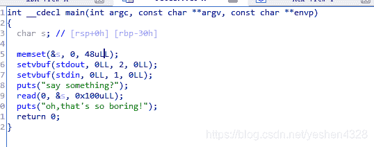
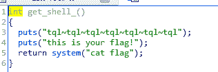
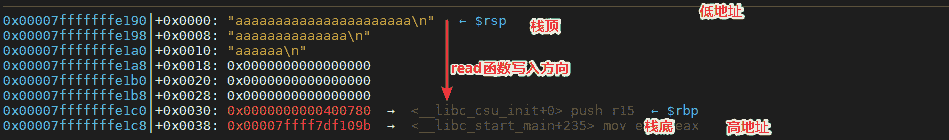
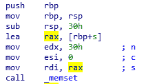
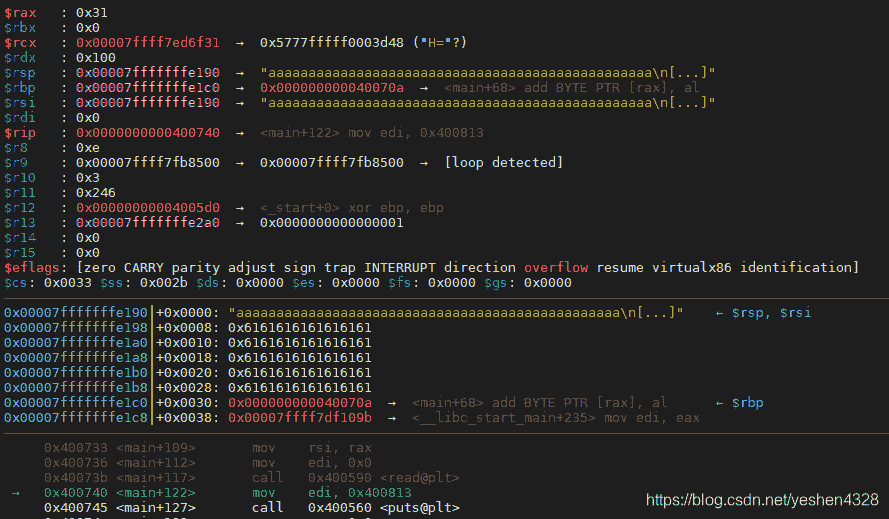
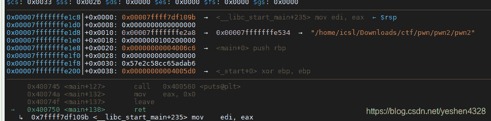
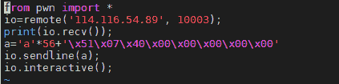
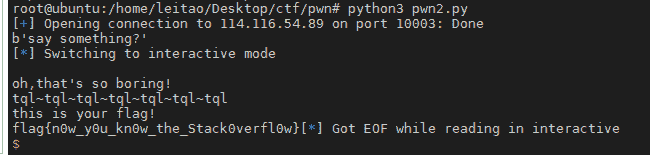

<!--yml
category: 未分类
date: 2022-04-26 14:18:40
-->

# ctf.bugku ctf题目详解——pwn2_yeshen4328的博客-CSDN博客

> 来源：[https://blog.csdn.net/yeshen4328/article/details/106363576](https://blog.csdn.net/yeshen4328/article/details/106363576)

# ctf.bugku ctf题目详解——pwn2

## 题目

程序分配了一个栈上的变量s，长度为0x30，并一开始置0.
9行开始从外部读取0x100的数据到s中，由此可见此处存在一个栈溢出。

同时使用ida打开程序之后发现还存在一个get_shell的函数：

于是我们需要想方法利用溢出来调用这个get_shell函数。

## x64函数调用规则

解题之前我们先学习下linux x64的函数调用规则。
x64机器在调用某个函数前，比如int func(int a, int b, int c, int d, int e, int f, int g, int h)，首先他会把前6个参数从左往右存入到寄存器rdi、rsi、rdx、rcx、r8、r9，其余参数存入到栈中，保存的顺序是从右往左入栈。比如abcdef会存入到寄存器中，然后一次入栈h、g。

保存完参数之后再把函数后面一条指令的地址入栈保存。

栈顶指针（寄存器）：rsp
栈底指针（帧指针）：rbp

## 栈结构

上图就是一个函数的栈结构，上面是栈顶，下面是栈底，栈顶是低地址，栈底是高地址，read函数往栈中写数据是从栈顶往栈底写入，如图所示。

## 其他指令

**leave**：leave指令的作用是把rsp指向rbp，然后将此时栈顶的元素pop到rbp。
一般是在函数体末尾，ret前调用，该函数这样做的目的是恢复函数栈帧。所以通过把rsp指向rbp来释放创建的栈空间。
**ret**：ret指令是把当前栈顶元素pop出来放到rip寄存器去进行函数跳转，目的是把函数调用前保存的返回地址给恢复出来，让代码运行到函数调用的地方。

以上是解本题可能用到的知识

### 解题

程序首先分配了0x30的栈空间给变量s，从上面汇编可以看出，rbp-0x30的地址被赋值到了rdi，也就是memset的第一个参数。
我们使用gdb运行pwn2，查看实时的栈结构来分析：

当运行到memset时，栈结构和寄存器如图所示，其中rdi保存了数组s的地址，也就是0x00007fffffffe190，对应到栈结构，刚好是栈顶，分配长度为0x30，刚好8行，如红框。

运行完read之后，我输入了0x30个a，刚好把s填满。

我们知道main函数也是个函数，在main被调用时，外面的代码也会把返回地址给入栈，然后跳转到main中，从上面栈可以看到，猜测红色字体0x40070a的就是返回地址，我们可以把get_shell的地址写入到这个位置，当main返回时，便会返回到get_shell中去，实现目标代码执行。

但是我尝试之后发现并不行，我忽略了ret前的leave指令，他会把rsp指向rbp，然后把rbp弹出，这样运行到ret指令时，rbp指向的就是第二个红色的地址了：

所以我们覆盖的返回应该是到0x00007fffffffe1c8这个位置，所以我们的输入可以是‘a’*56+’’’\x51\x07\x40\x00\x00\x00\x00\x00’，其中前面56个a就是用来填充变量s以及0x00007fffffffe1c0的，后面这个地址就是get_shell的函数地址小端法表示。

运行：
