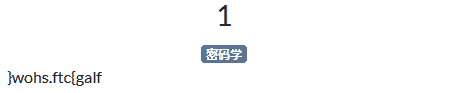
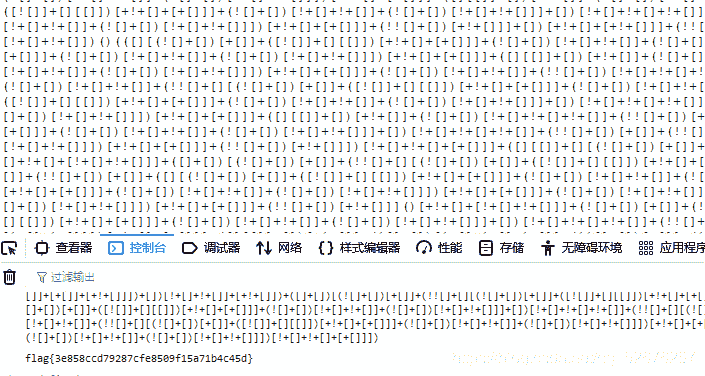

<!--yml
category: 未分类
date: 2022-04-26 14:29:42
-->

# ctf.show crypto题解_��阿兮��的博客-CSDN博客_ctf秀crypto6

> 来源：[https://blog.csdn.net/qq_52676257/article/details/113066385](https://blog.csdn.net/qq_52676257/article/details/113066385)

## 标题ctf show crypto题解

**crypto1:**


将字符串逆序

**crypto2:**


打开浏览器控制台，复制粘贴JSFuck代码后回车，即可得到flag
本题相关知识点：
零、介绍

jsfuck源于一门编程语言brainfuck，其主要的思想就是只使用8种特定的符号来编写代码。而jsfuck也是沿用了这个思想，它仅仅使用6种符号来编写代码。它们分别是(、)、+、[、]、!。
一、从示例开始

将下面这段神奇的代码贴到控制台试试看

```
[][(![]+[])][+!+[]]+(![]+[])[!+[]+!+[]]+(!![]+[])[!+[]+!+[]+!+[]]+(!![]+[])[+!+[]]+(!![]+[])[+[]]+(![]+[][(![]+[])[+[]]+([![]]+[][[]])[+!+[]+[+[]]]+(![]+[])[!+[]+!+[]]+(!![]+[])[+[]]+(!![]+[])[!+[]+!+[]+!+[]]+(!![]+[])[+!+[]]])[!+[]+!+[]+[+[]]]+[+!+[]]+(!![]+[][(![]+[])[+[]]+([![]]+[][[]])[+!+[]+[+[]]]+(![]+[])[!+[]+!+[]]+(!![]+[])[+[]]+(!![]+[])[!+[]+!+[]+!+[]]+(!![]+[])[+!+[]]])[!+[]+!+[]+[+[]]])() 
```

不出意外，会在窗口弹出数字“1”。

如果你是第一次见，那么你肯定会觉得这很神奇。究竟是怎么回事呢？

下面我们就来深入分析一下，一步步的把这神秘的面纱揭开。
二、jsfuck的原理

上面那段代码的原理其实很简单，它使用了Function关键字定义一个匿名函数，并立即执行了。

如果我们在浏览器敲入下面代码，也会弹出数字“1”:

```
Function("alert(1)")() 
```

而我们的示例正是基于这个原理，只不过它使用6个特定字符取到了js中的undefined、true、false、NaN等关键字的字符，并将他们组装成了这个匿名函数。

那么如何取这些字符呢？

举几个例子：

```
![]+[] 
```

这几个字符如果你贴到控制台，会输出“false”字符串，其实有用的是前面的 ![]，后面的+[]只是将false转换为字符串。

那么这个时候，如果我们再能够使用jsfuck的6个特定字符取到字符串“false”的下标，那么我们就取到对应的特定字符了。

比如：

```
+[] == 0
+!+[] == 1 
```

至于为什么等于他们会等于0和1，这里提示一下大家，请把第一个+看做正数的符号，然后就会执行Js的强制类型转换。

到这个时候，我们既有字符串，又有了下标，取对应的字符就方便了。

比如，我们要用6个特定字符显示一个字符“t”，我们可以像下面这么做：

```
(!![]+[])[+[]] 
```

我们分解来看：

```
!![]      
!![]+[]   
+[] 
```

所以上面那个jsfuck表达式，最终只是一个根据下标取字符串特定字符而已。

而我们最开始的jsfuck示例，正是由这一个个的字符，一个个的下标拼装而成的。26个英文字母都可以使用js的关键字取到。

至此，我相信你已经恍然大悟了，这层神秘的面纱也已经解开了。
三、jsfuck常见的取值

这里贴一个jsfuck官网使用的常见取值方式，个人认为取函数的方式并不完美，各位看官觉得呢？

```
false       =>  ![]
true        =>  !![]
undefined   =>  [][[]]
NaN         =>  +[![]]
0           =>  +[]
1           =>  +!+[]
2           =>  !+[]+!+[]
10          =>  [+!+[]]+[+[]]
Array       =>  []
Number      =>  +[]
String      =>  []+[]
Boolean     =>  ![]
Function    =>  []["filter"]
eval        =>  []["filter"]["constructor"]( CODE )()
window      =>  []["filter"]["constructor"]("return this")() 
```

四、研究的意义

写了这么多，到底意义何在？那么我就来肤浅的说几个。

1、能了解到很多JS语言最基本的语法词法。对工作几年的老鸟，被各种框架蹂躏之后，最缺的就是语言基础，重温一遍未尝不是好事。

2、合理利用可以对代码进行伪加密。比如有些正则、有些敏感字符不打算给用户和同行程序员看，使用代码混淆之后，可以用这个技术对关键信息进行一次转换，提高解码难度。

3、防止类似这种的XSS代码注入。据说这是黑客最喜欢的注入方式，因为没有特殊字符，没有阿拉伯数字，仅仅只有6个特定字符，很多系统不会过滤这6个字符。

有没有意义因人而异，更多的意义是，只要你愿意研究，这些知识你都会掌握的！

最后附jsfuck官网地址：http://www.jsfuck.com/

（本文完）