<!--yml
category: 未分类
date: 2022-04-26 14:43:30
-->

# ctf不允许上传该类型php,d3ctf easyweb题解_司梦化虚的博客-CSDN博客

> 来源：[https://blog.csdn.net/weixin_42474164/article/details/116281650](https://blog.csdn.net/weixin_42474164/article/details/116281650)

前言

这道题思路其实就是，如果在php中遇到了模版注入，但是限制了不允许执行php代码的时候，怎么通过模版注入达到RCE的效果

考点

预期：

二次注入

模版注入

phar反序列化

CI RCE POP链挖掘

非预期：

二次注入

模版注入

SSTI沙箱逃逸

二次注入

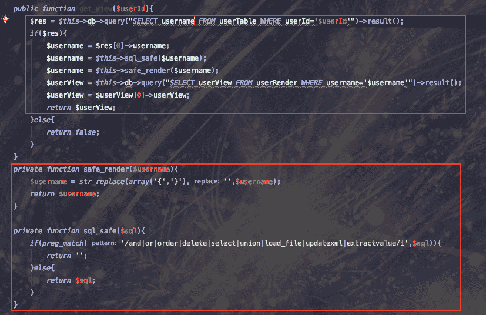

image.png

可以看到，在get_view的时候，通过session中的userid从数据库中取出了用户的username，之后对username进行了两次过滤，但是因为顺序不对，导致sql注入的黑名单可以绕过：se{lect

然后模版的标签{可以通过sql的16进制绕过，这两步应该是很容易看出来的

模版注入

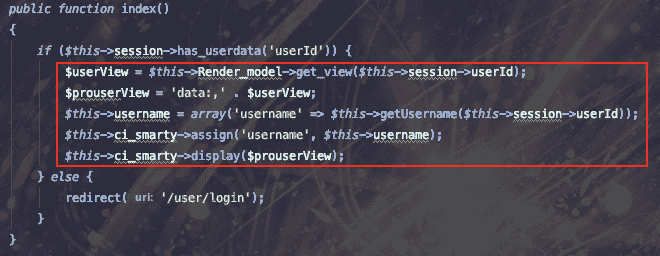

image.png

可以看到，index这里调用了get_view方法，然后将获取到的结果拼接到data协议中，之后将整个data协议的内容直接插入到了display函数中，很容易发现这里有一个模版注入的问题，我们只要通过union select就可以控制整个模版的内容。

这里有一点要注意的就是，我们需要将我们控制的字符串放到返回结果的第一行中，因为union select是在原先查询的下面添加一行结果，所以用limit 1,1即可返回我们控制的模版字符串

正文开始

因为当时将smarty嵌入到CI框架中，是根据网上其他师傅的博客来写的，但是因为参考文章的时间可能比较久，导致在整合的时候，其实是用的smartyBC，这是一个兼容低版本smarty的引擎，而不是最新的Smarty引擎

而这个SmartyBC就是一切非预期的开始

0x01 非预期解

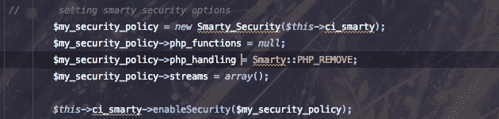

image.png

在构造方法中，为了不让各位师傅直接通过SSTI执行php命令，在这里设置了Smarty引擎的安全规则，默认不允许任何php方法，不允许php脚本的解析，看起来是没有什么问题，但是因为没有仔细看官方文档，结果发现还是可以执行php代码

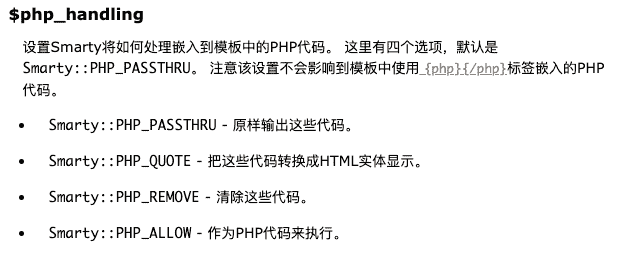

image.png

结果，php_handling不能限制{php}{/php}这样的标签，所以师傅们直接通过{{php}}phpinfo();{{/php}}即可直接getshell，23333

这里我犯了两个错误：

没有发现php_handling是不能限制{php}{/php}的

使用的是SmartyBC而不是Smarty，在Smarty中，这个标签已经被废弃了

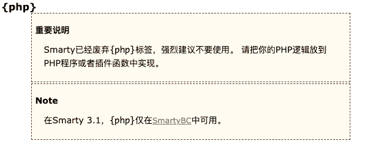

image.png

所以直接：

data:,{{php}}phpinfo();{{/php}}

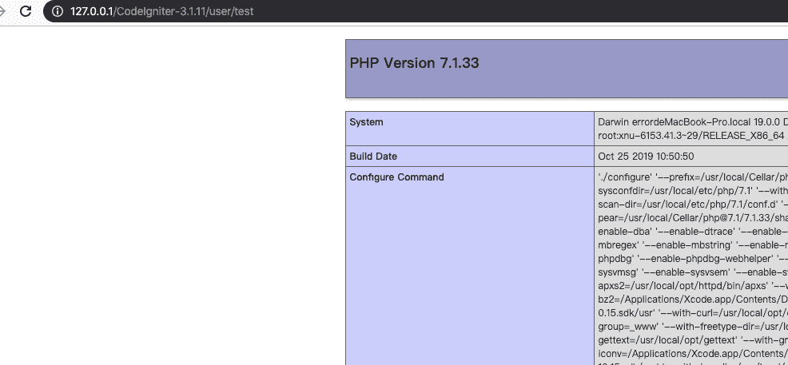

image.png

0x02 预期解

smarty对协议的处理

在CI中添加一个test路由，直接在display中调用data协议，使用xdebug跟一下display的逻辑

image.png

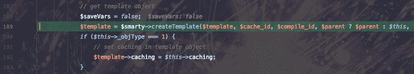

image.png

可以看到这里调用了createTemplate函数，根据函数名，这里就是创建我们的模版的地方，跟进去看一下，因我们传入的字符串是$template变量，所以重点关注对$template的处理，跟到_getTemplateId函数，进入

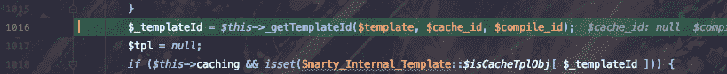

image.png

这里根据我们传入的字符串，拼接上模版目录生成了一个字符串作为tempateId

image.png

这里实例化了一个对象，对应的对象为：public $template_class = 'Smarty_Internal_Template';

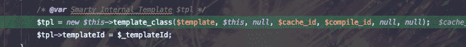

image.png

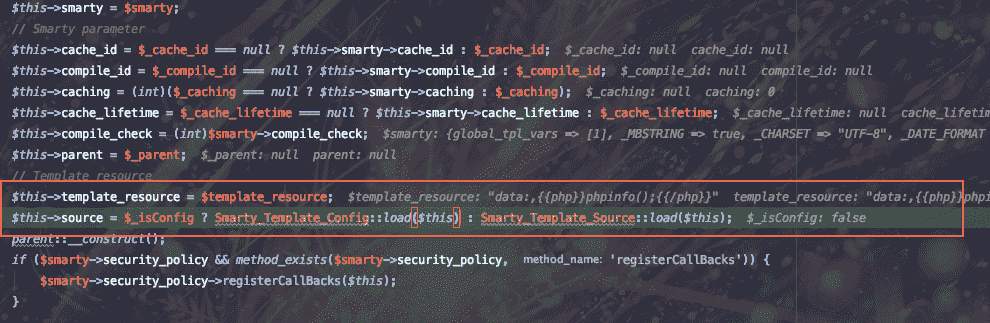

image.png

在构造函数中设置了很多属性，重点关注$this->template_resource,$this->source，调用了Smarty_Template_Source的load方法

来到了重点：load方法

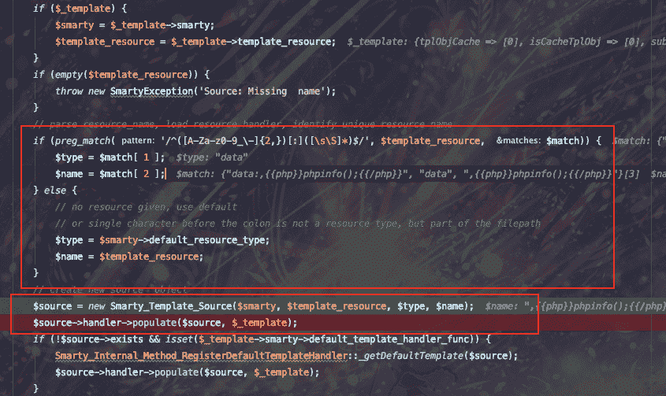

image.png

这个正则，其实匹配了我们对display的输入，将输入的字符串根据:分割，第一部分为协议名，第二部分为协议的内容

我们进入Smarty_Template_Source中

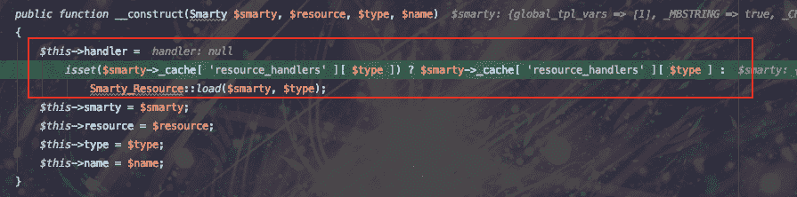

image.png

在smarty中，不同的协议有不同的handler来处理，这里通过Smarty_Resource::load来获取对应的handler

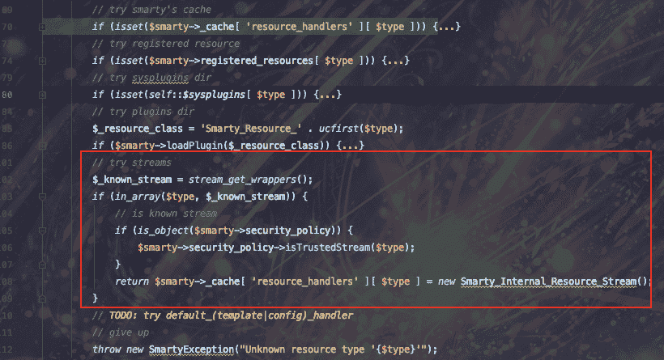

image.png

可以看到，在这里进行了很多次判断，是否是缓存，是否是注册以后的模版等等的判断，可以看到红框框出来的地方进行了对流的判断

在stream_get_wrappers的地方，获取了smarty支持的所有流的类型：

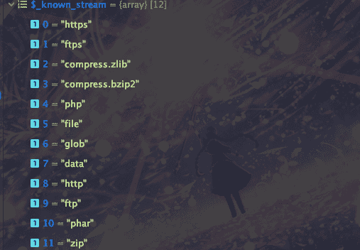

image.png

可以看到在smarty文档中也提到了，smarty支持流的方式去获取模版

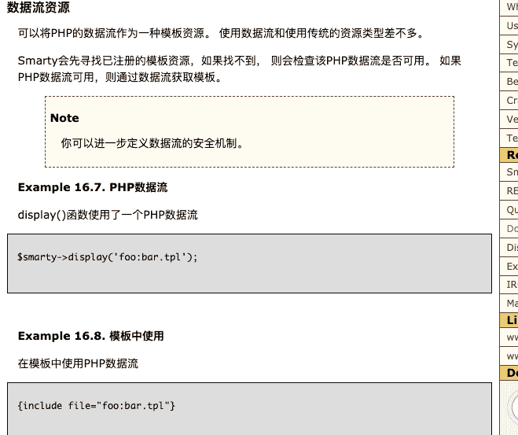

image.png

这里只要我们的流在这个名单中，即可返回$handler(Smarty_Internal_Resource_Stream)，也就是只要走到这一步，就会直接调用Smarty_Internal_Resource_Stream类的populate方法：

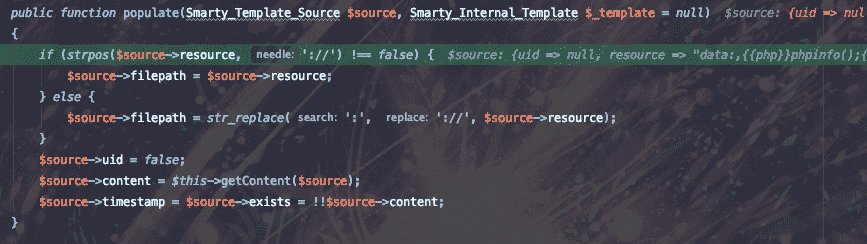

image.png

第一步将我们输入的协议统一转换为：data://这样子，再调用getContent函数

image.png

通过fopen获取到模版字符串

phar协议

smarty对协议的处理上面也分析过了，主要就是通过协议的不同，获取不同的类进行处理，不同协议的实现差异其实就是对应的handler不同

所以我们只要关注handler的获取就可以了，phar可以触发反序列化这个漏洞应该大家早就不陌生了，那么diaplay的参数可控，真的就可以触发反序列化吗？

payload: $this->ci_smarty->display('phar:///etc/passwd');

image.png

可以看到，获取的还是Smarty_Internal_Resource_Stream，和data协议一样，同样会走到getContent

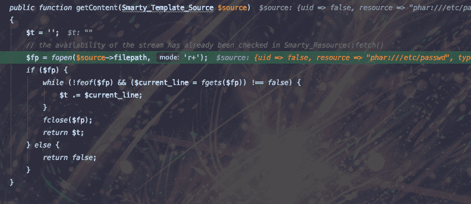

image.png

但是这里有个问题，想要使用fopen触发phar反序列化，对应的php.ini的phar.readonly的值必须要为false，而默认是true，所以如果在默认环境下，phar是无法触发反序列化的。

奇怪的php协议

按照理论来说，php协议应该会被Smarty_Internal_Resource_Stream所处理，但是如果你跟了php协议的handler的话，你会发现好像并不是这样

$this->ci_smarty->display('php:phar:///xxx/xxx.phar');

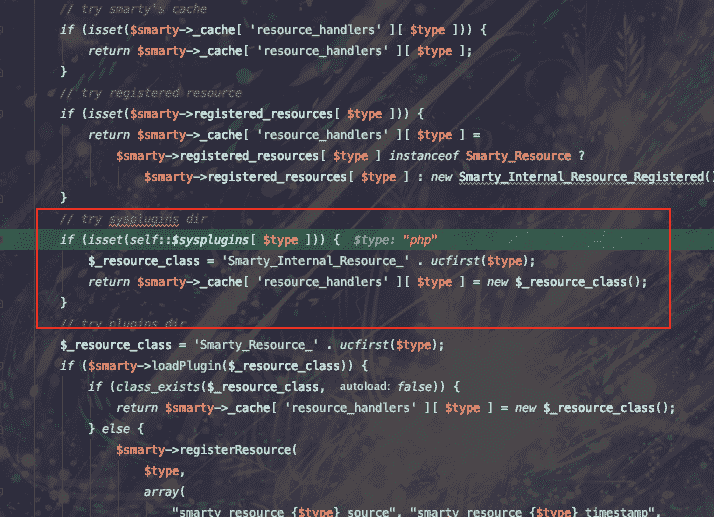

image.png

这里我们刚开始没有关注，但是如果你跟了php协议的处理的话，你会发现居然在这里sysplugins里面有php对应的处理

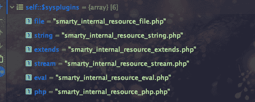

image.png

所以在这里直接返回了smarty_internal_resource_php.php这个php文件中定义的类，也就是Smarty_Internal_Resource_Php这个类

可以看到不仅仅支持php，其他类没有详细看，有时间可以分析一下其他类是干什么的。

所以接下来会调用Smarty_Internal_Resource_Php这个类的populate方法，结果发现这个类并没有这个方法，所以去父类去找，用ctrl+h可以很方便的看出来一个类的继承关系

image.png

所以去Smarty_Internal_Resource_File这个类里面去找：

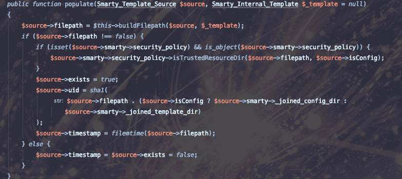

image.png

这里第一步调用了buildFilePath函数，进入这个函数，可以看到有很多is_file的判断，而is_file也是phar反序列化触发的入口之一，而且不需要phar.readonly的限制，所以考虑是不是可以通过这种方式触发反序列化

最后发现在170行，is_file函数参数完全可控，触发反序列化：

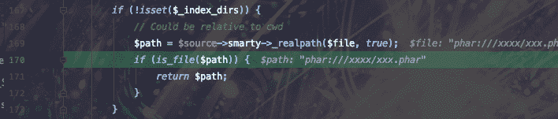

image.png

这个时候，我们就可以通过：data:,{{include file="php:phar:///tmp/xxxxx/xx.phar}}来触发phar反序列化

现在，我们可以触发反序列化了，接下来，我们需要找一个pop链，来达到RCE的效果

很沙雕的pop链

CI这个框架，pop链确实不是很好找(也是我tcl)，这里有一个很重要的原因，CI框架的类不是自动加载的，而是按需加载的，要加载的类，需要在config文件里面添加，导致全局搜索起来__destruct方法貌似很多，但是实际上没法用，23333

找了半天，总算找了个文件包含，但是限制了文件名要满足一定格式，而且要知道mysql的用户名和密码，就很憨憨。。。。

这也就是为什么我没有限制文件的后缀名

先全局搜索__destruct方法，发现在Cache_redis中有一个__destruct方法，调用了任意一个对象的close方法

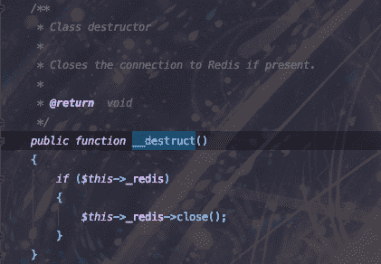

image.png

然后全局搜索close方法，在CI_Session_database_driver中调用了本类中的_release_lock方法

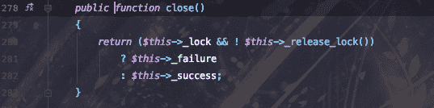

image.png

在这里又调用了db属性的query方法，所以我们可以通过这个地方调用任意的query方法

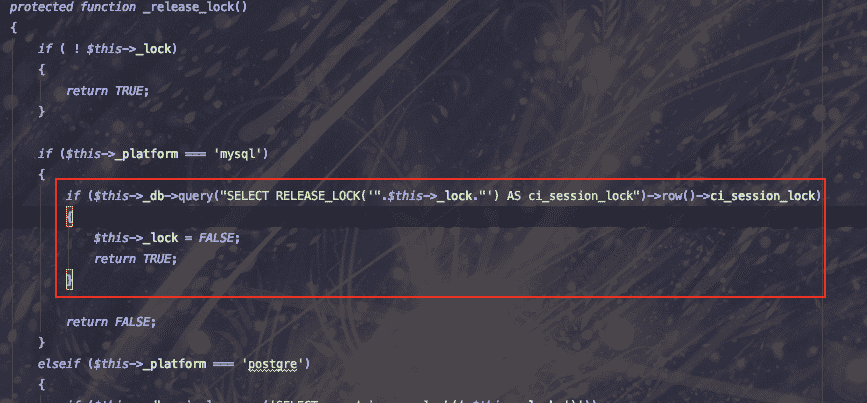

image.png

发现query这个方法是DB_driver实现的，在里面有一个load_rdriver函数

image.png

看到里面的$this->dbdriver可控，所以说我们可以通过目录穿越，来包含到任意目录下的xxx_result.php文件，从而达到RCE的目的

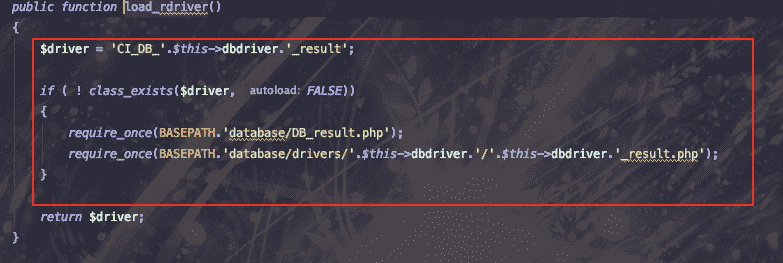

image.png

但是想要进入到load_rdriver函数，要保证前面的所有函数都正常执行，而在前面有一处sql语句执行，如果执行不成功的话就无法到load_rdriver的地方，所以我们需要正确的mysql配置来绕过

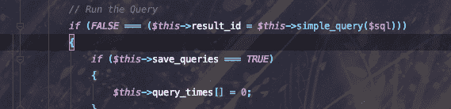

image.png

这样就可以利用这个文件包含达到RCE的效果。

写exp

因为很多属性都不是public的，而且我们要保证mysql的连接对象没有任何问题，所以我们可以通过向pop链中的类添加一些公共的set方法来覆盖其中的属性，和java bean一样

// Cache_redis

public function set($param){

$this->_redis = $param;

}

// Session_database_driver

public function set($param1){

$this->_lock = TRUE;

$this->_platform = "mysql";

$this->_db = $param1;

}

// mysqli_driver

public function set(){

$this->dbdriver = "../../../../../../../tmp/a";

}

// 控制器

public function payload(){

$obj1 = $this->cache->redis;

$obj2 = $this->session;

$obj3 = $this->db;

$obj2->set($obj3);

$obj1->set($obj2);

echo urlencode(serialize($obj1));

}

这里因为query是在DB_driver中的，所以，db对象应该是CI_DB_mysqli_driver

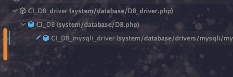

image.png

生成phar文件：

public function payload(){

$obj1 = $this->cache->redis;

$obj2 = $this->session;

$obj3 = $this->db;

$obj2->set($obj3);

$obj1->set($obj2);

$phar = new Phar("phar.phar"); //后缀名必须为phar

$phar->startBuffering();

$phar->setStub("<?php __HALT_COMPILER(); ?>"); //设置stub

$phar->setMetadata($obj1); //将自定义的meta-data存入manifest

$phar->addFromString("test.txt", "test"); //添加要压缩的文件

//签名自动计算

$phar->stopBuffering();

}

上传phar文件到tmp下面，之后调用：{{include file="php:phar:///tmp/xxxx/xx.phar"}}即可