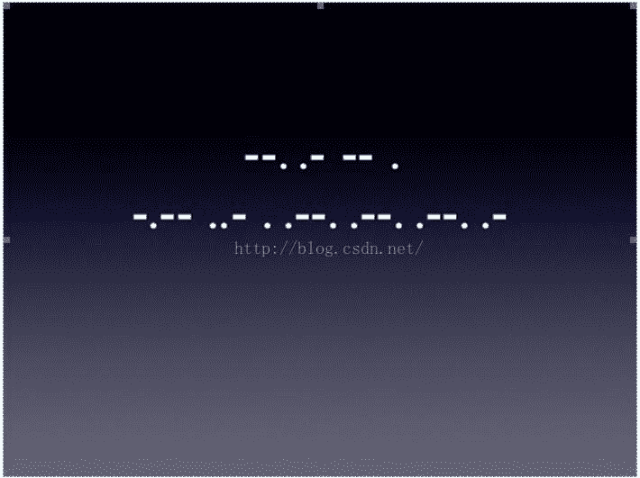
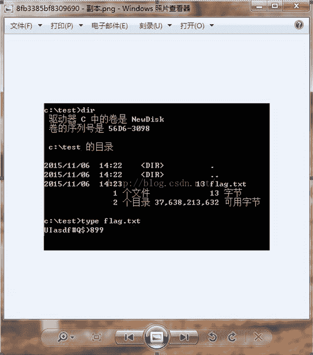

<!--yml
category: 未分类
date: 2022-04-26 14:36:16
-->

# ctf中杂项试题解析_u010921606的博客-CSDN博客

> 来源：[https://blog.csdn.net/u010921606/article/details/50926574](https://blog.csdn.net/u010921606/article/details/50926574)

1.请从该图片分析出相应的密码

URL：bc.jsxajs.cn/ea1dc2ea/d87bb732f45b9258.zip

下载后打开发现.jpg文件，文件不清晰，直接把.jpg改成.zip打开找到清晰图片

对照摩斯密码得到答案GAMEYUEPPPA

2.图片数据时完整的,但是图片头设定了像素高度为209,导致直接打开图片显示不完整.修改文件头图片高度之后,就能显示出完整的图片。

用winhex打开搜索到第一个D1修改成FF

