<!--yml
category: 未分类
date: 2022-04-26 14:30:24
-->

# ctf做题小技巧_撸代码的憨憨的博客-CSDN博客_ctf解题思路

> 来源：[https://blog.csdn.net/wangxinru1/article/details/79775756](https://blog.csdn.net/wangxinru1/article/details/79775756)

1 先打开一张图片

这是一道简单的题，猜猜图片中的人是谁。

直接用百度搜索 上传照片就可以知道她是刘亦菲了。

2 点击链接打开一张图片，比如

[点击打开链接](http://http//120.24.86.145:8002/misc/1.jpg) 

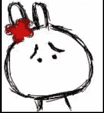

就会得到一张图片，然后用notepad++打开

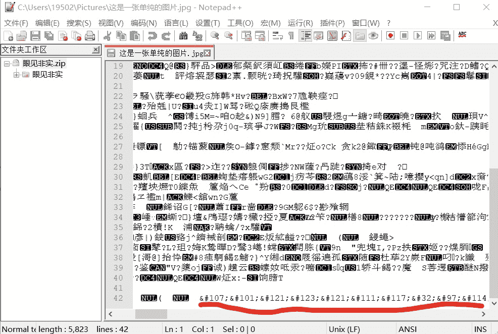

可以看到下面的一段转义序列，用unicode转换器解码就能得到key{you are right}

3 再看一张图片

用winhex和照片查看器分别打开它

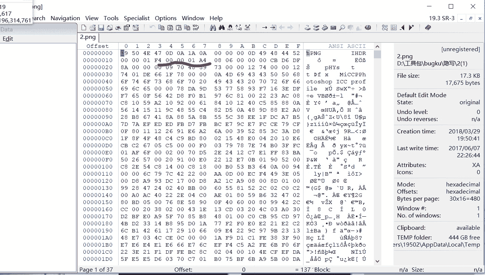

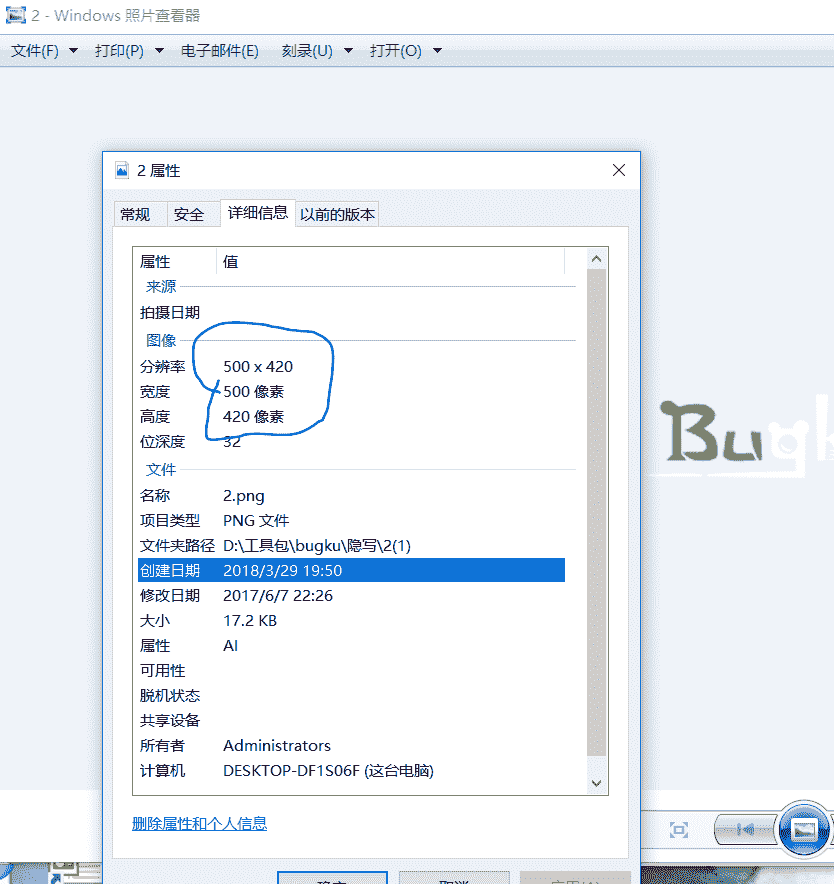

可以发现它的高度明显不一样，在winhex里把高度01 A4改为01 F4保存下来就会发现图片已经改变

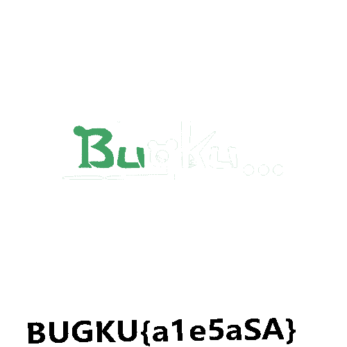

4 当上面的方法都不行时就直接在notepad++里打开直接搜索key或flag。

比如说telent这道题，这是一个PCAP文件，在notepad++里打开后搜索flag就会发现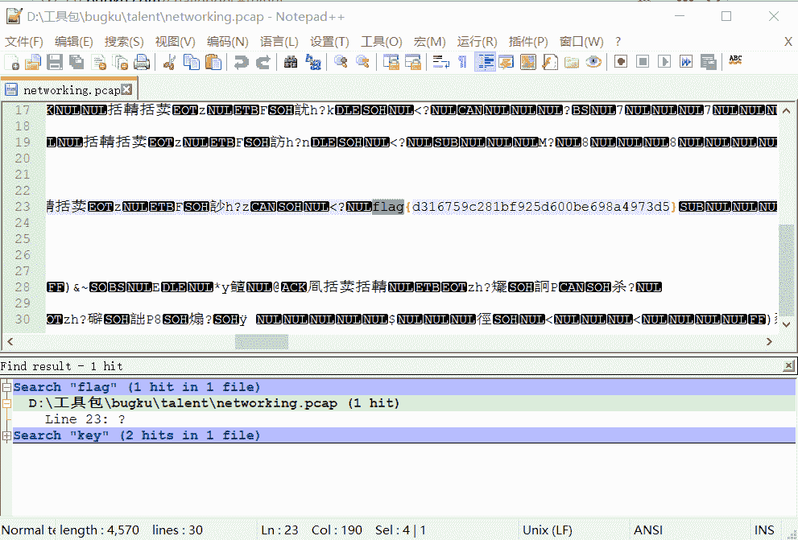

5 有的题直接是一个word文档，比如说眼见非实.。用notepad++打开

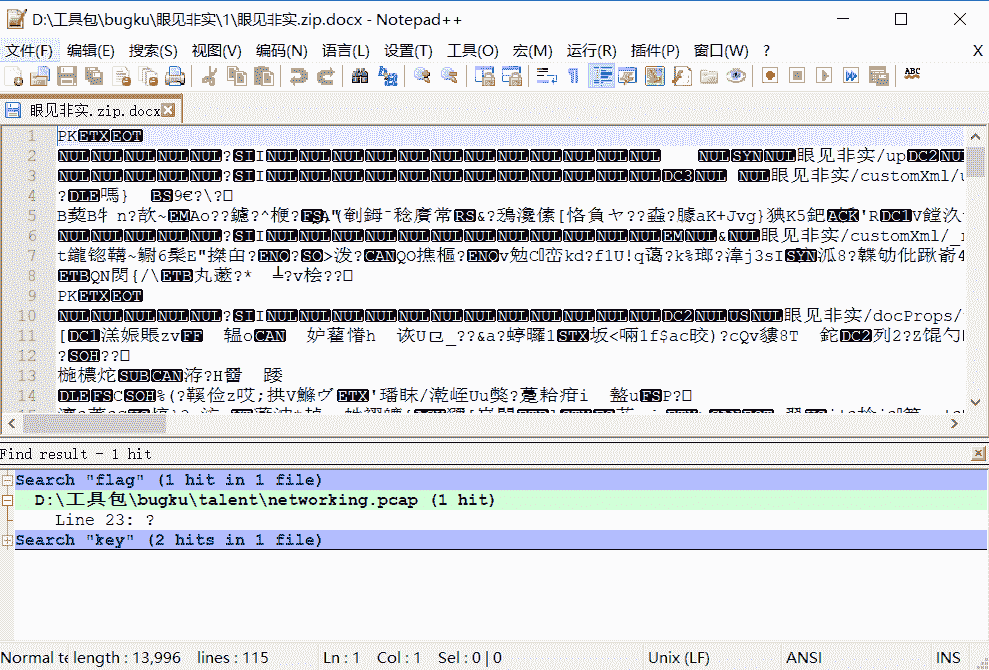

可以看到开头的PK标志，这是一个压缩文件的标志，然后把文档后缀改为zip解压，就会在解压后的文件中的word>document中找到

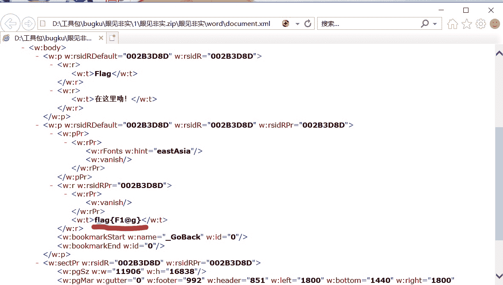

6 除此之外还有在图片里隐藏压缩文件的，如：

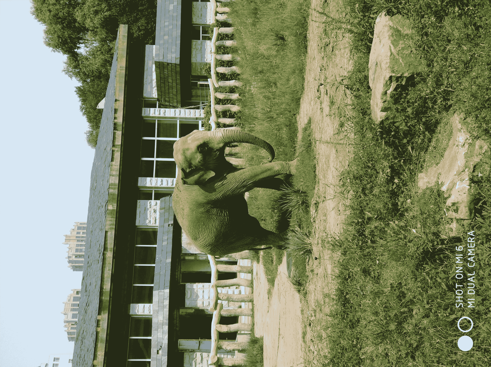

一张图片居然有6.11MB,就很有嫌疑，用010editor查看一下果然发现隐藏了一个压缩包

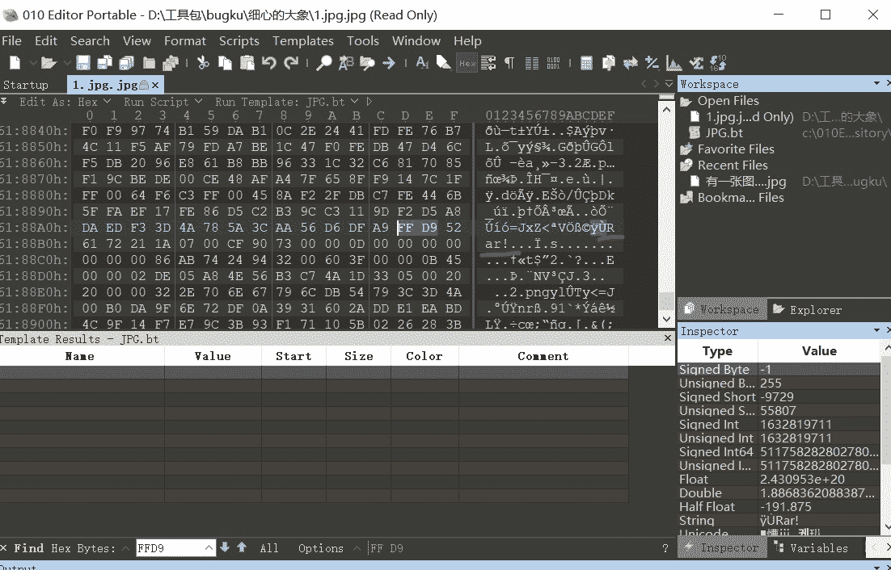

把从rar开始到最后拷贝为一个rar文件，然后解压这个文件发现是要密码的

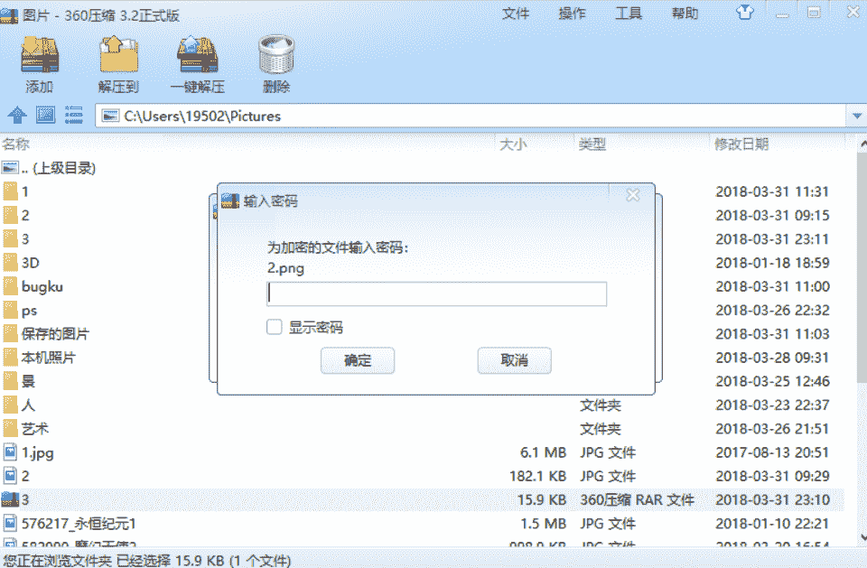

接下来我们打开图片查看器

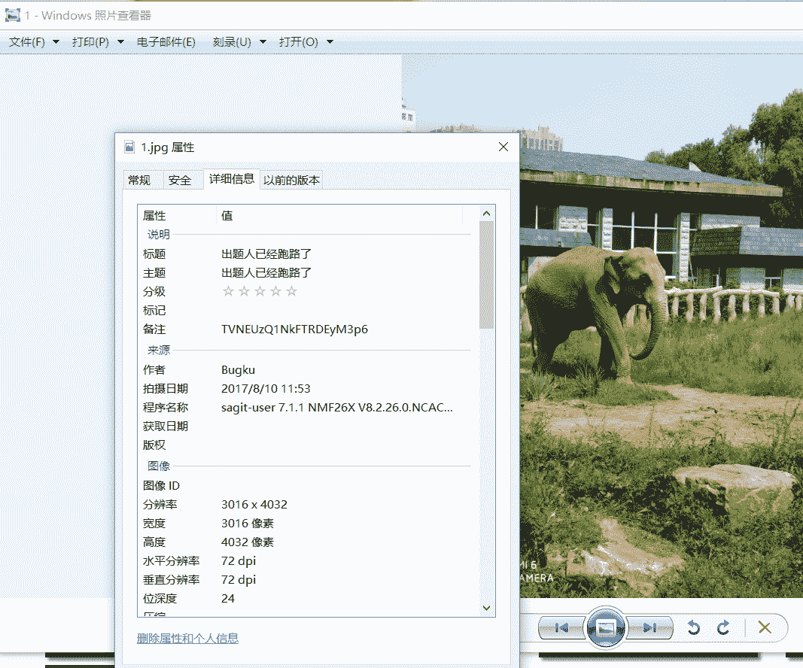

发现备注后面的一串代码，使用base64解码就能得到密码，解压后就得到了和3中一样的图片，然后，用3中介绍的方法去解就行了。