<!--yml
category: 未分类
date: 2022-04-26 14:20:49
-->

# ctf学习经历——极客部分题解_RoleMee的博客-CSDN博客

> 来源：[https://blog.csdn.net/qq_51604088/article/details/109891229](https://blog.csdn.net/qq_51604088/article/details/109891229)

> 解题思路
> Web
> 朋友的学妹
> 1，根据提示：打开 
> 
> 得到 ：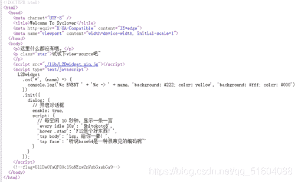
> 
> 2，找到flag。
> 
> EZWWW
> 1，打开网站，发现备份
> 
> 2，用御剑：扫描后台
> 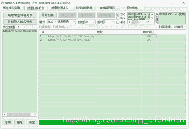
> 3，得备份的压缩包，打开
> 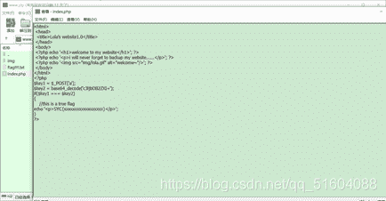
> 
> 4，分析代码：base64_decode(‘c3ljbDB2ZXI=’);
> 知是base64加密。百度在线解码。得sycl0ver
> 5，用postman的post请求：得flag
> 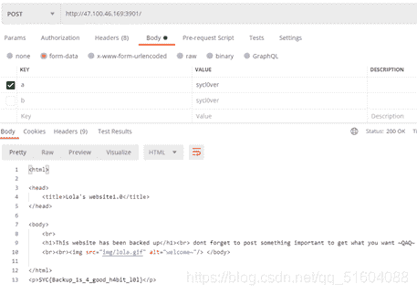
> 
> 刘壮的黑页
> 
> 1，打开网页，得到
> 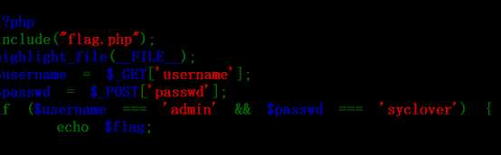
> 
> 2，用postman，get方式和post方式：用GET方法输入key=username，value=admin，用POST方法在Body输入key=passwd，value=syclover得flag；
> 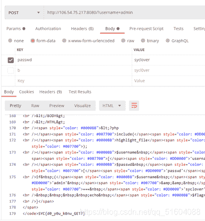
> 
> Welcome
> 1，打开网页：一脸懵逼；
> 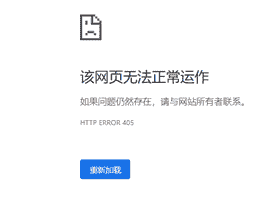
> 
> 2，根据提示，用post请求；
> 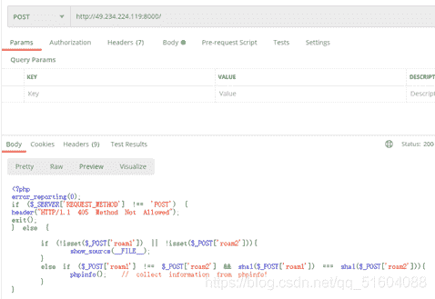
> 
> 3，分析代码：用数组将sha1绕过；
> 得一堆新代码(再次懵逼；
> 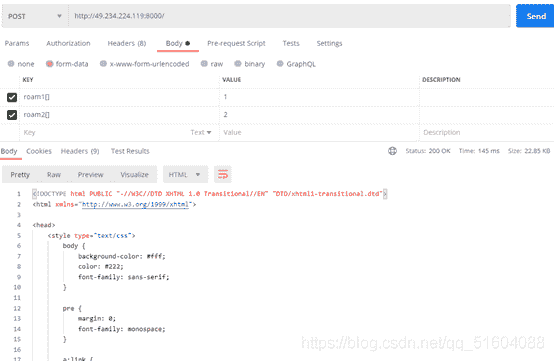
> 
> 4，在学长帮助下；得知类似flag的东西
> 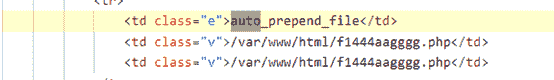
> 
> 5，用post请求打开网站http://49.234.224.119:8000/f1444aagggg.php
> 得flag
> 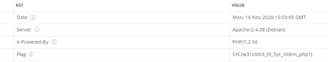
> 
> EzGit
> 1：根据提示用git；
> 在虚拟机中git clone https://github.com/denny0223/scrabble.git
> 2，输入命令：
> 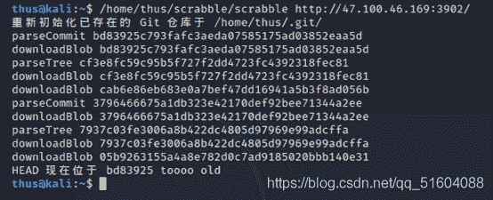
> 
> 发现flag tooooo old
> 3，还原版本：
> 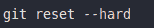
> 
> 得 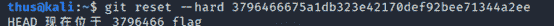
> 
> 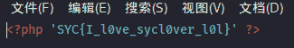
> 
> 我是大黑客
> 1，打开网站；发现备份文件 ；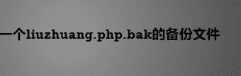
> 
> 2打开 ；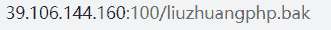
> 
> 下载文件；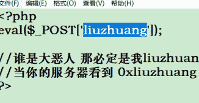
> 
> 得
> 3，白度知一句话密码liuzhuang。
> 4木马，用蚂剑，得 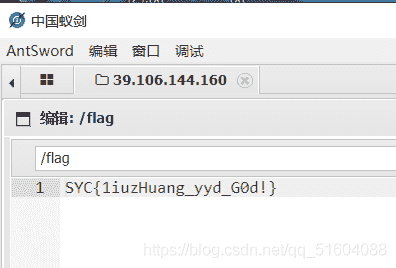
> 
> ezbypass
> 
> 1,用postman打开网站数组绕过得 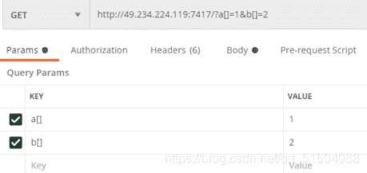
> 
> 2，得提示 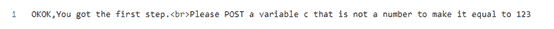
> 
> 3根据提示，用c，
> 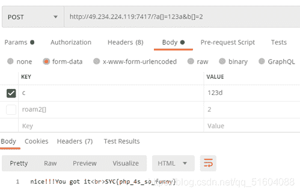
> 
> flagshop
> 
> 看到这个，想碰碰运气，第一次输入账号为admin 密码为123456
> 
> 
> 
> 第二次都输入admin
> 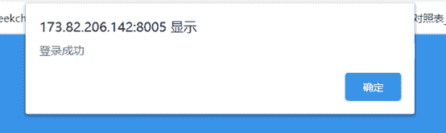
> 
> 结束真的进去了
> 在这里购买flag（花了我1w
> 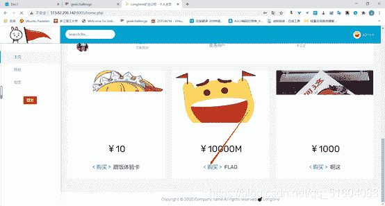
> 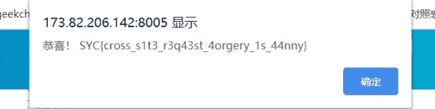
> 
> 然后成功
> 
> RE
> 
> NO RE no gain:
> 第一次接触ctf中的re，啥也不会，首先看到题目中的提示，想到下载IDA，在尝试几次后，终于打开
> 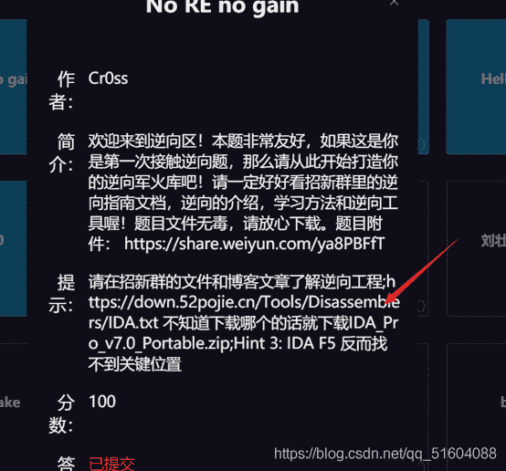
> 
> 打开后即可获得flag
> 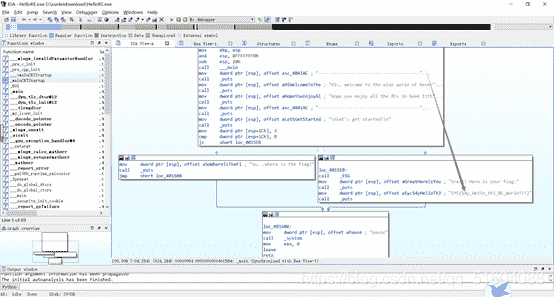
> 
> 我真不会写驱动！
> 
> 打开后并没有明显的发现flag。于是看到左边的函数列表很少，再加上当时没学过这方面的内容，于是想都看看，于是就找到了flag（啥也不懂）。
> 
> 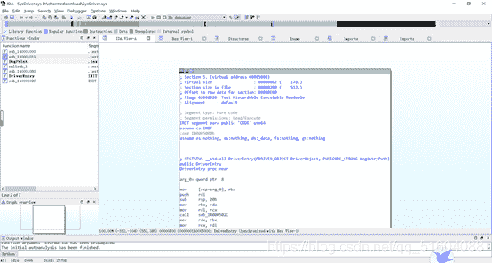
> 
> 
> WhatsAPK
> 
> 看到这两个，去CSDN查看APK的资料，看到使用Androidkiller，于是去下载
> 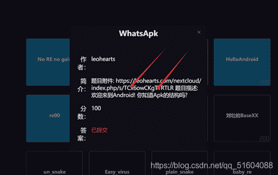
> 
> （就是这个玩意，忽略历史进程）
> 用这个打开题目文件
> 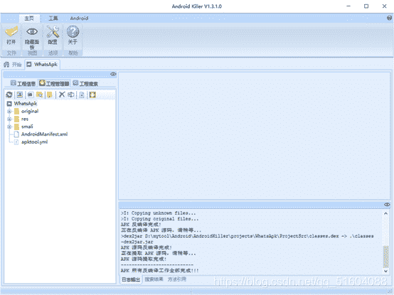
> 
> （不知所措），尝试搜索syc走捷径
> 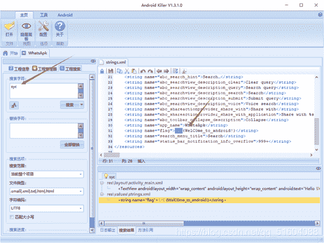
> 
> 还真的搜到了
> 
> HelloAndroid
> 根据上一题的经验，我还是尝试用Androidkiller打开
> 还是老方法，搜索
> 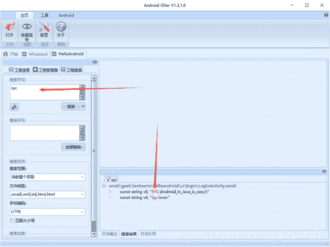
> 
> （秒杀）
> 
> RE00
> 老方法，用ida打开
> 
> 按F5反编译分析代码
> 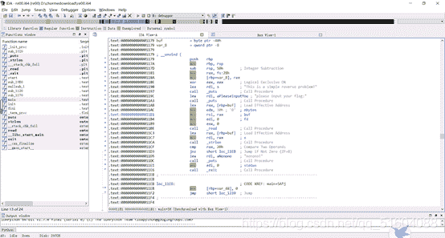
> 
> 看到这个地方，就是去研究byte_4060这个函数
> 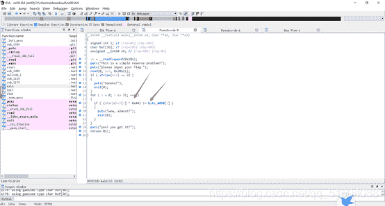
> 
> 根据wzgg的提示，按shift+e提取出密文
> 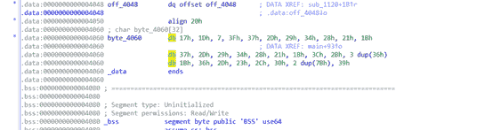
> 
> 得到这么一串数字，在根据大佬所说异或可以移项，于是开始解密，由于不会python，就使用c语言一个一个解密
> 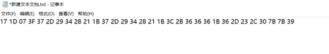
> 
> 最后拼接出来得到syc
> 
> Misc
> 一“页”障目
> 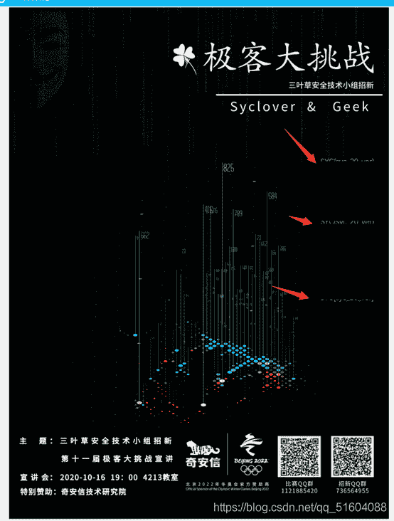
> 
> 看到右边的，于是放到ps中拼起来
> 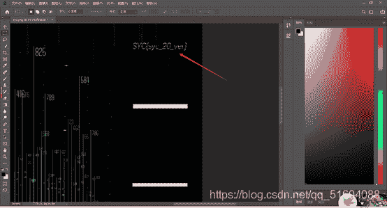
> 
> 得到flag（当时觉得杂项还挺容易）
> 
> 壮言壮语
> 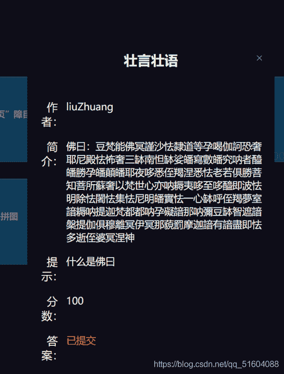
> 
> http://www.keyfc.net/bbs/tools/tudoucode.aspx
> 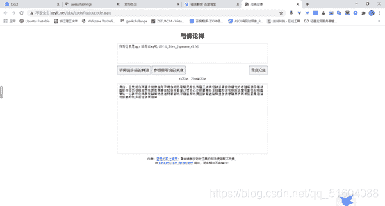
> 
> 得到flag
> 
> 秘技.反复横跳
> 
> 去CSDN查看相关资料
> https://blog.csdn.net/wxh0000mm/article/details/85683661?biz_id=102&utm_term=binwalk%E5%88%86%E7%A6%BB&utm_medium=distribute.pc_search_result.none-task-blog-2allsobaiduweb~default-1-85683661&spm=1018.2118.3001.4449
> 打开之前装的kaili虚拟机去使用binwalk
> 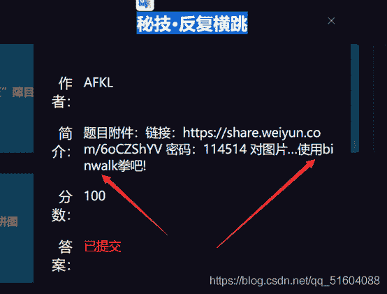
> 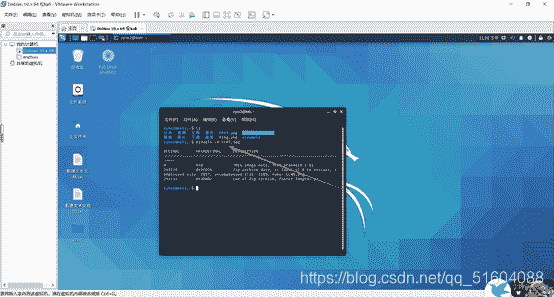
> 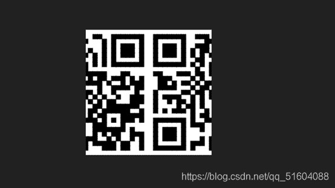
> 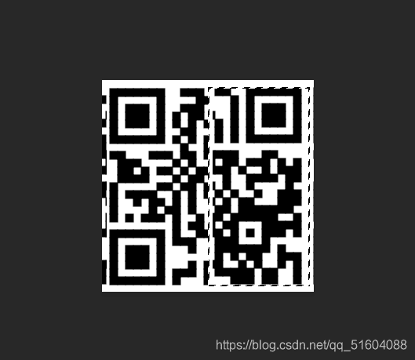
> 
> 扫描二维码得到syc
> 
> 来拼图
> 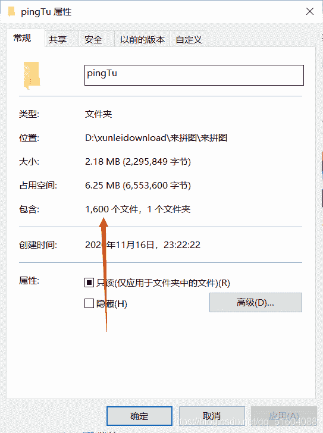
> 
> 猜测是把原图拆成40*40,然后打开观看
> 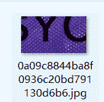
> 
> 看到这个文件是syc我就猜测在这附近，直觉告诉我这是md5编码，于是百度破解
> https://www.atool99.com/md5-crack.php
> 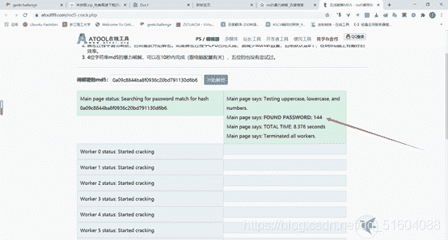
> 
> 得到144号，然后用md5编码145
> 145加密后为：2B24D495052A8CE66358EB576B8912C8
> 
> 
> 但不是，猜测143，
> 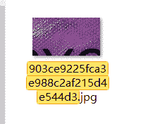
> 
> 也不是，于是猜测是加40，
> 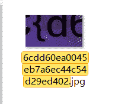
> 
> 果然是，于是这样找到最后一个，得到一串图片，用ps拼图
> 
> 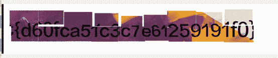
> 
> Crypto
> 二战情报员刘壮
> 
> 
> 很显然是摩斯密码
> https://www.atool99.com/morse.php
> 
> 
> 根据要求去掉下划线，加上SYC{}，提交即可
> 
> 铠甲与萨满
> 
> 显然是凯撒密码
> https://www.qqxiuzi.cn/bianma/kaisamima.php
> 
> 
> 位移六位即使syc
> 
> 
> 
> 跳跃的指尖
> 看到跳跃的指尖，在看到奇怪的字符
> 
> 突发奇想，把手放在键盘上试了试，于是发下是夹在他们中间的数，解密成功
> 
> 
> 成都养猪二厂
> 
> http://www.metools.info/code/c90.html
> 
> 
> 
> 
> 
> 
> 
> 发现是int 于是猜测是栅栏密码移位7
> 但是密码不对，于是将图片旋转一下
> 
> 
> 这样就对了
> 
> 规规矩矩的工作
> 下载文件
> http://blog.neargle.com/SecNewsBak/drops/CTF%E4%B8%AD%E9%82%A3%E4%BA%9B%E8%84%91%E6%B4%9E%E5%A4%A7%E5%BC%80%E7%9A%84%E7%BC%96%E7%A0%81%E5%92%8C%E5%8A%A0%E5%AF%86%20.html?tdsourcetag=s_pcqq_aiomsg
> 在这里找到加密方式，线性代数，计算上面方阵的逆矩阵。
> http://www.yunsuan.info/matrixcomputations/solvematrixinverse.html
> 
> 
> 然后逆矩阵和上面的矩阵相乘
> https://www.99cankao.com/matrix/matrix-multiplication.php
> 
> 
> 
> 然后讲结果mod26
> https://gonglue.qinggl.com/app/shuxue/qumoyunsuanjisuanqi.jsp
> 
> 
> 求出来是key
> 代入之前的程序中
> 
> 
> 韡髻猊岈
> 下载文件发现是维吉尼亚密码，然后百度发现都要密钥，正当自己一筹莫展之际，找到了无密钥破解
> http://atomcated.github.io/Vigenere/
> 
> 
> 侧重点是三个大写英文字母
> 发现并不是SYC
> 于是更改密钥长度
> 
> 
> 得到flag