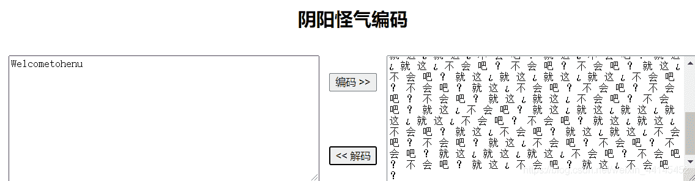
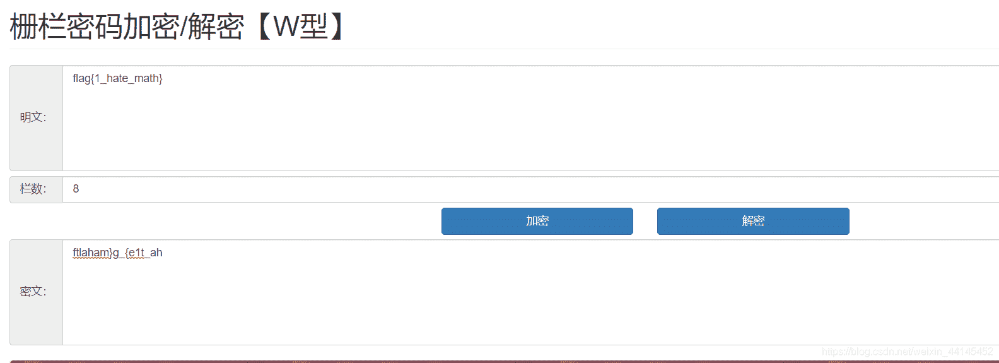
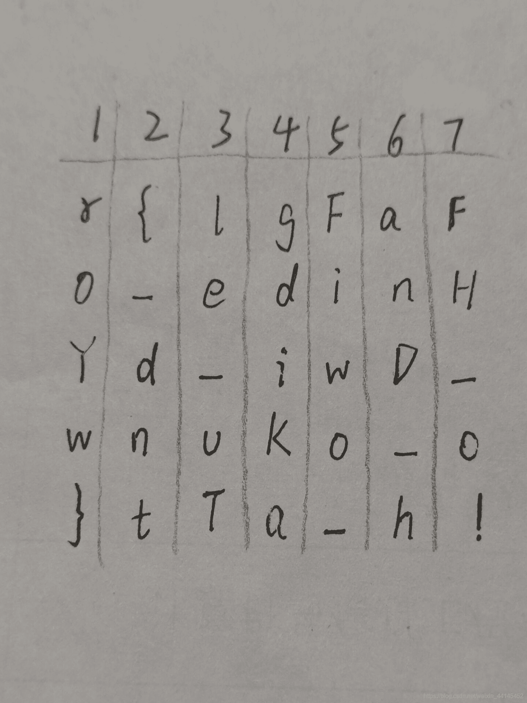
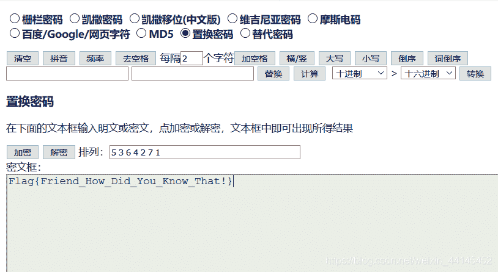
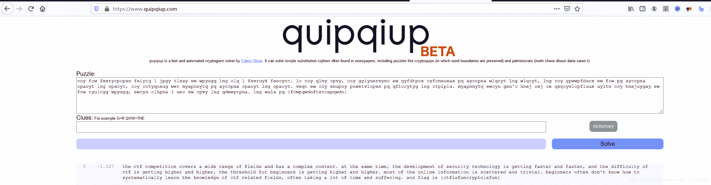

<!--yml
category: 未分类
date: 2022-04-26 14:48:19
-->

# ctf密码学特殊的编码和解密_落雪wink的博客-CSDN博客_编码

> 来源：[https://blog.csdn.net/weixin_44145452/article/details/109583673](https://blog.csdn.net/weixin_44145452/article/details/109583673)

最近做密码学的题，遇到好多没见过的解密题，还是太菜了，可恶
密码题解密传送门：[1个T的种子请自备纸巾](https://blog.csdn.net/qq_41638851/article/details/100526839?utm_source=app)

## 1.阴阳怪气编码

题目:

```
就 这 ¿ 就 这 ¿ 不 会 吧 ？ 就 这 ¿ 不 会 吧 ？ 就 这 ¿ 不 会 吧 ？ 不 会 吧 ？ 不 会 吧 ？ 就 这 ¿ 就 这 ¿ 不 会 吧 ？ 不 会 吧 ？ 就 这 ¿ 就 这 ¿ 不 会 吧 ？ 就 这 ¿ 不 会 吧 ？ 就 这 ¿ 就 这 ¿ 不 会 吧 ？ 不 会 吧 ？ 就 这 ¿ 不 会 吧 ？ 不 会 吧 ？ 就 这 ¿ 就 这 ¿ 就 这 ¿ 就 这 ¿ 不 会 吧 ？ 不 会 吧 ？ 就 这 ¿ 就 这 ¿ 就 这 ¿ 不 会 吧 ？ 不 会 吧 ？ 就 这 ¿ 就 这 ¿ 不 会 吧 ？ 不 会 吧 ？ 就 这 ¿ 不 会 吧 ？ 不 会 吧 ？ 不 会 吧 ？ 不 会 吧 ？ 就 这 ¿ 就 这 ¿ 不 会 吧 ？ 不 会 吧 ？ 就 这 ¿ 不 会 吧 ？ 不 会 吧 ？ 就 这 ¿ 不 会 吧 ？ 就 这 ¿ 就 这 ¿ 不 会 吧 ？ 不 会 吧 ？ 就 这 ¿ 就 这 ¿ 不 会 吧 ？ 就 这 ¿ 不 会 吧 ？ 就 这 ¿ 就 这 ¿ 不 会 吧 ？ 不 会 吧 ？ 不 会 吧 ？ 就 这 ¿ 不 会 吧 ？ 就 这 ¿ 就 这 ¿ 就 这 ¿ 就 这 ¿ 不 会 吧 ？ 不 会 吧 ？ 就 这 ¿ 不 会 吧 ？ 不 会 吧 ？ 不 会 吧 ？ 不 会 吧 ？ 就 这 ¿ 就 这 ¿ 不 会 吧 ？ 不 会 吧 ？ 就 这 ¿ 不 会 吧 ？ 就 这 ¿ 就 这 ¿ 就 这 ¿ 就 这 ¿ 就 这 ¿ 不 会 吧 ？ 不 会 吧 ？ 就 这 ¿ 就 这 ¿ 不 会 吧 ？ 就 这 ¿ 不 会 吧 ？ 就 这 ¿ 就 这 ¿ 不 会 吧 ？ 不 会 吧 ？ 就 这 ¿ 不 会 吧 ？ 不 会 吧 ？ 不 会 吧 ？ 就 这 ¿ 就 这 ¿ 就 这 ¿ 不 会 吧 ？ 不 会 吧 ？ 不 会 吧 ？ 就 这 ¿ 不 会 吧 ？ 就 这 ¿ 不 会 吧 ？ 
```

乍眼一看像二进制直接0 1转换，结果没出来，然后换成摩斯也没出来。培根密码？也没出来 漂亮，遇到困难直接睡大觉！
上工具：[https://github.com/mmdjiji/yygq.js](https://github.com/mmdjiji/yygq.js)
或者:[https://mmdjiji.gitee.io/yygq.js/](https://mmdjiji.gitee.io/yygq.js/)
解密出来：


## 2.凯撒+栅栏结合

题目里面有这一段编码：`if1lok5xdg3gjf5}{XvjLaJIj`
尝试栅栏没解出来 并且发现无论栅栏里面的因数是多少，首字母都是i，利用凯撒解密把i换成f

```
fc1ilh5uad3dgc5}{usgixgfg 
```

之后栅栏解密： `flag{ggchdcuif1535sxgiud}`
凯撒3 栅栏7 学到了

## 3.栅栏变种–w型栅栏解密

这种很简单 就像这个 `ftlaham}g_{e1t_ah`
在线工具：`http://www.atoolbox.net/Tool.php?Id=777`
解密如图：
或者用脚本：

```
'''
若知道栏数，则使用decode解密，若不知道，则使用crack_cipher遍历所有可能性
'''
def generate_w(string, n): 
    '''将字符排列成w型'''
    array = [['.']*len(string) for i in range(n)] 
    row = 0
    upflag = False
    for col in range(len(string)): 
        array[row][col] = string[col]
        if row == n-1:
            upflag = True
        if row == 0:
            upflag = False
        if upflag:
            row -= 1
        else:
            row += 1
    return array

def encode(string, n):
    '''加密'''
    array = generate_w(string, n)
    msg = []
    for row in range(n): 
        for col in range(len(string)):
            if array[row][col] != '.':
                msg.append(array[row][col])
    return array, msg

def decode(string, n):
    '''解密'''
    array = generate_w(string, n)
    sub = 0
    for row in range(n): 
        for col in range(len(string)):
            if array[row][col] != '.':
                array[row][col] = string[sub]
                sub += 1
    msg = []
    for col in range(len(string)): 
        for row in range(n):
            if array[row][col] != '.':
                msg.append(array[row][col])
    return array, msg

def crack_cipher(string):
    '''破解密码'''
    for n in range(2,len(string)): 
        print(str(n)+'栏：'+''.join(decode(string, n)[1]))

if __name__ == "__main__":
    string = "ftlaham}g_{e1t_ah"

    crack_cipher(string)

    array,msg = decode(string, n)

    for i in array: print(i)
    print(''.join(msg)) 
```

## 4.古典密码学之置换密码

题目:`114 123 108 103 70 97 70 111 95 101 100 105 110 72 89 100 95 105 119 68 95 119 110 117 75 111 95 111 125 116 84 97 95 104 33`
ascii转文本 `r{lgFaFo_edinHYd_iwD_wnuKo_o}tTa_h!`
然后栅栏无果，w栅栏无果，凯撒＋栅栏无果…
询问大佬得知是置换解密
工具是 密码字典，网上应该可以搜到
首先要明白置换密码的原理是什么 [《古典密码——置换密码》](https://blog.csdn.net/j5856004/article/details/78159723?utm_source=app)
明白了之后 先猜密钥长度，即该字符串排多少列时可能有flag，我们去掉含有@的列，而且第一行必须至少含有flag这4个字符，写下来是这样
之后找排列顺序，是5 3 6 4 2 7 1


## 5.词频分析

```
coy fcw fevrycpcpen feiytq l jpgy tlnay ew wpyugq lng olq l fevruyk fencync. lc coy qlvy cpvy, coy gyiyuervync ew qyfdtpcx cyfoneueax pq ayccpna wlqcyt lng wlqcyt, lng coy gpwwpfducx ew fcw pq ayccpna opaoyt lng opaoyt, coy cotyqoeug wet myapnnytq pq ayccpna opaoyt lng opaoyt. veqc ew coy enupny pnwetvlcpen pq qflccytyg lng ctpiplu. myapnnytq ewcyn gen'c hnej oej ce qxqcyvlcpfluux uyltn coy hnejuygay ew fcw tyulcyg wpyugq, ewcyn clhpna l uec ew cpvy lng qdwwytpna. lng wula pq {fcwpqwdnftxrcepqwdn} 
```

在线工具：`https://www.quipqiup.com/`
解密 flag {ctfisfuncryptoisfun}:

推荐博客：[CTF-加密与解密（二十一）](https://blog.csdn.net/weixin_39934520/article/details/108110367?utm_source=app)
[CTF-解密与加密](https://blog.csdn.net/weixin_39934520/category_10257166.html)