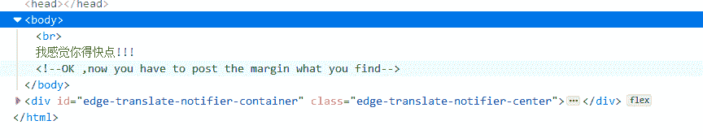
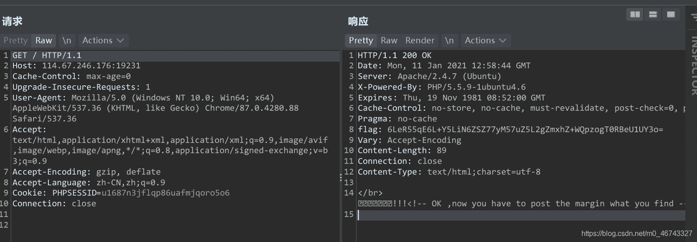

<!--yml
category: 未分类
date: 2022-04-26 14:49:32
-->

# ctf每日练习-第10天__wand1的博客-CSDN博客

> 来源：[https://blog.csdn.net/m0_46743327/article/details/112472518](https://blog.csdn.net/m0_46743327/article/details/112472518)

```
bugku的python脚本题 
```

## 秋名山车神

把表达式用python解出来然后post回去
这里需要用同一个session,所以要保持用同一个session

```
import requests
import re
from bs4 import BeautifulSoup

if __name__=='__main__':
    target='http://114.67.246.176:17112/'

    s=requests.session()
    req=s.get(url=target)
    tx1=req.text
    equation=re.search(r'\d(.*)\d',tx1).group()
    d={
        'value' :eval(equation)
    }
    c=s.post(url=target,data=d)
    print(c.text) 
```

## 速度要快！bugkuweb19

```
f12，提示要用post方法传一个margin
没看到有margin,抓包，发现返回头里有个flag,
两次base64可以得到一个值
提示要快点，所以只能用脚本了
需要base64转换以及截取字符串 
```





```
import requests
import re
import base64
if __name__=='__main__':
    target='http://114.67.246.176:19231/'
    s=requests.session()
    headers=s.get(url=target).headers
    flag=headers['flag']
    margin1=base64.b64decode(flag)
    margin2=repr(margin1).split(':')
    bs64=margin2[1]
    flag=base64.b64decode(bs64)
    d={
        'margin' :flag
    }
    c=s.post(url=target,data=d)
    print(c.text)
    print(repr(flag)) 
```