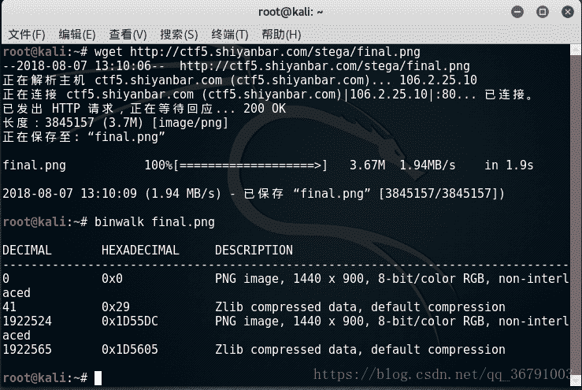
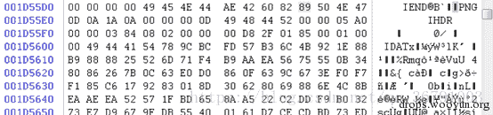

<!--yml
category: 未分类
date: 2022-04-26 14:49:28
-->

# ctf解题--当眼花的时候，会显示两张图（隐写）_妤儿兮兮的博客-CSDN博客_ctf 双图

> 来源：[https://blog.csdn.net/qq_36791003/article/details/81481567](https://blog.csdn.net/qq_36791003/article/details/81481567)

### 题目

不信？ 你试试
解题链接： [http://ctf5.shiyanbar.com/stega/final.png](http://ctf5.shiyanbar.com/stega/final.png)

### 解题

```
wget http://ctf5.shiyanbar.com/stega/final.png 
```

```
binwalk final.png
```



发现从1922524开始偏移

```
hexdump out.bmp
```


黑色的像数的在bmp中的hex的00保存的，那么我们就寻找不是00的地方,在偏移0x1110的地方可以发现有不是00的字节，一开始还以为这些就是flag的信息了，后来才发现是因为两个图片sub影响到了效果，真正的信息是隐藏在final-1.png中的，所以打开由final-1.png转换的final-1.bmp来对，通过之前diff得到的偏移，寻找到0x1110的地方，直到0x1330结束，这是隐藏的信息

*   只保留00 01，这个是因为RGB的关系，只隐藏在R通道里面了，其他通道都是图片的正常像数信息，过滤掉就可以了

> 00010000010000010001000100000101000100000001010100010101010001010001000000010001000001010001000000010101000001010001000101000001000100010101010100010001000001010001010100010000000100000001000100010100000101010000010100010000000101000101010000000101000000000001010000010101000100010000010000000101000100000001010100000000000100000100000000010101010000010001010101010001

*   观察一下可以发现，而奇数位都是0，是多余的，把这些去除掉。直接把00 替换成0，01替换成1

> 0100100101010011010001110111101101000101001101000111001101011001010111110101001101110100010001010110011100110100011011100011000001100111010100100011010001110000010010000111100101111101