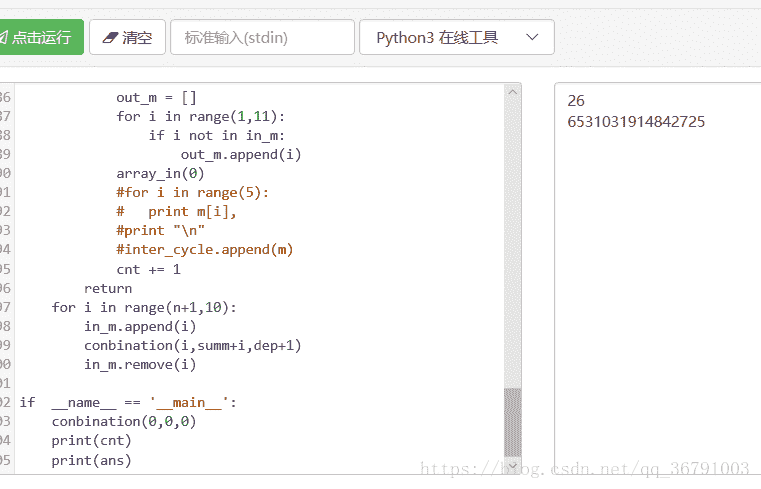

<!--yml
category: 未分类
date: 2022-04-26 14:35:11
-->

# ctf解题--算术题_妤儿兮兮的博客-CSDN博客_ctf快速计算

> 来源：[https://blog.csdn.net/qq_36791003/article/details/81458051](https://blog.csdn.net/qq_36791003/article/details/81458051)

### 题目

一道小学算术题，但是好多老师不会，不知道为什么
解题链接： [http://ctf5.shiyanbar.com/program/2/](http://ctf5.shiyanbar.com/program/2/)

### 解题

*   思路
    5条连线的数字之和要相等，即把每条连线上的数字相加，相加的和（记作sum0）要能被5整除。
    从上面的分析可以知道，填入的数字必须为1~10，也就是说内圈的数字要被重复计算一次，即（sum0 = 1+2+3+…+10+五个内圈的数字），而1~10的和为55能被5整除，在内圈挑选的数字也必须被5整除，因此可以进行一遍dfs（深度优先搜索），找出5个和能被5整除的数。
    通过计算我们可以得到一共有26组这样的组合。
    得到内圈能填哪些数后，易得外圈能填的数，还有内圈的5个数和外圈的5个数该填到对应的哪个位置的问题。总共的可能性有A（5,5）×A（5,5）中可能，分别进行搜索，并计算是否满足5条连线的和相等。如果相等在进行计算，看是否组成的串值最大
*   python

```
import os

pos = []
in_m = []
out_m = []
in_pos = []
out_pos = []

cnt = 0
ans = 0

def cal_ans(a,b):
    if b==10:
        return a*100+b
    else:
        return a*10+b

def     check():
    global in_m
    global out_m
    global in_pos
    global out_pos
    global ans
    m = []
    for i in range(10):
        m.append(0)
    for i in range(5):
        m[in_pos[i]] = in_m[i]
        m[out_pos[i]] = out_m[i]

    sum_check = []
    for i in range(0,10,2):
        sum_check.append(m[i]+m[i+1]+m[(i+2)%10])
    flag = 1
    for i in range(1,5):
        if sum_check[i]!=sum_check[i-1]:
            flag = 0
            break
    if flag == 1:

        tmp = 0
        m_min = 10000000000000000
        m_t = 1
        for i in range(1,10,2):
            if m[i] < m_min:
                m_min = m[i]
                m_t = i
        for i in range(5):
            tmp = cal_ans(tmp , m[m_t])
            tmp = cal_ans(tmp , m[m_t-1])
            tmp = cal_ans(tmp , m[(m_t+1)%10])
            m_t = (m_t + 2)%10 

        if tmp > ans:
            ans = tmp

def     array_out(dep):
    global out_pos
    if dep==5:
        check()
        return 
    for i in range(1,10,2):
        if i not in out_pos:
            out_pos.append(i)
            array_out(dep+1)
            out_pos.remove(i)

def     array_in(dep):
    global in_pos
    if dep==5:
        array_out(0)
        return
    for i in range(0,10,2):
        if i not in in_pos:
            in_pos.append(i)
            array_in(dep+1)
            in_pos.remove(i)

def     conbination(n,summ,dep):
    global in_m
    global out_m
    global cnt
    if dep==5:
        if summ%5==0:
            out_m = []
            for i in range(1,11):
                if i not in in_m:
                    out_m.append(i)
            array_in(0)

            cnt += 1
        return
    for i in range(n+1,10):
        in_m.append(i)
        conbination(i,summ+i,dep+1)
        in_m.remove(i)

if  __name__ == '__main__':
    conbination(0,0,0)
    print cnt
    print ans
```

运行结果：
