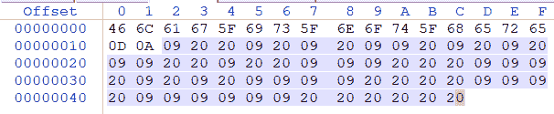

<!--yml
category: 未分类
date: 2022-04-26 14:22:17
-->

# ctf论剑场题解(1)_m0_51080245的博客-CSDN博客

> 来源：[https://blog.csdn.net/m0_51080245/article/details/109688933](https://blog.csdn.net/m0_51080245/article/details/109688933)

### CTF论剑场题解收集

1.头像

使用WinHex打开图片，在查看一栏中打开显示十六进制，然后在搜索栏中查找文本flag，可以找到十六进制显示栏中出现flag{bGxvdmV0aGVnaXJs}，

通过md5加密可得结果

[md5加密网址](https://www.cmd5.com/)

。

flag{adbc40de64d73a7faf5f53b0f1422991}

2.签到
flag{abcdABCD1234}

3.0和一的故事
不断解压文件，最后可得一flag{}.txt
以WinHex打开发现第二行开始有09 20组成的字符串

09 换为1, 20换为0(使用记事本的替换功能即可)
得到10010101101010110010011100011101010111100001110111111000000
转为不同进制数,最后十六进制的结果为flag
flag{4ad5938eaf0efc0}