<!--yml
category: 未分类
date: 2022-04-26 14:33:11
-->

# ctf赛题secret.php,CTF赛题全解之CTF成长之路（三）_weixin_39594312的博客-CSDN博客

> 来源：[https://blog.csdn.net/weixin_39594312/article/details/115649143](https://blog.csdn.net/weixin_39594312/article/details/115649143)

1.题目名称：BuyFlag

打开页面发现有个payflag的页面

点进去查看源代码发现注释中有代码

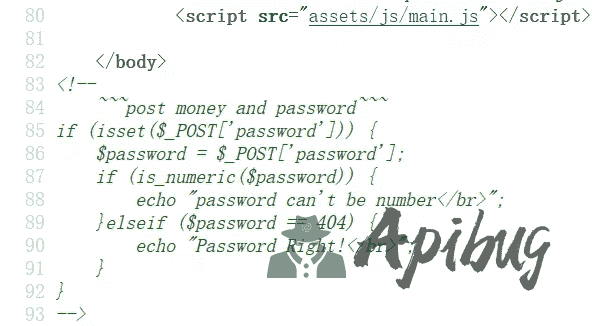

判断password参数是否是404，这里利用了is_numeric函数来进行判断所以提交404%20即可绕过is_numeric的判断。

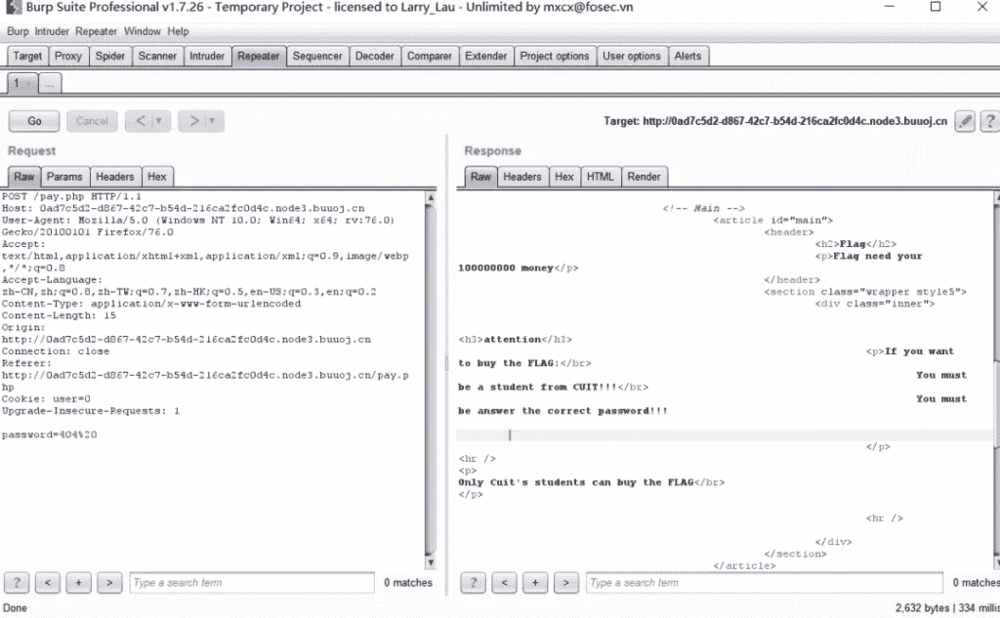

又要求必须是学生才行，这里看到cookie的user字段。这里我们改为1再进行提交。

通过判断一开始在源代码中的代码，我们添加money参数，将参数设置为flag的价格，然后显示金额太长。

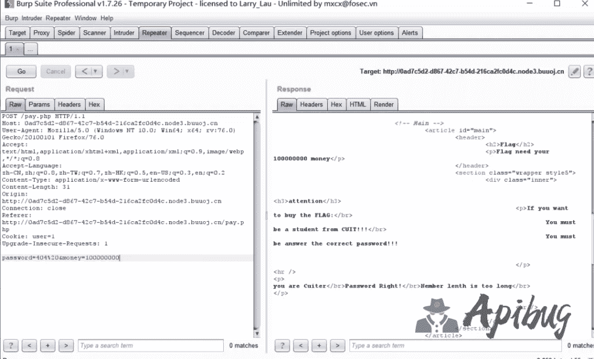

在经过测试后发现修改为数组后可以获得flag

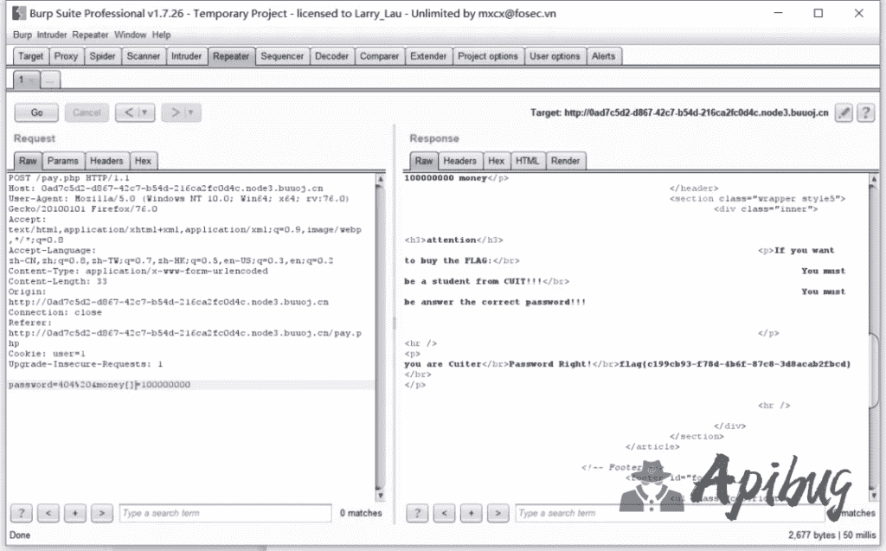

2.题目名称：你传你马呢

打开主页发现文件上传的地方

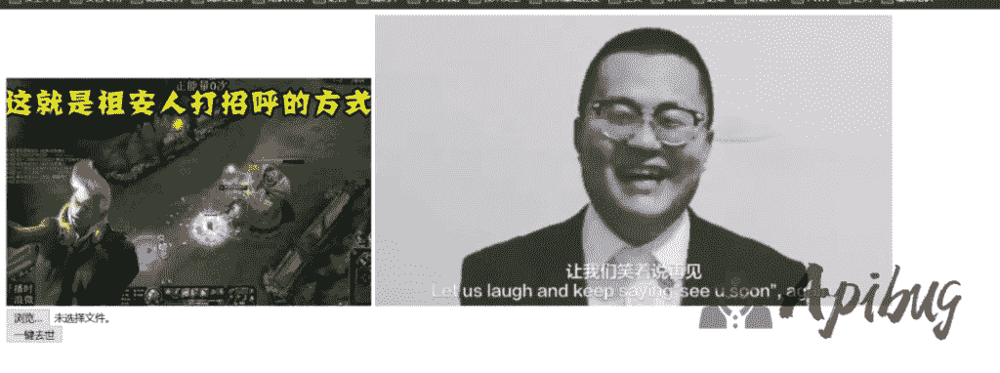

上传一个写有后门的图片格式文件发现可以上传。

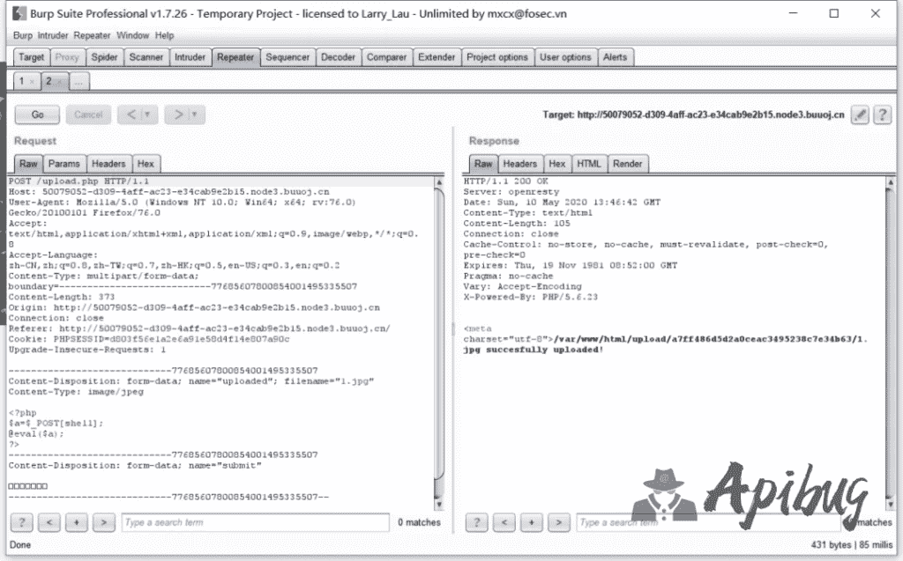

我们上传一个.ph作为尝试，发现已经被拦截，然后进行修改大小写发现依然拦截。所以推测是对ph进行了检测进制上传。

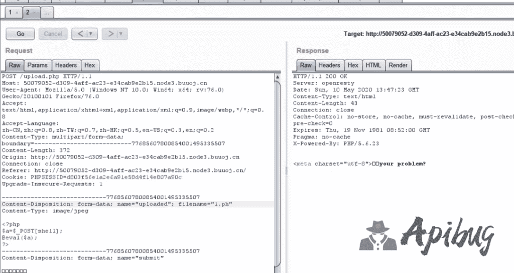

那么我们就尝试上传一个.htaccess，发现可以上传。

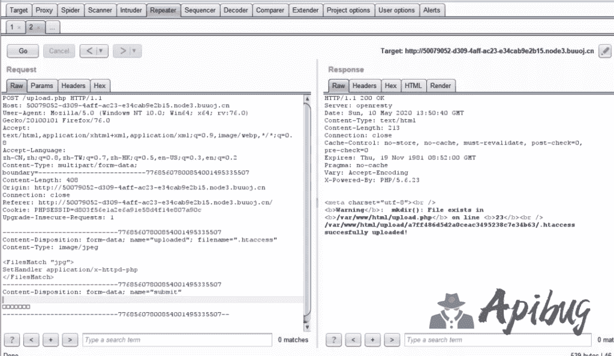

接下来直接上传一个jpg格式的带有后门的文件。

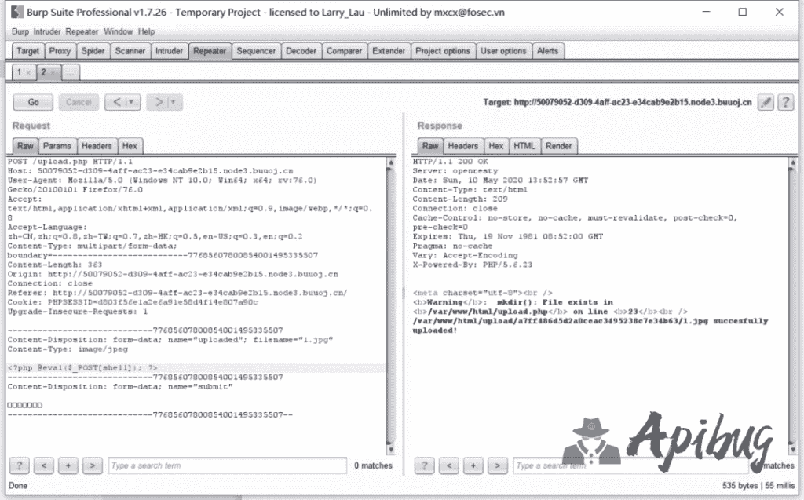

菜刀连接，获得flag。

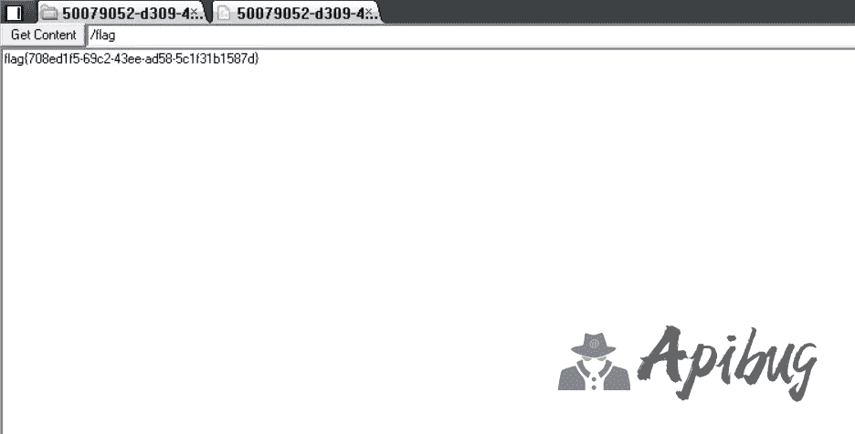

3.题目名称：BackupFile

通过提示下载index.php.bak

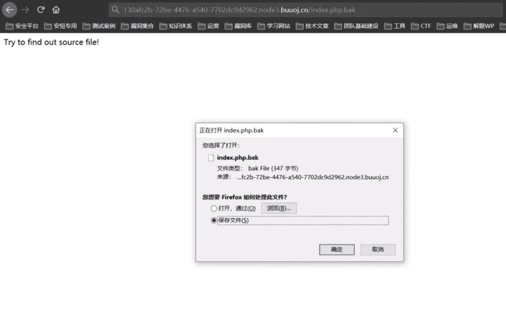

打开文件发现如下代码

include_once "flag.php";

if(isset($_GET['key'])) {

$key = $_GET['key'];

if(!is_numeric($key)) {

exit("Just num!");

}

$key = intval($key);

$str = "123ffwsfwefwf24r2f32ir23jrw923rskfjwtsw54w3";

if($key == $str) {

echo $flag;

}

}

else {

echo "Try to find out source file!";

}

Key只能为一个整数，这里我们通过php的弱类型比较，直接将传入123即可获得flag

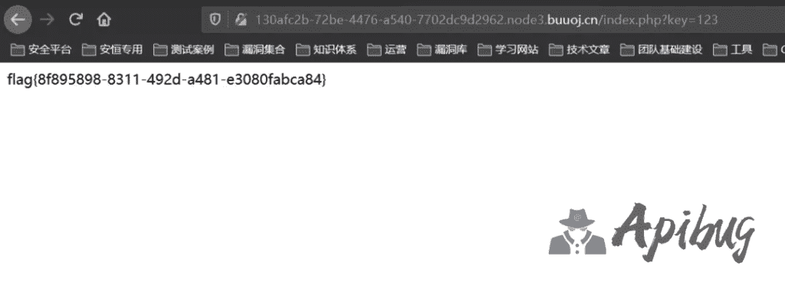

4.题目名称：easy_tornado

打开题目显示了3个文件

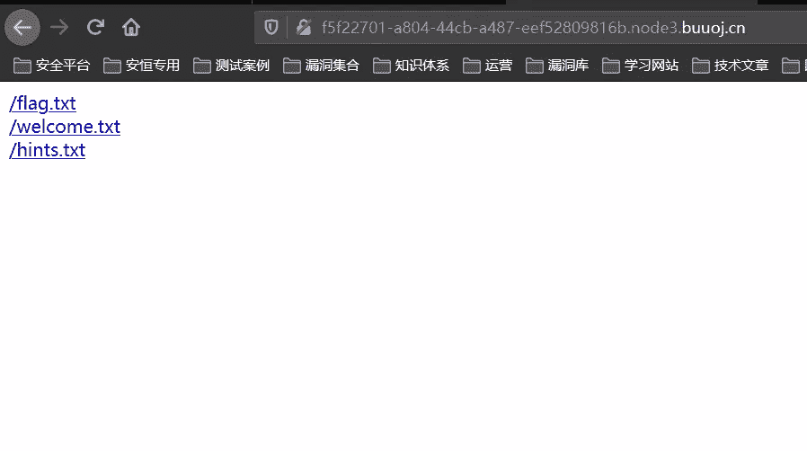

打开后发现连接中每个文件后面都会有一个filehash。

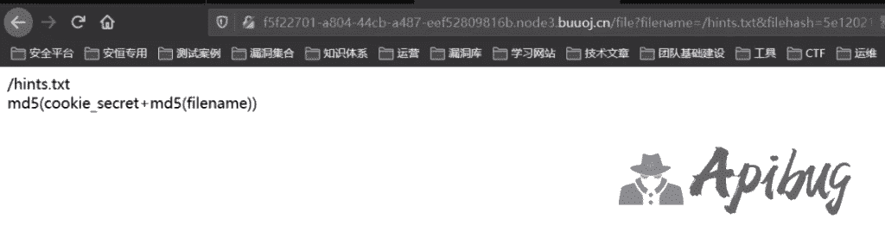

尝试修改文件名发现包含不了其它文件。提示Error

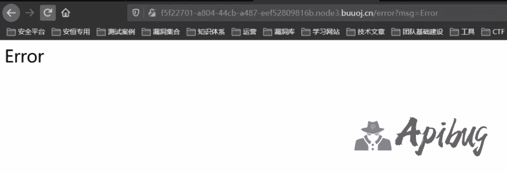

其实这个页面是存在注入点的，将参数修改为msg={{handler.settings}}可看到cookie_secret

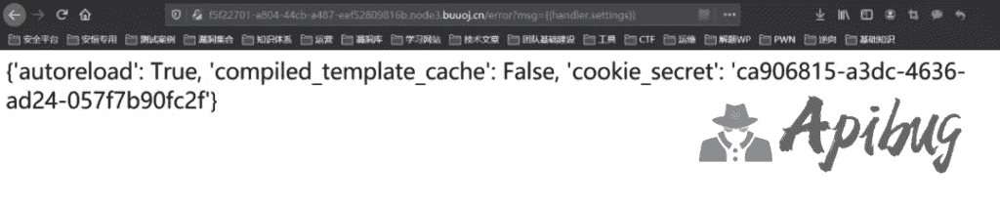

根据初始三个文件内所提示的flag文件为/fllllllllllllag，filehash的算法为md5(cookie_secret+md5(filename))

对应的脚本为：

echo md5('ca906815-a3dc-4636-ad24-057f7b90fc2f'.md5('/fllllllllllllag'));

读取flag：

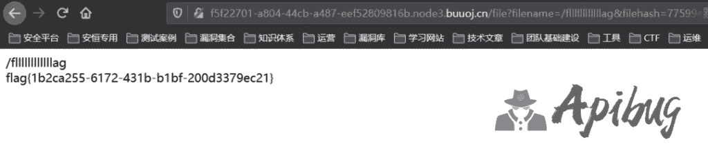