<!--yml
category: 未分类
date: 2022-04-26 14:49:56
-->

# ctf逆向解题——Bomb二进制炸弹_FunkyPants的博客-CSDN博客

> 来源：[https://blog.csdn.net/FunkyPants/article/details/96846945](https://blog.csdn.net/FunkyPants/article/details/96846945)

# Bomb

## Phase1

在输入阶段将由文件输入的字符存储在input中，在phase1，该阶段将原字符串存储到rdi中，调用pases_1函数进行字符串比较。

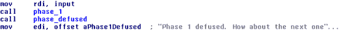

进入phase1函数，该函数将原字符串rdi与预先设定的字符串“Border relations with Canada
have never been better.”（存储在rsi中）进行比较，用于比较的函数是strings_not_equal，若两字符串相同，进入下一阶段。
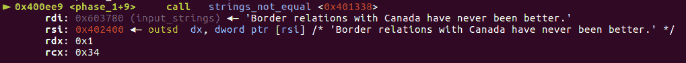

## Phase2

第二阶段首先分析需要输入的数据格式为'%d %d %d %d %d %d'，六个数字以空格隔开的数字。

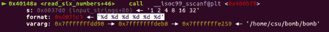

输入的数据被存储在栈上，每次向左移4位可以取出相应数字。

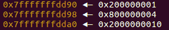
比较过程：
首先比较第一个数字，如果是1则进入后续步骤。
接着使用(rsp+4)取得第二个数字并放入rbx。将rbp设置为循环是否结束的标志位，其值为(rsp+18h)，每一位数字的存储占用4bit,4*6=24=18h。
接下来进行2~6位数字的比较，先将前一个数字取出放入eax中，把eax翻倍，比较此时eax与rbx 的值，若相等则进行下一个数的比较。可以看出之后的每个数字都是前一个数字的两倍。
Phase2的字符串是“1 2 4 8 16 32”.

## Phase3

首先分析sscanf()函数可以得到输入数据应为“%d %d”。
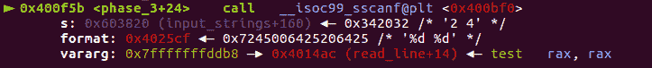

输入的两个数字分别被存储到rsp+8与rsp+12中。
将输入的第一个数字与7进行无符号比较，如果第一个数字小于7则进入下一步。
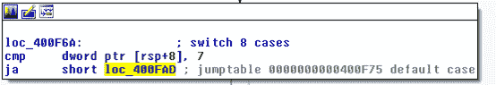
接下来是一个switch-case语句，根据第一个数字的值可以得到第二个数字值，此处共有7种组合，我们选择“7 326”进入下一阶段。
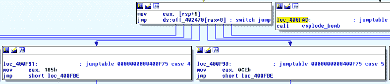

## Phase4

该阶段首先也是接收两个数字输入，存储方式与上述相同。
第一个数字需要小于0xe。
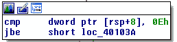

满足该条件时，将edx=0xe,esi=0,edi=第一个数字，这三个变量作为func4的参数调用func4。
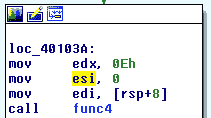

观察phase4的剩余部分，在func4结束后，对其返回结果eax的值进行判断，如果eax不等于0则程序爆炸；如果eax等于0，此时还需要输入的第二个数字也等于0，则可以通过phase4.
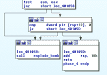

所以在phase4中需要使得返回结果eax为0.观察func4中的代码，该函数接收3个参数，也就是上文提到的edx=0xe,esi=0,edi=第一个数字。我们假设edi为变量x,esi为y，edx为z，eax为t，ecx为k，可以将func化简为以下c代码：

```
void func4(int x, int y, int z) {
    int t = z - y;
    int k = t >> 31;
    t = (t + k) >> 1;
    k = t + y;
    if(k <= x) {
        t = 0;
        if(k >= x) {
            return;
        }else {
            y = k + 1;
            func4(x, y, z);
        }
    }else {
        z = k - 1;
        func4(x, y, z);
       }
} 
```

如果要使得返回值t为0，需要满足k==x，通过带入x、y、z计算可以得到k=x=7，即第一个数为7，第二个数为0.

## Phase5

首先确定该阶段需要需要6个字符
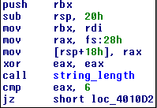

该程序将eax作为计数器，在每一次循环后加1，控制程序循环6次。在每一次循环中，程序取出我们输入的一个字符，将该字符与0xf进行与运算，得到的结果作为数组array_3499的偏移，用该数组中的字符替换原字符串。
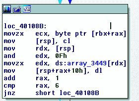

在完成对字符串的处理后，程序将处理后的字符串与“flyers”进行比较，如果两字符串相同则成功通过该阶段。
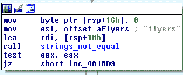

由上述过程，我们可以得到“flyers”字符在原数组中的索引为[9, 15, 14, 5, 6, 7]，也就是我们输入的ASCII字符与0xf进行与运算后应该得到的结果，所以可在从’a’~'z’这26个字母中，寻找符合对应条件的字母。最后得到的结果不唯一。
（i，y），（o），n，（e，u），（f，v），（g，w）

```
array = ['a', 'd', 'u', 'i', 'e', 'r', 's', 'n', 'f', 'o', 't', 'v', 'b', 'y', 'l']

for i in range(0,len(array)):
    d[array[i]]=i+1
'''
d={'a': 1,
 'b': 13,
 'd': 2,
 'e': 5,
 'f': 9,
 'i': 4,
 'l': 15,
 'n': 8,
 'o': 10,
 'r': 6,
 's': 7,
 't': 11,
 'u': 3,
 'v': 12,
 'y': 14}
'''

s = []
for i in 'flyers':
    s.append(d[i])

for i in s:
    for j in range(ord('a'),ord('z')+1):
        if j & 0xf == i:
            print(chr(j))
    print("-"*10) 
```

## Phase 6

Phases接收6个数字输入，使用的函数同样是read_six-numbers。

### Part 1

在接收输入后，首先判断输入的六个数字都小于6且不重复。程序逻辑为:

*   1 取出第一个数，在数组中索引为i，判断其需要小于6，再用该数字与之后的6-i个数字进行比较，判断其与另外6-i个数字都不重复。
*   2 取出下一个数，重复上述操作，直到6个数都满足条件。

```
对于输入的6个数字（索引为i）：
    取出其中一个数：
        如果该数字小于6：
            对于剩余6-i个数字：
                如果剩余6-i个数字与该数字都不相等：
                    取出下一个数
                explode_bomb()#数字有重复时
        explode_bomb()#数字大于6时 
```

代码解释如下：
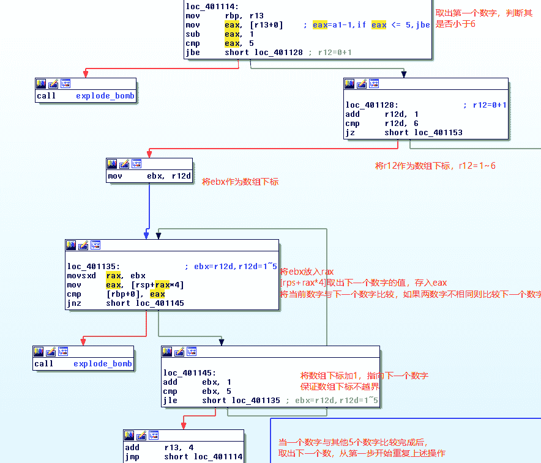

### Part 2

第二部分完成的操作是，用7减去数组中的每一个数字，将得到结果结果存储在数组原位置上。

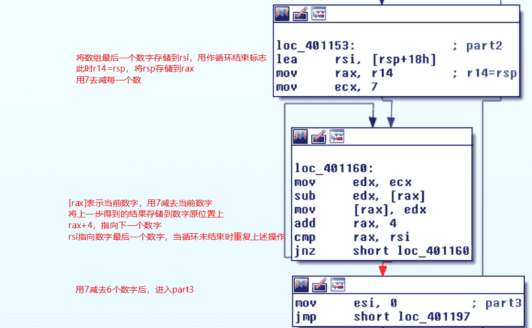

### Part3

该部分完成的功能是，根据我们输入的数组，对结构体数组重新排序。按照我们输入的数字的大小1，如果我们输入的5 2 4 3 1 6，那么node5会被存储在第一个位置，node2会被存储在第二个位1置……

第三部分中用到了6个预先定义的结构体node，一个node结构体如下

```
node{
value1;
value2;
*next;指向下一个node
} 
```

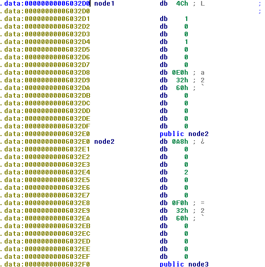

代码解释如下：
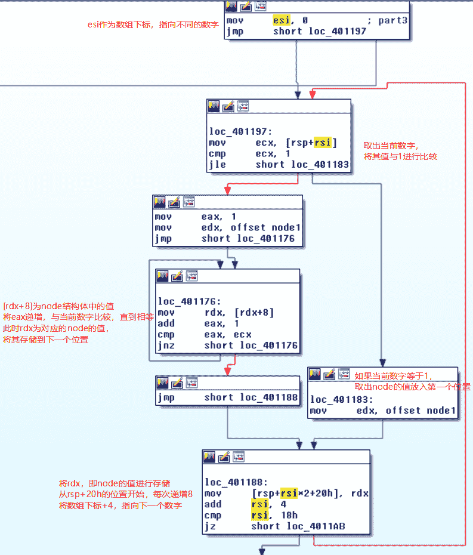

### Part4


### Part5

Part5是判断最后得到的结构体数组是否为递减数组。如果要得到最后的结果，根据原结构体数组可以得到顺序[3, 4, 5, 6, 1, 2]，考虑到part2中进行了减法操作，最后的序列是[4, 3, 2, 1, 6, 5]。
art4
[外链图片转存中…(img-WpdUYfna-1563771031455)]

### Part5

Part5是判断最后得到的结构体数组是否为递减数组。如果要得到最后的结果，根据原结构体数组可以得到顺序[3, 4, 5, 6, 1, 2]，考虑到part2中进行了减法操作，最后的序列是[4, 3, 2, 1, 6, 5]。