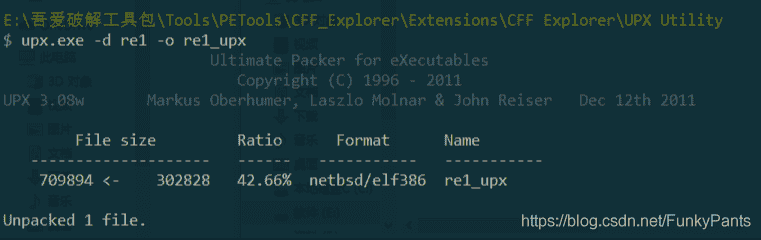
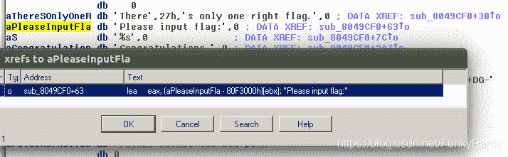
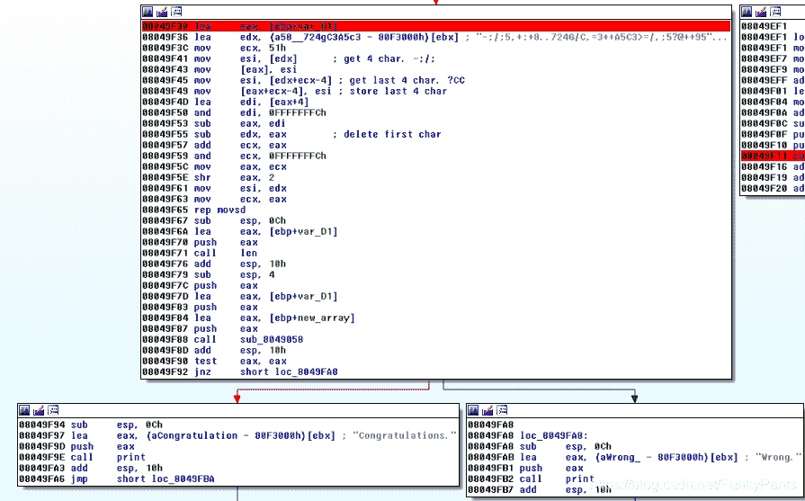
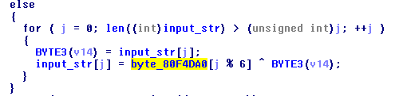
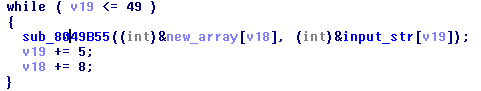
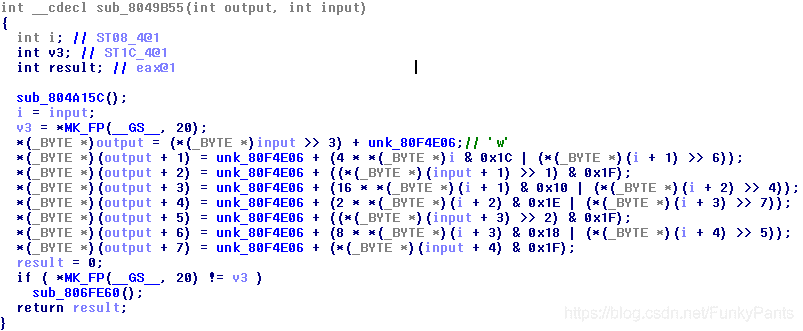
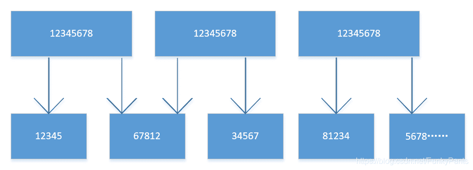
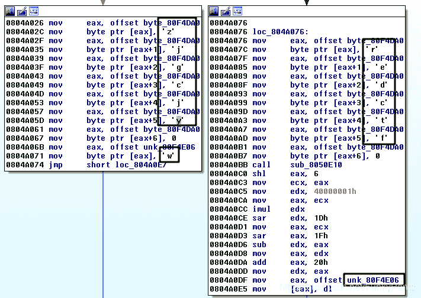

<!--yml
category: 未分类
date: 2022-04-26 14:30:11
-->

# ctf逆向解题——re1_FunkyPants的博客-CSDN博客_ctf逆向题

> 来源：[https://blog.csdn.net/FunkyPants/article/details/96843483](https://blog.csdn.net/FunkyPants/article/details/96843483)

# ctf逆向解题——re1

## 1.题目概述

题目给出一个带壳的32位ELF文件，要求通过对其进行分析，得到输入flag为何值时，程序可以得到正确的结果。
题目文件下载链接：
链接: [https://pan.baidu.com/s/1ns8LiGSODII313skD1Mi4w](https://pan.baidu.com/s/1ns8LiGSODII313skD1Mi4w) 提取码: m43u

## 2.题目知识点

1.  脱壳
2.  反汇编
3.  位运算

## 3.做题环境

*   Ubuntu16.04(32bit or 64bit)
*   IDA6.8
*   gdb

## 4.解题思路

## 脱壳

使用upx脱壳工具直接脱壳



## 4.1 初步观察

首先观察程序运行流程，在运行后，程序等待接收一个flag，如果超过5秒未输入或输入错误则退出。
使用IDA打开脱壳后的文件，可以看到函数名称均未被正确恢复，首先我们需要定位主函数。在运行程序时我们看到程序输出了一个字符串“Please input flag”，可在strings中找到该字符串，查看交叉引用，定位到主函数。



在定位到主函数后，可使用hex-rays插件进行反汇编（快捷键F5），查看程序大致流程。根据程序的执行流程、函数的参数可以大致猜测出部分函数的功能，使用快捷键n可以对其进行重命名。
可将程序大致分为三个部分：

### 4.1.1 part1

在接收输入字符串后，判断程序运行环境，之后选择对字符串从前向后或从后向前进行异或操作。
![[外链图片转存失败(img-M3kYTzA2-1563768256642)(assets/markdown-img-paste-20190721204534661.png)]](img/e95db923472c203d738db1287dc1d69f.png)

### 4.1.2 part2

开辟一段长度为100个字符的内存空间，对上一步异或后的字符串，按照一定规律将其放入新的内存空间。

![[外链图片转存失败(img-Z76j5gVX-1563768256643)(assets/markdown-img-paste-20190721204722809.png)]](img/e74cd4c0f757c202294906c8127f7403.png)

### 4.1.3 part3

对于程序中给定的一个长字符串，进行复杂的操作后，调用一个函数将该字符串与上一步得到的字符串进行比较，根据结果输出wrong或者congratulations。



## 4.2 具体分析

### 4.2.1 part1

根据程序执行流程，输入字符串长度应为50。输入字符串后，程序会调用一个函数对当前运行环境进行判断（此处有坑），决定程序向左或向右执行，这里可以先略过对环境判断函数的分析，选择使用判断失败的路径进行后续分析。

对于这条路径，程序对输入的字符串按照从前向后的顺序，使用字符串byte_80f4da0逐个字符进行异或操作，通过动态调试可以得到该字符为"zjgcjy"（暂时认为此值正确）。



### 4.2.2 part2

该部分将异或后的字符串按照一定规则存入新开辟的地址空间，观察该函数逻辑。



该函数接收原字符串input与新字符串outputr的地址，每次使用input中5个字符，通过操作后得到8个新字符并存入output中。完成一次操作后，input加5，output+8，直到对input中的所有字符完成操作。

通过分析函数的逻辑，可以得到该函数的功能是将input的5个字符按照每个字符对应8位二进制数据的形式，转化为40位二进制字符。将40位二进制字符按照每组5位取出8组，对每一组二进制数据加上一个unk字符，得到最后的8个output字符。

运算顺序：乘法运算高于逻辑运算，关于运算符的执行顺序也可以通过分析汇编代码得到。

output = unk + input,为了简化表达，以下分析过程省略unk,input省略为i

```
output0 = i0 >> 3

1234 5678 -> 0001 2345

相当于output0=i0(12345)

output1 = 4*i & 0x1c | i1 >> 6
i0(3456 7800) & ‭00011100‬ -> i(678)
i1(1200 0000) -> i1(12)
000678000 | 0000 0012 -> 0006 7812
相当于output1=i0(678)+i1(12)

output2 = i1 >> 1 & 0x1f
i1(1234 5678) -> i1(0123 4567)
i1(0123 4567) & ‭00011111‬ -> i1(34567) 
```



### 4.2.2 part3

在IDA6.8中，反汇编插件得出的结果可以直观的看出是错误的，小伙伴的7.0似乎得到了正确的结果。我们可以通过分析汇编代码观察进行了什么操作。可以看到程序在一顿移位操作后使用了`rep movsd`命令进行字符串的复制，查找其具体用法:

```
rep指令的目的是重复其上面的指令.ECX的值是重复的次数.
movsd指令是移动一个双字（dword），将DS:ESI中的值拷贝到ES:EDI指向的地址. 
```

但是在mov指令完成后，后面的操作中均未使用ES段的数据。在该汇编块的末尾，程序调用了一个函数，其参数是该段中定义的一个长字符串与part2中的得到的字符串，最后根据函数返回结果，如果反汇结果为0则输出“wrong”，可以猜测该函数的功能是字符串比较。`rep movsd`指令之前的操作不会影响最后的结果，在分析时可略过。

## 4.3 flag

在本题中，flag由我们输入，需要从根据程序的流程逆推得到。
在part2中计算的结果，应该与part3中的定义的长字符串相等。在前面已经分析过part2完成的功能，现在考虑如果由其得到的结果逆推出part2中输入的字符串。

直观上来看，part2中将50位ASCII字符按照每个字符对应8位二进制码的形式，转化为400位二进制字符串，按5位一组取出80组，加上一个unknown字符后的得到结果，也就是part3中的长字符串。现在已知part3长字符串，将其每一字符减去unknown字符，得到的应该是一个小于等于5位的二进制码，补全至5位，再将所有二进制码拼接为400位，按8位一组取出50组即可还原出part2中的输入字符串。

这里需要考虑的一个问题是unkown字符的值，在最初通过动态调试得到的unknown是"w"，用这个值不能计算得到结果，此时考虑是否另有其值。经过提醒，在part1中程序会调用一个函数对当前运行环境进行判断，从而决定unknown的值，该值属于ASCII字符，我们可以通过爆破的方法去猜测。另外，该函数也决定了part1中byte_80f4da0的值，对于byte_80f4da0查找交叉引用可以看到正确值是"redctf"。



在计算得到part2中的字符后，根据异或运算的性质，进行与part1中相同的异或操作，即可还原得到flag。

```
flag{e4Sy_ReVer5e_bU1It_0n_hO0K_Antldbg_anD_UpX?!} 
```

代码如下：

```
compare = "-;/;5,+:+8..724G/C,=3++A5C3>=/,;5?@++95-,7H;A9EA2/H-5.3+,36+9+DG-?/.79<<-7A0=?CC"

total = ''
for w in range(0x20, 0x7e + 1):  
    for s in compare:
        if ord(s) - w < 0:  
            break

				s5 = bin(ord(s) - w).replace('0b', '')

        if len(s5) != 5:  
            s5 = "0" * (5 - len(s5)) + s5
        total += s5  

    count = 0
    s = ''
    b = ''
    for c in total:
        s += c
        count += 1
        if count == 8:
            b += chr((int('0b' + s, 2)))
            s = ''
            count = 0
    total = ''

		flag = ''
		tag = 'redctf'

		for i in range(0, 50):
				flag += chr(ord(b[i]) ^ ord(tag[i % 6]))
		try:
				print(flag)
		except Exception as e:
				print(e)
				continue 
```

## 5.总结收获

1.  逆向分析时，应该主要关注代码段（函数）完成的功能，不要过多局限于单条指令功能的分析。
2.  在ctf中，很多时候会遇到出题人故意留的坑，比如这题中part1中用于异或的字符串根据环境的不同而不同，part3中进行复杂操作后却不影响结果，遇到这种情况应拓宽思路。