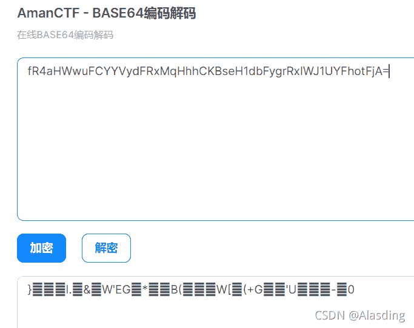
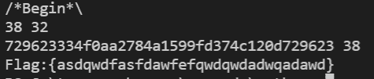

<!--yml
category: 未分类
date: 2022-04-26 14:42:22
-->

# decrypt-WEB-BugKuCTF_Alasding的博客-CSDN博客

> 来源：[https://blog.csdn.net/Alasding/article/details/120676352](https://blog.csdn.net/Alasding/article/details/120676352)

# 题目


密文：fR4aHWwuFCYYVydFRxMqHhhCKBseH1dbFygrRxIWJ1UYFhotFjA=
提示：

```
<?php
function encrypt($data,$key)
{
    $key = md5('ISCC');
    $x = 0;
    $len = strlen($data);
    $klen = strlen($key);
    for ($i=0; $i < $len; $i++) { 
        if ($x == $klen)
        {
            $x = 0;
        }
        $char .= $key[$x];
        $x+=1;
    }
    for ($i=0; $i < $len; $i++) {
        $str .= chr((ord($data[$i]) + ord($char[$i])) % 128);
    }
    return base64_encode($str);
}
?> 
```

# 题解

先base64解密密文：
<mark>}l.&W’EG*B(W[(+G’U-0</mark>


一串乱码
MD5的key：
729623334f0aa2784a1599fd374c120d

# 提示

看加密代码，先是key长度补齐，再进行一个凯撒密码加密，ASCII码的最大值为128，所以密文-key>0，则data+char<128;res=密文-key;
否则res=密文-key+128

# 代码

```
def decrypt():

    string="}l.&W'EG*B(W[(+G'U-0"
    key="729623334f0aa2784a1599fd374c120d"
    print(len(string),len(key))
    char=key+key[:len(string)-len(key)]
    print(char,len(char))
    flag=""
    for i in range(len(string)):
        if ord(string[i])-ord(char[i])>0:
            flag+=chr(ord(string[i])-ord(char[i]))
        else:
            flag+=chr(ord(string[i])-ord(char[i])+128)
    print(flag)

if __name__ == '__main__':
    print("/*Begin*\\")
    decrypt() 
```

# 结果


<mark>Flag:{asdqwdfasfdawfefqwdqwdadwqadawd}</mark>