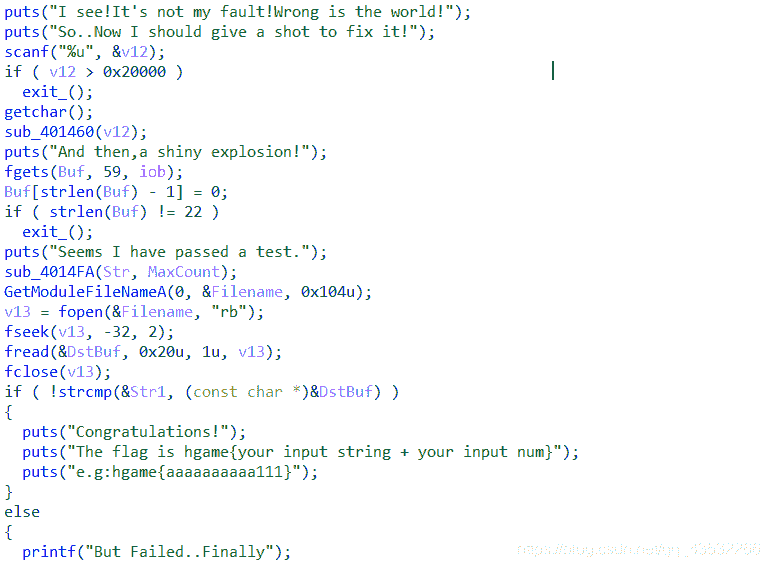
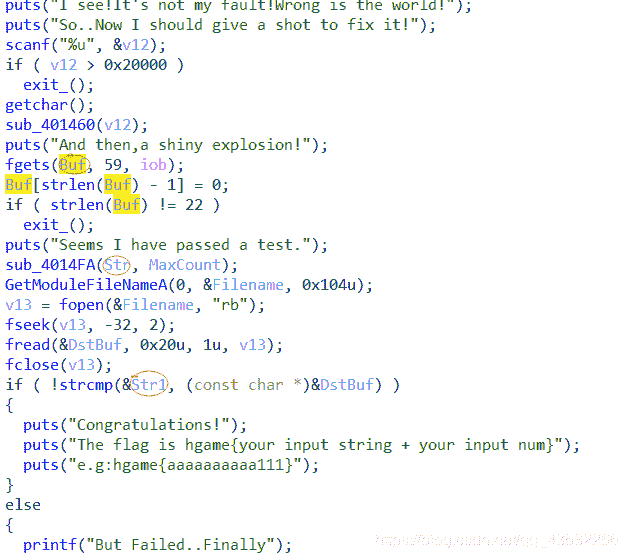
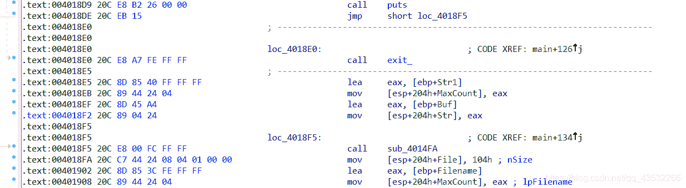
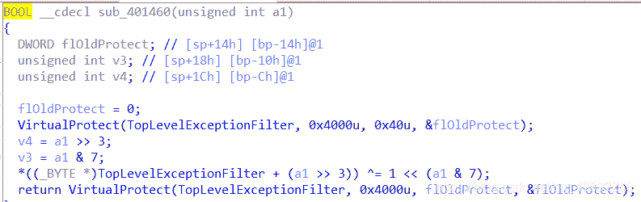
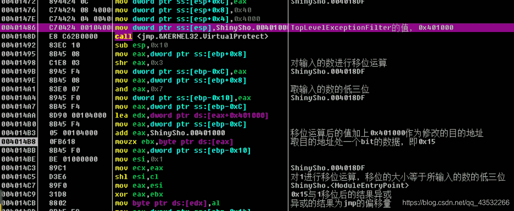
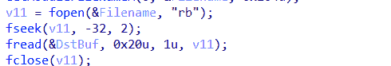
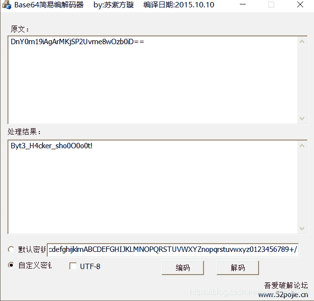

<!--yml
category: 未分类
date: 2022-04-26 14:45:37
-->

# hgame ctf week2--shinyshot题解_weixin_30753873的博客-CSDN博客

> 来源：[https://blog.csdn.net/weixin_30753873/article/details/96498164](https://blog.csdn.net/weixin_30753873/article/details/96498164)

第一次做hgame，感觉杭电的师傅们出的题挺好的（虽然这个题的出题人Ch1p师傅觉得这个题是个lj）

话不多说，直接上解题思路！感谢Ch1p师傅的点拨

题目：

链接：https://pan.baidu.com/s/1JHlQpnjPwIzJlUGWXoQHqw 
提取码：bg8f 

首先运行一次，然后用ida打开根据字符串找到main函数，f5之后如下：

​

这段函数的逻辑较清楚：先输入一个数字，满足条件后要再输入一个字符串，最后的flag就是满足条件的字符串加数字。

但是可以发现这段代码问题。

​

第二次的字符串仅仅做了个计算长度的操作后就不再使用了，而后面又莫名其妙多了一个str出来，所以我们可以怀疑是传参输了问题。

回到主函数，读汇编代码，可以发现有一段代码没有执行

​

0x4018de处的jmp直接跳转到了loc_4018F5处而略过了中间那一段代码。

我们可以修改jmp的偏移量从而改变跳转

若要跳转至0x4018e5，则偏移量应改为0x4018e5-0x4018de-2（jmp指令字节数）= 0x5

但这个题并不是让我们手动修改偏移量的。

我们可以看到第一次输入的数会传入sub_401460

​

查了一些virtualprotect这个api，了解到这个函数可以修改段属性，那么可以猜测后面的那个jmp的偏移量就是用这个函数进行修改的。

只看这段伪代码我没有完全明白意思，用od调试之后就明白了。

​

我们要将0x15修改为0x5，所以异或的结果为5，0x15^（1<<4）=5

修改的目的地址为0x4018df，所以我们输入的数为（0x8df<<3）+ 4=18172

sub_4014FA是一个换表了的base64，然后在最后进行了一次异或运算

​

这一段的作用是读取程序内部一段数据，我们可以在调试时找到这段数据，最后我们输入的字符串经过sub_4014FA的处理后与这段数据进行比较。

解密脚本简单，就不放了（懒），，放个结果：DnY0m19iAgArMKjSP2Uvme8wOzb0iD==

最后就是可以用一个自定义base64解密器解密即可

​

# over！

：