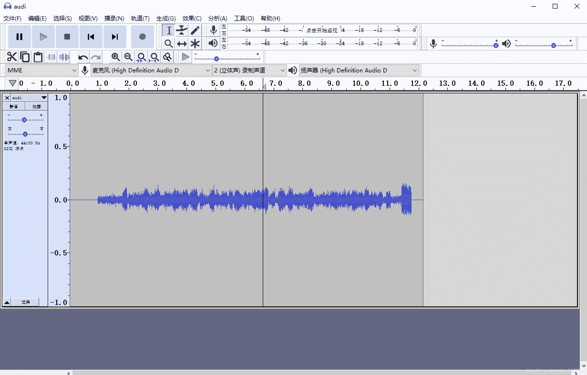
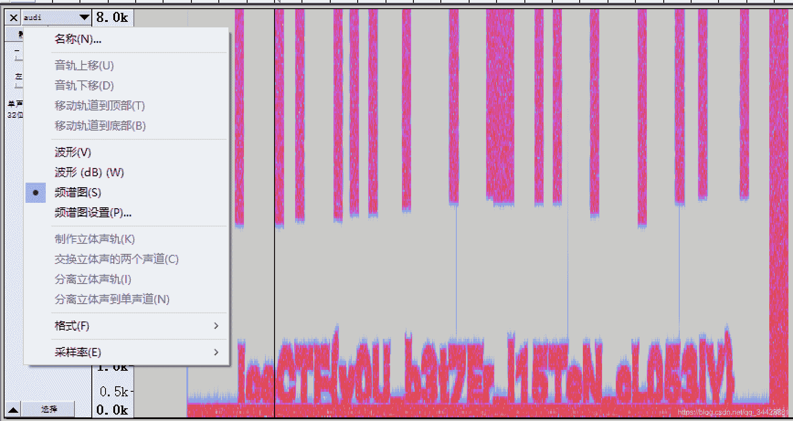

<!--yml
category: 未分类
date: 2022-04-26 14:47:50
-->

# ichunqiu CTF 训练 Basic 全解_Daren_f0的博客-CSDN博客

> 来源：[https://blog.csdn.net/qq_34423381/article/details/112974891](https://blog.csdn.net/qq_34423381/article/details/112974891)

本文题目出自 [ichunqiu CTF大本营](https://www.ichunqiu.com/battalion?t=1&r=0) 的 `Basic` 题目

### 1\. 来看一下 `flag` 格式

直接提交 `flag` 即可

### 2\. Audio Problems

> 题目内容：
> We intercepted the [audio signal](https://static2.ichunqiu.com/icq/resources/fileupload/CTF/IceCTF/basic/audi.wav) it sounds like there could be something hidden in it. Can you take a look and see if you can find anything?

下载文件，可以看到是一个 `.wav` 音频文件
打开之后，是一段嘈杂的声音，间断型波动，像是电报那种摩丝编码
掏工具 `Audacity` 查看一下

看起来又不像是莫斯编码，手动调到频谱图模式

发现看不太清楚，试试调频谱图设置，发现不会调，算了将就看吧
`IceCTF{y0U_b3t7Er_l15TeN_cL053lY}`

### 3\. Corrupt Transmission

* * *

### 待更新…