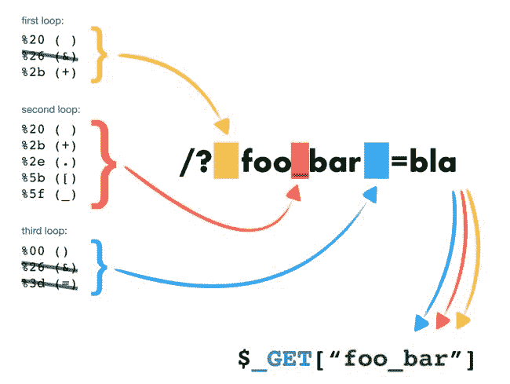
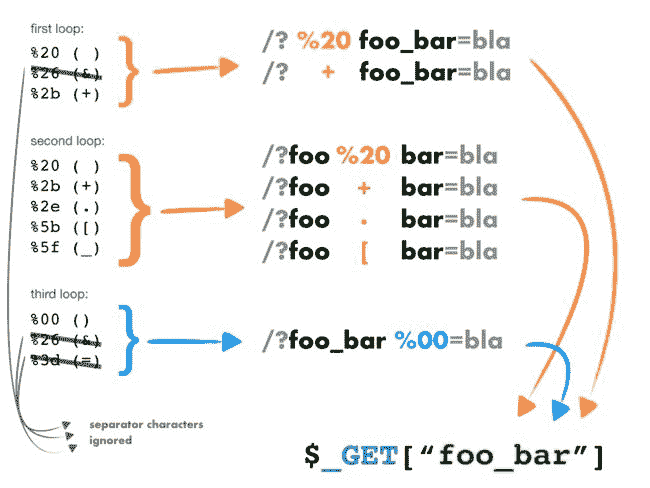
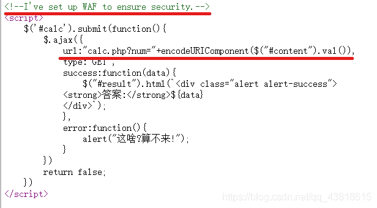
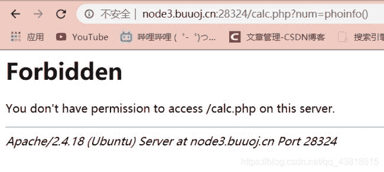
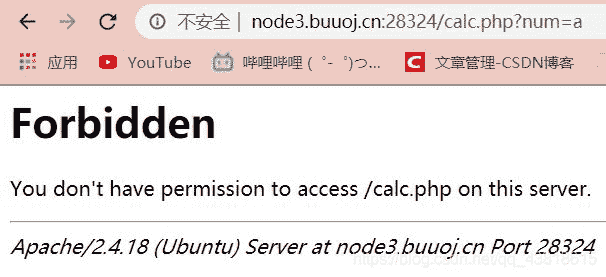
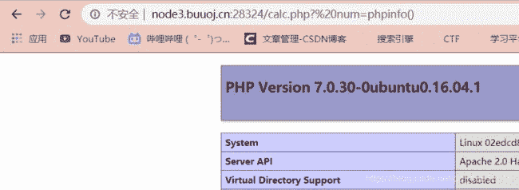
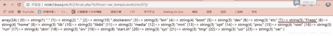
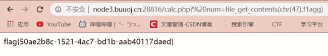

<!--yml
category: 未分类
date: 2022-04-26 14:50:21
-->

# php string ctf,PHP字符解析特性绕WAF【buuctf题 easy calc】_weixin_39939601的博客-CSDN博客

> 来源：[https://blog.csdn.net/weixin_39939601/article/details/115575821](https://blog.csdn.net/weixin_39939601/article/details/115575821)

一、PHP字符串解析特性

PHP需要将所有参数转换为有效的变量名，因此在解析查询字符串时，它会：

1.删除空白符

2.将某些字符转换为下划线(包括空格)

例如，/?%20news[id%00=42会转换为Array([news_id] => 42)，然后参数%20news[id%00的值将存储到$_GET["news_id"]中。(URL编码%20是空格，%00是0)

例如：

User input

Decoded PHP

variable name

%20foo_bar%00

foo_bar

foo_bar

foo%20bar%00

foo bar

foo_bar

foo%5bbar

foo[bar

foo_bar

二、parse_str函数

parse_str函数通常被自动应用于get、post请求和cookie中。那么解析函数到底是如何处理这些特殊字符的，假设特殊字符在3个位置：

1.[1st]foo_bar

2.foo[2nd]bar

3.foo_bar[3rd]

下面粘贴两张大佬的测试结果：

特殊字符在最前端：(空格)、(+)  可被删掉；

特殊字符在中间：(空格)、(+)、(.)、([)、(_)被转换成下划线；

特殊字符在末尾：%00()空白字符会被删掉；

三、下面是一道CTF题

1、主页面只是个计算器，右键查看源代码，可以看到有两个信息点：一是上了WAF，二是被发送到calc.php进行计算了。

2、访问calc.php看到源码,获取一个num的变量，并进行了黑名单过滤

3、发现num只要传入了字符就会报错，应该是WAF

4、发现利用PHP的字符串解析特性就能够绕过waf，WAF检测的可能是num这个变量，我们在前面加个空格变成%20num，WAF就检测不到，而PHP解析的时候把空格删掉了正确解析成num,所以可以绕过。

5、可以用  ?%20num=var_dump(scandir(/)) 来查看根目录下的文件和目录,但是/在黑名单里，所以我们把它换成chr(47)，

payload:   ?%20num=var_dump(scandir(chr(47)))

得到数组

6、用file_get_contents()函数读取f1agg文件的内容，

payload: ?%20num=file_get_contents(chr(47).f1agg)

scandir函数：返回指定目录中的文件和目录的数组。

chr()函数：chr() 用一个范围在 range(256)内的(就是0～255)整数作参数，返回值是当前整数对应的 ASCII 字符。

file_get_contents()函数：file_get_contents() 把整个文件读入一个字符串中。

题目要点：

1、上了WAF，用PHP字符串解析特性绕过；

2、黑名单中的字符用chr函数来绕过；

3、用scandir函数读取文件和目录；

4、用file_get_contents函数读取具体文件内容；

参考文章：https://www.freebuf.com/articles/web/213359.html