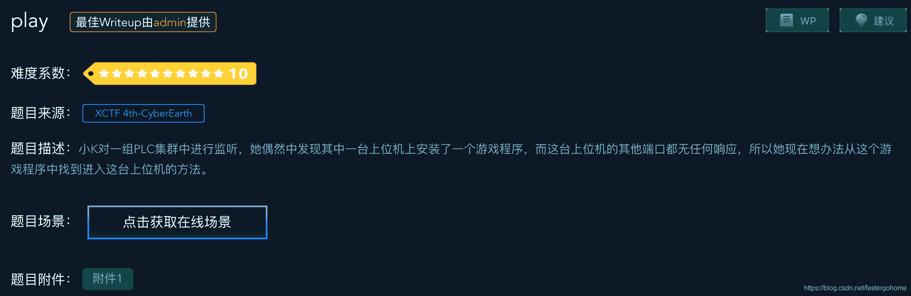

<!--yml
category: 未分类
date: 2022-04-26 14:31:43
-->

# play [XCTF-PWN][高手进阶区]CTF writeup攻防世界题解系列26（超详细分析）_3riC5r的博客-CSDN博客

> 来源：[https://blog.csdn.net/fastergohome/article/details/103751175](https://blog.csdn.net/fastergohome/article/details/103751175)

题目地址：[play](https://adworld.xctf.org.cn/task/answer?type=pwn&number=2&grade=1&id=4911&page=2)

本题是高手进阶区的第15题，比较有意思！

先看看题目：



后面的题目都是十颗星的难度，需要具备比较好的漏洞挖掘能力，在这些题目中我们能学到各种各样的新的姿势。

惯例先看看保护机制：

```
[*] '/ctf/work/python/play/a642a99a83fe4e31b1bd75959e52e6a1'
    Arch:     i386-32-little
    RELRO:    Partial RELRO
    Stack:    No canary found
    NX:       NX enabled
    PIE:      No PIE (0x8048000)
```

 这个代码的理解需要仔细分析，我这边已经把这个程序涉及到的数据结构给大家写出来了：

```
struct Hero
{
	DWORD dwSlave;		//*(_DWORD *)gHero)
	DWORD h2;			// 
	DWORD dwSurplus;	//*((_DWORD *)gHero + 2)) 血量 剩余额
	DWORD dwRecoveryHP;			// recovery_hp
	char* szHeroName;
	hero_kill_type* pHeroKillType; //*((_DWORD *)gHero + 20)
};

struct hero_kill_type
{
	DWORD dwAttachNum;
	DWORD dwDefenseNum;
	char* szAttackName;
	char* szAttackDesc;
	DWORD dwHidenPlusNum;
};

struct Monster
{
	DWORD dwSlave;		// *(_DWORD *)gMonster)
	DWORD m2;			// *(_DWORD *)(gMonster + 4)
	DWORD dwSurplus;	// *(_DWORD *)(gMonster + 8))
	DWORD dwRecoveryHP;
	char* szMonsterName;	// (char *)(gMonster + 16)
	monster_skill_type* pMonsterSkillType;		// *(_DWORD *)(gMonster + 80)
};

struct monster_skill_type
{
	DWORD dwAttachNum;
	DWORD dwDefenseNum;
	char* szDefenseName;
	char* szDefenseDesc;
	DWORD dwHidenPlusNum;
};
```

根据这个数据结构，我把程序的c语言代码重写了一下。

main函数：

```
int __cdecl __noreturn main(int argc, const char **argv, const char **envp)
{
  init();
  main_logic();
}

void __noreturn main_logic()
{
  int nChoice; // eax
  int v1; // [esp+8h] [ebp-10h]
  int v2; // [esp+Ch] [ebp-Ch]

  v1 = 0;
  while ( 1 )
  {
    while ( 1 )
    {
      round_menu();
      printf("choice>> ");
      nChoice = read_int();
      v2 = nChoice;
      if ( nChoice != 2 )
        break;
      run_away();
    }
    if ( nChoice > 2 )
    {
      if ( nChoice == 3 )
      {
        change_skill();
      }
      else
      {
        if ( nChoice == 4 )
          exit(0);
LABEL_13:
        puts("invalid choice");
      }
    }
    else
    {
      if ( nChoice != 1 )
        goto LABEL_13;
      attack();
    }
  }
}
```

初始化和释放内存的代码：

```
void init()
{
  unsigned int v0; // eax
  char szFilename; // [esp+0h] [ebp-48h]

  v0 = time(0);
  srand(v0);
  init_io();
  if ( access(g_tmp_db_dir, 0) && mkdir(g_tmp_db_dir, 0x1EDu) == -1 )
  {
    perror("mkdir error");
  }
  else
  {
    chdir(g_tmp_db_dir);
    while ( 1 )
    {
      printf("login:");
      read_buff((int)&szFilename, 64, 10);
      if ( (unsigned __int8)check_name(&szFilename) )
        break;
      puts("bad name");
    }
    if ( access(&szFilename, 0) )
    {
      puts("welcome to the system!");
      init_new_db_file(&szFilename);
    }
    else
    {
      puts("welcome back to the system");
    }
    init_db(&szFilename);
    gMonster = (int)malloc(0x54u);
    init_monster(0);
    init_hero();
  }
}

void *init_hero()
{
  void *result; // eax

  gHero->h2 = 0;
  gHero->dwSurplus = 20 * (gHero->h2);
  result = gHero;
  gHero->h4 = gHero->h2;
  return result;
}

int __cdecl init_monster(int nKilledMonsterNum)
{
  int result; // eax

  *(_DWORD *)gMonster->dwSlave = nKilledMonsterNum;
  gMonster->m2 = 0;
  gMonster->dwSurplus = 30 * (nKilledMonsterNum + 1);
  gMonster->m4 = nKilledMonsterNum + 1;
  strcpy((char *)(gMonster->szMonsterName), (&Monster_name)[nKilledMonsterNum]);
  result = 20 * nKilledMonsterNum + 0x804B140;              // g_monster_skill_type
  gMonster->pMonsterSkillType = result;
  return result;
}

void *__cdecl init_db(char *file)
{
  int v1; // eax
  void *result; // eax

  v1 = open(file, 2);
  gfd = v1;
  result = mmap(0, 0x1000u, 3, 1, v1, 0);
  gHero = result;
  return result;
}

int __cdecl init_new_db_file(char *file)
{
  int fd; // ST1C_4

  fd = open(file, 66, 438);
  gHero = malloc(0x54u);
  memset(gHero, 0, 0x54u);
  strcpy((char *)gHero->szHeroName, file);
  gHero->pHeroKillType = &g_hero_kill_type;
  write(fd, gHero, 0x54u);
  return close(fd);
}

void __noreturn release_all()
{
  munmap(gHero, 0x1000u);
  close(gfd);
  exit(0);
}
```

大家注意到这里使用到了两个特殊到函数mmap和munmap函数，这里我解释一下函数的情况：

> mmap, 从函数名就可以看出来这是memory map, 即地址的映射, 是一种内存映射文件的方法, (其他的还有mmap()系统调用，Posix共享内存，以及系统V共享内存，这些我们有机会在后续的文章讨论，今天的男主角是mmap）,将一个文件或者其它对象映射到进程的地址空间，实现文件磁盘地址和进程虚拟地址空间中一段虚拟地址的一一对映关系。mmap()系统调用使得进程之间通过映射同一个普通文件实现共享内存。普通文件被映射到进程地址空间后，进程可以向访问普通内存一样对文件进行访问，不必再调用read()，write（）等操作。
> 
> 注：实际上，mmap()系统调用并不是完全为了用于共享内存而设计的。它本身提供了不同于一般对普通文件的访问方式，进程可以像读写内存一样对普通文件的操作。而Posix或系统V的共享内存IPC则纯粹用于共享目的，当然mmap()实现共享内存也是其主要应用之一。

注意：mmap函数就是我们常说的条件竞争漏洞在文件映射上的主要体现形式，所以一般来说如果是直接使用mmap函数来利用文件映射内存进行用户数据的操作的话，就有可能会产生条件竞争漏洞。 

继续看主要的功能函数：

```
int attack()
{
  int result; // eax
  int dwMonsterDefenseNum; // [esp+10h] [ebp-18h]
  int dwMonsterAttackNum; // [esp+14h] [ebp-14h]
  int dwHeroDefenseNum; // [esp+18h] [ebp-10h]
  int dwHeroAttackNum; // [esp+1Ch] [ebp-Ch]

  ++gHero->h2;
  ++gMonster->m2;
  hero_recovery();
  mon_recovery();
  printf("%s display:%s\n", (char *)gHero->szHeroName, gHero->pHeroKillType->szAttackDesc);
  printf("%s display:%s\n", gMonster->szMonsterName, *(_DWORD *)(gMonster->pMonsterSkillType->szDefenseDesc);
  dwMonsterAttackNum = gMonster->pMonsterSkillType->dwAttachNum;
  dwMonsterDefenseNum = gMonster->pMonsterSkillType->dwDefenseNum;
  if ( gMonster->pMonsterSkillType->dwHidenPlusNum && gMonster->m2 > 4 && rand() % 3 == 1 )
  {
    gMonster->m2 = 0;
    dwMonsterDefenseNum += gMonster->pMonsterSkillType->dwHidenPlusNum;
    dwMonsterAttackNum += gMonster->pMonsterSkillType->dwHidenPlusNum;
  }
  dwHeroAttackNum = gHero->pHeroKillType->dwAttachNum;
  dwHeroDefenseNum = gHero->pHeroKillType->dwDefenseNum;
  if ( gMonster->pMonsterSkillType->dwHidenPlusNum )
  {
    printf("use hiden_methods?(1:yes/0:no):");
    if ( read_int() == 1 )
    {
      dwHeroDefenseNum += gHero->pHeroKillType->dwHidenPlusNum;
      dwHeroAttackNum += gHero->pHeroKillType->dwHidenPlusNum;
    }
  }
  if ( dwHeroDefenseNum < dwMonsterAttackNum )
    gHero->dwSurplus -= dwMonsterAttackNum - dwHeroDefenseNum;
  if ( dwMonsterDefenseNum < dwHeroAttackNum )
    gMonster->dwSurplus -= dwHeroAttackNum - dwMonsterDefenseNum;
  if ( gHero->dwSurplus <= 0 )
  {
    puts("you failed");
    gHero->dwSurplus = 0;
    release_all();
  }
  result = gMonster->dwSurplus;
  if ( result <= 0 )
  {
    puts("you win");
    if ( gMonster->dwSlave == 3 )
    {
      puts("we will remember you forever!");
      vul_func();
      release_all();
    }
    puts("slave up");
    level_up();
    result = init_monster(gMonster->m2);
  }
  return result;
}

int change_skill()
{
  int result; // eax
  signed int i; // [esp+Ch] [ebp-Ch]

  puts("you can use:");
  for ( i = 0; i <= 3; ++i )
    printf("%d: %s\n", i, off_804B0C8[5 * i]);  // g_hero_kill_type+8=0x804B0C8
  printf("choice>> ");
  result = read_int();
  if ( result >= 0 && result <= 3 )
  {
    result = 20 * result + 0x804B0C0;           // g_hero_kill_type
    gHero->pHeroKillType = result;
  }
  return result;
}

void *run_away()
{
  gMonster->m2 = 0;
  ++gHero->h2;
  hero_recovery();
  return mon_recovery();
}

void *mon_recovery()
{
  return recovery_hp((void *)gMonster, 70 * (gMonster->m2));
}

void *hero_recovery()
{
  return recovery_hp(gHero, 50 * (gHero->h2));
}

void *__cdecl recovery_hp(void *pObject, int nMaxHP)
{
  void *result; // eax

  pObject->dwSurplus += pObject->dwRecoveryHP;
  result = pObject->dwSurplus;
  if ( (signed int)result > nMaxHP )
  {
    result = pObject;
    pObject->dwSurplus = nMaxHP;
  }
  return result;
}

void *level_up()
{
  if ( gHero->dwSlave <= 2 )
    ++gHero->dwSlave;
  return init_hero();
}
```

注意到attachk函数中这部分代码涉及到两段式操作，可以利用不同到终端连接上进行条件修改。

```
 dwHeroAttackNum = gHero->pHeroKillType->dwAttachNum;
  dwHeroDefenseNum = gHero->pHeroKillType->dwDefenseNum;
  if ( gMonster->pMonsterSkillType->dwHidenPlusNum )
  {
    printf("use hiden_methods?(1:yes/0:no):");
    if ( read_int() == 1 )
    {
      dwHeroDefenseNum += gHero->pHeroKillType->dwHidenPlusNum;
      dwHeroAttackNum += gHero->pHeroKillType->dwHidenPlusNum;
    }
  } 
```

漏洞函数，程序已经帮我们命名好了

```
int vul_func()
{
  char s; // [esp+0h] [ebp-48h]

  printf("what's your name:");
  gets(&s);
  return printf("ok! %s ,welcome\n", &s);
} 
```

所以我们可以看到在attack函数中

```
 result = gMonster->dwSurplus;
  if ( result <= 0 )
  {
    puts("you win");
    if ( gMonster->dwSlave == 3 )
    {
      puts("we will remember you forever!");
      vul_func();
      release_all();
    }
    puts("slave up");
    level_up();
    result = init_monster(gMonster->m2);
  }
```

只要打赢这个游戏就可以触发漏洞函数，关键点就在于怎么利用两段式操作进行条件竞争漏洞的利用。

我把利用的python函数给大家：

```
def main_attack(p1, p2):  
   change_skill(p1, 3)  
   attack(p1)  
   change_skill(p2,1)  
   use_hide(p1, 1) 
```

利用脚本我就不贴出来了，能看懂的同学，自然很容易能够写出来自己的python脚本。

本题的知识点是条件竞争和mmap函数