<!--yml
category: 未分类
date: 2022-04-26 14:52:36
-->

# rgss加密文件解包器_OGeek线上CTF挑战赛逆向及加密类赛题详细Write Up_weixin_39751871的博客-CSDN博客

> 来源：[https://blog.csdn.net/weixin_39751871/article/details/111297205](https://blog.csdn.net/weixin_39751871/article/details/111297205)

from_the_shadow_plus

一个CS构架的代理。类似ss使用私有加密格式传输数据。选手需要通过逆向分析通信数据包个具体格式。然后编写脚本对pcap流量包中的通信流量进行解密从而获得flag

在通信过程中使用了rsa密钥交换并且只提供给选手client端的binary。不过因为密钥长度只有256位。可以直接通过因式分解求得密钥

解密脚本

```
#!/bin/bashfile="aaa.pcap"# Get all TCP stream numbersfor stream in `tshark -r $file -T fields -e tcp.stream | sort -n | uniq`do# Extract specified stream from $file and write it to a separate file.    tshark -r "$file" -Y "tcp.stream eq $stream" -w "$file.$stream.pcap"done
```

先是由t.sh将流量包按照tcp流切片。然后逐个解密寻找flag特征即可

babyre

题目给了两个文件 一个babyre binary和一个output.file

对babyre进行逆向分析：

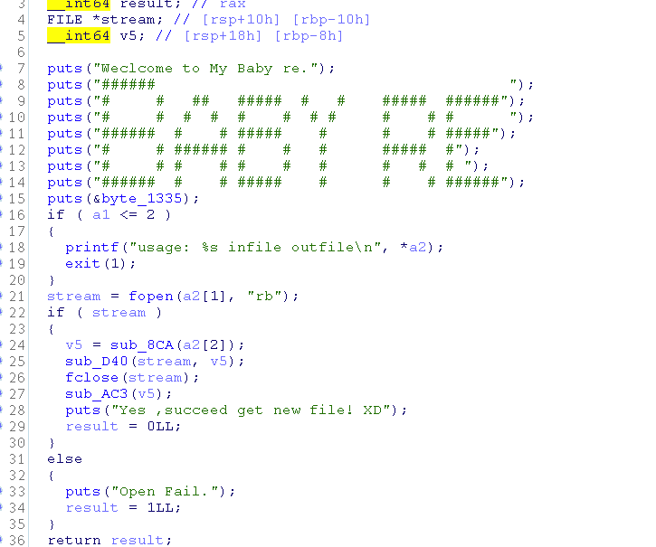

sub_D40 为压缩(或加密)算法，是主要要分析的目标：

其算法逻辑如下：

1、设置编码位置为输入流的开始

2、在滑窗的待编码区查找搜索区中的最大匹配字符串

3、如果找到字符串，输出(偏移值， 匹配长度)， 窗口向前滑动“匹配长度”

4、如果没有找到，输出(0, 0, 待编码区的第一个字符)，窗口向前滑动一个单位

5、如果待编码区不为空，回到步骤2

通过分析发现这是一个 lz77的压缩算法，按照算法逆向则可以解压。

King of KOF

详细描述解题过程、每一步必须附带截图、解题过程中用到的工具在文档中说明、解题过程中涉及到的利用代码请在解题工具中详细说明。

此文档中只写解题思路，其他内容不在此显示

题目附件是一个拳皇97的安装包，拳皇97的主体没做任何更改，关键部分再安装包安装的过程中，如果使用*unix下的file命令可以看出安装包是用NSIS打包的

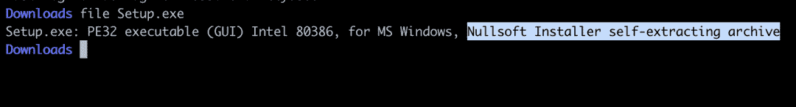

搜索可得到多种解包的方式，见链接

https://nsis.sourceforge.io/Can_I_decompile_an_existing_installer#Decompilers

解包得到安装脚本后，后边就是常规的逆向问题了，flag经过tea加密和base64编码后写到了注册表中，逆向nsi脚本和dll中的逻辑就可以得到flag。

* * *

Encryptor

详细描述解题过程、每一步必须附带截图、解题过程中用到的工具在文档中说明、解题过程中涉及到的利用代码请在解题工具中详细说明。

此文档中只写解题思路，其他内容不在此显示

encryptor是一个使用了chow实现的whitebox aes加密程序。ida分析可以发现经过了混淆处理但没有strip，其中SBox虽然在使用TBox的加密过程中未被调用到但仍存在于文件中，且可发现与正常SBox有区别。

使用deadpool_dca进行trace

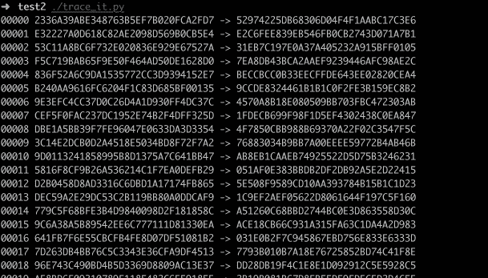

利用daredevil分析trace，要提取文件中的SBox进行分析，将其存在LUT/AES_AFTER_SBOX中

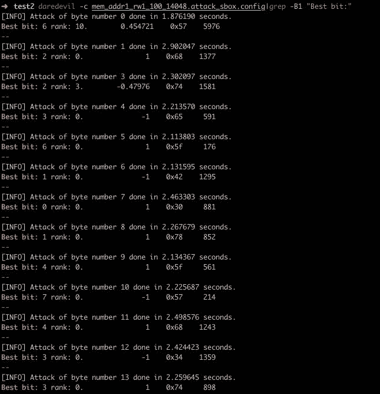

恢复出多数bytes，如存在少数未恢复的，可以暴力检测出

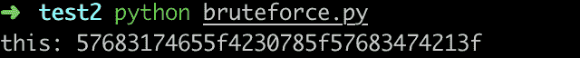

hdschnoor

详细描述解题过程、每一步必须附带截图、解题过程中用到的工具在文档中说明、解题过程中涉及到的利用代码请在解题工具中详细说明。

此文档中只写解题思路，其他内容不在此显示

题目给的服务要求我们给出一个可使用服务端要求的公钥进行校验的schnoor签名,但是我们并没有该公钥对应的私钥，那么这里就需要我们对签名进行伪造

观察服务端challenge的变化，可以发现每一轮challenge都会加上0x10，这就表示后面的challenge的生成是固定可预测的，与我们前一步选择的点没有关系，这样我们就可以伪造签名了

回顾验签的过程

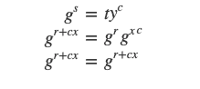

其中y为公钥，x为私钥，s=r+cx，这样只有我们知道私钥x，构造的s才能通过验证，但这是c的生成基于我们给出的t的情况下，如果二者没有关系且c可预测，那么我们构造签名时可令

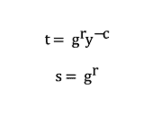

这样我们构造的签名同样可以通过验证，这一步过后我们即可拿到一个主公钥

Pubkey=xpub661MyMwAqRbcG33fSxLZzPgmgNQuyMRYf3NpQXTN7hDHFCGrnK7rcTdZ4UDfsXYsxrBAaj8YJTG684c6isAjhG9AGxaczC5kjRv2MnXZdcP

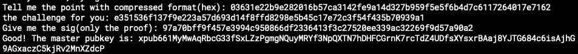

看到公钥的格式是bip32标准的

随后在题目给出的签名文件里我们可以看到有一百个schnoor签名，统计后可发现其中包含两个使用了相同的t的签名，这样我们就可以利用这两个签名和对应的challenge恢复出目标的私钥

通过这两个签名我们可以得到下面的式子

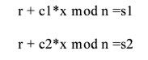

可以直接得到

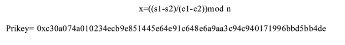

按照题目信息这里应该得到的是一个子私钥，在bip32标准中，同时知道子私钥与主公钥我们可以恢复出主私钥

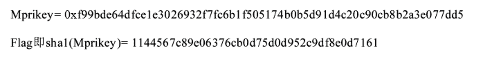

* * *

BDOnline

题目附件是虚拟机的镜像文件，根据build.prop等文件可知是一个sdk=18 armeabi-v7a Google API的虚拟机镜像，使用emulator 可以运行起来。

在题目描述中提到后门，猜测和网络行为有关，使用adb 进入模拟器shell，发现系统除5037还监听了2233端口

```
tcp       0      0 0.0.0.0:2233           0.0.0.0:*              LISTEN
```

过busybox的netstat 命令可知监听2233端口的进程名是nmae

```
Proto Recv-Q Send-Q Local Address           Foreign Address         State       PID/Program nametcp        0      0 (null):5037             (null):*                LISTEN      650/adbdtcp        0      0 (null):2233             (null):*                LISTEN      630/nmae
```

而定位文件位于/system/bin/nmae，IDA 打开ELF文件，查看main函数逻辑，当socket接收的数据非空，首先会将socket接收的内容输出。随后通过dlopen 和dlsym 获取某函数，将socket接收的前13位传入，后5位自负传入sub_A70函数，如果if条件为真则将socket传入的返回，否则返回硬编码字符串Backd00ronline。根据返回可知进入else分支是正确输入程序到达的路径。

dlopen 和 dlsym 要打开的动态库和符号都被加密，运行时会进行解密(解密逻辑是循环异或)。以dlopen的第一个参数为例，异或的两个字段分别保存在0x2466和0x247C

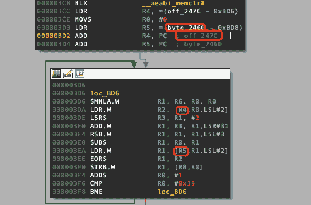

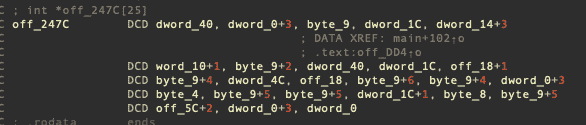

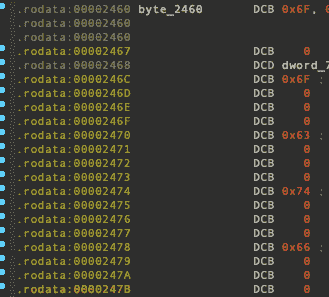

```
xor2 = [0x6f,0x70,0x70,0x6f,0x63,0x74,0x66]ptext = [0x40, 0x3, 0x9, 0x1c, 0x17, 0x11, 0xb, 0x40, 0x1c, 0x19, 0xd, 0x4c, 0x18, 0xf, 0xd, 0x3, 0x4, 0xe, 0xe, 0x1d, 0x8, 0xe, 0x5e, 0x3, 0x0]fname = ""for i in range(len(ptext)):    fname += chr(ptext[i] ^ xor2[i%7])print fname
```

解密得到库为/system/lib/libstamina.so 解析的符号是undefine

首先分析sub_A70，输入与一段内存进行比较

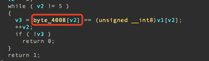

静态分析为空，数据填充在sub_A5C()函数：

```
dword_A88       DCD 0x8E, 0x92, 0xA2, 0xA2, 0xAC>>> a = [0x8E, 0x92, 0xA2, 0xA2, 0xAC]>>> eflag = "">>> for i in a:...     eflag += chr(i-0x2f)...>>> eflag'_css}'
```

ida打开libstamina.so，找到undefine函数，函数有多处解密字符串操作，静态分析可以忽略，与输入相关的是sub_848函数，决定函数的返回。

sub_848函数首先判断长度是否为13，如果输入正确，该函数返回1。函数对输入的13位做了运算和比较，在F5伪代码中 如果每个 或| 两侧的运算表达式均为0 则函数返回1，是期待的返回值。|两侧可以转为等式，个数可以等式个数和输入相等，属于解方程类型的题目。

解法有多种，这里以z3 为例

```
from z3 import *s = Solver()v4 = Int('a') v5 = Int('b') v6 = Int('c') v7 = Int('d') v10 = Int('e') v8 = Int('f') v9 = Int('g') v14 = Int('h') v16 = Int('i') v17 = Int('j') v15 = Int('k') v18 = Int('l') v19 = Int('m')s.add(v4 < 127)s.add(v5 < 127)s.add(v6 < 127)s.add(v7 < 127)s.add(v10 < 127)s.add(v8 < 127)s.add(v9 < 127)s.add(v14 < 127)s.add(v16 < 127)s.add(v17 < 127)s.add(v15 < 127)s.add(v18 < 127)s.add(v19 < 127)s.add(v4 > 32)s.add(v5 > 32)s.add(v6 > 32)s.add(v7 > 32)s.add(v10 > 32)s.add(v8 > 32)s.add(v9 > 32)s.add(v14 > 32)s.add(v16 > 32)s.add(v17 > 32)s.add(v15 > 32)s.add(v18 > 32)s.add(v19 > 32)v13 = 5 * v9v20 = v5 + v4 + v6 + v7;v21 = v20 + v10s.add((v21 + 2 * v8 + v13 + 3 * v14 + v16 + v17 + v15 + v18 + v19) == 0x728)s.add((3 * v17+ v5+ v4+ v6+ 2 * v7+ v10+ v8+ v13+ v14+ v16+ v15+ v18+ v19) == 0x6F3)s.add((v4+ 2 * v5+ v6+ v7+ v10+ v8+ v13+ v14+ v16+ v17+ v15+ 3 * v18+ v19) == 0x72E)s.add((3 * v15 + v5 + v4 + 2 * v6 + v7 + v10 + v8 + v13 + v14 + v16 + v17 + v18 + v19) == 0x701)s.add((v20 + 2 * v10 + v8 + v13 + v14 + 3 * v16 + v17 + v15 + v18 + v19) == 0x733 )s.add((11 * v9 + v21 + v8 + v14 + v16 + v17 + v15 + v18 + v19) == 0x704)s.add((9 * v5 + v4 + v6 + v7 + v10 + v8 + v13 + v14 + v16 + v17 + v15 + v18 + v19) == 0x93E)s.add((3 * v5 + v4 + v6 + v7 + v10 + v8 + v13 + v14 + v16 + v17 + v15 + 2 * v18 + v19) == 0x728 )s.add((3 * v10 + v20 + v8 + v13 + v14 + 2 * v16 + v17 + v15 + v18 + v19) == 0x741 )s.add((3 * v8 + v20 + v10 + v13 + 2 * v14 + v16 + v17 + v15 + v18 + v19) == 0x71C )s.add((3 * v7 + v5 + v4 + v6 + v10 + v8 + v13 + v14 + v16 + 2 * v17 + v15 + v18 + v19) == 0x703)s.add((3 * v6 + v5 + v4 + v7 + v10 + v8 + v13 + v14 + v16 + v17 + 2 * v15 + v18 + v19) == 0x701 )s.add((3 * v4 + v5 + v6 + v7 + v10 + v8 + v13 + v14 + v16 + v17 + v15 + v18 + 2 * v19) == 0x70F )if s.check() == sat:  flag = ''  model = s.model()  print chr(model[v4].as_long())+chr(model[v5].as_long())+chr(model[v6].as_long())+chr(model[v7].as_long())+chr(model[v10].as_long())+chr(model[v8].as_long())+chr(model[v9].as_long())+chr(model[v14].as_long())+chr(model[v16].as_long())+chr(model[v17].as_long())+chr(model[v15].as_long())+chr(model[v18].as_long())+chr(model[v19].as_long())  $ python oppowp.pyflag{f1rmWare
```

可以使用python脚本进行验证

```
$ python clinet.py 127.0.0.1 flag{f1rmWare_css}Backd00ronline
```

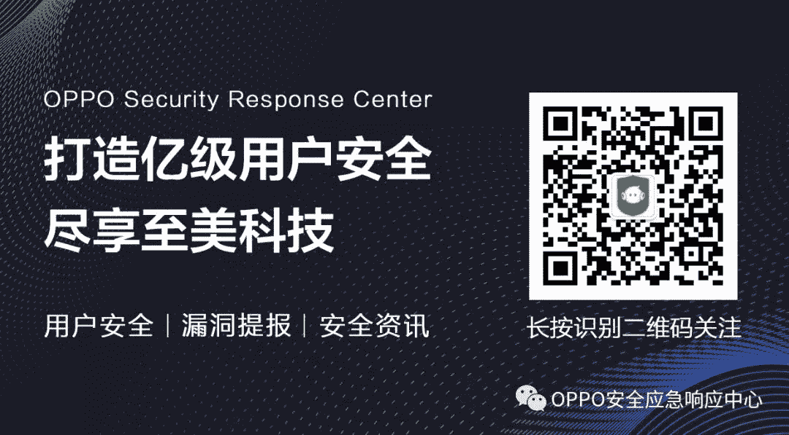