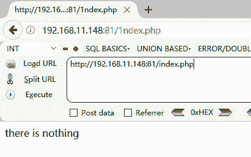
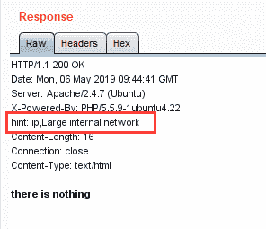
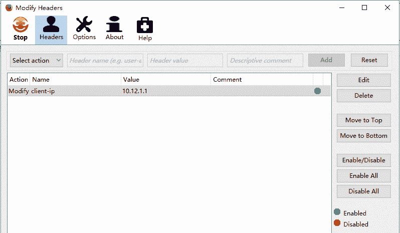
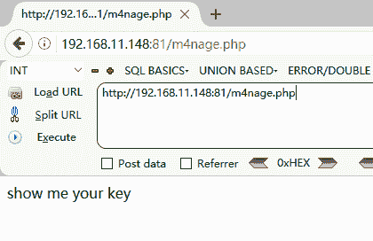
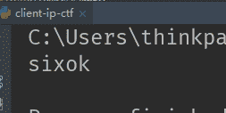
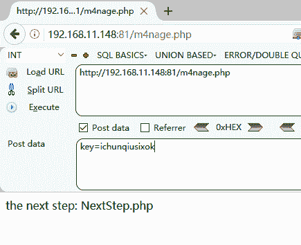
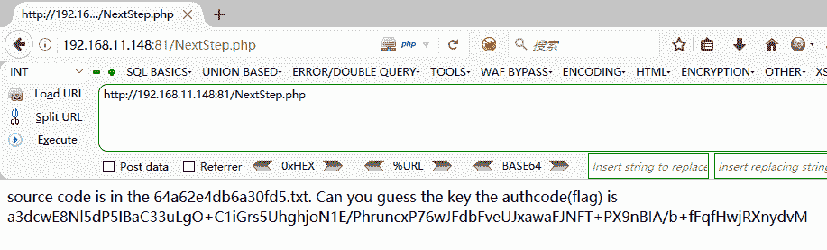
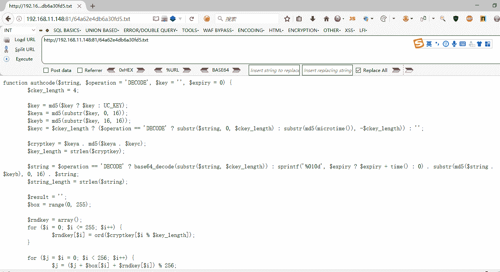
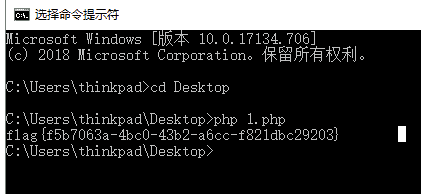

<!--yml
category: 未分类
date: 2022-04-26 14:36:05
-->

# there is nothing（i春秋CTF题解）_weixin_30258027的博客-CSDN博客

> 来源：[https://blog.csdn.net/weixin_30258027/article/details/98878092](https://blog.csdn.net/weixin_30258027/article/details/98878092)

**（1）打开页面，显示为：there is nothing**



**（2）抓包发现提示**



**（3）hint:ip,Large internal network**

**意为最大的内网网段IP，hint: ip,Large internal network（最大内网ip），内网ip中最大的网段应该就是10.0.0.0了，所以我们伪造ip再一次访问题目链接，我们可以用火狐的插件伪造，（modify headers）随便伪造10.0.0.0网段的ip**



**（4）确定后刷新网页，发现网页自动跳转到别的页面，根据提示，show me your key；使用post或者get请求进行request**



**（5）很好的出现了以下语句：**
**key is not right,md5(key)==="3a7525f5c934d05f8e381a9a8f40cc00",and the key is ichunqiu[a-z]{5}**

**ichunqiu为md5的前8个字母，后5个字母无告诉，需要根据3a7525f5c934d05f8e381a9a8f40cc00来破解剩下的5个字母。**

**可以使用：https://www.somd5.com/**
**也可以自己写脚本：**

```
import hashlib

def md5(data): m=hashlib.md5()
m.update(data.encode("utf8"))
a=m.hexdigest() return a

a = 'ichunqiu' b = 'abcdefghigklmnopqrstuvwxyz'
for q in b:
for w in b:
for e in b:
for r in b:
for t in b:
if md5(a+q+w+e+r+t)=='3a7525f5c934d05f8e381a9a8f40cc00':
print(q+w+e+r+t)
```



**（6）然后将ichunqiu与sixok拼接为key再次进行请**



**（7）访问NextStep.php页面**



**（8）接下来进行解密即可：**

```
<?php
function authcode($string, $operation = 'DECODE', $key = '', $expiry = 0) { $ckey_length = 4; $key = md5($key ? $key : UC_KEY); $keya = md5(substr($key, 0, 16)); $keyb = md5(substr($key, 16, 16)); $keyc = $ckey_length ? ($operation == 'DECODE' ? substr($string, 0, $ckey_length) : substr(md5(microtime()), -$ckey_length)) : ''; $cryptkey = $keya . md5($keya . $keyc); $key_length = strlen($cryptkey); $string = $operation == 'DECODE' ? base64_decode(substr($string, $ckey_length)) : sprintf('%010d', $expiry ? $expiry + time() : 0) . substr(md5($string . $keyb), 0, 16) . $string; $string_length = strlen($string); $result = ''; $box = range(0, 255); $rndkey = array(); for ($i = 0; $i <= 255; $i++) { $rndkey[$i] = ord($cryptkey[$i % $key_length]);
} for ($j = $i = 0; $i < 256; $i++) { $j = ($j + $box[$i] + $rndkey[$i]) % 256; $tmp = $box[$i]; $box[$i] = $box[$j]; $box[$j] = $tmp;
} for ($a = $j = $i = 0; $i < $string_length; $i++) { $a = ($a + 1) % 256; $j = ($j + $box[$a]) % 256; $tmp = $box[$a]; $box[$a] = $box[$j]; $box[$j] = $tmp; $result .= chr(ord($string[$i]) ^ ($box[($box[$a] + $box[$j]) % 256]));
} if ($operation == 'DECODE') { if ((substr($result, 0, 10) == 0 || substr($result, 0, 10) - time() > 0) && substr($result, 10, 16) == substr(md5(substr($result, 26) . $keyb), 0, 16)) { return substr($result, 26);
} else { return '';
}
} else { return $keyc . str_replace('=', '', base64_encode($result));
}

}

echo authcode("d04aRj3IDNQMDylF8SRI1gUzQRCIrPKGLMZIN0UEgOk6bElT+K0ghD5h5pv73Vw2S4IKkp1bg77iEnU0228LI9nYwj0U+Og", $operation = 'DECODE', $key = 'ichunqiusixok', $expiry = 0) ?>
```

**（9）然后进行破解：**



**（10）使用php运行代码即可**

