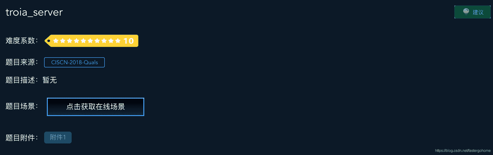
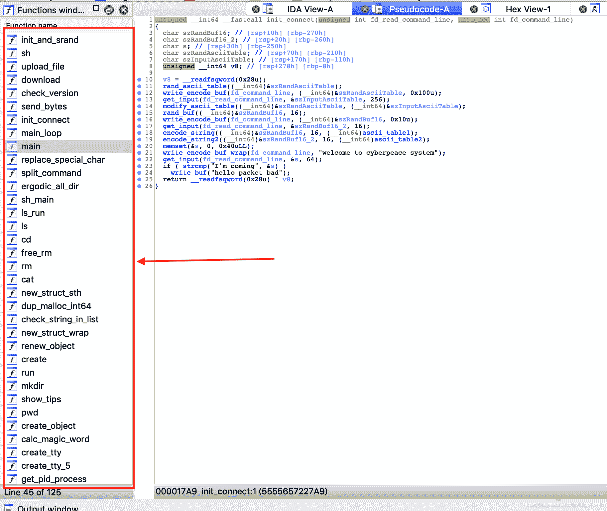
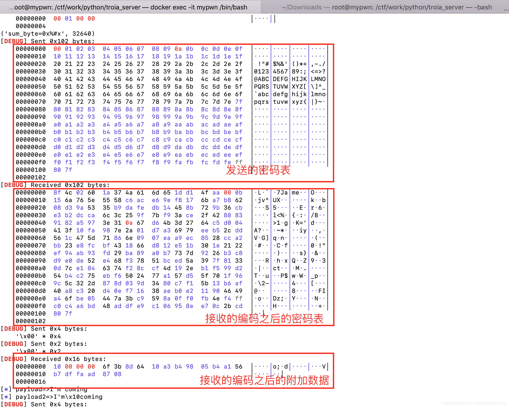

<!--yml
category: 未分类
date: 2022-04-26 14:40:43
-->

# troia_server [XCTF-PWN][高手进阶区]CTF writeup攻防世界题解系列27(未完待续）_3riC5r的博客-CSDN博客

> 来源：[http://blog.csdn.net/fastergohome/article/details/103761125](http://blog.csdn.net/fastergohome/article/details/103761125)

题目地址：[troia_server](https://adworld.xctf.org.cn/task/answer?type=pwn&number=2&grade=1&id=4605&page=5)

这个题目是攻防世界PWN题目的倒数第二题，不好意思，我并没有完成，这里只是先把我的阶段性的实验总结了一下，看看对大家是否有帮助。

如果需要ida的反编译的文件，可以留下您的邮箱，我们可以共同探讨，一起解决！

先看看题目：

照例检查一下保护机制：

```
[*] '/ctf/work/python/troia_server/a751aa63945b4edcb6a7bb47986e960d'
    Arch:     amd64-64-little
    RELRO:    Full RELRO
    Stack:    Canary found
    NX:       NX enabled
    PIE:      PIE enabled
```

保护机制全开，非常真实的一道题目。

我先把反编译的c语言的代码中的重要部分给大家分析一下。

main 函数：

```
__int64 __fastcall main(__int64 a1, char **a2, char **a3)
{
  init_and_srand();
  init_ascii_table();
  ergodic_all_dir(1u);
  create_tty_5();
  alarm(0xF0u);
  init_connect(0, 1u);
  check_version(0, 1u);
  main_loop(0, 1u);
  return 0LL;
}
```

我先简单介绍一下主要函数的意义：

1、init_and_srand函数

初始化环境，并利用time设置随机数种子

2、init_ascii_table函数

初始化两个密码表（一个上行，一个下行），密码表使用的是256个ascii值对应的映射，这里只是做了初始化

3、ergodic_all_dir函数

遍历所有服务器上的目录及文件，写入内存中的一个数据结构

4、create_tty_5函数

创建5个tty连接池

5、init_connect函数

这个函数非常重要，这里会把两个密码表进行具体的数据填充，并做随机化

6、check_version函数

检查客户端发上来的版本号是否正确

7、main_loop函数

主循环函数，接收各种命令并进行相应的处理和返回

* * *

下面我分析一下具体的函数：

init_connect函数

```
unsigned __int64 __fastcall init_connect(unsigned int fd_read_command_line, unsigned int fd_command_line)
{
  char szRandBuf16; // [rsp+10h] [rbp-270h]
  char szRandBuf16_2; // [rsp+20h] [rbp-260h]
  char s; // [rsp+30h] [rbp-250h]
  char szRandAsciiTable; // [rsp+70h] [rbp-210h]
  char szInputAsciiTable; // [rsp+170h] [rbp-110h]
  unsigned __int64 v8; // [rsp+278h] [rbp-8h]

  v8 = __readfsqword(0x28u);
  rand_ascii_table((__int64)&szRandAsciiTable);
  write_encode_buf(fd_command_line, (__int64)&szRandAsciiTable, 0x100u);
  get_input(fd_read_command_line, &szInputAsciiTable, 256);
  modify_ascii_table((__int64)&szRandAsciiTable, (__int64)&szInputAsciiTable);
  rand_buf((__int64)&szRandBuf16, 16);
  write_encode_buf(fd_command_line, (__int64)&szRandBuf16, 0x10u);
  get_input(fd_read_command_line, &szRandBuf16_2, 16);
  encode_string((__int64)&szRandBuf16, 16, (__int64)ascii_table1);
  encode_string2((__int64)&szRandBuf16_2, 16, (__int64)ascii_table2);
  memset(&s, 0, 0x40uLL);
  write_encode_buf_wrap(fd_command_line, "welcome to cyberpeace system");
  get_input(fd_read_command_line, &s, 64);
  if ( strcmp("I'm coming", &s) )
    write_buf("hello packet bad");
  return __readfsqword(0x28u) ^ v8;
}
```

我们注意到里面有两个密码表ascii_table1和ascii_table2，ascii_table1是服务器发送给客户端的时候使用的密码表，ascii_table2是客户端发送给服务器的密码表。

先说一下ascii_table2的处理流程：

1、客户端发送256个字节的数据给到服务器

2、客户端发送16个字节的附加数据给服务器

3、服务器对这两个数据进行二次加密处理之后保存到ascii_table2中

4、以后所有get_input函数中接收到的数据都会用ascii_table2做逆向处理

```
signed __int64 __fastcall get_input(unsigned int fd_read_command_line, void *buf, int nSize)
{
  __int16 v3; // ST1A_2
  int nSize2; // [rsp+8h] [rbp-28h]
  int nInputSize; // [rsp+1Ch] [rbp-14h]
  void *ptr; // [rsp+20h] [rbp-10h]
  unsigned __int64 v8; // [rsp+28h] [rbp-8h]

  nSize2 = nSize;
  v8 = __readfsqword(0x28u);
  read_input(fd_read_command_line, (__int64)&nInputSize, 4);
  if ( nInputSize < 0 || nInputSize > nSize2 )
    write_buf("size error");
  ptr = malloc(nInputSize + 2);
  if ( !ptr )
    write_buf("malloc error");
  read_input(fd_read_command_line, (__int64)ptr, nInputSize + 2);
  v3 = *(_WORD *)((char *)ptr + nInputSize);
  if ( (unsigned __int16)sum_buf_byte((__int64)ptr, nInputSize) != v3 )
    write_buf("data bad");
  memset(buf, 0, nSize2);
  copy_encode_byte((__int64)buf, (__int64)ptr, nInputSize);
  free(ptr);
  return 1LL;
}
```

然后是get_input函数处理流程：

1、接收4个字节的长度nLen

2、检查数字合法性

3、接收nLen+2字节的数据

4、对接收的前面nLen个字节，轮询所有字节进行sum

5、将sum值和接收的后面两个字节进行比对

6、比对成功，对前面的nLen个字节利用ascii_table2做逆向处理

这部分的利用代码我已经编写好了，能够完成客户端对服务器的数据发送。

```
#coding:utf8
#!/usr/bin/env python

from pwn import *

context.log_level = 'debug'
process_name = './a751aa63945b4edcb6a7bb47986e960d'
p = process([process_name], env={'LD_LIBRARY_PATH':'./'})
# p = remote('111.198.29.45', 59861)
# elf = ELF(process_name)

def make_ascii_table(reverse):
	ascii_table = ''
	for x in range(256):
		if reverse==1:
			v = 0xFF-x
			if v%0x10 == 0:
				v = (v+0xf0)%0x100
			ascii_table += chr(v)
		else:
			ascii_table += chr(x)
	return ascii_table

def calc_sum_byte(payload):
	sum_byte = 0
	for x in range(len(payload)):
		sum_byte += ord(payload[x])
	print('sum_byte=0x%#x', sum_byte)
	return sum_byte

def send_payload(payload):
	p.send(p32(len(payload)))
	# pause()
	p.send(payload+p16(calc_sum_byte(payload)))

def encode(payload):
	payload2 = ''
	for x in range(len(payload)):
		payload2 += ascii_table_reverse[(0xFF - ord(payload[x]))]
	log.info('payload=>%s', payload)
	log.info('payload2=>%s', payload2)
	return payload2

# print(0x63+0x9c)

p.recv()
a = make_ascii_table(0)
ascii_table_reverse = make_ascii_table(1)
send_payload(a)
# pause()

# p.send('\x00'*4)
# p.send('\x00'*2)
p.recv()
p.send('\x00'*4)
p.send('\x00'*2)

p.recv()
payload = 'I\'m coming'
# payload = 'abc'
'''
0x306d2749	0x696d6f63	0x0000676e
0x306d2749	0x696d6f63	0x0000676e
0x206d2749	0x696d6f63	0x0000676e
'''
send_payload(encode(payload))

# p.send('\x0a'+'\x00'*3)
# p.send(p32(len(payload2)))
# pause()
# p.send(payload2+p16(calc_sum_byte(payload2)))
# p.send(payload+'\x08\x90')

payload = 'version v4.10'
send_payload(encode(payload))
p.recv()
send_payload(encode('\x00'))
# p.recv()

def sh_cmd(cmd):
	send_payload(encode(p32(len(cmd))))
	send_payload(encode(cmd))
	p.recv()

# sh_cmd('ls')
sh_cmd('cat flag')

'''
第二阶段工作

rand table:
x0 x1 x2 x3  x4 x5 x6 x7  x8 x9 xA xB  xC xD xE xF

x0=0x0A

y0=rand_table[x0]

根据开始进入的时候发过来的编码过的密码表和附加数据，逆推出密码表
'''

p.interactive()
```

所有函数和变量我都已经重新命名：



第二阶段的工作就是根据开始进入的时候发过来的编码过的密码表数据和附加数据，逆推出ascii_table1密码表



这个题目更偏向于crypto和reverse的题目，主要还是利用gdb和密码学的知识进行二进制调试。