<!--yml
category: 未分类
date: 2022-04-26 14:18:57
-->

# unctf2020部分题解_tansty_zh的博客-CSDN博客

> 来源：[https://blog.csdn.net/tansty_zh/article/details/109707327](https://blog.csdn.net/tansty_zh/article/details/109707327)

## ⭐unctf2020

**是团队中人写的wp，本人经其同意进行转载**

**友链：https://www.cnblogs.com/Jlay/p/unctf_2020.html**

## ⭐misc

### 1、baba_is_you


题目告诉我们，了解png文件格式。

> 下载得到一张png格式的图片。
> 
> 用010editor打开查看，发现最后含有一个B站网址
> 
> ```
> https://www.bilibili.com/video/BV1y44111737 
> ```
> 
> 访问，查看评论区得到flag

flag：

```
unctf{let's_study_pwn} 
```

### 2、阴阳人编码

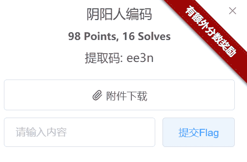

> 下载得到一个pdf，里面文字全是 （阴阳怪气）。仔细查看，阴阳怪气也就分为三种：
> 
> `就这.` `不会吧！` `就这¿`
> 
> 结合题目中给出的编码，很容易想到 `Ook！` 编码
> 
> 于是，将 `就这.` 替换为 `.`
> 
> `不会吧！` 替换为 `！`
> 
> `就这¿` 替换为 `？`

得到如下：

```
Ook. Ook. Ook. Ook. Ook. Ook. Ook. Ook. Ook. Ook. Ook. Ook. Ook. Ook. Ook.
Ook. Ook. Ook. Ook. Ook. Ook
Ook. Ook. Ook. Ook. Ook. Ook. Ook. Ook. Ook. Ook. Ook. Ook. Ook. Ook. Ook.
Ook. Ook? Ook. Ook? Ook
Ook. Ook. Ook. Ook. Ook. Ook. Ook. Ook. Ook. Ook. Ook
Ook. Ook. Ook. Ook. Ook. Ook
Ook
Ook. Ook. Ook. Ook. Ook. Ook. Ook. Ook. Ook. Ook. Ook. Ook
Ook. Ook. Ook. Ook. Ook. Ook. Ook. Ook. Ook
Ook.
Ook. Ook. Ook. Ook. Ook. Ook. Ook. Ook? Ook. Ook? Ook
Ook. Ook. Ook. Ook. Ook. Ook. Ook
Ook. Ook. Ook. Ook. Ook. Ook. Ook. Ook. Ook. Ook. Ook. Ook
Ook. Ook? Ook
Ook
Ook? Ook. Ook. Ook. Ook. Ook. Ook. Ook. Ook. Ook. Ook. Ook. Ook. Ook. Ook!
Ook? Ook
Ook. Ook. Ook? Ook. Ook? Ook
Ook. Ook. Ook. Ook. Ook. Ook. Ook. Ook. Ook. Ook. Ook. Ook
Ook. Ook? Ook. Ook. Ook. Ook. Ook. Ook. Ook. Ook. Ook. Ook. Ook? Ook. Ook?
Ook
Ook. Ook. Ook. Ook. Ook
Ook
Ook
Ook
Ook. Ook. Ook
Ook
Ook. Ook
Ook. Ook. Ook? Ook. Ook? Ook
Ook
Ook?Ook
Ook. Ook. Ook. Ook. Ook. Ook. Ook
Ook
Ook
Ook. Ook. Ook.
Ook. Ook. Ook. Ook. Ook. Ook. Ook. Ook
Ook.
Ook. Ook. Ook. Ook. Ook. Ook. Ook. Ook. Ook? Ook. Ook? Ook
Ook. Ook. Ook. Ook
Ook
Ook
Ook. Ook? Ook
Ook
Ook
Ook. Ook. Ook
Ook
Ook
Ook. Ook. Ook. Ook
Ook. Ook. Ook. Ook. Ook. Ook. Ook? Ook. Ook? Ook
Ook. Ook. Ook. Ook
Ook. Ook. Ook. Ook. Ook. Ook. Ook. Ook. Ook
Ook. Ook. Ook. Ook
Ook? Ook. Ook? Ook
Ook. Ook? Ook. Ook. Ook. Ook. Ook. Ook. Ook. Ook
Ook
Ook
Ook
Ook? Ook
Ook. Ook. Ook. Ook. Ook
Ook
Ook
Ook
Ook. Ook. Ook. Ook. Ook. Ook. Ook. Ook. Ook. Ook
Ook?
Ook. Ook. Ook. Ook. Ook. Ook. Ook. Ook. Ook. Ook. Ook. Ook. Ook. Ook. Ook.
Ook. Ook? Ook. Ook? Ook
Ook. Ook. Ook 
```

将他复制到揭秘网址进行解密 ：

https://www.splitbrain.org/services/ook

得到

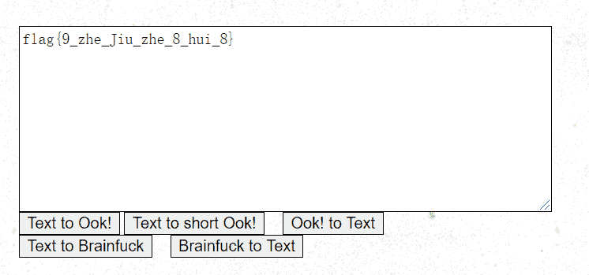

```
flag{9_zhe_Jiu_zhe_8_hui_8} 
```

### 3、 爷的历险记

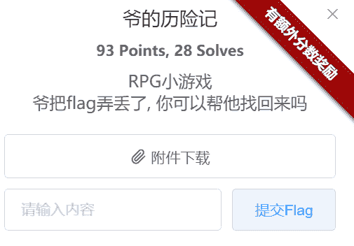

这个附件有点大啊，下载得到一个游戏，（杀死耗子得经验做任务的“窒息”游戏）

解压一看

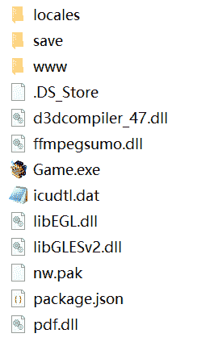

发现 `www` 的文件夹，直接点进去看，（众所周知，主要的资源全在这个文件夹里头）


index.html 根网页，点进去 出一个error 很真实，环境没搭建怎么出东西


但这里提示我们 这个 data文件夹很重要

点击进入，发现一堆json文件，一开始 一系列的map00x.json 引人注意，点进去查看，好像是每一关的任务，但是flag均没有出现。后来，终于在 `Items.json` 这个文件里面找到 flag 包括之前的fake flag也在里面。

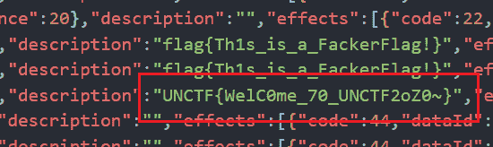

```
UNCTF{WelC0me_70_UNCTF2oZ0~} 
```

### 4、YLB’s CAPTCHA - 签到题

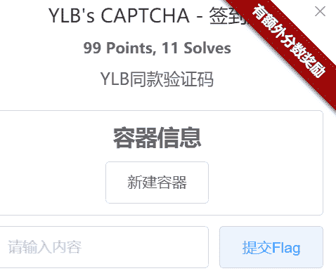

进入一个网页，ctrl+u查看网页源码

```
<body>
	<div class="quote" id="neat">总决赛  彳亍  YLB  验证码  服务器宕机  CISCN  知乎  RNM，退钱  有码无🐴  宕机的平台  2020  WIFI  出题  AWD  业界毒瘤  洋垃圾  阴间平台  CTF春晚  phpstudy  选手主办方一起AWD  靶机重置  Misc选手狂喜  国际大厂  断网  Oo0ilLlWwKkSsOoPpCcZz  平台特色  不想打可以不打  PATCH  烂  选手AD  易霖博  鼓掌  Python签到Pwn题  Docker下发机制  规则反复横跳  BuildBreakFix  OCR  平台被攻击  AP隔离  运维是新人  义务承办比赛  提高业界知名度  40道题目，就4题能用的  鼓励PY  野鸡比赛  只开MYSQL的WEB题  ylb倒闭了吗  买设备提分数  最重要的比赛，最垃圾的平台  交不上去的flag  YLBNB  狂欢的知乎  请不要再给ylb压力了  三个半小时的解题赛  临时改赛制  祝早日倒闭  易霖博牛逼  全场等待修平台 选手Attack主办方Defense  免费的快乐水</div>
    <form action="./index.php" method="post">
        <br/>
        <input type="text" name="captcha" placeholder="Entry the CAPTCHA" style="text-align: center;background-color: #53656f;"><br/>
        <input type="submit" value="Submit" class="button">
    </form>
<script src="./title.js"></script>
</body> 
```

注意到最下面还有一句：

```
<p>Get 10 points to get flag<br>Your point: </p> 
```

也就是说最直观的方法，就是读取验证码得到十分，获取flag。

于是，介于 验证码比较难认，将其图片保存，用stegesolve 换个通道进行查看。

【注意】大小写要区分！！！

【一步错全盘皆输】 得到

```
UNCTF{7ed2cc4f-184b-43ec-bc21-bc100dbdf9f6} 
```

### 5、躲猫猫


下载得到一个excel。 用010editor查看 `504B0304` 修改后缀名 zip 发现基本上都是 xml 文件。放在 idea中进行查看，

最后在 `sharedDtrings.xml` 发现怪异之处。

```
<?xml version="1.0" encoding="UTF-8" standalone="yes"?>
<sst xmlns="http://schemas.openxmlformats.org/spreadsheetml/2006/main" count="2" uniqueCount="2"><si><t>dW5jdGYlN0I3MzgzYjY3ZGU5MTA2YTZmMTBmZGJlNGU4ZWJjNjRjZSU3RA==</t><phoneticPr fontId="1" type="noConversion"/></si><si><t>你居然把猫猫移开了，但是你也找不到flag</t><phoneticPr fontId="1" type="noConversion"/></si></sst> 
```

注意到一串base64加密的字符串。

```
dW5jdGYlN0I3MzgzYjY3ZGU5MTA2YTZmMTBmZGJlNGU4ZWJjNjRjZSU3RA== 
```

解密得到

flag

```
unctf{7383b67de9106a6f10fdbe4e8ebc64ce} 
```

### 6、网络深处1

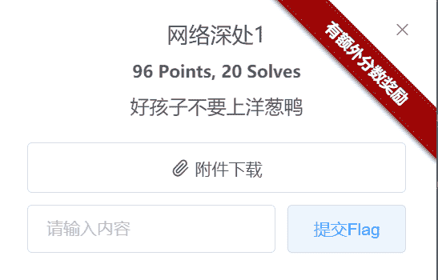

下载附件，得到一段拨号音音频，一个txt情景步骤导入，和一个有密码的压缩包。

在txt里面有一串数字，估计是最终flag的来源之处。

```
636806841748368750477720528895492611039728818913495104112781919263174040060359776171712496606031373211949881779178924464798852002228370294736546700438210687486178492208471812570216381077341015321904079977773352308159585335376746026882907466893864815887274158732965185737372992697108862362061582646638841733361046086053127284900532658885220569350253383469047741742686730128763680253048883638446528421760929131783980278391556912893405214464624884824555647881352300550360161429758833657243131238478311219915449171358359616665570429230738621272988581871 
```

> txt中已经很清楚的告诉我们，必须要解开压缩包，才能搞清楚这串数字的含义。
> 
> 而压缩包密码就是电话号码，也就是蕴含在波号音中。
> 
> 靠人耳辨别是什么号码，（对我来说）简直白日做梦。

直接上工具 ： `dtmf2num.exe`

> 附上下载地址 [dtmf2num官方网址](http://freshmeat.sourceforge.net/projects/dtmf2num) [dtmf2num下载地址](http://aluigi.altervista.org/mytoolz/dtmf2num.zip)

下载好后，对此执行命令：

```
dtmf2num.exe 拨号音.wav 
```

直接出来了：

```
DTMF2NUM 0.1.1
by Luigi Auriemma
e-mail: aluigi@autistici.org
web:    aluigi.org

- open 拨号音.wav
  wave size      35200
  format tag     1
  channels:      1
  samples/sec:   8000
  avg/bytes/sec: 16000
  block align:   2
  bits:          16
  samples:       17600
  bias adjust:   -3
  volume peaks:  -29471 29471
  normalize:     3296

- MF numbers:    74

- DTMF numbers:  15975384265 
```

得到 压缩包密码为： `15975384265` 解压后，又得到一段音频和一个txt。

通过txt，我们知道，在音频中蕴含着一个极大的线索，用于破解那串数字。

用 `audacity` 音频文件打开 ，查看波形，没发现啥。

于是切到 频谱图，发现一个关键词 `tupper`

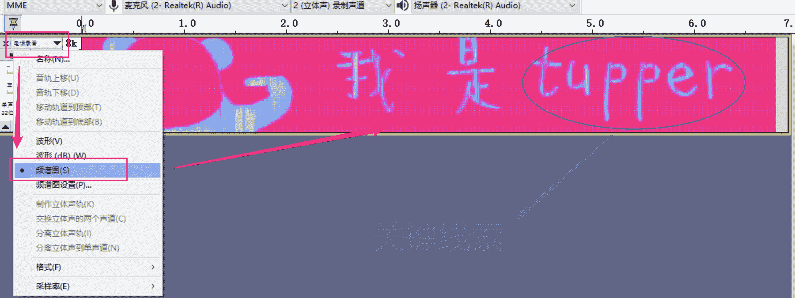

一开始还不知道是啥意思，于是直接百度 `tupper` 经过多番搜索，终于 找到了 `Tupper自我指涉公式造图`

[附一篇大佬的介绍Tupper自我指涉公式造图原理](https://www.bbsmax.com/A/QW5Yw13Gzm/)

于是 上脚本：（其实）那串神秘数字就是 k

```
"""
 Copyright (c) 2012, 2013 The PyPedia Project, http://www.pypedia.com
 <br>All rights reserved.

 Redistribution and use in source and binary forms, with or without modification, are permitted provided that the following conditions are met:

 # Redistributions of source code must retain the above copyright notice, this list of conditions and the following disclaimer.
 # Redistributions in binary form must reproduce the above copyright notice, this list of conditions and the following disclaimer in the documentation and/or other materials provided with the distribution.

 THIS SOFTWARE IS PROVIDED BY THE COPYRIGHT HOLDERS AND CONTRIBUTORS "AS IS" AND
 ANY EXPRESS OR IMPLIED WARRANTIES, INCLUDING, BUT NOT LIMITED TO, THE IMPLIED
 WARRANTIES OF MERCHANTABILITY AND FITNESS FOR A PARTICULAR PURPOSE ARE
 DISCLAIMED. IN NO EVENT SHALL THE COPYRIGHT OWNER OR CONTRIBUTORS BE LIABLE FOR
 ANY DIRECT, INDIRECT, INCIDENTAL, SPECIAL, EXEMPLARY, OR CONSEQUENTIAL DAMAGES
 (INCLUDING, BUT NOT LIMITED TO, PROCUREMENT OF SUBSTITUTE GOODS OR SERVICES;
 LOSS OF USE, DATA, OR PROFITS; OR BUSINESS INTERRUPTION) HOWEVER CAUSED AND
 ON ANY THEORY OF LIABILITY, WHETHER IN CONTRACT, STRICT LIABILITY, OR TORT
 (INCLUDING NEGLIGENCE OR OTHERWISE) ARISING IN ANY WAY OUT OF THE USE OF THIS
 SOFTWARE, EVEN IF ADVISED OF THE POSSIBILITY OF SUCH DAMAGE.

 http://www.opensource.org/licenses/BSD-2-Clause
 """

__pypdoc__ = """
 Method: Tupper_self_referential_formula
 Link: http://www.pypedia.com/index.php/Tupper_self_referential_formula
 Retrieve date: Tue, 11 Mar 2014 03:15:49 +0200

 Plots the [http://en.wikipedia.org/wiki/Tupper's_self-referential_formula Tupper's_self-referential_formula]:
 : <math>{1\over 2} < \left\lfloor \mathrm{mod}\left(\left\lfloor {y \over 17} \right\rfloor 2^{-17 \lfloor x \rfloor - \mathrm{mod}(\lfloor y\rfloor, 17)},2\right)\right\rfloor</math>

 The plot is the very same formula that generates the plot. 

 [[Category:Validated]]
 [[Category:Algorithms]]
 [[Category:Math]]
 [[Category:Inequalities]]

 """

def Tupper_self_referential_formula():
    k = 636806841748368750477720528895492611039728818913495104112781919263174040060359776171712496606031373211949881779178924464798852002228370294736546700438210687486178492208471812570216381077341015321904079977773352308159585335376746026882907466893864815887274158732965185737372992697108862362061582646638841733361046086053127284900532658885220569350253383469047741742686730128763680253048883638446528421760929131783980278391556912893405214464624884824555647881352300550360161429758833657243131238478311219915449171358359616665570429230738621272988581871

    def f(x, y):
        d = ((-17 * x) - (y % 17))
        e = reduce(lambda x, y: x * y, [2 for x in range(-d)]) if d else 1
        f = ((y / 17) / e)
        g = f % 2
        return 0.5 < g

    for y in range(k + 16, k - 1, -1):
        line = ""
        for x in range(0, 107):
            if f(x, y):
                line += "@"
            else:
                line += " "
        print(line)

if __name__ == '__main__':

    returned = Tupper_self_referential_formula()
    if returned:
        print(str(returned)) 
```

执行命令。

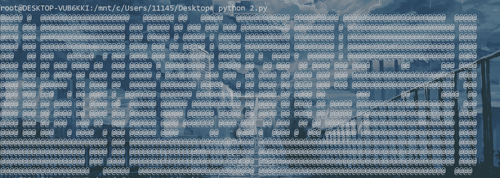

远处观看 效果更佳哦！！

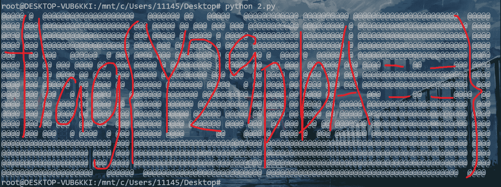

得到flag

```
flag{Y29pbA==} 
```

### 7、被删除的flag

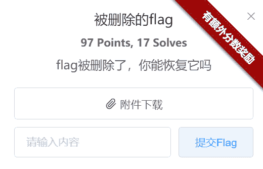

下载附件，得到一个 `flag` 文件。

未知格式，直接用010editor打开，ctrl+f 一搜 `unctf` ， flag就出了。

```
unctf{congratulations!} 
```

### 8、你能破解我的密码吗

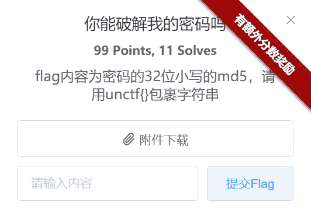

附件下载得到一个 `shadow` 文件。

```
root:!:18556:0:99999:7:::
daemon:*:18474:0:99999:7:::
bin:*:18474:0:99999:7:::
sys:*:18474:0:99999:7:::
sync:*:18474:0:99999:7:::
games:*:18474:0:99999:7:::
man:*:18474:0:99999:7:::
lp:*:18474:0:99999:7:::
mail:*:18474:0:99999:7:::
news:*:18474:0:99999:7:::
uucp:*:18474:0:99999:7:::
proxy:*:18474:0:99999:7:::
www-data:*:18474:0:99999:7:::
backup:*:18474:0:99999:7:::
list:*:18474:0:99999:7:::
irc:*:18474:0:99999:7:::
gnats:*:18474:0:99999:7:::
nobody:*:18474:0:99999:7:::
systemd-network:*:18474:0:99999:7:::
systemd-resolve:*:18474:0:99999:7:::
systemd-timesync:*:18474:0:99999:7:::
messagebus:*:18474:0:99999:7:::
syslog:*:18474:0:99999:7:::
_apt:*:18474:0:99999:7:::
tss:*:18474:0:99999:7:::
uuidd:*:18474:0:99999:7:::
tcpdump:*:18474:0:99999:7:::
avahi-autoipd:*:18474:0:99999:7:::
usbmux:*:18474:0:99999:7:::
rtkit:*:18474:0:99999:7:::
dnsmasq:*:18474:0:99999:7:::
cups-pk-helper:*:18474:0:99999:7:::
speech-dispatcher:!:18474:0:99999:7:::
avahi:*:18474:0:99999:7:::
kernoops:*:18474:0:99999:7:::
saned:*:18474:0:99999:7:::
nm-openvpn:*:18474:0:99999:7:::
hplip:*:18474:0:99999:7:::
whoopsie:*:18474:0:99999:7:::
colord:*:18474:0:99999:7:::
geoclue:*:18474:0:99999:7:::
pulse:*:18474:0:99999:7:::
gnome-initial-setup:*:18474:0:99999:7:::
gdm:*:18474:0:99999:7:::
guguguguji:$1$AH$xtjky.3kppbU27tR0SDJT.:18556:0:99999:7:::
systemd-coredump:!!:18556:::::: 
```

shadow文件 是linux系统中记载root密码的保密性文件，可以用 john 来破解。

下载地址： http://www.openwall.com/john/

解压后，进入 `run` 目录。并把 执行命令

```
john --show shadow 
```

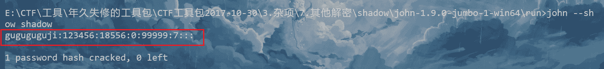

得到 密码 `123456` [md5加密](https://md5jiami.51240.com/)

得到flag

```
unctf{e10adc3949ba59abbe56e057f20f883e} 
```

### 9、mouse_click


下载附件，拿到 `mouse_click.pcapng` 很显然，USB流量分析。

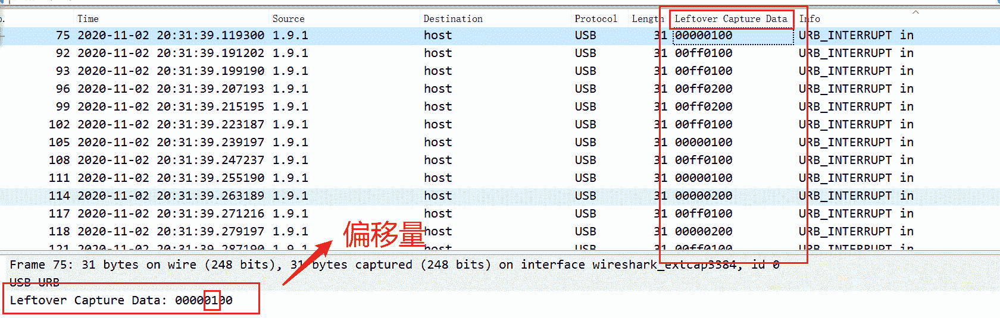

> USB协议鼠标数据部分在Leftover Capture Data域中，数据长度为`四个字节`。
> 
> 第一个字节代表按键：
> 
> 如 0x00时，代表没有按键、0x01时，代表左键，0x02时，代表当前按键为右键。
> 
> 第二个字节代表鼠标水平偏移量：
> 
> 值为正时，代表鼠标水平右移多少像素，为负时，代表水平左移多少像素。
> 
> 第三个字节与第二字节类似，代表垂直上下移动的偏移。

#### 1、将`mouse_click.pcapng` 中的 Leftover Capture Data域 数据导出

```
tshark -r mouse_click.pcapng -T fields -e usb.capdata > data.txt
tshark -r mouse_click.pcapng -T fields -e usb.capdata | sed '/^\s*$/d' > data.txt #提取并去除空行 
```

得到 如下图 data.txt 文件

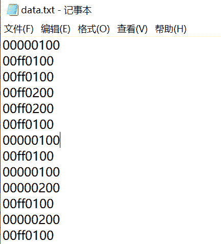

#### 2、规范冒号格式

一般提取会有冒号 格式为 xx：xx：xx：xx

于是 运行脚本 `maohao.py`

```
f=open('data.txt','r')
fi=open('out.txt','w')
while 1:
    a=f.readline().strip()
    if a:
        if len(a)==8: 
            out=''
            for i in range(0,len(a),2):
                if i+2 != len(a):
                    out+=a[i]+a[i+1]+":"
                else:
                    out+=a[i]+a[i+1]
            fi.write(out)
            fi.write('\n')
    else:
        break

fi.close() 
```

```
python maohao.py 
```

#### 3、鼠标流量转换为坐标

再将所得到的鼠标流量转换为xy坐标，运行 脚本 `mouse.py` 如下

```
nums = []
keys = open('out.txt','r')
f = open('xy.txt','w')
posx = 0
posy = 0
for line in keys:
    if len(line) != 12 :
        continue
    x = int(line[3:5],16)
    y = int(line[6:8],16)
    if x > 127 :
        x -= 256
    if y > 127 :
        y -= 256
    posx += x
    posy += y
    btn_flag = int(line[0:2],16)  
    if btn_flag == 1 :
        f.write(str(posx))
        f.write(' ')
        f.write(str(posy))
        f.write('\n')

f.close() 
```

```
python mouse.py 
```

得到：

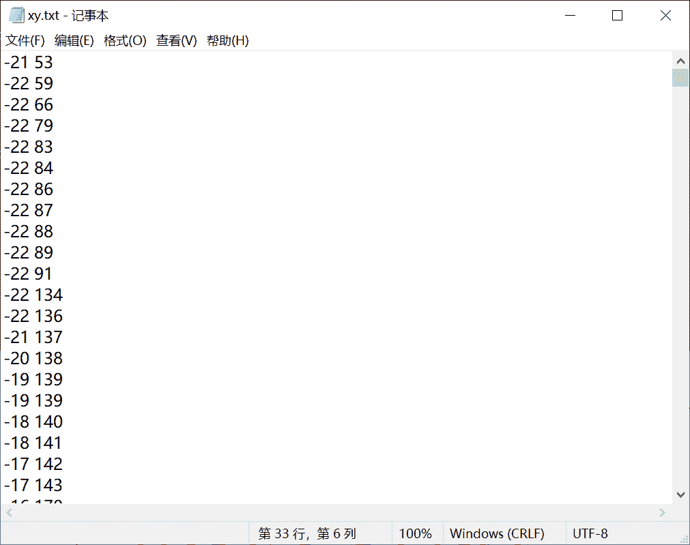

#### 4、gnuplot绘制图像

运行 `gnuplot.exe` 将图像绘制出来

```
gnuplot> plot "xy.txt"
gnuplot> 
```

最后得到：

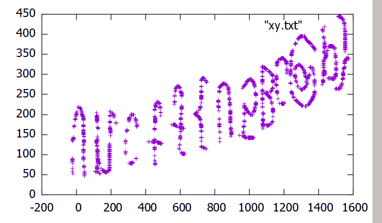

很显然，图像反了。对其垂直翻转一下，flag就出了

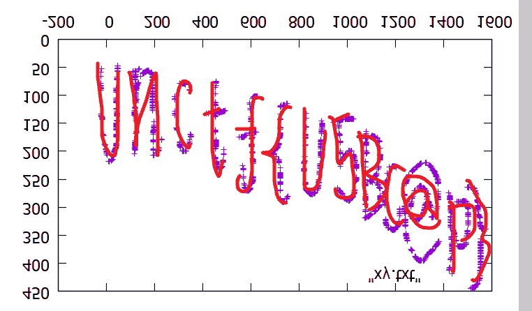

```
unctf{U5BC@P} 
```

[【参考链接】](https://blog.csdn.net/qq_43625917/article/details/107723635)

### 10、撕坏的二维码

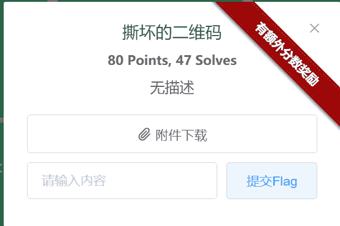

下载得到一张二维码，只不过不全。


众所周知，一张二维码有三个定位符，补全右上角那个，即可出flag


且记，扫的时候，将二维码大小稍微调小一点。

```
unctf{QR@2yB0x} 
```

### 11、倒影

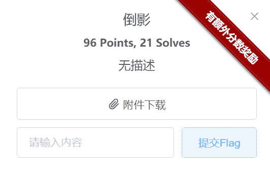

下载附件得到一个 倒影.exe 用010editor打开，发现 `FF D8 FF E0` 的文件头，显然这是一张 jpg。

往后拉，发现 最后有一串base64编码字符串。

```
MDAwMDAwMDAwMEI0MDAwMDAwQTUwMDEwMDAxMDAwMDAwMDAwNjA1MEI0MDUxMDZENkE5RUEyNEU1NzY3MTA2RDdBRDU4QUMyMjk0MDEwNkQ3QUQ1OEFDMjI5NDAwMDgxMDAxMDAwMDAwMDAwMDAwMjAwQTA0Nzg3NDdFMjc2MTZDNjY2MDAwMDAwMDAwMDAwMDAwMjAwMDAwMDAwMDAwMDAwNDIwMDgwMDAwMDAwOTEwMDAwMDA1Mjk3RDQ1MzVFMTU1NUU1QzkwMDAwODAxMDAwQTAwMEYzMjAxMEI0MDVCNEVDQzdFOTg4OUVERjFCQTMwQzZGRjcxODM2RUJDRkU5QTczNUVGRDZFNTAxQ0UxNDEwOTUwNTgyNzc2NEI2OURDMzdDNkUyRTQ3ODc0N0UyNzYxNkM2NjYwMDAwMDA4MDAwMDAwMDkxMDAwMDAwNTI5N0Q0NTM1RTE1NTVFNUM5MDAwMDgwMTAwMEEwNDAzMEI0MDU= 
```

[在线解密](https://base64.supfree.net/)

得到一串 十六进制字符串

```
0000000000B4000000A500100010000000006050B405106D6A9EA24E5767106D7AD58AC22940106D7AD58AC229400081001000000000000200A0478747E27616C666000000000000000200000000000000420080000000910000005297D4535E1555E5C90000801000A000F32010B405B4ECC7E9889EDF1BA30C6FF71836EBCFE9A735EFD6E501CE14109505827764B69DC37C6E2E478747E27616C66600000080000000910000005297D4535E1555E5C90000801000A04030B405 
```

shift+v 复制进010editor。

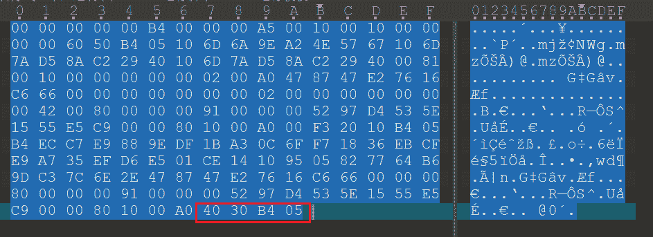

注意： `40 30 B4 05` 反一下 就是 `50 4B 03 04` 说明，要把得到的十六进制字符串倒序 ==》 倒影的真正含义。

附java脚本 ：

```
public class Main {
	public static void main(String[] args) {
		Scanner in = new Scanner(System.in);
		String s = in.nextLine();
		String str[] = s.split("");
		for(int i=str.length-1;i>=0;--i) {
			System.out.print(str[i]);
		}
	}
} 
```

得到：

```
504B03040A00010800009C5E5551E5354D79250000001900000008000000666C61672E747874E2E6C73CD96B46772850590141EC105E6DFE537A9EFCBE63817FF6C03AB1FDE9889E7CCE4B504B01023F000A00010800009C5E5551E5354D792500000019000000080024000000000000002000000000000000666C61672E7478740A002000000000000100180004922CA85DA7D60104922CA85DA7D6017675E42AE9A6D601504B050600000000010001005A0000004B0000000000 
```

修改后缀名 zip。 得到一个加密的压缩包。

但没有其他提示，直接暴力破解一下

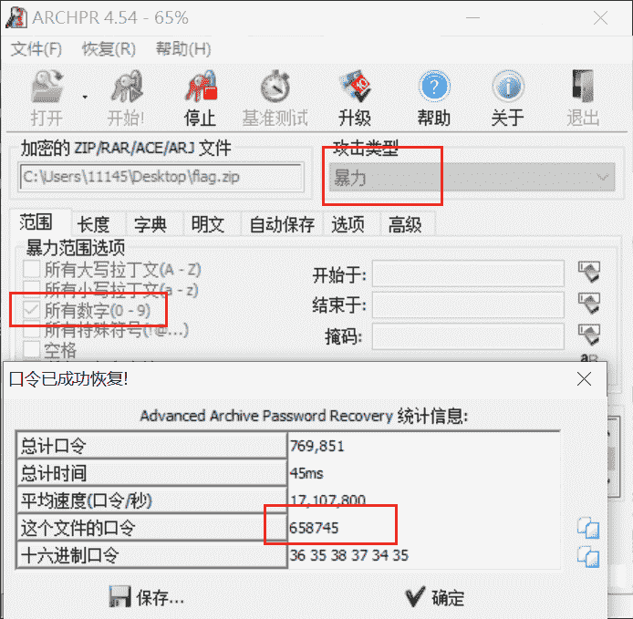

得到 密码： 658745

解压得到flag

```
UNCTF{Th13_Is_@_F1@G} 
```

### 12、EZ_IMAGE

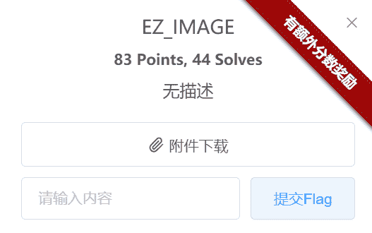

下载得到 225张杂乱无章的jpg图。解法很简单，就是将这图拼起来即可。

1、 `montage` 命令

使用该命令，实现多张图合并成为一张图。 [montage命令详解](https://commandnotfound.cn/linux/1/493/montage-%E5%91%BD%E4%BB%A4)

> （kali Linux）安装命令：
> 
> ```
> apt-get install graphicsmagick-imagemagick-compat 
> ```

进入解压后的文件夹目录下，执行命令

```
montage *.jpg -tile 15x15 -geometry +0+0 1.jpg 
```

得到：


#### 2、 gaps命令自动拼图

[下载地址](https://github.com/nemanja-m/gaps)

```
git clone https://github.com/nemanja-m/gaps.git
cd gaps 
```

先用 pip3安装好以下库：

```
pip3 install numpy
pip3 install opencv-python
pip3 install matplotlib
pip3 install pytest
pip3 install pillow 
```

安装完成后，打开 `requirements.txt` 修改里面库对应的版本。


此为版本号 ， 比如我是：

```
numpy==1.18.4
opencv-python==4.4.0.46
matplotlib==3.2.2
pytest==4.6.11
pillow==6.2.1 
```

再执行以下命令。

```
pip3 install -r requirements.txt
sudo apt-get install python-tk
pip3 install -e . 
```

安装完成后，将之前合成的1.jpg 拖到 `gaps-master` 该目录下， 执行以下命令：

```
gaps --image=1.jpg --population=500 --size=60 --save 
```

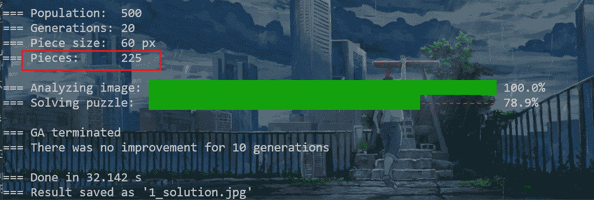

【注意】一定要控制 pieces等于图的总张数

最后得到


flag即为：

```
UNCTF{EZ_MISC_AND_HACK_FUN} 
```

## ⭐Crypto

### 1、easy_rsa

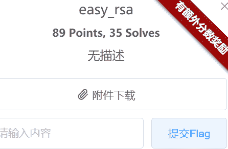

下载得到 rsa 加密脚本，比较简单：

```
from Crypto.Util import number
import gmpy2
from Crypto.Util.number import bytes_to_long

p = number.getPrime(1024)
q = number.getPrime(1024)
if p > q:
    a = p + q
    b = p - q
    print(a,b)

n = p * q
e = 65537
phi = (p-1)*(q-1)
d = gmpy2.invert(e,phi)
m = bytes_to_long(b'msg')
c = pow(m,e,n)
print(c) 
```

很容易得到 p q 且已知 n e 直接上脚本 跑即可：

```
import libnum
from Crypto.Util.number import long_to_bytes

a = 320398687477638913975700270017132483556404036982302018853617987417039612400517057680951629863477438570118640104253432645524830693378758322853028869260935243017328300431595830632269573784699659244044435107219440036761727692796855905230231825712343296737928172132556195116760954509270255049816362648350162111168
b = 9554090001619033187321857749048244231377711861081522054479773151962371959336936136696051589639469653074758469644089407114039221055688732553830385923962675507737607608026140516898146670548916033772462331195442816239006651495200436855982426532874304542570230333184081122225359441162386921519665128773491795370
c = 22886015855857570934458119207589468036427819233100165358753348672429768179802313173980683835839060302192974676103009829680448391991795003347995943925826913190907148491842575401236879172753322166199945839038316446615621136778270903537132526524507377773094660056144412196579940619996180527179824934152320202452981537526759225006396924528945160807152512753988038894126566572241510883486584129614281936540861801302684550521904620303946721322791533756703992307396221043157633995229923356308284045440648542300161500649145193884889980827640680145641832152753769606803521928095124230843021310132841509181297101645567863161780

p = (a+b) // 2
q = (a-b) // 2
n = q * p
e = 65537

d = libnum.invmod(e, (p - 1) * (q - 1))
m = pow(c, d, n)  
string = long_to_bytes(m)  
print(string) 
```

得到

```
b'UNCTF{welcome_to_rsa}' 
```

### 2、简单的RSA

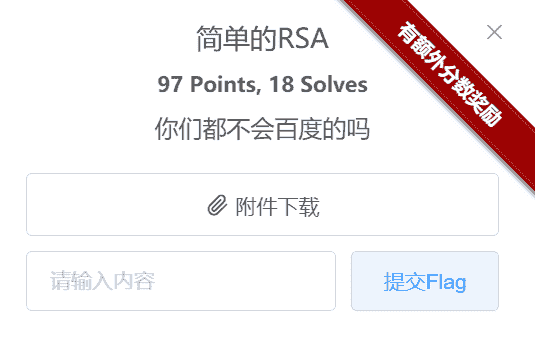

下载得到一个txt

```
e= 18437613570247445737704630776150775735509244525633303532921813122997549954741828855898842356900537746647414676272022397989161180996467240795661928117273837666615415153571959258847829528131519423486261757569454011940318849589730152031528323576997801788206457548531802663834418381061551227544937412734776581781
n= 147282573611984580384965727976839351356009465616053475428039851794553880833177877211323318130843267847303264730088424552657129314295117614222630326581943132950689147833674506592824134135054877394753008169629583742916853056999371985307138775298080986801742942833212727949277517691311315098722536282119888605701
c= 140896698267670480175739817539898638657099087197096836734243016824204113452987617610944986742919793506024892638851339015015706164412994514598564989374037762836439262224649359411190187875207060663509777017529293145434535056275850555331099130633232844054767057175076598741233988533181035871238444008366306956934 
```

显然，这e 非常大。马上想到是 rsa wiener-attack 。于是 修改脚本如下：

```
import  RSAwienerHacker
e= 18437613570247445737704630776150775735509244525633303532921813122997549954741828855898842356900537746647414676272022397989161180996467240795661928117273837666615415153571959258847829528131519423486261757569454011940318849589730152031528323576997801788206457548531802663834418381061551227544937412734776581781
n= 147282573611984580384965727976839351356009465616053475428039851794553880833177877211323318130843267847303264730088424552657129314295117614222630326581943132950689147833674506592824134135054877394753008169629583742916853056999371985307138775298080986801742942833212727949277517691311315098722536282119888605701
d =  RSAwienerHacker.hack_RSA(e,n)
if d:
    print(d) 
```

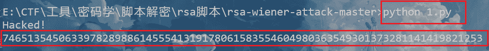

得到 d ：

```
74651354506339782898861455541319178061583554604980363549301373281141419821253 
```

有 c、e、d、n 接下来，有手就行，直接上脚本！

```
from Crypto.Util.number import long_to_bytes

e= 18437613570247445737704630776150775735509244525633303532921813122997549954741828855898842356900537746647414676272022397989161180996467240795661928117273837666615415153571959258847829528131519423486261757569454011940318849589730152031528323576997801788206457548531802663834418381061551227544937412734776581781
n= 147282573611984580384965727976839351356009465616053475428039851794553880833177877211323318130843267847303264730088424552657129314295117614222630326581943132950689147833674506592824134135054877394753008169629583742916853056999371985307138775298080986801742942833212727949277517691311315098722536282119888605701
c= 140896698267670480175739817539898638657099087197096836734243016824204113452987617610944986742919793506024892638851339015015706164412994514598564989374037762836439262224649359411190187875207060663509777017529293145434535056275850555331099130633232844054767057175076598741233988533181035871238444008366306956934

d = 74651354506339782898861455541319178061583554604980363549301373281141419821253
m = pow(c, d, n)  
string = long_to_bytes(m)  
print(string) 
```

得到flag：

```
b'unctf{wi3n3r_Att@ck}' 
```

### 3、鞍山大法官开庭之缺的营养这一块怎么补

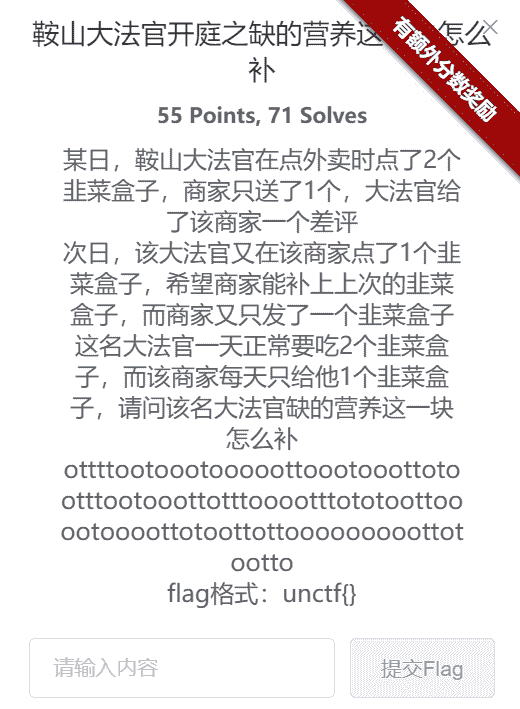

显然题干给出的是一种未知编码的字符串

```
ottttootoootooooottoootooottotootttootooottotttooootttototoottooootoooottotoottottooooooooottotootto 
```

先来看一下，里面就涉及两种字母，很容易让人想到 二进制 ，尝试转字符串，失败。

还有一种编码，培根密码，也是涉及2个字符。尝试 [在线解密](http://rumkin.com/tools/cipher/baconian.php)

先将 o 替换为A ， t替换为B。

```
ABBBBAABAAABAAAAABBAAABAAABBABAABBBAABAAABBABBBAAAABBBABABAABBAAAABAAAABBABAABBABBAAAAAAAAABBABAABBA 
```

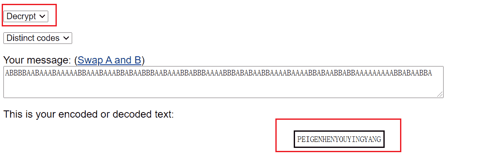

得到flag

```
unctf{PEIGENHENYOUYINGYANG} 
```

## ⭐Reverse

### 1、re_checkin

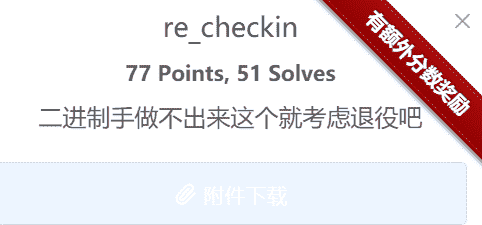

先考虑有没有壳。用PEID一查 无。 安心拖入 IDA

> 先 shift+f12 查看字符串。
> 
> 发现 `success` 敏感词，进行追踪，来到函数sub_401550() 按F5
> 
> ```
> __int64 sub_401550()
> {
> char Str1; 
> 
> sub_40B300();
> puts("Welcome!Please Input:");
> sub_419C00("%1000s", &Str1);
> if ( !strcmp(&Str1, &Str2) )
> puts("success!");
> else
> puts("fail!");
> system("pause");
> return 0i64;
> } 
> ```
> 
> 很快发现， `strcmp` 是 Str1与Str2 对比 ，因为Str1输入，于是追踪Str2
> 
> 

> 发现 在 sub_4015DC 函数，进行查看
> 
> ```
> void sub_4015DC()
> {
> Str2 = 117;
> byte_42F041 = 110;
> byte_42F042 = 99;
> byte_42F043 = 116;
> byte_42F044 = 102;
> byte_42F045 = 123;
> byte_42F046 = 87;
> byte_42F047 = 101;
> byte_42F048 = 108;
> byte_42F049 = 99;
> byte_42F04A = 111;
> byte_42F04B = 109;
> byte_42F04C = 101;
> byte_42F04D = 84;
> byte_42F04E = 111;
> byte_42F04F = 85;
> byte_42F050 = 78;
> byte_42F051 = 67;
> byte_42F052 = 84;
> byte_42F053 = 70;
> byte_42F054 = 125;
> byte_42F055 = 0;
> } 
> ```

很显然 ASCII码 转换得到 ： [在线网站](http://www.ab126.com/goju/1711.html)

得到

```
unctf{WelcomeToUNCTF} 
```

### 2、babypy

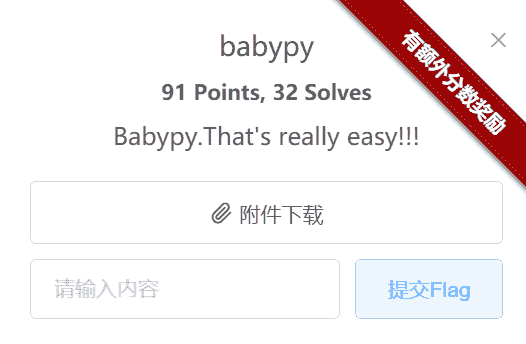

得到了一个 .exe 和一个txt

txt如下：

```
313131303130313031313031313130303131303030313130313131303130303031313030313130303131313130313130313031303130303031313031303030303130303030303030313131303130303031303131313131303131303130303130313131303031313031303131313131303131313030313030313130303130313031313030303031303031313030303130303131303030313031313131303031303130313131313130313130303031313030313130303030303031313030303030303131303030313031313131313031 
```

首先对 babypy.exe 进行壳检查，发现 无壳。

这个时候，我们需要对exe进行反编译为python源码。

利用 `pyinstxtractor.py` 来进行反编译。 [下载地址戳这里](https://github.com/extremecoders-re/pyinstxtractor)

执行命令：

```
python pyinstxtractor.py babypy.exe 
```

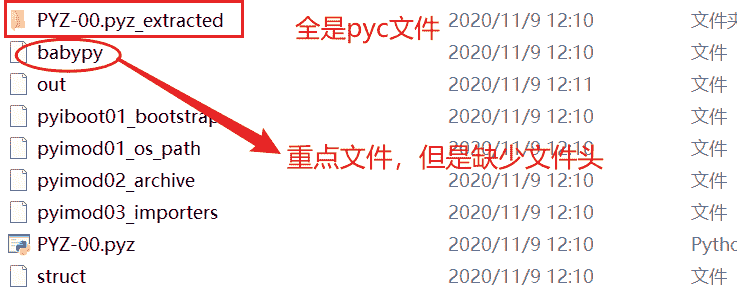

注意到 babypy 重点源文件，但是由于反编译不是十全十美的，他丧失了文件头，因此没有后缀 `.pyc` 于是，打开一个本身的pyc，查看文件头

`42 0D 0D 0A 00 00 00 00`

于是给他补上：

```
42 0D 0D 0A 00 00 00 00 70 79 69 30 10 01 00 00 
```

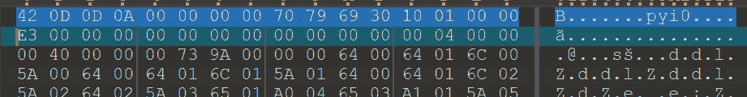

并修改后缀名 .pyc 再进行反编译 生成py文件 [反编译地址](https://tool.lu/pyc/)

```
 import os
import libnum
import binascii
flag = 'unctf{*******************}' 
```

看到这里，跟自己之前想的很有出入，本来以为会出全部脚本，于是思路断了。

其实是忘记了，出题方给的重要讯息！那个 tip.txt

于是，解题脚本如下：

```
import libnum
m = 0x313131303130313031313031313130303131303030313130313131303130303031313030313130303131313130313130313031303130303031313031303030303130303030303030313131303130303031303131313131303131303130303130313131303031313031303131313131303131313030313030313130303130313031313030303031303031313030303130303131303030313031313131303031303130313131313130313130303031313030313130303030303031313030303030303131303030313031313131313031

str = libnum.n2s(m)
print(libnum.b2s(str)) 
```

跑出 flag：

```
unctf{Th@t_is_rea11y_c001} 
```

### 3、反编译

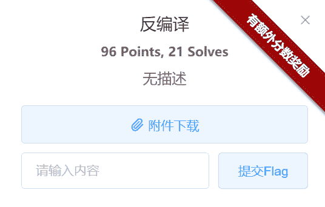

下载得到一个 `run.exe` 加之题目“反编译” ，与上题一样的思路。

利用 `pyinstxtractor.py` 来进行反编译。

执行命令：

```
python pyinstxtractor.py run.exe 
```

给run补上，并修改后缀名

```
42 0D 0D 0A 00 00 00 00 70 79 69 30 10 01 00 00 
```

再进行反编译 生成py文件 [反编译地址](https://tool.lu/pyc/)

得到：

```
 str2 = 'UMAQBvogWLDTWgX"""k'
flag = ''
for i in range(len(str2)):
    flag += chr(ord(str2[i]) + i)

print(flag) 
```

直接跑出flag

```
UNCTF{un_UN_ctf123} 
```

## ⭐pwn

### 1、YLBNB

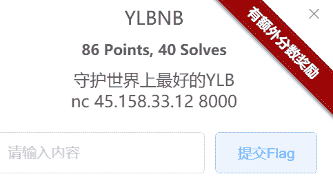

直接nc一把

```
nc 45.158.33.12 8000 
```

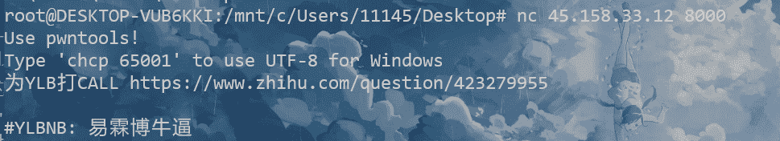

于是直接上 exp （最简单的那种）

```
from pwn import *

p = remote('45.158.33.12', 8000)
payload = ''
p.sendline(payload)

p.interactive() 
```

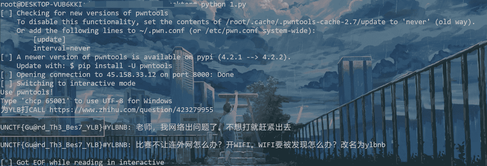

得到flag

```
UNCTF{Gu@rd_Th3_Bes7_YLB} 
```

下次一定！！